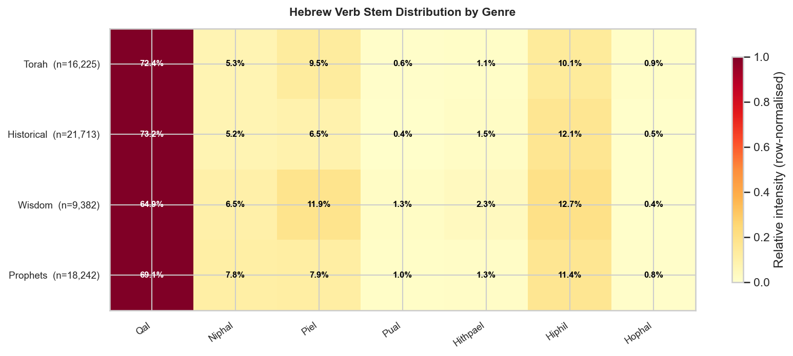
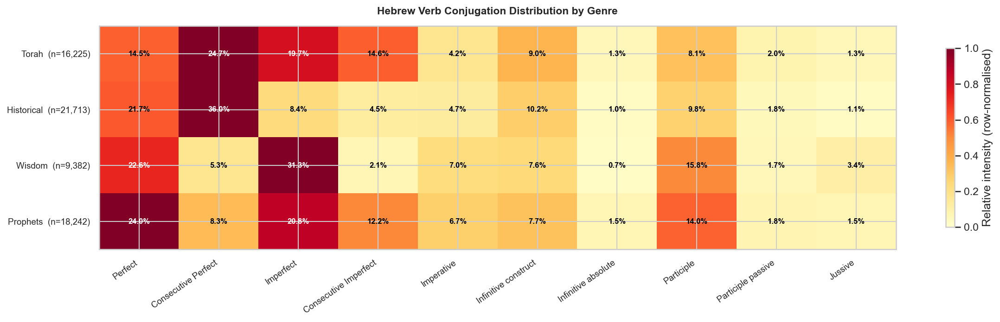
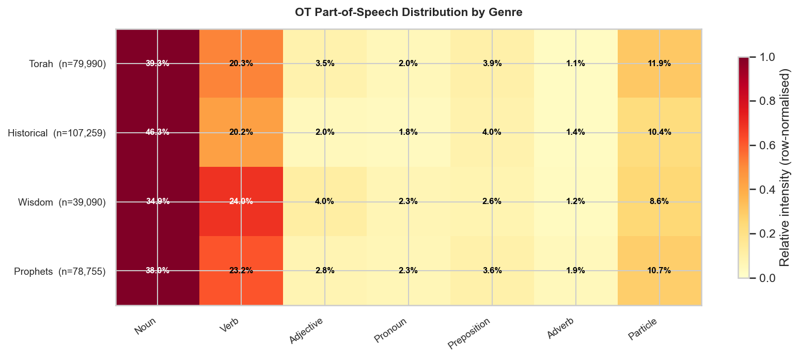
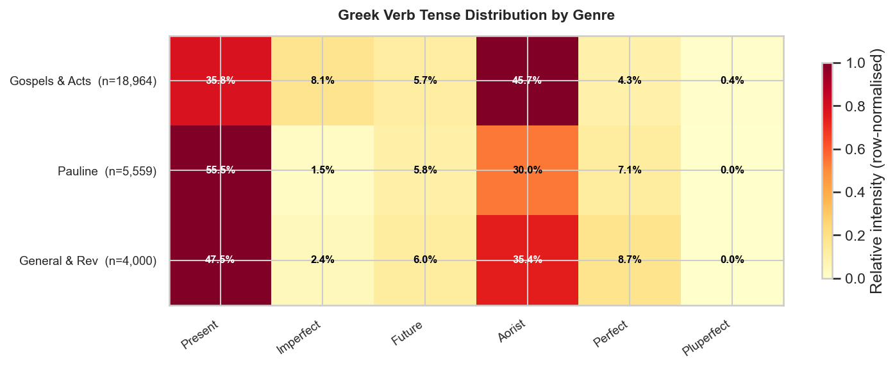
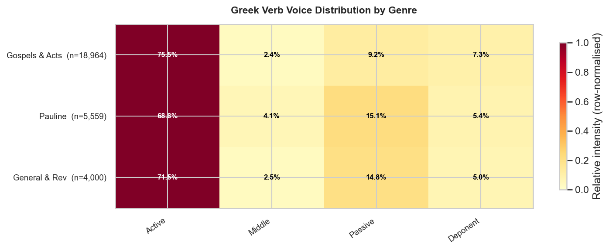
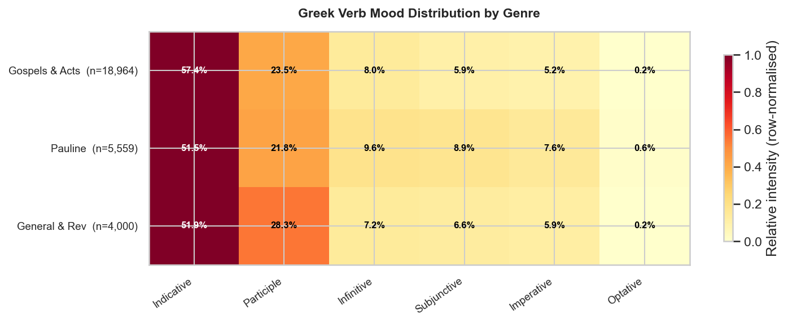
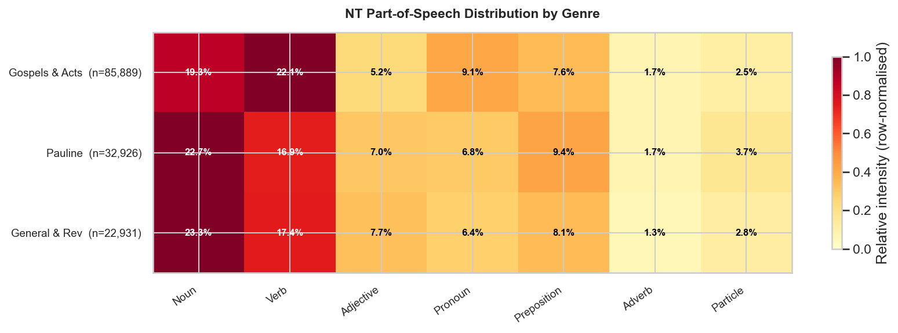

# Genre Comparison: Morphological Patterns Across Literary Sections

Analysis of how grammatical features distribute differently across the literary genres of the Hebrew OT and Greek NT, using STEPBible TAHOT/TAGNT morphological data.

Values shown as percentage of the relevant token class within each genre.

---

## Old Testament Hebrew

### Token Counts by Genre

| Genre | Books | Total Tokens |
|---|---:|---:|
| Torah | 5 | 79,990 |
| Historical | 12 | 107,259 |
| Wisdom | 5 | 39,090 |
| Prophets | 17 | 78,755 |

### Verb Stem Distribution

_Hebrew verb stems (binyanim) encode voice and degree of action intensity. Qal is the simple active stem; Piel intensifies or factitives; Hiphil makes causative; Niphal is passive/reflexive._

| Genre | Tokens | Qal | Niphal | Piel | Pual | Hithpael | Hiphil | Hophal |
|---|---:|---:|---:|---:|---:|---:|---:|---:|
| Torah | 16,225 | 72.4% | 5.3% | 9.5% | 0.6% | 1.1% | 10.1% | 0.9% |
| Historical | 21,713 | 73.2% | 5.2% | 6.5% | 0.4% | 1.5% | 12.1% | 0.5% |
| Wisdom | 9,382 | 64.9% | 6.5% | 11.9% | 1.3% | 2.3% | 12.7% | 0.4% |
| Prophets | 18,242 | 69.1% | 7.8% | 7.9% | 1.0% | 1.3% | 11.4% | 0.8% |

### Verb Conjugation Distribution

_Consecutive Perfect (wayyiqtol) drives OT narrative prose. Imperfect and Participle dominate poetry and prophecy, reflecting ongoing or vivid-present discourse._

| Genre | Tokens | Perfect | Consecutive Perfect | Imperfect | Consecutive Imperfect | Imperative | Infinitive construct | Infinitive absolute | Participle | Participle passive | Jussive |
|---|---:|---:|---:|---:|---:|---:|---:|---:|---:|---:|---:|
| Torah | 16,225 | 14.5% | 24.7% | 19.7% | 14.6% | 4.2% | 9.0% | 1.3% | 8.1% | 2.0% | 1.3% |
| Historical | 21,713 | 21.7% | 36.0% | 8.4% | 4.5% | 4.7% | 10.2% | 1.0% | 9.8% | 1.8% | 1.1% |
| Wisdom | 9,382 | 22.6% | 5.3% | 31.3% | 2.1% | 7.0% | 7.6% | 0.7% | 15.8% | 1.7% | 3.4% |
| Prophets | 18,242 | 24.0% | 8.3% | 20.8% | 12.2% | 6.7% | 7.7% | 1.5% | 14.0% | 1.8% | 1.5% |

### Part-of-Speech Distribution

_The ratio of verbs to nouns shifts across genres: narrative prose is verb-heavy (action), poetry and law are noun-heavy (description)._

| Genre | Tokens | Noun | Verb | Adjective | Pronoun | Preposition | Adverb | Particle |
|---|---:|---:|---:|---:|---:|---:|---:|---:|
| Torah | 79,990 | 39.3% | 20.3% | 3.5% | 2.0% | 3.9% | 1.1% | 11.9% |
| Historical | 107,259 | 46.3% | 20.2% | 2.0% | 1.8% | 4.0% | 1.4% | 10.4% |
| Wisdom | 39,090 | 34.9% | 24.0% | 4.0% | 2.3% | 2.6% | 1.2% | 8.6% |
| Prophets | 78,755 | 38.0% | 23.2% | 2.8% | 2.3% | 3.6% | 1.9% | 10.7% |

---

## New Testament Greek

### Token Counts by Genre

| Genre | Books | Total Tokens |
|---|---:|---:|
| Gospels & Acts | 5 | 85,889 |
| Pauline | 13 | 32,926 |
| General & Rev | 9 | 22,931 |

### Verb Tense Distribution

_Aorist (punctiliar past) dominates narrative sections; Present dominates epistolary and didactic writing. Perfect (R-form) marks completed action with ongoing relevance._

| Genre | Tokens | Present | Imperfect | Future | Aorist | Perfect | Pluperfect |
|---|---:|---:|---:|---:|---:|---:|---:|
| Gospels & Acts | 18,964 | 35.8% | 8.1% | 5.7% | 45.7% | 4.3% | 0.4% |
| Pauline | 5,559 | 55.5% | 1.5% | 5.8% | 30.0% | 7.1% | 0.0% |
| General & Rev | 4,000 | 47.5% | 2.4% | 6.0% | 35.4% | 8.7% | 0.0% |

### Verb Voice Distribution

_Passive constructions increase in epistolary literature, reflecting theological passives (divine action without naming God). Deponent verbs are grammatically active but semantically middle._

| Genre | Tokens | Active | Middle | Passive | Deponent |
|---|---:|---:|---:|---:|---:|
| Gospels & Acts | 18,964 | 75.5% | 2.4% | 9.2% | 7.3% |
| Pauline | 5,559 | 68.8% | 4.1% | 15.1% | 5.4% |
| General & Rev | 4,000 | 71.5% | 2.5% | 14.8% | 5.0% |

### Verb Mood Distribution

_Participles are proportionally highest in Revelation and General letters, reflecting their dense predicative and attributive use. Subjunctive marks contingency and hortatory purpose clauses._

| Genre | Tokens | Indicative | Participle | Infinitive | Subjunctive | Imperative | Optative |
|---|---:|---:|---:|---:|---:|---:|---:|
| Gospels & Acts | 18,964 | 57.4% | 23.5% | 8.0% | 5.9% | 5.2% | 0.2% |
| Pauline | 5,559 | 51.5% | 21.8% | 9.6% | 8.9% | 7.6% | 0.6% |
| General & Rev | 4,000 | 51.9% | 28.3% | 7.2% | 6.6% | 5.9% | 0.2% |

### Part-of-Speech Distribution

_The ratio of verbs to nouns shifts across genres: narrative prose is verb-heavy (action), poetry and law are noun-heavy (description)._

| Genre | Tokens | Noun | Verb | Adjective | Pronoun | Preposition | Adverb | Particle |
|---|---:|---:|---:|---:|---:|---:|---:|---:|
| Gospels & Acts | 85,889 | 19.3% | 22.1% | 5.2% | 9.1% | 7.6% | 1.7% | 2.5% |
| Pauline | 32,926 | 22.7% | 16.9% | 7.0% | 6.8% | 9.4% | 1.7% | 3.7% |
| General & Rev | 22,931 | 23.3% | 17.4% | 7.7% | 6.4% | 8.1% | 1.3% | 2.8% |

---

_Source: STEPBible TAHOT/TAGNT (CC BY 4.0, Tyndale House Cambridge). Values are percentages of the relevant token class within each genre._