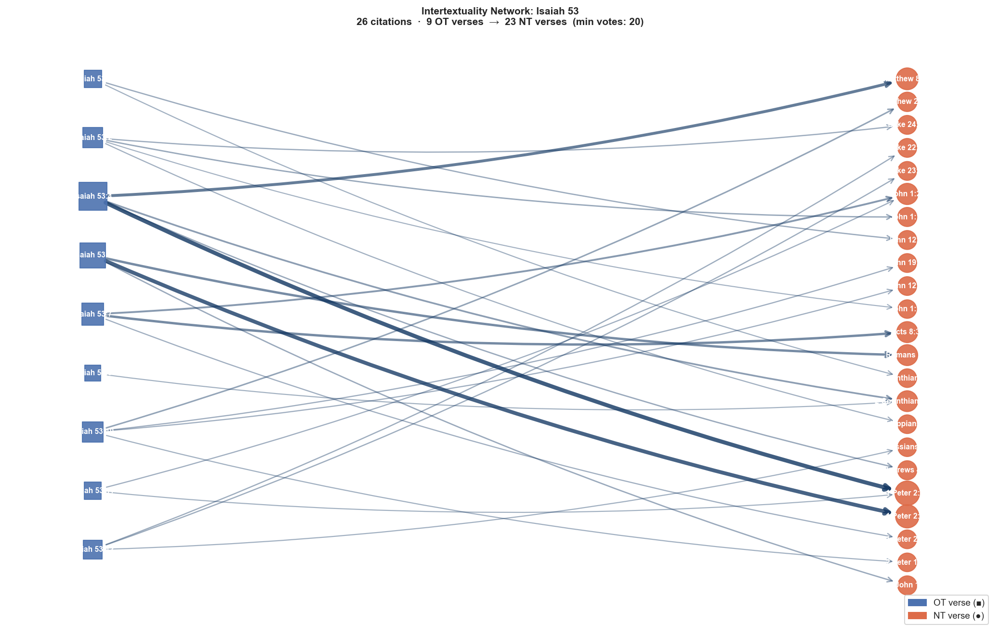

# Intertextuality Network: Isaiah 53

**OT anchor:** Isaiah 53  
**NT citations:** 26  
**Min confidence votes:** 20  
**NT books covered:** 13  

## Network Graph

## NT Book Coverage

| NT Book | Citations | Total Vote Score |
|---|---:|---:|
| 1 Peter | 4 | 291 |
| John | 7 | 201 |
| Matthew | 2 | 122 |
| Luke | 3 | 79 |
| Acts | 1 | 68 |
| Romans | 1 | 67 |
| 2 Corinthians | 2 | 65 |
| 1 John | 1 | 30 |
| Hebrews | 1 | 30 |
| Philippians | 1 | 23 |
| 1 Corinthians | 1 | 22 |
| 2 Peter | 1 | 22 |
| Colossians | 1 | 22 |

## All Citations

| OT Verse | NT Verse | Votes | OT Text | NT Text |
|---|---|---:|---|---|
| Isaiah 53:4 | 1 Peter 2:24 | 127 | nevertheless sicknesses/ our he he bore and/ pains/ our he carried/ them and/ we... | Who the sins of us Himself bore in the body of Him on the tree so that <the> to ... |
| Isaiah 53:6 | 1 Peter 2:25 | 119 | all of/ us like <the>/ sheep we have gone astray each to/ own way/ his we have t... | You were for like sheep going astray but you have returned now to the Shepherd a... |
| Isaiah 53:4 | Matthew 8:17 | 86 | nevertheless sicknesses/ our he he bore and/ pains/ our he carried/ them and/ we... | so that it may be fulfilled that having been spoken through Isaiah the prophet s... |
| Isaiah 53:7 | Acts 8:32 | 68 | he was oppressed and/ he [was] afflicted and/ not he opened mouth/ his like <the... | <the> Now the passage of the Scripture which he was reading was this: As a sheep... |
| Isaiah 53:6 | Romans 5:8 | 67 | all of/ us like <the>/ sheep we have gone astray each to/ own way/ his we have t... | Demonstrates however the His own love to us <the> God, that still sinners when b... |
| Isaiah 53:7 | John 1:29 | 49 | he was oppressed and/ he [was] afflicted and/ not he opened mouth/ his like <the... | On the next day he sees <the> John <the> Jesus coming to him and says; Behold th... |
| Isaiah 53:4 | 2 Corinthians 5:21 | 44 | nevertheless sicknesses/ our he he bore and/ pains/ our he carried/ them and/ we... | The [One] for not having known sin for us sin He made, so that we ourselves may ... |
| Isaiah 53:10 | Matthew 27:46 | 36 | and/ Yahweh he desired to crush/ him he made [him] sick if it will make a guilt ... | About then the ninth hour cried out <the> Jesus in a voice loud saying; Eli Eli,... |
| Isaiah 53:2 | John 1:11 | 31 | and/ he grew up like <the>/ shoot <to>/ before/ him and/ like <the>/ root from/ ... | To <the> [His] own He came, and <the> [His] own Him not received. |
| Isaiah 53:4 | Hebrews 4:15 | 30 | nevertheless sicknesses/ our he he bore and/ pains/ our he carried/ them and/ we... | Not for have we a high priest not being able to sympathize with the weaknesses o... |
| Isaiah 53:6 | 1 John 1:8 | 30 | all of/ us like <the>/ sheep we have gone astray each to/ own way/ his we have t... | If we shall say that sin not we have, ourselves we deceive and the truth not is ... |
| Isaiah 53:1 | John 12:38 | 28 | who? has he believed <to>/ report/ our and/ [the] arm of Yahweh to whom? has it ... | so that the word of Isaiah the prophet may be fulfilled that said: Lord, who has... |
| Isaiah 53:2 | Luke 24:46 | 27 | and/ he grew up like <the>/ shoot <to>/ before/ him and/ like <the>/ root from/ ... | And He said to them that Thus it has been written and thus it was necessary for ... |
| Isaiah 53:12 | Luke 22:37 | 26 | <to>/ therefore I will allot a portion to/ him among the/ many [people] and/ wit... | I say for to you that still this which [was] written it behooves to be accomplis... |
| Isaiah 53:12 | Luke 23:34 | 26 | <to>/ therefore I will allot a portion to/ him among the/ many [people] and/ wit... | <the> And Jesus was saying; Father, do forgive them; not for they know what they... |
| Isaiah 53:10 | John 19:30 | 25 | and/ Yahweh he desired to crush/ him he made [him] sick if it will make a guilt ... | When then took the sour wine <the> Jesus He said; It has been finished. And havi... |
| Isaiah 53:11 | John 1:29 | 24 | from/ [the] labor of self/ his he will see he will be satisfied by/ knowledge/ h... | On the next day he sees <the> John <the> Jesus coming to him and says; Behold th... |
| Isaiah 53:7 | 1 Peter 2:23 | 24 | he was oppressed and/ he [was] afflicted and/ not he opened mouth/ his like <the... | Who being reviled not was not reviling back suffering not was threatening He was... |
| Isaiah 53:10 | John 12:24 | 24 | and/ Yahweh he desired to crush/ him he made [him] sick if it will make a guilt ... | Amen Amen I say to you; only unless the grain <the> of wheat having fallen into ... |
| Isaiah 53:2 | Philippians 2:7 | 23 | and/ he grew up like <the>/ shoot <to>/ before/ him and/ like <the>/ root from/ ... | but Himself emptied [the] form of a servant having taken, in [the] likeness of m... |
| Isaiah 53:12 | Colossians 2:15 | 22 | <to>/ therefore I will allot a portion to/ him among the/ many [people] and/ wit... | Having disarmed the rulers and the authorities He disgraced [them] in public, ha... |
| Isaiah 53:10 | 2 Peter 1:17 | 22 | and/ Yahweh he desired to crush/ him he made [him] sick if it will make a guilt ... | Having received for from God [the] Father honor and glory a voice was brought to... |
| Isaiah 53:1 | 1 Corinthians 15:3 | 22 | who? has he believed <to>/ report/ our and/ [the] arm of Yahweh to whom? has it ... | I delivered for to you in [the] foremost what also I received that Christ died f... |
| Isaiah 53:11 | 1 Peter 2:24 | 21 | from/ [the] labor of self/ his he will see he will be satisfied by/ knowledge/ h... | Who the sins of us Himself bore in the body of Him on the tree so that <the> to ... |
| Isaiah 53:9 | 2 Corinthians 5:21 | 21 | and/ someone assigned with wicked [people] grave/ his and/ with a rich [person] ... | The [One] for not having known sin for us sin He made, so that we ourselves may ... |
| Isaiah 53:2 | John 1:14 | 20 | and/ he grew up like <the>/ shoot <to>/ before/ him and/ like <the>/ root from/ ... | And the Word flesh became and He dwelt among us, and we beheld the glory of Him,... |

## Verse-by-Verse Detail

### Isaiah 53:4

> nevertheless sicknesses/ our he he bore and/ pains/ our he carried/ them and/ we we considered/ him stricken struck of God and/ afflicted

**[1 Peter 2:24]** (votes: 127)  
> Who the sins of us Himself bore in the body of Him on the tree so that <the> to sins having been dead <the> to righteousness we may live; Of whom by the wounds of him you have been healed.

**[Matthew 8:17]** (votes: 86)  
> so that it may be fulfilled that having been spoken through Isaiah the prophet saying; Himself the infirmities of us He took and <the> [our] diseases bore.

**[2 Corinthians 5:21]** (votes: 44)  
> The [One] for not having known sin for us sin He made, so that we ourselves may become [the] righteousness of God in Him.

**[Hebrews 4:15]** (votes: 30)  
> Not for have we a high priest not being able to sympathize with the weaknesses of us, tempted however in all things by [the] same way without sin.

### Isaiah 53:6

> all of/ us like <the>/ sheep we have gone astray each to/ own way/ his we have turned and/ Yahweh he has caused to touch <on>/ him <obj.> [the] iniquity of all of/ us

**[1 Peter 2:25]** (votes: 119)  
> You were for like sheep going astray but you have returned now to the Shepherd and Overseer of the souls of you.

**[Romans 5:8]** (votes: 67)  
> Demonstrates however the His own love to us <the> God, that still sinners when being we Christ for us died.

**[1 John 1:8]** (votes: 30)  
> If we shall say that sin not we have, ourselves we deceive and the truth not is in us.

### Isaiah 53:7

> he was oppressed and/ he [was] afflicted and/ not he opened mouth/ his like <the>/ sheep [which] to the/ slaughter it is brought and/ like/ a ewe [which] <to>/ before shearers/ its it is dumb and/ not he opened mouth/ his

**[Acts 8:32]** (votes: 68)  
> <the> Now the passage of the Scripture which he was reading was this: As a sheep to slaughter He was led, and as a lamb before the [one who] shearing him [is] silent, so not He opens the mouth of Him.

**[John 1:29]** (votes: 49)  
> On the next day he sees <the> John <the> Jesus coming to him and says; Behold the Lamb <the> of God, who is taking away the sin of the world.

**[1 Peter 2:23]** (votes: 24)  
> Who being reviled not was not reviling back suffering not was threatening He was delivering [Himself] however to the [One] judging justly;

### Isaiah 53:10

> and/ Yahweh he desired to crush/ him he made [him] sick if it will make a guilt offering self/ his he will see offspring he will prolong days and/ [the] pleasure of Yahweh in/ hand/ his it will prosper

**[Matthew 27:46]** (votes: 36)  
> About then the ninth hour cried out <the> Jesus in a voice loud saying; Eli Eli, lema sabachthani? That is: God of Mine God of Mine, so why Me have you forsaken?

**[John 19:30]** (votes: 25)  
> When then took the sour wine <the> Jesus He said; It has been finished. And having bowed the head He yielded up the spirit.

**[John 12:24]** (votes: 24)  
> Amen Amen I say to you; only unless the grain <the> of wheat having fallen into the ground shall die, it alone abides; if however it shall die, much fruit it bears.

**[2 Peter 1:17]** (votes: 22)  
> Having received for from God [the] Father honor and glory a voice was brought to Him such as follows by the Majestic Glory: The Son of Mine <the> beloved of Mine this is, in whom I myself found delight.

### Isaiah 53:2

> and/ he grew up like <the>/ shoot <to>/ before/ him and/ like <the>/ root from/ ground dry not form [belonged] to/ him and/ not splendor and/ we will look at/ him and/ not appearance and/ we will desire/ him

**[John 1:11]** (votes: 31)  
> To <the> [His] own He came, and <the> [His] own Him not received.

**[Luke 24:46]** (votes: 27)  
> And He said to them that Thus it has been written and thus it was necessary for Was to suffer the Christ and to rise out from [the] dead on the third day

**[Philippians 2:7]** (votes: 23)  
> but Himself emptied [the] form of a servant having taken, in [the] likeness of men having been made,

**[John 1:14]** (votes: 20)  
> And the Word flesh became and He dwelt among us, and we beheld the glory of Him, a glory as of an only begotten from [the] Father, full of grace and truth.

### Isaiah 53:1

> who? has he believed <to>/ report/ our and/ [the] arm of Yahweh to whom? has it been revealed

**[John 12:38]** (votes: 28)  
> so that the word of Isaiah the prophet may be fulfilled that said: Lord, who has believed in the report of us? And the arm of [the] Lord to whom has been revealed?

**[1 Corinthians 15:3]** (votes: 22)  
> I delivered for to you in [the] foremost what also I received that Christ died for the sins of us according to the Scriptures

### Isaiah 53:12

> <to>/ therefore I will allot a portion to/ him among the/ many [people] and/ with mighty [people] he will apportion [the] plunder because that he poured out to <the>/ death life/ his and/ with transgressors he was numbered and/ he [the] sin of many [people] he bore and/ for the/ transgressors he will make entreaty

**[Luke 22:37]** (votes: 26)  
> I say for to you that still this which [was] written it behooves to be accomplished in Me myself, <the> And with [the] lawless He was reckoned.’ And for the [thing] concerning Me an end have.

**[Luke 23:34]** (votes: 26)  
> <the> And Jesus was saying; Father, do forgive them; not for they know what they do. Dividing then the garments of Him they cast lots.

**[Colossians 2:15]** (votes: 22)  
> Having disarmed the rulers and the authorities He disgraced [them] in public, having triumphed over them in it.

### Isaiah 53:11

> from/ [the] labor of self/ his he will see he will be satisfied by/ knowledge/ his he will justify [the] righteous [one] servant/ my to <the>/ many [people] and/ iniquities/ their he he will bear

**[John 1:29]** (votes: 24)  
> On the next day he sees <the> John <the> Jesus coming to him and says; Behold the Lamb <the> of God, who is taking away the sin of the world.

**[1 Peter 2:24]** (votes: 21)  
> Who the sins of us Himself bore in the body of Him on the tree so that <the> to sins having been dead <the> to righteousness we may live; Of whom by the wounds of him you have been healed.

### Isaiah 53:9

> and/ someone assigned with wicked [people] grave/ his and/ with a rich [person] in/ death<s>/ his on not violence he had done and/ not deceit [was] in/ mouth/ his

**[2 Corinthians 5:21]** (votes: 21)  
> The [One] for not having known sin for us sin He made, so that we ourselves may become [the] righteousness of God in Him.

---

_Cross-reference data: scrollmapper / OpenBible.info (CC-BY). Vote scores reflect community confidence in each link. Text: KJV (STEPBible TAHOT/TAGNT CC BY 4.0, Tyndale House Cambridge)._