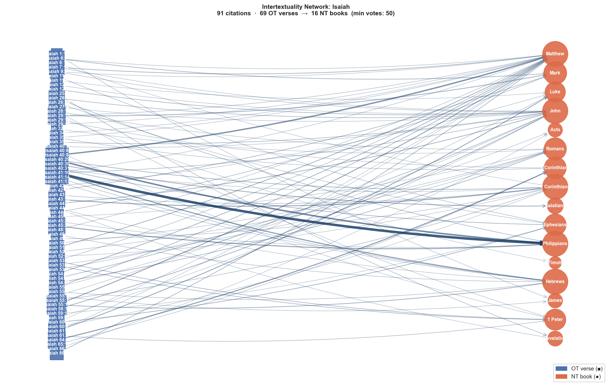

# Intertextuality Network: Isaiah

**OT anchor:** Isaiah  
**NT citations:** 91  
**Min confidence votes:** 50  
**NT books covered:** 16  

## Network Graph

## NT Book Coverage

| NT Book | Citations | Total Vote Score |
|---|---:|---:|
| Matthew | 18 | 2,124 |
| Philippians | 5 | 1,853 |
| John | 14 | 1,348 |
| 2 Corinthians | 9 | 847 |
| Hebrews | 8 | 841 |
| Mark | 4 | 547 |
| Romans | 7 | 510 |
| 1 Corinthians | 4 | 494 |
| Ephesians | 5 | 484 |
| 1 Peter | 5 | 446 |
| Luke | 4 | 399 |
| Galatians | 1 | 190 |
| Revelation | 2 | 152 |
| James | 2 | 131 |
| Acts | 2 | 120 |
| 2 Timothy | 1 | 53 |

## All Citations

| OT Verse | NT Verse | Votes | OT Text | NT Text |
|---|---|---:|---|---|
| Isaiah 41:10 | Philippians 4:13 | 905 | may not you be afraid for [am] with/ you I may not you fear for I [am] God/ your... | [For] all things I have strength in the [One] strengthening me in Christ. |
| Isaiah 40:29 | Philippians 4:13 | 498 | [he is] giving to the/ weary [person] strength and/ to/ [those who] there not [i... | [For] all things I have strength in the [One] strengthening me in Christ. |
| Isaiah 40:8 | Matthew 24:35 | 421 | it dries up grass it withers a flower and/ [the] word of God/ our it will stand ... | The heaven and the earth will pass away, <the> but the words of Mine certainly n... |
| Isaiah 64:4 | 1 Corinthians 2:9 | 298 | and/ from/ long ago not people have heard not people have given ear eye not it h... | but even as it has been written: What eye not has seen and ear not has heard and... |
| Isaiah 45:24 | Philippians 4:13 | 276 | only [are] in/ Yahweh of/ me anyone will say righteousness<es> and/ strength to/... | [For] all things I have strength in the [One] strengthening me in Christ. |
| Isaiah 41:10 | Hebrews 13:6 | 261 | may not you be afraid for [am] with/ you I may not you fear for I [am] God/ your... | So are confident we to say: [The] Lord [is] my helper, and not I will be afraid;... |
| Isaiah 43:18 | 2 Corinthians 5:17 | 249 | may not you remember former [things] and/ ancient [things] may not you consider | Therefore if anyone [is] in Christ, [he is] a new creation; The old things have ... |
| Isaiah 55:11 | Matthew 24:35 | 243 | thus it is word/ my which it goes forth from/ mouth/ my not it will return to/ m... | The heaven and the earth will pass away, <the> but the words of Mine certainly n... |
| Isaiah 61:1 | Luke 4:18 | 221 | [the] spirit of [the] Lord Yahweh [is] on/ me because he has anointed Yahweh <ob... | [The] Spirit of [the] Lord [is] upon Me myself, of which because He has anointed... |
| Isaiah 40:30 | Galatians 6:9 | 190 | and/ they may grow weary youths so/ they may become weary and/ young men certain... | <the> And [in] well doing not we may grow weary; in time for due we will reap a ... |
| Isaiah 29:13 | Mark 7:6 | 180 | and/ he said [the] Lord because for it has drawn near the/ people <the>/ this wi... | <the> And answering He said to them that: Rightly prophesied Isaiah concerning y... |
| Isaiah 51:6 | Matthew 24:35 | 176 | lift up to the/ heavens eyes/ your and/ look to the/ earth <from>/ beneath for [... | The heaven and the earth will pass away, <the> but the words of Mine certainly n... |
| Isaiah 55:11 | Hebrews 4:12 | 165 | thus it is word/ my which it goes forth from/ mouth/ my not it will return to/ m... | Living [is] for the word <the> of God and active and sharper than any sword two-... |
| Isaiah 58:11 | John 7:38 | 164 | and/ he will lead/ you Yahweh continually and/ he will satisfy in/ arid regions ... | The [one] believing in Me myself, even as has said the Scripture: Rivers out of ... |
| Isaiah 54:10 | Matthew 24:35 | 160 | that the/ mountains they will be removed and/ the/ hills they will shake and/ co... | The heaven and the earth will pass away, <the> but the words of Mine certainly n... |
| Isaiah 44:3 | John 7:38 | 160 | for I will pour out water on thirsty [ground] and/ streams on dry ground I will ... | The [one] believing in Me myself, even as has said the Scripture: Rivers out of ... |
| Isaiah 60:1 | Ephesians 5:14 | 150 | arise shine for it has come light/ your and/ [the] glory of Yahweh on/ you it ha... | [14] Therefore it says: do awake you who [are] sleeping and do rise up out from ... |
| Isaiah 7:14 | Matthew 1:23 | 144 | <to>/ therefore he will give [the] Lord he to/ you a sign there! the/ young woma... | Behold the virgin in womb [pregnancy] will have and she will bear a son, and the... |
| Isaiah 40:29 | 2 Corinthians 12:9 | 141 | [he is] giving to the/ weary [person] strength and/ to/ [those who] there not [i... | And He has said to me; Suffices you the grace of Mine; the for power of mine in ... |
| Isaiah 6:9 | Mark 8:18 | 138 | and/ he said go and/ you will say to the/ people <the>/ this hear continually <t... | Eyes having not do you see? And ears having not do you hear? And not do you reme... |
| Isaiah 54:17 | Romans 8:31 | 135 | any weapon [which] it will be formed on/ you not it will succeed and/ every tong... | What then will we say to these things? If <the> God [is] for us, who [can be] ag... |
| Isaiah 55:1 | Matthew 11:28 | 133 | alas! O every thirsty [one] come to the/ waters and/ [one] who not [belongs] to/... | Come to Me all you who [are] toiling and burdened, and I myself will give rest t... |
| Isaiah 40:31 | Ephesians 6:10 | 132 | and/ [those who] wait for <of> Yahweh they will renew strength they will go up w... | <the> Henceforth brothers of mine do be empowered in [the] Lord and in the stren... |
| Isaiah 66:2 | Matthew 5:3 | 131 | and/ <obj.> all these [things] hand/ my it made and/ they were all these [things... | Blessed [are] the poor in the spirit, for theirs is the kingdom of the heavens. |
| Isaiah 54:13 | John 6:45 | 128 | and/ all children/ your [will be] taught of Yahweh and/ [will be] great [the] pe... | It is written in the prophets: And they will be all taught <the> of God.’ Everyo... |
| Isaiah 53:4 | 1 Peter 2:24 | 127 | nevertheless sicknesses/ our he he bore and/ pains/ our he carried/ them and/ we... | Who the sins of us Himself bore in the body of Him on the tree so that <the> to ... |
| Isaiah 12:3 | John 7:38 | 126 | and/ you will draw water with/ joy from/ [the] springs of <the>/ salvation | The [one] believing in Me myself, even as has said the Scripture: Rivers out of ... |
| Isaiah 42:18 | Mark 8:18 | 125 | O/ deaf [people] listen and/ O/ blind [people] look to/ see | Eyes having not do you see? And ears having not do you hear? And not do you reme... |
| Isaiah 53:6 | 1 Peter 2:25 | 119 | all of/ us like <the>/ sheep we have gone astray each to/ own way/ his we have t... | You were for like sheep going astray but you have returned now to the Shepherd a... |
| Isaiah 35:8 | John 14:6 | 119 | and/ it will be there a highway and/ a way and/ [the] way of <the>/ holiness it ... | Says to him <the> Jesus; I myself am the way and the truth and the life. No [one... |
| Isaiah 26:3 | John 14:1 | 112 | an inclination firm you will keep peace peace for in/ you [he is] trusting | Not should be troubled of you the heart; You believe in <the> God also in Me mys... |
| Isaiah 26:3 | Philippians 4:7 | 112 | an inclination firm you will keep peace peace for in/ you [he is] trusting | And the peace <the> of God which is surpassing all understanding will guard the ... |
| Isaiah 41:10 | John 14:27 | 110 | may not you be afraid for [am] with/ you I may not you fear for I [am] God/ your... | Peace I leave with you, peace <the> of Mine I give to you; not even as the world... |
| Isaiah 44:18 | Mark 8:18 | 104 | not they know and/ not they understand for it is besmeared from/ seeing eyes/ th... | Eyes having not do you see? And ears having not do you hear? And not do you reme... |
| Isaiah 25:8 | Revelation 21:4 | 94 | he will swallow up <the>/ death to/ perpetuity and/ he will wipe away [the] Lord... | And He will wipe away the God every tear from the eyes of them, and <the> death ... |
| Isaiah 55:7 | 2 Corinthians 10:5 | 90 | let him forsake a wicked [person] way/ his and/ a person of wickedness thoughts/... | and every high thing lifting itself up against the knowledge <the> of God and ta... |
| Isaiah 61:6 | 1 Peter 2:9 | 89 | and/ you priests of Yahweh you will be called [the] servants of God/ our it will... | You yourselves however [are] a race chosen, a royal priesthood, a nation holy, a... |
| Isaiah 43:2 | 2 Corinthians 12:9 | 89 | if you will pass in the/ waters [will be] with/ you I and/ in the/ rivers not th... | And He has said to me; Suffices you the grace of Mine; the for power of mine in ... |
| Isaiah 41:14 | Hebrews 13:6 | 87 | may not you be afraid O worm of Jacob O men of Israel I I will help/ you [the] u... | So are confident we to say: [The] Lord [is] my helper, and not I will be afraid;... |
| Isaiah 53:4 | Matthew 8:17 | 86 | nevertheless sicknesses/ our he he bore and/ pains/ our he carried/ them and/ we... | so that it may be fulfilled that having been spoken through Isaiah the prophet s... |
| Isaiah 11:2 | Ephesians 1:17 | 83 | and/ it will rest on/ him [the] spirit of Yahweh a spirit of wisdom and/ underst... | that the God of the Lord of us Jesus Christ, the Father <the> of glory, may give... |
| Isaiah 29:13 | Matthew 15:8 | 78 | and/ he said [the] Lord because for it has drawn near the/ people <the>/ this wi... | draws near to me <the> people this with the mouth of them and with the lips Me i... |
| Isaiah 9:6 | John 1:1 | 76 | for a child he will be born to/ us a son he will be given to/ us and/ it was the... | In [the] beginning was the Word, and the Word was with <the> God, and God was th... |
| Isaiah 49:2 | Hebrews 4:12 | 76 | and/ he made mouth/ my like/ a sword sharp in/ [the] shadow of hand/ his he hid/... | Living [is] for the word <the> of God and active and sharper than any sword two-... |
| Isaiah 55:3 | Hebrews 3:7 | 73 | incline ear/ your and/ come to/ me listen so/ may it live self/ your and/ I will... | Therefore, even as says the Spirit <the> Holy: Today if the voice of Him you sha... |
| Isaiah 35:4 | 1 Corinthians 16:13 | 71 | say to/ [people] hasty of heart be strong may not you be afraid here! God/ your ... | do watch, do stand firm in the faith, do act like men, do be strong. |
| Isaiah 52:7 | Romans 10:15 | 71 | how! they are beautiful on the/ mountains [the] feet of [one who] bears news [on... | How now shall they preach only unless they shall be sent? Even as it has been wr... |
| Isaiah 49:8 | 2 Corinthians 6:2 | 70 | thus he says Yahweh in/ a time of favor I will answer/ you and/ on/ a day of sal... | He says for: In a time acceptable I listened to you and in a day of salvation I ... |
| Isaiah 6:9 | Matthew 13:14 | 69 | and/ he said go and/ you will say to the/ people <the>/ this hear continually <t... | And is fulfilled concerning them the prophecy of Isaiah who is saying: In hearin... |
| Isaiah 65:17 | 1 Corinthians 2:9 | 68 | for here/ I [am] about to create heavens new and/ an earth new and/ not they wil... | but even as it has been written: What eye not has seen and ear not has heard and... |
| Isaiah 50:7 | Romans 8:31 | 68 | and/ [the] Lord Yahweh he helps <to>/ me there- -fore not I have been humiliated... | What then will we say to these things? If <the> God [is] for us, who [can be] ag... |
| Isaiah 26:19 | Ephesians 5:14 | 68 | they will live dead [ones]/ your corpse/ my they will rise/ ! awake and/ shout f... | [14] Therefore it says: do awake you who [are] sleeping and do rise up out from ... |
| Isaiah 53:7 | Acts 8:32 | 68 | he was oppressed and/ he [was] afflicted and/ not he opened mouth/ his like <the... | <the> Now the passage of the Scripture which he was reading was this: As a sheep... |
| Isaiah 48:17 | Matthew 11:28 | 68 | thus he says Yahweh redeemer/ your [the] holy [one] of Israel I [am] Yahweh God/... | Come to Me all you who [are] toiling and burdened, and I myself will give rest t... |
| Isaiah 53:6 | Romans 5:8 | 67 | all of/ us like <the>/ sheep we have gone astray each to/ own way/ his we have t... | Demonstrates however the His own love to us <the> God, that still sinners when b... |
| Isaiah 55:6 | James 4:8 | 67 | seek Yahweh when/ he lets be found/ himself call on/ him when/ is/ he near | do draw near <the> to God and He will draw near to you. do cleanse [your] hands,... |
| Isaiah 41:17 | Hebrews 13:5 | 66 | the/ poor [people] and/ the/ needy [people] [are] seeking water and/ there not t... | [Let be] without covetousness <the> [your] manner of life; being satisfied with ... |
| Isaiah 41:10 | Matthew 28:20 | 64 | may not you be afraid for [am] with/ you I may not you fear for I [am] God/ your... | teaching them to observe all things as much as I commanded you; And behold I mys... |
| Isaiah 1:16 | James 1:27 | 64 | wash cleanse yourselves remove [the] wickedness of deeds/ your from/ before eyes... | Religion pure and undefiled before the God and Father this is, to visit orphans ... |
| Isaiah 35:4 | Matthew 11:5 | 64 | say to/ [people] hasty of heart be strong may not you be afraid here! God/ your ... | Blind receive sight, and lame walk, lepers are cleansed, and deaf hear, and dead... |
| Isaiah 34:4 | Matthew 24:35 | 63 | and/ they will rot away all [the] host of the/ heavens and/ they will be rolled ... | The heaven and the earth will pass away, <the> but the words of Mine certainly n... |
| Isaiah 12:2 | John 14:1 | 62 | here! God [is] salvation/ my I will trust and/ not I will be in dread for [is] m... | Not should be troubled of you the heart; You believe in <the> God also in Me mys... |
| Isaiah 9:6 | Matthew 1:23 | 62 | for a child he will be born to/ us a son he will be given to/ us and/ it was the... | Behold the virgin in womb [pregnancy] will have and she will bear a son, and the... |
| Isaiah 55:6 | Luke 11:9 | 62 | seek Yahweh when/ he lets be found/ himself call on/ him when/ is/ he near | And I myself to you say; do ask and it will be given to you; do seek and you wil... |
| Isaiah 45:23 | Philippians 2:10 | 62 | by/ myself I swear it goes forth from/ mouth/ my righteousness a word and/ not i... | that at the name of Jesus every knee may bow in the heavens and on earth and und... |
| Isaiah 7:14 | John 1:1 | 61 | <to>/ therefore he will give [the] Lord he to/ you a sign there! the/ young woma... | In [the] beginning was the Word, and the Word was with <the> God, and God was th... |
| Isaiah 40:5 | John 1:14 | 61 | and/ it will be revealed [the] glory of Yahweh and/ they will see [it] all flesh... | And the Word flesh became and He dwelt among us, and we beheld the glory of Him,... |
| Isaiah 42:7 | Luke 4:18 | 60 | to/ open eyes blind to/ bring out from/ prison prisoner[s] from/ a house of impr... | [The] Spirit of [the] Lord [is] upon Me myself, of which because He has anointed... |
| Isaiah 28:16 | Romans 10:11 | 60 | <to>/ therefore thus he says [the] Lord Yahweh here/ I he has laid in/ Zion a st... | Says for the Scripture; Everyone who is believing on Him not will be put to sham... |
| Isaiah 55:1 | John 7:37 | 59 | alas! O every thirsty [one] come to the/ waters and/ [one] who not [belongs] to/... | In now the last day the great [day] of the feast had stood <the> Jesus and cried... |
| Isaiah 28:16 | 1 Peter 2:6 | 59 | <to>/ therefore thus he says [the] Lord Yahweh here/ I he has laid in/ Zion a st... | Therefore it is contained in <the> Scripture: Behold I lay in Zion a stone corne... |
| Isaiah 27:2 | John 15:1 | 59 | in the/ day <the>/ that a vineyard of delight sing of/ it | I myself am the vine <the> true, and the Father of Mine the vinedresser is. |
| Isaiah 44:6 | Revelation 1:8 | 58 | thus he says Yahweh [the] king of Israel and/ redeemer/ its Yahweh of hosts I [a... | I myself am the Alpha and the Omega beginning and end says the Lord <the> God, w... |
| Isaiah 29:19 | Matthew 5:5 | 58 | and/ they will add humble [people] in/ Yahweh joy and/ needy [people] of humanki... | Blessed [are] the meek, for they themselves will inherit the earth. |
| Isaiah 44:6 | Hebrews 13:8 | 58 | thus he says Yahweh [the] king of Israel and/ redeemer/ its Yahweh of hosts I [a... | Jesus Christ yesterday and today [is] the same and to the ages. |
| Isaiah 29:14 | 1 Corinthians 1:19 | 57 | <to>/ therefore here/ I he will repeat to/ deal wonderfully with <obj.> the/ peo... | It has been written for: I will destroy the wisdom of the wise, and the intellig... |
| Isaiah 52:11 | 2 Corinthians 6:17 | 56 | depart depart go out from/ there an unclean [thing] may not you touch go out fro... | Therefore do come out from [the] midst of them and do be separate, says [the] Lo... |
| Isaiah 11:8 | Luke 10:19 | 56 | and/ he will play a suckling-child over [the] hole of a cobra and/ over [the] ne... | Behold I have given you the authority <the> to tread upon serpents and scorpions... |
| Isaiah 32:17 | Romans 5:1 | 56 | and/ it will be [the] work of <the>/ righteousness peace and/ [the] labor of <th... | Having been justified therefore by faith peace we have with <the> God through th... |
| Isaiah 41:10 | Hebrews 13:5 | 55 | may not you be afraid for [am] with/ you I may not you fear for I [am] God/ your... | [Let be] without covetousness <the> [your] manner of life; being satisfied with ... |
| Isaiah 29:13 | 2 Timothy 3:5 | 53 | and/ he said [the] Lord because for it has drawn near the/ people <the>/ this wi... | having a form of godliness <the> but the power of it already denying. And these ... |
| Isaiah 61:1 | Matthew 11:5 | 53 | [the] spirit of [the] Lord Yahweh [is] on/ me because he has anointed Yahweh <ob... | Blind receive sight, and lame walk, lepers are cleansed, and deaf hear, and dead... |
| Isaiah 45:22 | Romans 14:11 | 53 | turn to/ me and/ be saved O all [the] ends of [the] earth for I [am] God and/ th... | It has been written for: Live I myself, says [the] Lord, that to Me myself will ... |
| Isaiah 40:31 | 2 Corinthians 4:16 | 52 | and/ [those who] wait for <of> Yahweh they will renew strength they will go up w... | Therefore not we lose heart; but if even the outward of us man is being brought ... |
| Isaiah 40:6 | 1 Peter 1:24 | 52 | a voice [is] saying proclaim and/ he said what? will I proclaim all <the>/ flesh... | because All flesh [is] like grass, and all [the] glory of it like [the] flower o... |
| Isaiah 66:1 | Acts 7:48 | 52 | thus he says Yahweh the/ heavens [are] throne/ my and/ the/ earth [is] [the] foo... | Yet not the Most High in hand-made temples dwells, Even as the prophet says: |
| Isaiah 60:1 | Matthew 5:16 | 51 | arise shine for it has come light/ your and/ [the] glory of Yahweh on/ you it ha... | Thus should shine the light of you before <the> men so that they may see your <t... |
| Isaiah 59:17 | Ephesians 6:14 | 51 | and/ he put on righteousness like <the>/ body armor and/ a helmet of salvation o... | do stand therefore having girded the loins of you with truth and having put on t... |
| Isaiah 59:21 | John 7:38 | 51 | and/ I this [is] covenant/ my with/ them he says Yahweh spirit/ my which [is] on... | The [one] believing in Me myself, even as has said the Scripture: Rivers out of ... |
| Isaiah 6:10 | 2 Corinthians 4:4 | 50 | make fat [the] heart of the/ people <the>/ this and/ ears/ its make heavy and/ e... | in whom the god of the age this has blinded the minds of the unbelieving so as f... |
| Isaiah 60:2 | 2 Corinthians 4:6 | 50 | for there! <the>/ darkness it will cover [the] earth and/ thick darkness peoples... | For [it is] <the> God <the> having said Out of darkness light will shine, who sh... |

---

_Cross-reference data: scrollmapper / OpenBible.info (CC-BY). Vote scores reflect community confidence in each link. Text: KJV (STEPBible TAHOT/TAGNT CC BY 4.0, Tyndale House Cambridge)._