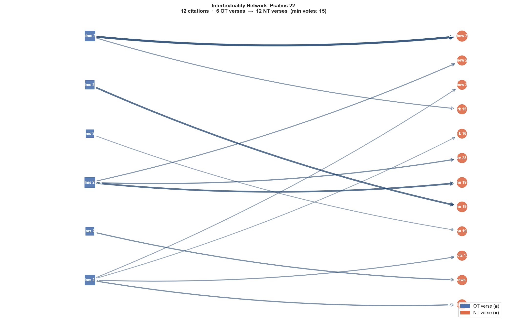

# Intertextuality Network: Psalms 22

**OT anchor:** Psalms 22  
**NT citations:** 12  
**Min confidence votes:** 15  
**NT books covered:** 7  

## Network Graph

## NT Book Coverage

| NT Book | Citations | Total Vote Score |
|---|---:|---:|
| John | 3 | 116 |
| Matthew | 3 | 109 |
| Mark | 2 | 42 |
| Hebrews | 1 | 31 |
| Luke | 1 | 31 |
| Revelation | 1 | 31 |
| Acts | 1 | 25 |

## All Citations

| OT Verse | NT Verse | Votes | OT Text | NT Text |
|---|---|---:|---|---|
| Psalms 22:1 | Matthew 27:46 | 64 | O God/ my God/ my <to>/ why? have you forsaken/ me [are] far from/ deliverance/ ... | About then the ninth hour cried out <the> Jesus in a voice loud saying; Eli Eli,... |
| Psalms 22:18 | John 19:24 | 49 | they distribute clothes/ my to/ themselves and/ on clothing/ my they cast a lot | They said therefore to one another; Not let us tear up it, but let us cast lots ... |
| Psalms 22:15 | John 19:28 | 49 | it has dried up like <the>/ earthenware strength/ my and/ tongue/ my [has been] ... | After this knowing <the> Jesus that now all things has been accomplished, so tha... |
| Psalms 22:27 | Revelation 15:4 | 31 | they will remember and/ they may turn to Yahweh all [the] ends of [the] earth so... | Who certainly surely may fear you O Lord, and will glorify the name of You? For ... |
| Psalms 22:18 | Luke 23:34 | 31 | they distribute clothes/ my to/ themselves and/ on clothing/ my they cast a lot | <the> And Jesus was saying; Father, do forgive them; not for they know what they... |
| Psalms 22:22 | Hebrews 2:12 | 31 | I will recount name/ your to/ brothers/ my in/ among [the] assembly I will prais... | saying: I will declare the name of You to the brothers of Mine, in [the] midst o... |
| Psalms 22:18 | Matthew 27:35 | 26 | they distribute clothes/ my to/ themselves and/ on clothing/ my they cast a lot | having crucified now Him they divided the garments of Him casting lots, so that ... |
| Psalms 22:1 | Mark 15:34 | 25 | O God/ my God/ my <to>/ why? have you forsaken/ me [are] far from/ deliverance/ ... | And on the ninth <the> hour cried out <the> Jesus in a voice loud saying: Eloi E... |
| Psalms 22:27 | Acts 1:8 | 25 | they will remember and/ they may turn to Yahweh all [the] ends of [the] earth so... | But you will receive power when was coming the Holy Spirit upon you and you will... |
| Psalms 22:27 | Matthew 28:19 | 19 | they will remember and/ they may turn to Yahweh all [the] ends of [the] earth so... | Having gone therefore do disciple all the nations baptizing them in the name of ... |
| Psalms 22:16 | John 19:37 | 18 | for they have surrounded/ me dogs a company of evil-doers they have encircled/ m... | And again another Scripture says: They will behold on the [One] they have pierce... |
| Psalms 22:27 | Mark 16:15 | 17 | they will remember and/ they may turn to Yahweh all [the] ends of [the] earth so... | And He said to them; Having gone into the world all do proclaim the gospel to al... |

## Verse-by-Verse Detail

### Psalms 22:1

> O God/ my God/ my <to>/ why? have you forsaken/ me [are] far from/ deliverance/ my [the] words of cry of distress/ my

**[Matthew 27:46]** (votes: 64)  
> About then the ninth hour cried out <the> Jesus in a voice loud saying; Eli Eli, lema sabachthani? That is: God of Mine God of Mine, so why Me have you forsaken?

**[Mark 15:34]** (votes: 25)  
> And on the ninth <the> hour cried out <the> Jesus in a voice loud saying: Eloi Eloi, lema sabachthani? Which is being translated; O God of Mine O God of Mine, to why have You forsaken Me

### Psalms 22:18

> they distribute clothes/ my to/ themselves and/ on clothing/ my they cast a lot

**[John 19:24]** (votes: 49)  
> They said therefore to one another; Not let us tear up it, but let us cast lots for it whose it will be; that the Scripture may be fulfilled what is being spoken: They divided the garments of Mine among themselves and for the clothing of Mine they cast a lot. The indeed therefore soldiers these things did,

**[Luke 23:34]** (votes: 31)  
> <the> And Jesus was saying; Father, do forgive them; not for they know what they do. Dividing then the garments of Him they cast lots.

**[Matthew 27:35]** (votes: 26)  
> having crucified now Him they divided the garments of Him casting lots, so that may be fulfilled which having been spoken by <the> prophet they divided the garments of mine themselves and upon the clothing of mine they cast lots

### Psalms 22:15

> it has dried up like <the>/ earthenware strength/ my and/ tongue/ my [has been] made to cling to jaws/ my and/ to/ [the] dust of death you put/ me

**[John 19:28]** (votes: 49)  
> After this knowing <the> Jesus that now all things has been accomplished, so that may be fulfilled the Scripture, He says; I thirst.

### Psalms 22:27

> they will remember and/ they may turn to Yahweh all [the] ends of [the] earth so/ they may bow down <to>/ before/ you all [the] clans of [the] nations

**[Revelation 15:4]** (votes: 31)  
> Who certainly surely may fear you O Lord, and will glorify the name of You? For [You] alone [are] sacred, For all the nations will come and will worship before You, because the righteous acts of You were revealed.

**[Acts 1:8]** (votes: 25)  
> But you will receive power when was coming the Holy Spirit upon you and you will be My witnesses in both Jerusalem and in all <the> Judea and Samaria and until [the] uttermost part of the earth.

**[Matthew 28:19]** (votes: 19)  
> Having gone therefore do disciple all the nations baptizing them in the name of the Father and of the Son and of the Holy Spirit,

**[Mark 16:15]** (votes: 17)  
> And He said to them; Having gone into the world all do proclaim the gospel to all the creation.

### Psalms 22:22

> I will recount name/ your to/ brothers/ my in/ among [the] assembly I will praise/ you

**[Hebrews 2:12]** (votes: 31)  
> saying: I will declare the name of You to the brothers of Mine, in [the] midst of [the] congregation I will sing praises of you.

### Psalms 22:16

> for they have surrounded/ me dogs a company of evil-doers they have encircled/ me like/ a lion hands/ my and/ feet/ my

**[John 19:37]** (votes: 18)  
> And again another Scripture says: They will behold on the [One] they have pierced.

---

_Cross-reference data: scrollmapper / OpenBible.info (CC-BY). Vote scores reflect community confidence in each link. Text: KJV (STEPBible TAHOT/TAGNT CC BY 4.0, Tyndale House Cambridge)._