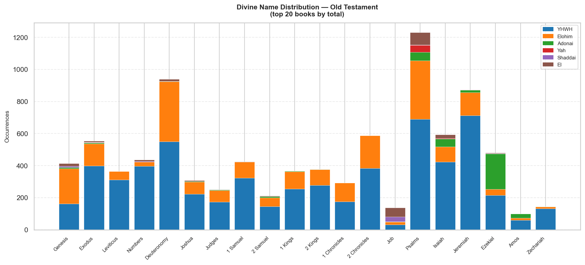
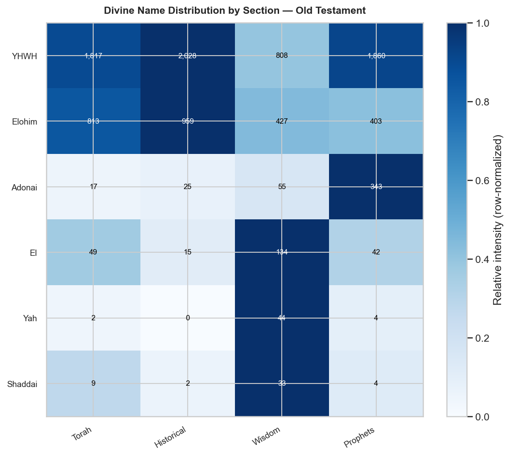
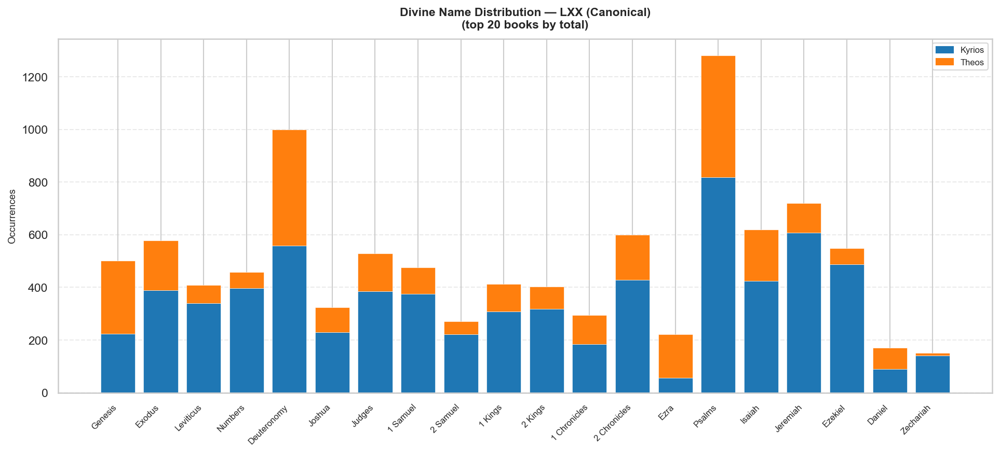
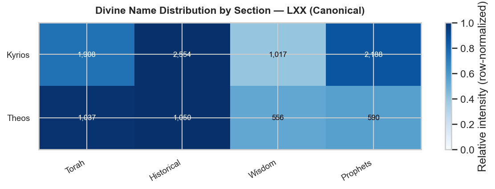
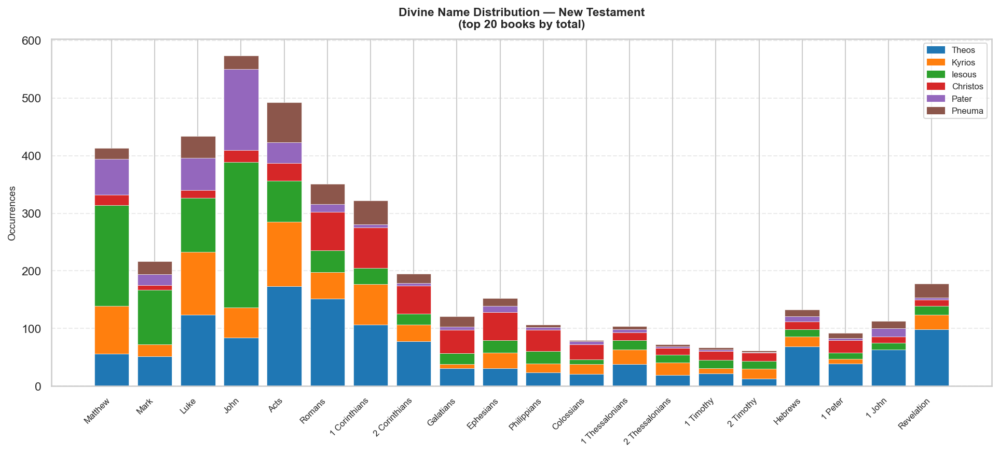
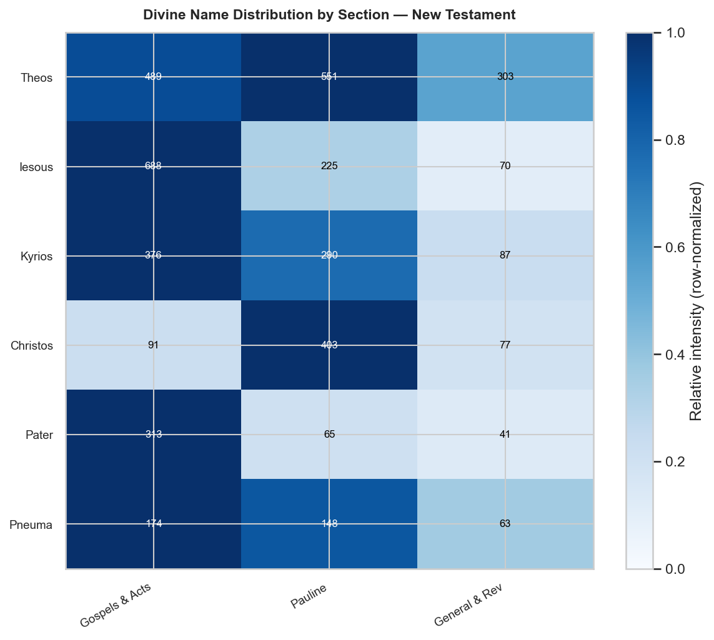

# Divine Names and Christological Titles

Analysis of the major divine names across the Hebrew OT, Septuagint (LXX), and Greek NT, drawn from STEPBible TAHOT/TAGNT/TALXX morphological data.

---

## Old Testament (Hebrew)

### Overview

| Name | Script | Strongs | Total | % | Top Books |
|---|---|---|---:|---:|---|
| YHWH | יהוה | H3068G | 6,513 | 65.8% | Jeremiah (712), Psalms (689), Deuteronomy (549) |
| Elohim | אֱלֹהִים | H0430 | 2,602 | 26.3% | Deuteronomy (375), Psalms (365), Genesis (219) |
| Adonai | אֲדֹנָי | H0136 | 440 | 4.4% | Ezekiel (222), Psalms (54), Isaiah (48) |
| El | אֵל | H0410 | 240 | 2.4% | Psalms (77), Job (56), Isaiah (22) |
| Yah | יָהּ | H3050 | 50 | 0.5% | Psalms (43), Isaiah (4), Exodus (2) |
| Shaddai | שַׁדַּי | H7706 | 48 | 0.5% | Job (31), Genesis (6), Ezekiel (2) |

### Distribution by Section

| Name | Torah | Historical | Wisdom | Prophets | Total |
|---|---:|---:|---:|---:|---:|
| YHWH | 1,817 | 2,028 | 808 | 1,860 | 6,513 |
| Elohim | 813 | 959 | 427 | 403 | 2,602 |
| Adonai | 17 | 25 | 55 | 343 | 440 |
| El | 49 | 15 | 134 | 42 | 240 |
| Yah | 2 | 0 | 44 | 4 | 50 |
| Shaddai | 9 | 2 | 33 | 4 | 48 |

### Charts

### By Book

| Book | YHWH | Elohim | Adonai | Yah | Shaddai | El | Total |
|---|---:|---:|---:|---:|---:|---:|---:|
| Genesis | 163 | 219 | 8 | 0 | 6 | 18 | 414 |
| Exodus | 398 | 139 | 6 | 2 | 1 | 7 | 553 |
| Leviticus | 311 | 53 | 0 | 0 | 0 | 0 | 364 |
| Numbers | 396 | 27 | 1 | 0 | 2 | 10 | 436 |
| Deuteronomy | 549 | 375 | 2 | 0 | 0 | 14 | 940 |
| Joshua | 223 | 76 | 4 | 0 | 0 | 4 | 307 |
| Judges | 173 | 73 | 4 | 0 | 0 | 1 | 251 |
| Ruth | 18 | 4 | 0 | 0 | 2 | 0 | 24 |
| 1 Samuel | 323 | 101 | 0 | 0 | 0 | 1 | 425 |
| 2 Samuel | 146 | 54 | 7 | 0 | 0 | 5 | 212 |
| 1 Kings | 255 | 107 | 5 | 0 | 0 | 0 | 367 |
| 2 Kings | 277 | 98 | 2 | 0 | 0 | 0 | 377 |
| 1 Chronicles | 175 | 118 | 0 | 0 | 0 | 0 | 293 |
| 2 Chronicles | 384 | 203 | 0 | 0 | 0 | 0 | 587 |
| Ezra | 37 | 55 | 1 | 0 | 0 | 0 | 93 |
| Nehemiah | 17 | 70 | 2 | 0 | 0 | 4 | 93 |
| Job | 32 | 17 | 1 | 0 | 31 | 56 | 137 |
| Psalms | 689 | 365 | 54 | 43 | 2 | 77 | 1,230 |
| Proverbs | 87 | 5 | 0 | 0 | 0 | 1 | 93 |
| Ecclesiastes | 0 | 40 | 0 | 0 | 0 | 0 | 40 |
| Song of Songs | 0 | 0 | 0 | 1 | 0 | 0 | 1 |
| Isaiah | 424 | 94 | 48 | 4 | 1 | 22 | 593 |
| Jeremiah | 712 | 145 | 14 | 0 | 0 | 2 | 873 |
| Lamentations | 32 | 0 | 14 | 0 | 0 | 1 | 47 |
| Ezekiel | 216 | 36 | 222 | 0 | 2 | 4 | 480 |
| Daniel | 8 | 22 | 11 | 0 | 0 | 4 | 45 |
| Hosea | 46 | 26 | 0 | 0 | 0 | 3 | 75 |
| Joel | 33 | 11 | 0 | 0 | 1 | 0 | 45 |
| Amos | 60 | 14 | 25 | 0 | 0 | 0 | 99 |
| Obadiah | 6 | 0 | 1 | 0 | 0 | 0 | 7 |
| Jonah | 26 | 16 | 0 | 0 | 0 | 1 | 43 |
| Micah | 39 | 11 | 2 | 0 | 0 | 2 | 54 |
| Habakkuk | 12 | 2 | 1 | 0 | 0 | 0 | 15 |
| Zephaniah | 33 | 5 | 1 | 0 | 0 | 0 | 39 |
| Haggai | 35 | 3 | 0 | 0 | 0 | 0 | 38 |
| Zechariah | 132 | 11 | 2 | 0 | 0 | 0 | 145 |
| Malachi | 46 | 7 | 2 | 0 | 0 | 3 | 58 |

---

## Septuagint — canonical books only

### Overview

| Name | Script | Strongs | Total | % | Top Books |
|---|---|---|---:|---:|---|
| Kyrios | κύριος | G2962 | 7,667 | 70.3% | Psalms (818), Jeremiah (607), Deuteronomy (558) |
| Theos | θεός | G2316 | 3,233 | 29.7% | Psalms (462), Deuteronomy (441), Genesis (277) |

### Distribution by Section

| Name | Torah | Historical | Wisdom | Prophets | Total |
|---|---:|---:|---:|---:|---:|
| Kyrios | 1,908 | 2,554 | 1,017 | 2,188 | 7,667 |
| Theos | 1,037 | 1,050 | 556 | 590 | 3,233 |

### Charts

### By Book

| Book | Kyrios | Theos | Total |
|---|---:|---:|---:|
| Genesis | 224 | 277 | 501 |
| Exodus | 389 | 189 | 578 |
| Leviticus | 340 | 69 | 409 |
| Numbers | 397 | 61 | 458 |
| Deuteronomy | 558 | 441 | 999 |
| Joshua | 229 | 96 | 325 |
| Judges | 386 | 142 | 528 |
| Ruth | 19 | 5 | 24 |
| 1 Samuel | 376 | 99 | 475 |
| 2 Samuel | 221 | 50 | 271 |
| 1 Kings | 309 | 103 | 412 |
| 2 Kings | 319 | 83 | 402 |
| 1 Chronicles | 184 | 110 | 294 |
| 2 Chronicles | 429 | 171 | 600 |
| Ezra | 57 | 165 | 222 |
| Esther | 25 | 26 | 51 |
| Job | 120 | 18 | 138 |
| Psalms | 818 | 462 | 1,280 |
| Proverbs | 79 | 34 | 113 |
| Ecclesiastes | 0 | 42 | 42 |
| Isaiah | 424 | 195 | 619 |
| Jeremiah | 607 | 113 | 720 |
| Lamentations | 44 | 0 | 44 |
| Ezekiel | 487 | 62 | 549 |
| Daniel | 91 | 79 | 170 |
| Hosea | 48 | 33 | 81 |
| Joel | 31 | 12 | 43 |
| Amos | 89 | 25 | 114 |
| Obadiah | 7 | 1 | 8 |
| Jonah | 26 | 17 | 43 |
| Micah | 44 | 12 | 56 |
| Nahum | 13 | 3 | 16 |
| Habakkuk | 13 | 5 | 18 |
| Zephaniah | 38 | 7 | 45 |
| Haggai | 34 | 3 | 37 |
| Zechariah | 141 | 11 | 152 |
| Malachi | 51 | 12 | 63 |

---

## New Testament (Greek)

### Overview

| Name | Script | Strongs | Total | % | Top Books |
|---|---|---|---:|---:|---|
| Theos | θεός | G2316 | 1,343 | 30.2% | Acts (173), Romans (152), Luke (124) |
| Iesous | Ἰησοῦς | G2424G | 983 | 22.1% | John (253), Matthew (175), Mark (95) |
| Kyrios | κύριος | G2962 | 753 | 16.9% | Acts (112), Luke (109), Matthew (83) |
| Christos | Χριστός | G5547 | 571 | 12.8% | 1 Corinthians (70), Romans (66), 2 Corinthians (48) |
| Pater | πατήρ | G3962 | 419 | 9.4% | John (140), Matthew (62), Luke (56) |
| Pneuma | πνεῦμα | G4151 | 385 | 8.6% | Acts (70), 1 Corinthians (41), Luke (38) |

### Distribution by Section

| Name | Gospels & Acts | Pauline | General & Rev | Total |
|---|---:|---:|---:|---:|
| Theos | 489 | 551 | 303 | 1,343 |
| Iesous | 688 | 225 | 70 | 983 |
| Kyrios | 376 | 290 | 87 | 753 |
| Christos | 91 | 403 | 77 | 571 |
| Pater | 313 | 65 | 41 | 419 |
| Pneuma | 174 | 148 | 63 | 385 |

### Charts

### By Book

| Book | Theos | Kyrios | Iesous | Christos | Pater | Pneuma | Total |
|---|---:|---:|---:|---:|---:|---:|---:|
| Matthew | 56 | 83 | 175 | 18 | 62 | 19 | 413 |
| Mark | 52 | 20 | 95 | 8 | 19 | 23 | 217 |
| Luke | 124 | 109 | 94 | 13 | 56 | 38 | 434 |
| John | 84 | 52 | 253 | 21 | 140 | 24 | 574 |
| Acts | 173 | 112 | 71 | 31 | 36 | 70 | 493 |
| Romans | 152 | 46 | 38 | 66 | 14 | 35 | 351 |
| 1 Corinthians | 107 | 70 | 28 | 70 | 6 | 41 | 322 |
| 2 Corinthians | 78 | 29 | 19 | 48 | 5 | 16 | 195 |
| Galatians | 31 | 7 | 19 | 41 | 5 | 18 | 121 |
| Ephesians | 31 | 27 | 22 | 48 | 11 | 14 | 153 |
| Philippians | 24 | 15 | 22 | 37 | 4 | 5 | 107 |
| Colossians | 21 | 17 | 8 | 26 | 6 | 2 | 80 |
| 1 Thessalonians | 38 | 25 | 17 | 13 | 6 | 5 | 104 |
| 2 Thessalonians | 19 | 22 | 13 | 12 | 3 | 3 | 72 |
| 1 Timothy | 22 | 9 | 14 | 16 | 2 | 4 | 67 |
| 2 Timothy | 13 | 17 | 14 | 14 | 1 | 3 | 62 |
| Titus | 13 | 1 | 4 | 4 | 1 | 1 | 24 |
| Philemon | 2 | 5 | 7 | 8 | 1 | 1 | 24 |
| Hebrews | 69 | 17 | 13 | 13 | 9 | 12 | 133 |
| James | 16 | 15 | 2 | 2 | 4 | 2 | 41 |
| 1 Peter | 39 | 8 | 11 | 22 | 3 | 9 | 92 |
| 2 Peter | 7 | 14 | 9 | 8 | 2 | 1 | 41 |
| 1 John | 63 | 0 | 12 | 11 | 14 | 13 | 113 |
| 2 John | 2 | 1 | 2 | 4 | 4 | 0 | 13 |
| 3 John | 3 | 0 | 0 | 0 | 0 | 0 | 3 |
| Jude | 5 | 7 | 6 | 6 | 1 | 2 | 27 |
| Revelation | 99 | 25 | 15 | 11 | 4 | 24 | 178 |

---

_Source: STEPBible TAHOT/TAGNT/TALXX (CC BY 4.0, Tyndale House Cambridge)._