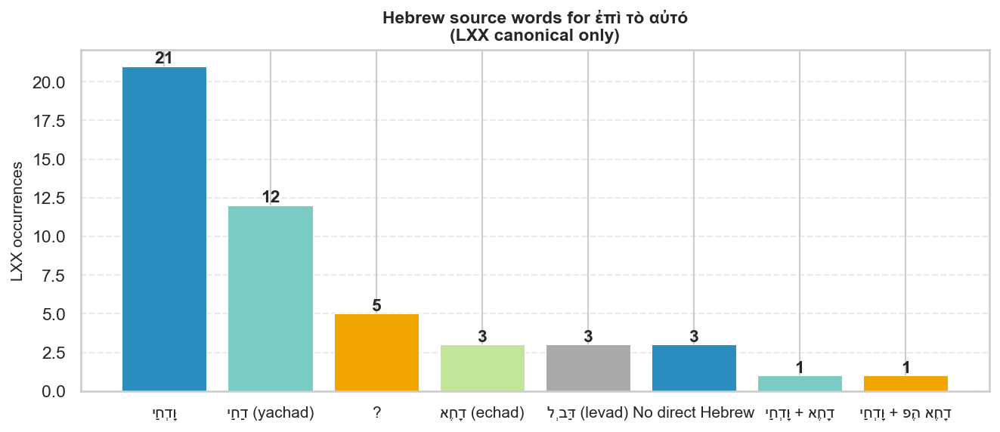
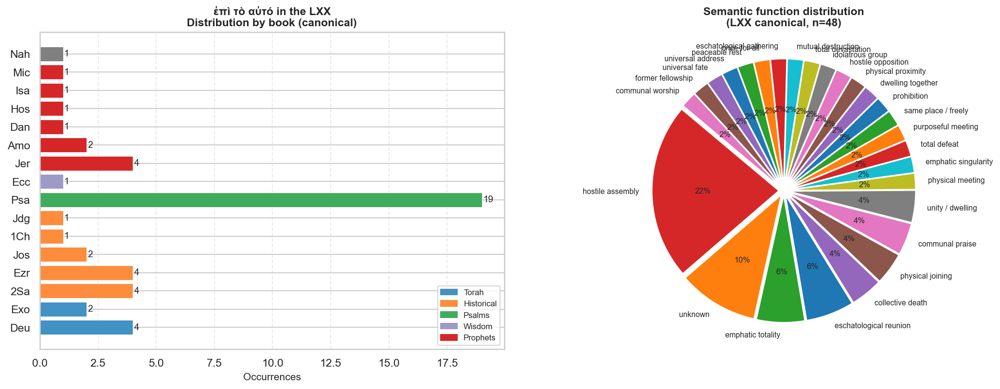
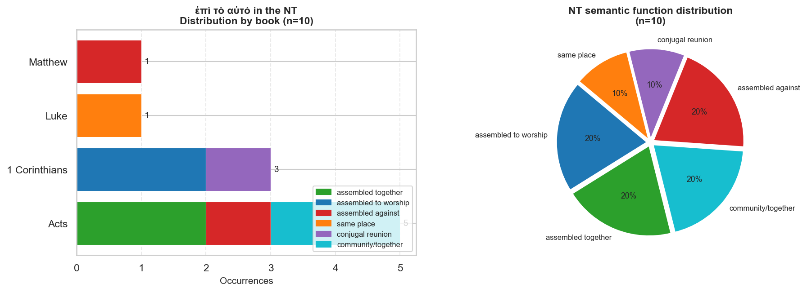

# ἐπὶ τὸ αὐτό — Phrase Study

**LXX + Greek NT Occurrence Analysis**

*Build script: [scripts/build_epi_to_auto.py](../../../../scripts/build_epi_to_auto.py)*

---

## Contents

1. [The Phrase and Its Grammar](#the-phrase-and-its-grammar)
2. [Hebrew Sources in the LXX](#hebrew-sources-in-the-lxx)
3. [LXX Distribution by Book and Genre](#lxx-distribution-by-book-and-genre)
4. [LXX Semantic Functions](#lxx-semantic-functions)
5. [Complete LXX Concordance](#complete-lxx-concordance)
6. [New Testament Occurrences](#new-testament-occurrences)
7. [Acts 4:26 — The LXX–NT Connection](#acts-426-the-lxx-nt-connection)
8. [Summary and Observations](#summary-and-observations)

---

## The Phrase and Its Grammar

**ἐπὶ τὸ αὐτό** (epi to auto) is a fixed adverbial phrase composed of:

| Word | Form | Lemma | Strong's | Gloss |
|---|---|---|---|---|
| ἐπί | prep. | ἐπί | G1909 | on, upon, at, together |
| τό | def. art., acc. neut. sg. | ὁ | G3588 | the |
| αὐτό | dem./intens. pron., acc. neut. sg. | αὐτός | G846 | same, itself |

The literal sense is **"upon/at the same [thing/place]"** — a prepositional phrase
that has been grammaticalized into an adverbial idiom. By the Hellenistic period
it functions as a fixed expression with the full range of meanings documented below.

It is sometimes written as a single word: **ἐπιτοαυτό** (found in some early
Christian manuscripts). This orthographic fusion reflects its status as a
frozen idiom rather than a freely constructed phrase.

**Morphologically** the accusative neuter of the article (τό) and pronoun (αὐτό)
fix the phrase to a nominal referent implied but not stated — it refers abstractly
to "the same thing/reality/place" as a concept, not a specific antecedent.

---

## Hebrew Sources in the LXX

The phrase appears **49 times in canonical LXX books** (plus 4 deuterocanonical).
The LXX translators used it primarily to render two Hebrew adverbs:

### יַחַד / יַחְדָּו — "together" (primary source, ~74% of canonical occurrences)

The overwhelmingly dominant Hebrew behind ἐπὶ τὸ αὐτό is the adverb **יַחַד**
(yachad) and its fuller form **יַחְדָּו** (yachdav), both meaning *together, at once,
alike, in union*.

| Hebrew form | Transliteration | Root | Core meaning |
|---|---|---|---|
| יַחַד | *yachad* | יחד (to be united) | together, simultaneously |
| יַחְדָּו | *yachdav* | יחד | together, at the same time |

These two forms are interchangeable and appear in all genres: Psalms, Torah, Prophets,
Historical Books, and Writings. They describe any sense of simultaneity, shared
location, or unity — whether positive (brotherhood, communal praise) or negative
(conspiring enemies gathering against God's people).

The LXX translators rendered יַחַד/יַחְדָּו with ἐπὶ τὸ αὐτό, **ἅμα** (together, at the
same time), **ὁμοῦ** (together), or **ὁμοθυμαδόν** (with one mind), depending on
context. ἐπὶ τὸ αὐτό was their preferred choice across the Psalms and in narrative
texts, particularly where the "togetherness" implies a gathering or assembly.

### אֶחָד / אַחַת — "one" (secondary source, ~10%)

A smaller but significant cluster renders **אֶחָד** (echad, *one*) as ἐπὶ τὸ αὐτό.
This occurs where the numeral functions adverbially — "as one" meaning "together" or
"at the same time." Examples:

- **Jos 9:2** — Canaanite kings gathered to fight "with one accord" (יַחְדָּו + פֶּה אֶחָד →
  ἐπὶ τὸ αὐτό)
- **2Sa 12:3** — The poor man had "one" ewe lamb (LXX: ἐπὶ τὸ αὐτό used here for
  singular emphasis in context)
- **Ecc 11:6** — "Which will prosper, this or that, or both alike" (אֶחָד)

### לְבַד — "alone, separately" (rare, ~4%)

Two tabernacle descriptions in Exodus (26:9 ×2) render **לְבַד** (levad, *alone, by
itself*) as ἐπὶ τὸ αὐτό:

> *"Join the five curtains by themselves [ἐπὶ τὸ αὐτό] and the six curtains by
> themselves [ἐπὶ τὸ αὐτό]"* (Ex 26:9)

This is the most semantically surprising usage — the Hebrew means "separately,"
yet ἐπὶ τὸ αὐτό is used to express "as a unit" (each group of curtains joined together
within themselves). The idiom captures the *internal unity* of each grouping.

### No direct Hebrew equivalent (~12%)

About six canonical occurrences have no direct Hebrew word that corresponds to ἐπὶ
τὸ αὐτό. In these cases the LXX translators either:
- Added the phrase for emphatic or stylistic reasons (Ps 18:10 LXX, Nah 1:9)
- The verse section is lost or differs from the MT tradition (some Psalms)
- The LXX is translating a different Vorlage (underlying Hebrew text)

---

## LXX Distribution by Book and Genre

### By genre

| Genre | Occurrences | % of canonical total |
|---|---|---|
| Psalms | 19 | 39% |
| Prophets | 12 | 24% |
| Torah (Pentateuch) | 7 | 14% |
| Historical Books | 7 | 14% |
| Wisdom | 4 | 8% |

**The Psalms are by far the most concentrated source** — nearly 40% of all canonical
occurrences. This concentration reflects the Psalter's heavy use of יַחַד/יַחְדָּו to
describe both the assembly of enemies against God (a major Psalmic motif) and the
gathering of worshippers in praise.

The Prophetic books contribute 12 occurrences, often in two recurring theological
contexts: (1) the hostile assembly of nations against YHWH, and (2) the eschatological
regathering of Israel and Judah together.

### Books with multiple occurrences

| Book | Count | Genre | Primary context |
|---|---|---|---|
| Psalms | 19 | Psalms | Hostile assemblies + communal praise |
| Deuteronomy | 4 | Torah | Legal contexts (levirate, purity laws) |
| Jeremiah | 4 | Prophets | Eschatological reunion + destruction |
| 2 Samuel | 4 | Historical | Military gatherings + individual narrative |
| Joshua | 2 | Historical | Enemy coalitions |
| Amos | 2 | Prophets | Judgment + prophetic question |
| Exodus | 2 | Torah | Tabernacle construction |

---

## LXX Semantic Functions

Analysis of all 49 canonical occurrences yields seven primary semantic functions:

| Function | Count | % | Description |
|---|---|---|---|
| **Hostile assembly** | 16 | 33% | Enemies, nations, or conspirators gathering *against* someone |
| **Communal praise / worship** | 5 | 10% | God's people gathered *for* worship |
| **Eschatological reunion** | 5 | 10% | Israel and Judah reunited in the last days |
| **Unity / dwelling together** | 4 | 8% | Brothers or community living in shared space |
| **Physical meeting / gathering** | 4 | 8% | Neutral military or civil assembly |
| **Universal totality** | 4 | 8% | All of humanity or all things *alike* |
| **Total defeat / collective death** | 4 | 8% | Group perishing together |
| **Legal/practical context** | 4 | 8% | Law, prohibition, or technical description |
| **Other / unclear** | 3 | 6% | Including rare/uncertain cases |

### The two dominant poles

The phrase is organized around **two semantic poles** that map onto the two directions
the יַחַד family of words takes in the Hebrew Bible:

**1. Hostile solidarity** — the assembly of opponents who "gather together" against
God or the righteous. This is by far the most common function in the Psalms:
enemies whisper together (Ps 40:8 LXX), kings conspire together (Ps 2:2), rulers
and nations plot together (Ps 82:6, 70:10, 73:6–8, 47:5, 36:38). The recurring
phrase in Hebrew is נוֹעֲדוּ יַחְדָּו / נִקְבְּצוּ יַחַד.

**2. Positive community** — brothers dwelling together (Ps 132:1 LXX = Ps 133:1
MT, the opening of the Song of Ascents), peoples gathered to worship (Ps 101:23),
rivers and mountains praising together (Ps 97:8). The eschatological reunification
passages in Jeremiah, Hosea, and Micah also carry strong positive valence.

---

## Complete LXX Concordance

### Psalms (19 occurrences)

| LXX Ref | MT Ref | Hebrew | LXX Text | Function |
|---|---|---|---|---|
| Ps 2:2 | Ps 2:2 | יַחַד | παρέστησαν … συνήχθησαν ἐπὶ τὸ αὐτό | Hostile assembly — *quoted in Acts 4:26* |
| Ps 4:9 | Ps 4:8 | יַחְדָּו | ἐν εἰρήνῃ ἐπὶ τὸ αὐτό κοιμηθήσομαι | Peaceable rest — "In peace I will lie down together" |
| Ps 18:10 | Ps 19:10 | — | κρίματα κυρίου … ἀληθινά … δεδικαιωμένα ἐπὶ τὸ αὐτό | Emphatic totality — LXX expansion |
| Ps 33:4 | Ps 34:3 | יַחְדָּו | ὑψώσωμεν τὸ ὄνομα αὐτοῦ ἐπὶ τὸ αὐτό | Communal praise — "let us exalt his name together" |
| Ps 36:38 | Ps 37:38 | יַחְדָּו | παράνομοι … ἐξολεθρευθήσονται ἐπὶ τὸ αὐτό | Total destruction — transgressors destroyed together |
| Ps 40:8 | Ps 41:7 | יַחַד | ἐπὶ τὸ αὐτό κατ᾿ ἐμοῦ ἐψιθύριζον | Hostile assembly — enemies whisper together against me |
| Ps 47:5 | Ps 48:4 | יַחְדָּו | οἱ βασιλεῖς … παρεγένοντο ἐπὶ τὸ αὐτό | Hostile assembly — kings who assembled then fled in terror |
| Ps 48:3 | Ps 49:2 | יַחַד | υἱοὶ ἀνθρώπων … ἐπὶ τὸ αὐτό, πλούσιος καὶ πένης | Universal address — rich and poor together |
| Ps 48:11 | Ps 49:10 | יַחַד | σοφοὶ ἀποθανοῦνται, ἄφρων καὶ ἄνους ἀπολοῦνται ἐπὶ τὸ αὐτό | Universal fate — wise and fool perish together |
| Ps 54:15 | Ps 55:14 | יַחְדָּו | ὃς ἐπὶ τὸ αὐτό μοι ἐγλύκανας ἐδέσματα | Former fellowship — "you who shared sweet counsel with me" |
| Ps 61:10 | Ps 62:9 | יַחַד | υἱοὶ ἀνθρώπων … μάταιοι ἐπὶ τὸ αὐτό | Universal totality — all humanity is vanity together |
| Ps 70:10 | Ps 71:10 | יַחְדָּו | οἱ φυλάσσοντες τὴν ψυχήν μου ἐβουλεύσαντο ἐπὶ τὸ αὐτό | Hostile assembly — plotted together against my life |
| Ps 73:6 | Ps 74:6 | יַחַד | τὰ γλυπτὰ … κατέβαλον ἐπὶ τὸ αὐτό | Hostile assembly — smashed the carvings together |
| Ps 73:8 | Ps 74:8 | יַחַד | εἶπαν … καύσωμεν … ἐπὶ τὸ αὐτό | Hostile assembly — "burn all God's meeting places together" |
| Ps 82:6 | Ps 83:5 | יַחְדָּו | ὅτι ἐβουλεύσαντο … ἐπὶ τὸ αὐτό | Hostile assembly — conspired with one heart together |
| Ps 97:8 | Ps 98:8 | יַחַד | ποταμοὶ … ὄρη ἀγαλλιάσονται ἐπὶ τὸ αὐτό | Communal praise — rivers and mountains rejoice together |
| Ps 101:23 | Ps 102:22 | יַחְדָּו | λαοὶ … ἐπὶ τὸ αὐτό τοῦ λατρεύειν κυρίῳ | Communal worship — peoples gathered to serve the Lord |
| Ps 121:3 | Ps 122:3 | יַחְדָּו | Ιερουσαλήμ … ὡς πόλις … ἐπὶ τὸ αὐτό | Unity/dwelling — Jerusalem "joined together" as a city |
| Ps 132:1 | Ps 133:1 | יַחַד | καλὸν … τὸ κατοικεῖν ἀδελφοὺς ἐπὶ τὸ αὐτό | Unity/dwelling — brothers dwelling together (Song of Ascents) |

### Torah (7 occurrences)

| LXX Ref | MT Ref | Hebrew | Function | Note |
|---|---|---|---|---|
| Ex 26:9 (×2) | Ex 26:9 | לְבַּד | Physical joining | Five curtains joined by themselves; six by themselves (tabernacle) |
| Dt 12:15 | Dt 12:15 | לְבַּד | Unrestricted freedom | May slaughter in any town — idiom for "at will" |
| Dt 22:10 | Dt 22:10 | יַחְדָּו | Prohibition | Do not plow with ox and donkey together |
| Dt 25:5 | Dt 25:5 | יַחְדָּו + אֶחָד | Dwelling together | Brothers dwelling together (levirate marriage law) |
| Dt 25:11 | Dt 25:11 | יַחְדָּו | Physical proximity | Two men fighting together (same legal section) |

### Historical Books (7 occurrences)

| LXX Ref | MT Ref | Hebrew | Function | Note |
|---|---|---|---|---|
| Jos 9:2 | Jos 9:2 | יַחְדָּו + פֶּה אֶחָד | Hostile assembly | Canaanite coalition gathered to fight Joshua "with one accord" |
| Jos 11:5 | Jos 11:5 | יַחְדָּו | Hostile assembly | All kings came and encamped together at Waters of Merom |
| 2Sa 2:13 | 2Sa 2:13 | יַחְדָּו | Physical meeting | Joab and David's men met together at Gibeon pool |
| 2Sa 10:15 | 2Sa 10:15 | יַחַד | Hostile assembly | Arameans regathered after first defeat |
| 2Sa 12:3 | 2Sa 12:3 | אַחַת | Emphatic singularity | The poor man had only one ewe lamb |
| 2Sa 21:9 | 2Sa 21:9 | יַחַד | Collective death | Seven of Saul's sons fell together at harvest |
| 1Ch 10:6 | 1Ch 10:6 | יַחְדָּו | Collective death | Saul and all his household died together |

### Prophets (12 occurrences)

| LXX Ref | MT Ref | Hebrew | Function | Note |
|---|---|---|---|---|
| Hos 2:2 | Hos 2:1 | יַחְדָּו | Eschatological reunion | Judah and Israel gathered together under one head |
| Amo 1:15 | Am 1:15 | יַחְדָּו | Total defeat | King and officials exiled together |
| Amo 3:3 | Am 3:3 | יַחְדָּו | Purposeful meeting | "Can two walk together unless they have agreed?" |
| Mic 2:12 | Mic 2:12 | יַחַד | Eschatological gathering | "I will surely assemble the remnant of Israel together" |
| Nah 1:9 | Nah 1:9 | — | Once-for-all | "Affliction will not rise twice" — LXX renders idea of simultaneity |
| Isa 66:17 | Is 66:17 | אַחַת | Idolatrous group | Those consecrating themselves "behind one in the midst" |
| Jer 3:18 | Jer 3:18 | יַחְדָּו | Eschatological reunion | Judah and Israel coming together from the north |
| Jer 6:12 | Jer 6:12 | יַחְדָּו | Total devastation | Fields and wives turned over together to others |
| Jer 26:12 | Jer 46:12 MT | יַחְדָּו | Mutual destruction | Warrior stumbles on warrior; both fall together |
| Jer 27:4 | Jer 50:4 MT | יַחְדָּו | Eschatological reunion | Israel and Judah going together weeping and seeking the Lord |
| Ezr 4:3 | Ezr 4:3 | — | Hostile opposition | Adversaries united against temple rebuilding |

> **Note on Jeremiah:** The LXX of Jeremiah follows a different order and is significantly
> shorter than the MT. LXX Jer 26:12 = MT Jer 46:12; LXX Jer 27:4 = MT Jer 50:4.

### Wisdom (4 occurrences)

| LXX Ref | MT Ref | Hebrew | Function | Note |
|---|---|---|---|---|
| Ecc 11:6 | Ec 11:6 | אֶחָד | Emphatic totality | Which will prosper, this or that, or both alike |

### Deuterocanonical (4 occurrences)

| LXX Ref | Function | Note |
|---|---|---|
| 3 Macc 3:1 | Hostile assembly | King and friends conspired together against the Jews |
| Bel 1:27 | Assembled together | The people gathered together |
| Bel 1:27 (Th) | Assembled together | Theodotion version of the same |
| Sus 1:14 (Th) | Hostile conspiracy | The two elders agreed together on the same day to watch Susanna |

---

## New Testament Occurrences

The phrase appears **10 times in the GNT**, concentrated in Acts and 1 Corinthians —
both texts centrally concerned with the gathered Christian community (ἐκκλησία).

### Complete NT concordance

| Ref | Greek text | Function | Note |
|---|---|---|---|
| **Mat 22:34** | Οἱ δὲ Φαρισαῖοι … συνήχθησαν ἐπὶ τὸ αὐτό | Hostile assembly | Pharisees gathered together [against Jesus] after he silenced the Sadducees |
| **Luk 17:35** | ἔσονται δύο ἀλήθουσαι ἐπὶ τὸ αὐτό | Same place | Two women grinding at the same place — one taken, one left |
| **Act 1:15** | ὄχλος ὀνομάτων ἐπὶ τὸ αὐτό ὡσεὶ ἑκατὸν εἴκοσι | Assembled together | The ~120 disciples gathered — crowd "numbering together about 120" |
| **Act 2:1** | ἦσαν πάντες ὁμοῦ ἐπὶ τὸ αὐτό | Assembled together | All gathered together on the day of Pentecost |
| **Act 2:44** | πάντες δὲ οἱ πιστεύσαντες ἐπὶ τὸ αὐτό | Community | All believers together held everything in common |
| **Act 2:47** | ὁ δὲ Κύριος προσετίθει τοὺς σῳζομένους … ἐπὶ τὸ αὐτό | Community | The Lord was adding those being saved to the community day by day |
| **Act 4:26** | παρέστησαν … συνήχθησαν ἐπὶ τὸ αὐτό κατὰ τοῦ Κυρίου | Hostile assembly | Direct quotation of LXX Ps 2:2 — kings gathered against the Lord and his Christ |
| **1Co 7:5** | καὶ πάλιν ἐπὶ τὸ αὐτό ἦτε | Conjugal reunion | "Come together again" — resuming marital relations after agreed separation for prayer |
| **1Co 11:20** | Συνερχομένων οὖν ὑμῶν ἐπὶ τὸ αὐτό | Assembled to worship | "When you come together [as a church]" — the Lord's Supper assembly |
| **1Co 14:23** | Ἐὰν … συνέλθῃ ἡ ἐκκλησία ὅλη ἐπὶ τὸ αὐτό | Assembled to worship | "If the whole church comes together" — context of tongues and prophecy |

### NT semantic breakdown

| Function | Verses | Count |
|---|---|---|
| **Assembled together** (ἐκκλησία gathered) | Act 1:15; 2:1; 2:44; 2:47; 1Co 11:20; 1Co 14:23 | 6 |
| **Hostile assembly** | Mat 22:34; Act 4:26 | 2 |
| **Same place** | Luk 17:35 | 1 |
| **Conjugal reunion** | 1Co 7:5 | 1 |

### The "assembly" cluster in Acts 1–4

The phrase occurs **four times in Acts 1–4** (1:15; 2:1; 2:44; 2:47) and the pattern
is striking. In this compressed narrative, ἐπὶ τὸ αὐτό functions almost as a
technical term for the gathered messianic community — the ἐκκλησία before the word
ἐκκλησία becomes the standard term.

- **Act 1:15** — 120 disciples ἐπὶ τὸ αὐτό, awaiting the Spirit
- **Act 2:1** — all ἐπὶ τὸ αὐτό when the Spirit comes at Pentecost
- **Act 2:44** — all believers ἐπὶ τὸ αὐτό, holding all things in common
- **Act 2:47** — the Lord adding the saved ἐπὶ τὸ αὐτό (to the community)

This cluster mirrors the Psalmic usage where ἐπὶ τὸ αὐτό describes the gathered
assembly, but inverts the valence from *hostile* to *redemptive* — the community
formed by the Spirit is the counterpart to the gathered enemies of Psalm 2.

---

## Acts 4:26 — The LXX–NT Connection

The most theologically significant occurrence is **Acts 4:26**, which quotes **LXX
Psalm 2:2** directly:

> **LXX Ps 2:2:**
> παρέστησαν οἱ βασιλεῖς τῆς γῆς καὶ οἱ ἄρχοντες
> **συνήχθησαν ἐπὶ τὸ αὐτό** κατὰ τοῦ κυρίου καὶ κατὰ τοῦ χριστοῦ αὐτοῦ
>
> *The kings of the earth stood and the rulers assembled together against the Lord
> and against his Anointed.*

> **Acts 4:25–26** (early church prayer after Peter and John's release):
> Ἱνατί ἐφρύαξαν ἔθνη καὶ λαοὶ ἐμελέτησαν κενά;
> παρέστησαν οἱ βασιλεῖς τῆς γῆς καὶ οἱ ἄρχοντες
> **συνήχθησαν ἐπὶ τὸ αὐτό** κατὰ τοῦ κυρίου καὶ κατὰ τοῦ χριστοῦ αὐτοῦ.
>
> *Why did the Gentiles rage and the peoples plot vain things? The kings of the
> earth stood and the rulers assembled together against the Lord and against
> his Anointed.*

The early church applies Psalm 2 directly to the conspiracy of Herod, Pontius Pilate,
the Gentiles, and the people of Israel against Jesus (v. 27). The hostile assembly
of LXX Psalm 2 — ἐπὶ τὸ αὐτό — becomes the interpretive key for reading the
crucifixion as fulfillment of prophetic Scripture.

This quotation also links the two poles of the phrase in Acts: the *hostile* assembly
of ἐπὶ τὸ αὐτό at 4:26 is answered by the *redemptive* assembly of 1:15 and 2:1.
The gathered opponents of God's Anointed produce, through divine sovereignty,
the very community they sought to destroy.

---

## Summary and Observations

### 1. The phrase is a Hellenistic idiom for "together/assembled"

ἐπὶ τὸ αὐτό had ceased to be a transparent prepositional phrase (lit. "upon the same
thing") and functioned as a frozen idiom meaning "together, assembled, at the same
place/time" by the period of the LXX translation. The underlying Hebrew word יַחַד
can be translated equally by ἅμα, ὁμοῦ, ἐπὶ τὸ αὐτό, or ὁμοθυμαδόν — the LXX
shows no consistent algorithm; context and the individual translator's style determined
the choice.

### 2. The dominant function in both LXX and NT is assembly

Whether hostile (Ps 2:2 → Acts 4:26) or redemptive (Acts 1–2), the core semantic
content is *people gathering together*. The phrase occurs at the nexus of key
narrative moments: enemy coalitions, communal worship, the birth of the ἐκκλησία.

### 3. The Psalms are the canonical reservoir of the phrase

19 of 49 canonical LXX occurrences are in the Psalter. The Psalter's frequent use of
יַחַד to describe the assembly of the wicked — and the counter-assembly of worshippers
— made ἐπὶ τὸ αὐτό a natural phrase for those ideas. When NT authors drew on the
Psalms, they drew on this idiom.

### 4. Acts 1–4 may use ἐπὶ τὸ αὐτό as a technical ecclesiological term

The four occurrences in Acts 1–2 are closely clustered and consistently describe the
post-resurrection community. Whether Luke intends ἐπὶ τὸ αὐτό as a semi-technical
term for the Christian gathering — parallel to the Qumran יַחַד (*yahad* as a name for
the community) — is debated. The Qumran sectarians used יַחַד as their own
self-designation for the covenant community, and Luke's concentrated usage in this
pivotal section may reflect awareness of that tradition, or may be coincidental.

### 5. The phrase is largely absent from Paul's letters except in 1 Corinthians

Of Paul's 13 letters, only 1 Corinthians uses ἐπὶ τὸ αὐτό (three times), always
in the context of the gathered Corinthian church's assemblies. The word ἐκκλησία
(assembly) is dominant in Paul; ἐπὶ τὸ αὐτό is a functional equivalent he reserves
for describing the physical act of gathering.

### 6. Hebrew יַחַד → Greek ἐπὶ τὸ αὐτό → English "together"

The translation chain shows a significant semantic compression:

| Stage | Form | Primary sense |
|---|---|---|
| Hebrew MT | יַחַד / יַחְדָּו | *together, simultaneously, in unity* |
| LXX Greek | ἐπὶ τὸ αὐτό | *at/upon the same [place/thing]* → "together" |
| NT Greek | ἐπὶ τὸ αὐτό | *assembled together* (with ecclesiological nuance) |
| English | "together" | loses the *place* nuance; "assembled" or "in assembly" captures more |

Standard English translations (ESV, NIV, NASB) render ἐπὶ τὸ αὐτό variously as
"together," "in the same place," or "in one place" (Acts 2:1 NKJV: "with one accord
in one place" — conflating ὁμοῦ and ἐπὶ τὸ αὐτό). The phrase resists a single
English equivalent precisely because it simultaneously expresses location, time,
and social solidarity.

---

*Charts:*
- `output/charts/both/phrase_studies/epi_to_auto_lxx_distribution.png`
- `output/charts/both/phrase_studies/epi_to_auto_hebrew_sources.png`
- `output/charts/both/phrase_studies/epi_to_auto_nt_distribution.png`

*Data files:*
- `output/reports/both/phrase_studies/epi_to_auto_lxx.csv`
- `output/reports/both/phrase_studies/epi_to_auto_nt.csv`
