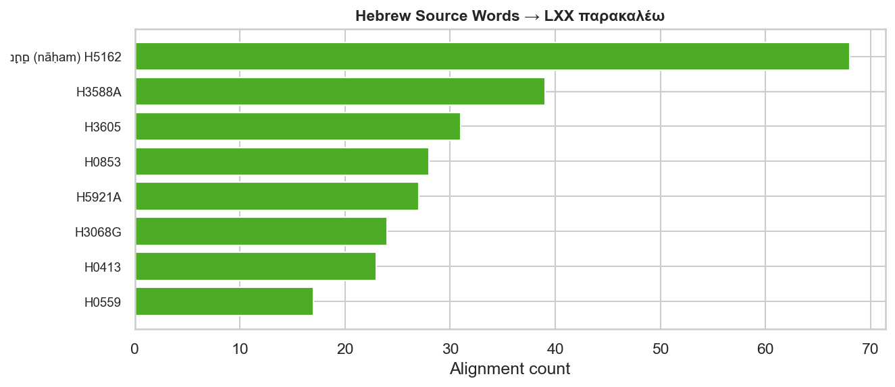
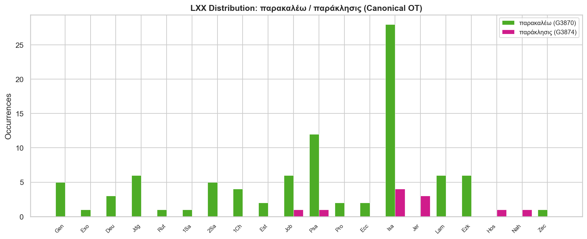

# Word Study: παράκλητος / παρακαλέω / παράκλησις

*Build script: [scripts/both/word_studies/parakletos/build_parakletos_report.py](../../../../../scripts/both/word_studies/parakletos/build_parakletos_report.py)*

---

## Contents

- [Overview](#overview)
- [Definitions and Semantic Range](#definitions-and-semantic-range)
- [Hebrew Background: נָחַם (nāḥam) and Related Words](#hebrew-background-נָחַם-nāḥam-and-related-words)
- [LXX Distribution and Usage](#lxx-distribution-and-usage)
- [NT Distribution](#nt-distribution)
- [παράκλητος in John 14–16: The Farewell Discourse](#παράκλητος-in-john-1416-the-farewell-discourse)
- [παράκλητος in 1 John 2:1: The Advocate](#παράκλητος-in-1-john-21-the-advocate)
- [παρακαλέω and παράκλησις in Paul](#παρακαλέω-and-παράκλησις-in-paul)
- [Translation History: "Comforter" vs "Advocate" vs "Helper"](#translation-history-comforter-vs-advocate-vs-helper)
- [Theological Significance](#theological-significance)
- [Key Observations](#key-observations)
- [Data Files](#data-files)

---

## Key Observations

The παράκλητος word family sits at the intersection of comfort, advocacy, and prophetic exhortation — semantic threads that converge in the person of the Holy Spirit in the Johannine tradition. The following observations summarise the findings across Hebrew background, LXX usage, and NT theology.

### 1. The root is Hebrew נָחַם (nāḥam) — but the noun παράκλητος has no LXX precedent

The verb παρακαλέω and noun παράκλησις both have deep roots in the LXX, primarily translating נָחַם (H5162) — a verb meaning to comfort, console, or relent. But παράκλητος (the title Jesus uses for the Spirit) appears **zero times** in the canonical LXX or deuterocanon. It is a distinctively NT coinage — used only by John in the NT — and its background must be sought outside the LXX.

### 2. Isaiah is the LXX heartland of παρακαλέω

Of the 91 canonical LXX occurrences of παρακαλέω, **28 are in Isaiah** — concentrated in the great Servant Songs and consolation oracles of Isaiah 40–66. "Comfort, comfort my people" (Isa 40:1 LXX) uses παρακαλέω twice in one verse. These passages establish the eschatological horizon for the concept: divine comfort is a characteristic of the coming Messianic age.

### 3. παράκλητος carries a forensic as well as a consoling sense

The Greek word παράκλητος is a verbal adjective meaning "one called alongside" (παρά + καλέω). In Hellenistic legal usage it denoted an advocate or legal helper — someone who appears on your behalf before a tribunal. In 1 Jn 2:1 this sense is explicit: "we have an παράκλητον with the Father — Jesus Christ the righteous." The Johannine use of the word for the Spirit holds both senses in tension: helper-comforter and legal advocate.

### 4. John uses παράκλητος exclusively for divine persons

All 5 NT occurrences of παράκλητος are in John's writings: 4 in the Farewell Discourse (Jhn 14–16) for the Holy Spirit, 1 in 1 Jhn 2:1 for Jesus Christ. No other NT writer uses the noun — not even Paul, who uses παρακαλέω {n0} times. John appears to have chosen παράκλητος as a title precisely because of its theological density.

### 5. Paul's "God of all comfort" echoes the LXX consolation tradition

2 Corinthians 1:3–7 is the densest concentration of the word family in Paul — using παρακαλέω and παράκλησις 10 times in 5 verses. Paul's "God of all comfort/consolation" (θεὸς πάσης παρακλήσεως) draws directly on the LXX consolation tradition rooted in נָחַם, especially Isaiah's portrait of YHWH as the one who comforts his suffering people.

### 6. The Lamentations background sharpens the meaning

Lamentations uses παρακαλέω 6 times — notably in the refrain "there is no one to comfort her" (Lam 1:2, 9, 16, 17, 21). The desolation of absent comfort in Lamentations makes the promised coming of the Comforter in John's Gospel all the more theologically charged: what Zion lacked at the Exile, the church receives at Pentecost.

### 7. The Spirit as "another παράκλητος" implies Jesus is the first

In John 14:16 Jesus says "I will ask the Father and he will give you *another* παράκλητον" (ἄλλον παράκλητον). The word ἄλλον ("another of the same kind") implies Jesus himself has been the disciples' παράκλητος during his earthly ministry — confirmed by 1 Jn 2:1 where Christ is explicitly the παράκλητος before the Father. The Spirit continues, in a new mode of presence, the advocacy-and-comfort ministry of Jesus.

---

## Overview

| Term | Strongs | Gloss | LXX (canonical) | NT |
|---|---|---|---|---|
| παράκλητος | G3875 | comforter, advocate, helper | 0 | 5 |
| παρακαλέω  | G3870 | to comfort, exhort, beseech | 91 | 108 |
| παράκλησις | G3874 | comfort, consolation, exhortation | 11 | 29 |

The three words share the root παρακαλ- (from παρά + καλέω, "to call alongside"). They span a semantic range from legal advocacy through pastoral comfort to prophetic exhortation — and the NT exploits all three dimensions.

---

## Definitions and Semantic Range

### παράκλητος (paraklētos) — G3875

A verbal adjective from παρακαλέω, functioning as a substantive: "one called alongside (to help)." The word has two well-attested meanings in Greek literature:

1. **Legal/forensic**: an advocate, counsel for the defense — one who stands beside the accused and speaks on their behalf before a judge. This usage is found in papyri and in Philo.
2. **General helper/intercessor**: a mediator, one who intercedes or pleads on another's behalf in a non-legal context.

The word does **not** carry the sense of "comforter" in classical Greek usage. The English translation "Comforter" (KJV, following Wycliffe) derives from the Latin *Consolator* and reflects the theological influence of the related verb and the Isaiah consolation tradition. Modern translations prefer "Helper," "Advocate," or "Counselor."

### παρακαλέω (parakaleō) — G3870

The verb from which παράκλητος is derived. Its semantic range is wide:

- **To comfort, console** — the dominant LXX sense, translating נָחַם
- **To exhort, urge** — Paul's dominant NT usage
- **To appeal to, beseech, request** — frequent in Acts and the Epistles
- **To invite alongside** — the etymological root

The same Greek word covers what English requires three words to express: "comfort," "exhort," and "beseech." Context and genre determine which shade is foreground.

### παράκλησις (paraklēsis) — G3874

The noun form: comfort, consolation, exhortation, or encouragement. In Paul it tends toward "encouragement" or "comfort." In Luke 2:25 (Simeon waiting for "the consolation of Israel," παράκλησιν τοῦ Ἰσραήλ) it is used as a Messianic title for the redemption God had promised — a direct echo of the LXX consolation tradition.

---

## Hebrew Background: נָחַם (nāḥam) and Related Words

The primary Hebrew root behind this word family is **נָחַם (nāḥam, H5162)** — a verb with two distinct but related semantic clusters:

| Stem | Primary meaning | Key examples |
|---|---|---|
| Niphal | to be comforted; to relent, repent | Gen 6:6 (God "repented"); Isa 1:24 |
| Piel | to comfort, console | Isa 40:1; 2 Sam 12:24; Ps 23:4 |

נָחַם occurs **108 times** in the OT (Niphal + Piel). The Piel is the comfort sense; the Niphal often carries the sense of "to change one's mind" or "to relent," which is why it is used for both human grief and divine repentance.

### Related Hebrew words

| Hebrew | Transliteration | Strongs | Gloss | OT occ |
|---|---|---|---|---|
| נָחַם | nāḥam | H5162 | to comfort, relent | 108 |
| נֶחָמָה | neḥāmāh | H5165 | comfort, consolation | 2 |
| נִיחוּם | nîḥûm | H5150 | comfort, compassion (pl.) | 3 |
| תַּנְחוּם | tanḥûm | H8575 | consolation(s) | 5 |

### Key OT passages

**Psalm 23:4** — "thy rod and thy staff they comfort [יְנַחֲמֻנִי] me" — the Piel of נָחַם in one of its most personal expressions.

**Isaiah 40:1** — "Comfort, comfort [נַחֲמוּ נַחֲמוּ] my people, saith your God" — the double Piel imperative that opens the Book of Consolation. The LXX renders both with παρακαλεῖτε.

**Isaiah 66:13** — "As one whom his mother comforteth [תְּנַחֲמֶנּוּ], so will I comfort you" — YHWH's comfort explicitly compared to a mother's. The LXX uses παρακαλέσει / παρακαλέσω.

**Lamentations 1:2** — "she hath none to comfort her [מְנַחֵם]... all her friends have dealt treacherously with her" — the desolate refrain that reverses Isaiah's promise. The LXX uses παρακαλῶν.

**Isaiah 61:2** — "to comfort [לְנַחֵם] all that mourn" — part of the Servant's commission, cited by Jesus in Luke 4:18–19.

### The LXX translation pattern

The LXX consistently renders the Piel of נָחַם with παρακαλέω. The Niphal (to be comforted) is rendered with the passive/middle forms of the same verb. The related nouns (תַּנְחוּם, נֶחָמָה) are rendered with παράκλησις.

---

## LXX Distribution and Usage

παρακαλέω occurs **91 times** in the canonical LXX and **48 times** in the deuterocanon. παράκλησις occurs **11 times** canonically and **5 times** in the deuterocanon. παράκλητος is **absent** from the LXX entirely.

### Isaiah: the Book of Consolation

Isaiah accounts for **28 of the 91 canonical LXX uses** of παρακαλέω — by far the highest concentration in any single book. The occurrences cluster in chapters 40–66 (Deutero-Isaiah), the "Book of Consolation," where YHWH's promise of comfort to exiled Israel is the dominant theme:

| Reference | Form | Notes |
|---|---|---|
| Isa 40:1 | παρακαλεῖτε (×2) | "Comfort, comfort my people" — the programmatic double imperative |
| Isa 40:2 | παρακαλέσατε | "Speak comfortably to Jerusalem" |
| Isa 49:13 | παρεκάλεσεν | "The LORD hath comforted his people" |
| Isa 51:3 | παρακαλέσω, παρεκάλεσα | "I... will comfort Zion... I have comforted her waste places" |
| Isa 51:12 | παρακαλῶν | "I, even I, am he that comforteth you" |
| Isa 61:2 | παρακαλέσαι | "To comfort all that mourn" — the Servant's commission |
| Isa 66:13 | παρακαλέσει, παρακαλέσω, παρακληθήσεσθε | "As one whom his mother comforteth, so will I comfort you" |

The dominance of future-tense forms in Isaiah reflects the eschatological orientation of the Book of Consolation: YHWH's comfort is something he *will* do — a promise awaiting fulfillment.

### Lamentations: the absence of comfort

Lamentations uses παρακαλέω 6 times, always in a negated or lamenting construction — "there is no one to comfort her" (Lam 1:2, 9, 16, 17, 21). This structural echo of Isaiah is theologically significant: the very comfort that Isaiah promises is absent from the destroyed city. The NT fulfillment of that comfort — through the Spirit as παράκλητος — answers precisely this Lamentation.

### Psalms

The 12 Psalm occurrences include some of the most personal comfort texts in the OT: Psalm 23:4 ("thy rod and staff comfort me") and Psalm 94:19 ("thy comforts delight my soul," παρακλήσεις in the LXX).

---

## NT Distribution

παράκλητος: **5 occurrences** in 2 books (Jhn, 1Jn)

παρακαλέω: **108 occurrences** in 19 books

παράκλησις: **29 occurrences** in 11 books

<table>
<tr>
<td valign="top">
<table>
<tr><th colspan="4" align="left"><b>Gospels &amp; Acts</b></th></tr>
<tr><th align="left">Book</th><th>G3875</th><th>G3870</th><th>G3874</th></tr>
<tr><td>Matthew</td><td align="right">—</td><td align="right">9</td><td align="right">—</td></tr>
<tr><td>Mark</td><td align="right">—</td><td align="right">9</td><td align="right">—</td></tr>
<tr><td>Luke</td><td align="right">—</td><td align="right">7</td><td align="right">2</td></tr>
<tr><td>John</td><td align="right">4</td><td align="right">—</td><td align="right">—</td></tr>
<tr><td>Acts</td><td align="right">—</td><td align="right">22</td><td align="right">4</td></tr>
</table>
</td>
<td width="32">&nbsp;</td>
<td valign="top">
<table>
<tr><th colspan="4" align="left"><b>Pauline Epistles</b></th></tr>
<tr><th align="left">Book</th><th>G3875</th><th>G3870</th><th>G3874</th></tr>
<tr><td>Romans</td><td align="right">—</td><td align="right">4</td><td align="right">3</td></tr>
<tr><td>1 Corinthians</td><td align="right">—</td><td align="right">6</td><td align="right">1</td></tr>
<tr><td>2 Corinthians</td><td align="right">—</td><td align="right">18</td><td align="right">11</td></tr>
<tr><td>Ephesians</td><td align="right">—</td><td align="right">2</td><td align="right">—</td></tr>
<tr><td>Philippians</td><td align="right">—</td><td align="right">2</td><td align="right">1</td></tr>
<tr><td>Colossians</td><td align="right">—</td><td align="right">2</td><td align="right">—</td></tr>
<tr><td>1 Thessalonians</td><td align="right">—</td><td align="right">7</td><td align="right">1</td></tr>
<tr><td>2 Thessalonians</td><td align="right">—</td><td align="right">2</td><td align="right">1</td></tr>
<tr><td>1 Timothy</td><td align="right">—</td><td align="right">4</td><td align="right">1</td></tr>
<tr><td>2 Timothy</td><td align="right">—</td><td align="right">1</td><td align="right">—</td></tr>
<tr><td>Titus</td><td align="right">—</td><td align="right">3</td><td align="right">—</td></tr>
<tr><td>Philemon</td><td align="right">—</td><td align="right">2</td><td align="right">1</td></tr>
</table>
</td>
<td width="32">&nbsp;</td>
<td valign="top">
<table>
<tr><th colspan="4" align="left"><b>General Epistles &amp; Revelation</b></th></tr>
<tr><th align="left">Book</th><th>G3875</th><th>G3870</th><th>G3874</th></tr>
<tr><td>Hebrews</td><td align="right">—</td><td align="right">4</td><td align="right">3</td></tr>
<tr><td>1 Peter</td><td align="right">—</td><td align="right">3</td><td align="right">—</td></tr>
<tr><td>1 John</td><td align="right">1</td><td align="right">—</td><td align="right">—</td></tr>
<tr><td>Jude</td><td align="right">—</td><td align="right">1</td><td align="right">—</td></tr>
</table>
</td>
</tr>
</table>

---

## παράκλητος in John 14–16: The Farewell Discourse

Jesus uses παράκλητος four times in the Farewell Discourse (John 13–17), always for the Holy Spirit. Each occurrence is embedded in a "Paraclete saying" that reveals a distinct aspect of the Spirit's identity and work:

---

### John 14:16

> *"And I will pray the Father, and he shall give you another Comforter, that he may abide with you for ever;"* (KJV)

- "**another** παράκλητον" (ἄλλον παράκλητον) — implies Jesus himself has been the disciples' παράκλητος during his ministry
- The Spirit will "**abide with you for ever**" — contrasting with Jesus' coming departure; permanence is a key attribute
- The request goes to the Father — the Spirit comes as a gift of the Trinity

---

### John 14:26

> *"But the Comforter, which is the Holy Ghost, whom the Father will send in my name, he shall teach you all things, and bring all things to your remembrance, whatsoever I have said unto you."* (KJV)

- Explicitly identified: "the Comforter, **which is the Holy Ghost**"
- Sent "**in my name**" — the Spirit acts with the authority of Christ
- Function 1: "**teach you all things**"
- Function 2: "**bring all things to your remembrance**" — a specifically apostolic function (ensuring accurate transmission of Jesus' words)

---

### John 15:26

> *"But when the Comforter is come, whom I will send unto you from the Father, even the Spirit of truth, which proceedeth from the Father, he shall testify of me:"* (KJV)

- "**whom I will send unto you from the Father**" — the Spirit's procession from the Father, sent by the Son
- "**the Spirit of truth**" (τὸ πνεῦμα τῆς ἀληθείας) — a title linking the Spirit to Jesus as "the truth" (14:6)
- Function: "**bear witness** of me" — the Spirit's testimony role is forensic (μαρτυρήσει, legal witness language)

---

### John 16:7–15

> *"Nevertheless I tell you the truth; It is expedient for you that I go away: for if I go not away, the Comforter will not come unto you; but if I depart, I will send him unto you."* (KJV)

- "**it is expedient for you that I go away**" — Jesus' departure is the necessary condition for the Spirit's coming
- The Spirit's three-part forensic function (16:8–11):
  1. Convict the world of **sin** (failure to believe in Jesus)
  2. Convict of **righteousness** (Jesus vindicated by his return to the Father)
  3. Convict of **judgment** (Satan already judged)
- "**guide you into all truth**" (16:13) — the Spirit as epistemic guide
- "**he shall glorify me**" (16:14) — the Spirit's ministry is Christocentric

---

### The four Paraclete sayings: summary

| Reference | Title | Functions |
|---|---|---|
| Jhn 14:16–17 | "another Paraclete," Spirit of truth | Abides with disciples forever |
| Jhn 14:26 | Paraclete = Holy Spirit | Teaches, reminds of Jesus' words |
| Jhn 15:26 | Paraclete, Spirit of truth | Bears forensic witness to Christ |
| Jhn 16:7–15 | Paraclete | Convicts world; guides into all truth; glorifies Christ |

---

## παράκλητος in 1 John 2:1: The Advocate

> *"My little children, these things write I unto you, that ye sin not. And if any man sin, we have an advocate with the Father, Jesus Christ the righteous:"* (KJV)

This is the only NT use of παράκλητος for Jesus (rather than the Spirit). The legal/forensic sense is unmistakable: Jesus is the παράκλητος "with the Father" (πρὸς τὸν πατέρα), standing in the court of divine judgment as advocate for believers who sin.

- "**Jesus Christ the righteous**" — his righteousness is the basis of his advocacy; he is not merely sympathetic but qualified
- This use confirms that 1 Jn 2:1 and John 14–16 together form a complete picture: **Jesus is the first Paraclete** before the Father; the Spirit is the second Paraclete beside the disciples

---

## παρακαλέω and παράκλησις in Paul

2 Corinthians 1:3–7 is Paul's most theologically developed treatment of the word family. Paul uses παρακαλέω and παράκλησις **10 times in 5 verses** — a density that signals theological purpose, not style.

> *"Blessed be God, even the Father of our Lord Jesus Christ, the Father of mercies, and the **God of all comfort** [θεὸς πάσης παρακλήσεως]; Who **comforteth** us in all our tribulation, that we may be able to **comfort** them which are in any trouble, by the **comfort** wherewith we ourselves are comforted of God."* (2 Cor 1:3–4, KJV)

### Key structural features

- **God as the source** of all comfort (παράκλησις) — echoing LXX Isaiah's "YHWH as comforter"
- **Participatory logic**: we are comforted *in order to* comfort others
- The affliction-comfort pattern mirrors the suffering Servant of Isaiah

### Luke's use: παράκλησις as Messianic title

- **Luke 2:25** — Simeon was "waiting for the **consolation of Israel**" (παράκλησιν τοῦ Ἰσραήλ) — a direct Messianic title for the redemption promised through Isaiah. The word connects the Nativity narrative directly to Isaiah's Book of Consolation.
- **Acts 9:31** — the church "walking in the **comfort** of the Holy Spirit" (τῇ παρακλήσει τοῦ ἁγίου πνεύματος) — παράκλησις as the Spirit's characteristic gift, linking back to the Johannine παράκλητος.

### Hebrews: exhortation dimension

Hebrews uses παράκλησις primarily in the sense of "exhortation": "the word of **exhortation**" (13:22) and "the **exhortation** which speaketh unto you as sons" (12:5). The comfort and exhortation senses of the word are held together — true comfort of the suffering always includes a summons forward.

---

## Translation History: "Comforter" vs "Advocate" vs "Helper"

| Translation | Rendering of παράκλητος | Notes |
|---|---|---|
| Vulgate (Jerome) | *Paraclitus* / *Consolator* | Transliteration + "Consoler" |
| Wycliffe (1382) | "Comforter" | From Latin *consolator* via Vulgate |
| KJV (1611) | "Comforter" (Jhn) / "advocate" (1 Jn) | First English Bible to distinguish by context |
| ESV (2001) | "Helper" | Emphasises active assistance over emotional comfort |
| NASB (1971/2020) | "Helper" | Same reasoning as ESV |
| NIV (1984/2011) | "Advocate" | Emphasises the forensic/legal sense |
| NET (2005) | "Advocate" | Detailed footnotes on the legal background |
| NRSV (1989) | "Advocate" | Consistent with legal/forensic meaning |

The KJV's choice of "Comforter" is historically influential but linguistically imprecise: the Greek παράκλητος does not primarily mean comforter in the sense of one who soothes grief. It means one called alongside to assist and advocate. The KJV itself recognised the difference — rendering the identical word as "advocate" in 1 Jn 2:1, where the legal context is unmistakable.

---

## Theological Significance

### The convergence of three traditions

John's use of παράκλητος draws on three distinct backgrounds:

1. **Hellenistic legal usage**: the advocate-intercessor who speaks before a court
2. **The LXX consolation tradition**: YHWH as comforter of his people (Isaiah, Psalms, Lamentations)
3. **Jewish wisdom and prophecy**: the concept of a divine helper who mediates between God and humanity (Philo's Logos; the prophetic intercessor role)

By choosing παράκλητος rather than the more common παρακαλέω vocabulary, John created a title that compressed all three into a single, pregnant term.

### The Spirit as replacement and continuation

The "another Paraclete" language (Jhn 14:16) positions the Spirit not as a substitute for an absent Jesus but as the mode of Jesus' continuing presence. The Spirit's ministry in John 14–16 is entirely Christocentric: the Spirit teaches what Jesus taught, testifies to Jesus, glorifies Jesus, and brings to remembrance Jesus' own words. The Paraclete is the presence of Christ in the community of the Spirit.

### Eschatological fulfillment

Lamentations' grief — "there is no one to comfort her" — finds its answer in the Paraclete. The promised comfort of Isaiah 40–66, which Simeon awaited as the "consolation of Israel," arrives in two stages: first in the incarnate Christ (the first Paraclete), then in the Spirit given at Pentecost (the second Paraclete). Paul's "God of all comfort" frames the same fulfillment in epistolary theology.

---

## Data Files

| File | Contents |
|---|---|
| [parakletos-nt-concordance.csv](parakletos-nt-concordance.csv) | NT concordance for all three terms with KJV text |
| [parakletos-lxx-concordance.csv](parakletos-lxx-concordance.csv) | LXX concordance (canonical + deuterocanon) |