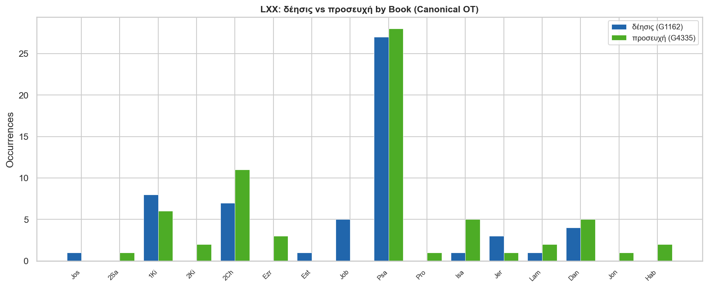
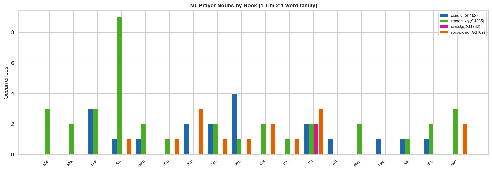
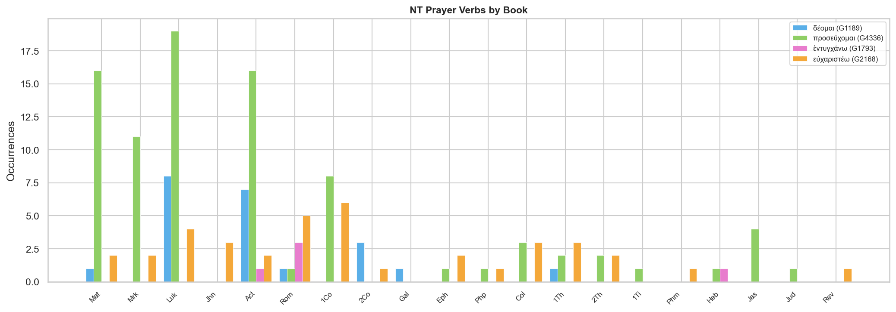
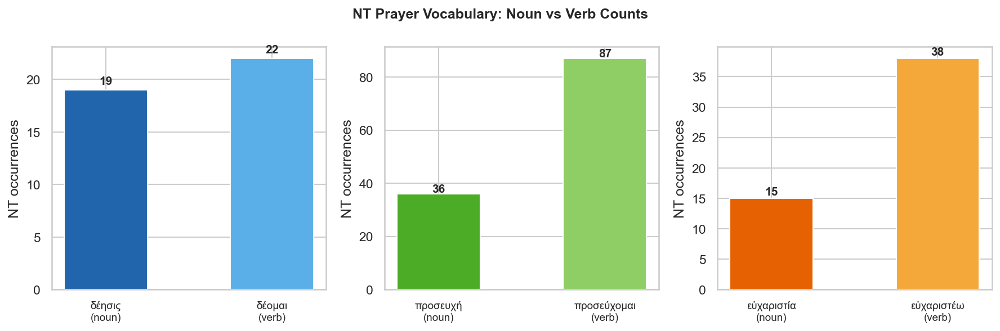

# Word Study: Greek Prayer Vocabulary in 1 Timothy 2:1

*Build script: [scripts/both/word_studies/prayer-vocabulary/build_prayer_vocabulary_report.py](../../../../../scripts/both/word_studies/prayer-vocabulary/build_prayer_vocabulary_report.py)*

---

## Contents

- [Overview: 1 Timothy 2:1](#overview-1-timothy-21)
- [The Four Terms: Definitions and Distinctions](#the-four-terms-definitions-and-distinctions)
  - [δέησις — Supplication](#δέησις--supplication-g1162)
  - [προσευχή — Prayer](#προσευχή--prayer-g4335)
  - [ἔντευξις — Intercession](#ἔντευξις--intercession-g1783)
  - [εὐχαριστία — Thanksgiving](#εὐχαριστία--thanksgiving-g2169)
- [Hebrew Background](#hebrew-background)
- [LXX Distribution](#lxx-distribution)
- [NT Distribution](#nt-distribution)
- [Passages Where Multiple Terms Appear Together](#passages-where-multiple-terms-appear-together)
- [The Intercession Concept: ἐντυγχάνω in the NT](#the-intercession-concept-ἐντυγχάνω-in-the-nt)
- [Theological Significance](#theological-significance)
- [Key Observations](#key-observations)
- [Data Files](#data-files)

---

## Key Observations

### 1. Paul stacks four distinct terms deliberately

In 1 Tim 2:1 Paul writes δεήσεις, προσευχάς, ἐντεύξεις, εὐχαριστίας in a single exhortation — four accusative plurals in a row. This is not synonymous repetition for rhetorical effect (as in Greek oratory) but a theological taxonomy: each term isolates a specific dimension of the church's prayer life. The four together define comprehensiveness: need-driven petition, general worship-address, advocacy for others, and grateful response.

### 2. προσευχή is the generic term; the others are more specific

προσευχή (36 NT, 68 LXX) is the broadest term — the standard Greek word for prayer in both the LXX and NT, translating the Hebrew תְּפִלָּה (tephillah, {tephillah} OT occurrences). It appears in every major NT corpus, in Psalm titles, and in Solomon's Temple prayer. The other three terms each narrow in on a specific posture or function.

### 3. δέησις always carries a sense of urgent, need-driven petition

δέησις (19 NT, 58 LXX) — "supplication" — is rooted in δέομαι ("to lack, to need"), and this etymology is theologically active: every δέησις is a prayer from a position of acknowledged deficiency. It is the term used for Jesus' own prayer in Gethsemane (Heb 5:7), for Paul's intercession for Israel (Rom 10:1), and for the congregation's prayer for Peter in prison (Acts 12:5). It never appears as a generic word for prayer — it always implies intensity and specific need.

### 4. ἔντευξις is NT-exclusive and forensically charged

ἔντευξις (2 NT occurrences, **zero LXX occurrences**) is the most theologically distinctive term in the list. Its cognate verb ἐντυγχάνω means "to approach on behalf of someone" — a technical term for presenting a petition to a king or magistrate (Acts 25:24; Esther LXX; 3 Macc). In 1 Tim 2:1 it denotes the church's advocacy for outsiders — "for all people" — before God. In 1 Tim 4:5 the same noun describes the sanctifying power of God's word and prayer. The verb ἐντυγχάνω is used (5 NT occurrences) for both Christ's eternal intercession at the Father's right hand (Heb 7:25; Rom 8:34) and the Spirit's intercession within the believer (Rom 8:26–27).

### 5. εὐχαριστία is almost entirely a NT and Pauline development

εὐχαριστία (15 NT, 1 LXX canonical) is barely present in the LXX and absent from the Hebrew tradition as a prayer category. Its verb εὐχαριστέω (38 NT) similarly has zero canonical LXX occurrences. This is a genuinely new theological emphasis in the NT — Paul uses εὐχαριστία and εὐχαριστέω as structural markers in nearly every letter opening. The command to pray "with thanksgiving" (Php 4:6; Col 4:2) reflects the Christ-shaped transformation of prayer: petition is now framed by grateful confidence in what God has already done.

### 6. The verb ἐντυγχάνω links ecclesial and divine intercession

The three NT uses of ἐντυγχάνω in Romans 8 and Hebrews 7 establish a theology of intercession that frames 1 Timothy 2:1: the Spirit intercedes within us (Rom 8:26–27), Christ intercedes for us from the Father's right hand (Rom 8:34; Heb 7:25), and the church is called to intercede for all people (1 Tim 2:1). The church's ἔντευξις participates in the Son's and Spirit's own intercessory ministry.

### 7. Psalms is the LXX school of prayer — and uses both δέησις and προσευχή

The Psalter accounts for 27 of the 58 canonical LXX δέησις occurrences and 28 of the 68 canonical LXX προσευχή occurrences. The Psalms consistently pair both terms (e.g. Psa 6:10 LXX uses both in the same verse), showing that even in the OT the two concepts were complementary — προσευχή as the act of addressing God, δέησις as the urgent petition within that address.

---

## Overview: 1 Timothy 2:1

> *"I exhort therefore, that, first of all, supplications, prayers, intercessions, and giving of thanks, be made for all men;"* (KJV)

In this exhortation — the first in his body of instructions to Timothy about church order — Paul uses four distinct Greek words for prayer, each describing a different facet of the church's corporate prayer life. They appear as accusative plural nouns, objects of the infinitive ποιεῖσθαι ("to make/offer"), governed by the verb παρακαλῶ ("I urge").

| # | Greek | Strongs | KJV | Transliteration |
|---|---|---|---|---|
| 1 | δεήσεις | G1162 | supplications | *deēseis* |
| 2 | προσευχάς | G4335 | prayers | *proseuchas* |
| 3 | ἐντεύξεις | G1783 | intercessions | *enteuxeis* |
| 4 | εὐχαριστίας | G2169 | giving of thanks | *eucharistias* |

**Scope:** "for all people" (ὑπὲρ πάντων ἀνθρώπων) — including kings and those in authority (v. 2). The universal scope is itself theologically significant: the church's prayer is not self-enclosed but outward-facing.

---

## The Four Terms: Definitions and Distinctions

---

### δέησις — Supplication (G1162)

**Transliteration:** *deēsis*  |  **Related verb:** δέομαι (G1189, "to lack, to need, to beseech")

**Etymology:** From δέω ("to lack, to be in want"). The root meaning is significant: every δέησις arises from a position of need or deficiency. It is not merely polite petition but urgent, earnest supplication.

**Semantic range:**
- Urgent petition arising from a specific need
- Entreaty directed to God *or* to another person
- Always implies the petitioner's awareness of their own insufficiency

**Key NT uses:**

> *"Who in the days of his flesh, when he had offered up prayers and supplications with strong crying and tears unto him that was able to save him from death, and was heard in that he feared;"* (Heb 5:7)

Jesus' own Gethsemane prayer is described with δεήσεις — the most intense possible petition, accompanied by "strong crying and tears," directed to the one who could deliver him from death.

> *"Praying always with all prayer and supplication in the Spirit, and watching thereunto with all perseverance and supplication for all saints;"* (Eph 6:18)

In the armor of God passage, δέησις and προσευχή appear together: προσευχή is the general mode, δέησις is the urgent, targeted petition within it. The two work in tandem.

> *"Be careful for nothing; but in every thing by prayer and supplication with thanksgiving let your requests be made known unto God."* (Php 4:6)

Again δέησις and προσευχή are paired — with εὐχαριστία wrapping them both. Philippians 4:6 and Ephesians 6:18 form the closest NT parallels to the 1 Timothy 2:1 prayer taxonomy.

**LXX roots:** Translates primarily תְּחִנָּה (*techinnah*, H8467, 25 OT occ) — "entreaty, supplication" — and also the Psalmic appeals to God (שַׁוְעָה, H7775). Heavy concentration in Psalms (27 LXX occurrences) and Solomon's Temple prayer (1 Kings 8 — 8 occurrences).

---

### προσευχή — Prayer (G4335)

**Transliteration:** *proseuchē*  |  **Related verb:** προσεύχομαι (G4336, "to pray")

**Etymology:** From πρός ("toward") + εὔχομαι ("to wish, vow, pray"). The preposition πρός points to the directional orientation of prayer — it is addressed *toward* God. This directional quality distinguishes it from more general terms for speech or request.

**Semantic range:**
- The generic, comprehensive term for prayer
- Encompasses petition, praise, thanksgiving, and intercession
- Used for both individual and corporate prayer
- In classical Greek, often a formal vow or prayer to a deity

**Occurrence profile:** The most frequent noun (36 NT, 68 LXX canonical), appearing across all NT corpora and in the headings of five Psalm titles (Psa 17; 86; 90; 102; 142 MT). Luke-Acts has the heaviest NT concentration (Acts alone: 9 times), reflecting Luke's programmatic emphasis on prayer as a characteristic of the early church.

**LXX roots:** The standard rendering of תְּפִלָּה (*tephillah*, H8605, 77 OT occ) — the most common Hebrew prayer noun, used for Solomon's Temple prayer, the Psalms (32 occurrences), and prophetic intercession. When the LXX translator chose between δέησις and προσευχή to render תְּפִלָּה, the latter was preferred for formal, comprehensive prayers; the former for urgent individual appeals.

---

### ἔντευξις — Intercession (G1783)

**Transliteration:** *enteuxis*  |  **Related verb:** ἐντυγχάνω (G1793, "to intercede, to appeal")

**Etymology:** From ἐντυγχάνω ("to fall in with, to approach, to petition"). In Hellenistic Greek the verb was used technically for submitting a petition to a ruler or official — a formal act of advocacy on another's behalf before a higher authority.

**A uniquely NT term:**

> ἔντευξις appears **zero times** in the LXX (canonical or deuterocanonical) and only **twice** in the entire NT — both in 1 Timothy (2:1 and 4:5). Its cognate verb ἐντυγχάνω occurs once in the canonical LXX (Daniel) and only 5 times in the NT.

**NT occurrences of ἔντευξις:**

> *"I exhort therefore, that, first of all, supplications, prayers, intercessions, and giving of thanks, be made for all men;"* (1 Tim 2:1)

The church's intercessory advocacy for "all people" — the word's forensic background makes the prayer a formal act of representation before God.

> *"For it is sanctified by the word of God and prayer."* (1 Tim 4:5)

Here ἔντευξις (NASB: "prayer") refers to the sanctifying effect of God's word and prayer on food — an intimate, relational encounter with God. The same word that covers public intercession for nations also covers the private prayer of grace over a meal, showing the breadth of the concept.

---

### εὐχαριστία — Thanksgiving (G2169)

**Transliteration:** *eucharistia*  |  **Related verb:** εὐχαριστέω (G2168, "to give thanks")

**Etymology:** From εὖ ("well") + χάρις ("grace, favor") → "to return good favor, to give thanks for grace received."

**A distinctively NT emphasis:**

εὐχαριστία (15 NT occurrences) is almost absent from the LXX (1 canonical occurrence, in Esther 8:12 LXX — a non-Semitic addition). Its verb εὐχαριστέω has zero canonical LXX occurrences. This distribution signals that thanksgiving as a distinct, named category of prayer is a NT — specifically Pauline — development.

**Paul's structural use:** εὐχαριστία and εὐχαριστέω are characteristic markers of Paul's letter openings and prayer reports (Rom 1:8; 1 Cor 1:4; Eph 1:16; Php 1:3; Col 1:3; 1 Th 1:2). The command to "pray with thanksgiving" (Php 4:6; Col 4:2; 1 Th 5:18) reflects the Christ-shaped horizon of NT prayer: petition is offered with grateful confidence in what God has already accomplished in Christ.

**The Eucharist connection:** εὐχαριστία is also the word behind "Eucharist" — the Lord's Supper as the act of thanksgiving (1 Cor 11:24; cf. the verbal form in the institution narrative). The overlap between table-thanksgiving and prayer-thanksgiving is not accidental.

---

## Hebrew Background

| Hebrew | Transliteration | Strongs | Gloss | OT occ | LXX rendering |
|---|---|---|---|---|---|
| תְּפִלָּה | tephillah | H8605 | prayer (formal, comprehensive) | 77 | mainly προσευχή |
| תְּחִנָּה | techinnah | H8467 | entreaty, supplication | 25 | mainly δέησις |
| שַׁוְעָה | shavah | H7775 | cry for help | 11 | δέησις |
| —  | — | — | *no Hebrew equivalent* | — | ἔντευξις has no Hebrew root |
| תּוֹדָה | todah | H8426 | thanksgiving, praise | 32 | αἴνεσις, not εὐχαριστία |

The key insight from the Hebrew alignment is that **ἔντευξις and εὐχαριστία are genuinely new theological categories** — they have no stable Hebrew equivalents in the OT prayer vocabulary. The OT prayer tradition is well served by תְּפִלָּה and תְּחִנָּה, which map to the Psalms' comprehensive prayers and urgent supplications. But the NT adds the dimensions of intercessory advocacy (ἔντευξις) and Christ-grounded thanksgiving (εὐχαριστία) that arise specifically from the new covenant context.

---

## LXX Distribution

δέησις: **58 canonical LXX occurrences**  |  προσευχή: **68 canonical LXX occurrences**

**Psalms** dominates both terms (δέησις: 27; προσευχή: 28), establishing the Psalter as the school of OT prayer. **1 Kings 8** (Solomon's Temple prayer) has the second-highest concentration of both terms — the great dedicatory prayer uses both as near-synonyms for formal petition before YHWH.

The two LXX terms are **complementary, not synonymous**: they frequently appear in the same verse (e.g. Psa 6:10 LXX), where προσευχή frames the act of prayer while δέησις intensifies the urgency of the petition. This pairing in the LXX prepares for and explains their pairing in NT passages like Eph 6:18 and Php 4:6.

---

## NT Distribution

<table>
<tr>
<td valign="top">
<table>
<tr><th colspan="5" align="left"><b>Gospels &amp; Acts</b></th></tr>
<tr><th align="left">Book</th><th>δέησις</th><th>προσευχή</th><th>ἔντευξις</th><th>εὐχαριστία</th></tr>
<tr><td>Matthew</td><td align="right">—</td><td align="right">3</td><td align="right">—</td><td align="right">—</td></tr>
<tr><td>Mark</td><td align="right">—</td><td align="right">2</td><td align="right">—</td><td align="right">—</td></tr>
<tr><td>Luke</td><td align="right">3</td><td align="right">3</td><td align="right">—</td><td align="right">—</td></tr>
<tr><td>Acts</td><td align="right">1</td><td align="right">9</td><td align="right">—</td><td align="right">1</td></tr>
</table>
</td>
<td width="32">&nbsp;</td>
<td valign="top">
<table>
<tr><th colspan="5" align="left"><b>Pauline Epistles</b></th></tr>
<tr><th align="left">Book</th><th>δέησις</th><th>προσευχή</th><th>ἔντευξις</th><th>εὐχαριστία</th></tr>
<tr><td>Romans</td><td align="right">1</td><td align="right">2</td><td align="right">—</td><td align="right">—</td></tr>
<tr><td>1 Corinthians</td><td align="right">—</td><td align="right">1</td><td align="right">—</td><td align="right">1</td></tr>
<tr><td>2 Corinthians</td><td align="right">2</td><td align="right">—</td><td align="right">—</td><td align="right">3</td></tr>
<tr><td>Ephesians</td><td align="right">2</td><td align="right">2</td><td align="right">—</td><td align="right">1</td></tr>
<tr><td>Philippians</td><td align="right">4</td><td align="right">1</td><td align="right">—</td><td align="right">1</td></tr>
<tr><td>Colossians</td><td align="right">—</td><td align="right">2</td><td align="right">—</td><td align="right">2</td></tr>
<tr><td>1 Thessalonians</td><td align="right">—</td><td align="right">1</td><td align="right">—</td><td align="right">1</td></tr>
<tr><td>1 Timothy</td><td align="right">2</td><td align="right">2</td><td align="right">2</td><td align="right">3</td></tr>
<tr><td>2 Timothy</td><td align="right">1</td><td align="right">—</td><td align="right">—</td><td align="right">—</td></tr>
<tr><td>Philemon</td><td align="right">—</td><td align="right">2</td><td align="right">—</td><td align="right">—</td></tr>
</table>
</td>
<td width="32">&nbsp;</td>
<td valign="top">
<table>
<tr><th colspan="5" align="left"><b>General Epistles &amp; Revelation</b></th></tr>
<tr><th align="left">Book</th><th>δέησις</th><th>προσευχή</th><th>ἔντευξις</th><th>εὐχαριστία</th></tr>
<tr><td>Hebrews</td><td align="right">1</td><td align="right">—</td><td align="right">—</td><td align="right">—</td></tr>
<tr><td>James</td><td align="right">1</td><td align="right">1</td><td align="right">—</td><td align="right">—</td></tr>
<tr><td>1 Peter</td><td align="right">1</td><td align="right">2</td><td align="right">—</td><td align="right">—</td></tr>
<tr><td>Revelation</td><td align="right">—</td><td align="right">3</td><td align="right">—</td><td align="right">2</td></tr>
</table>
</td>
</tr>
</table>

**Observations from the distribution:**

- **Luke-Acts** dominates the verbs, especially προσεύχομαι (Luke 19, Acts 16) and δέομαι (Luke 8, Acts 7) — Luke's theology of prayer is action-oriented, narrating Jesus and the apostles at prayer.
- **Paul** dominates the nouns — δέησις, προσευχή, εὐχαριστία all cluster in his letters. Paul conceptualizes prayer; Luke narrates it.
- **1 Timothy** is the only NT book with ἔντευξις, and has the highest concentration of all four nouns together.
- **Revelation** has 3 occurrences of προσευχή — all in the image of golden bowls full of incense, "which are the prayers of the saints" (Rev 5:8; 8:3–4), forming the eschatological climax of the prayer tradition.

---

## Passages Where Multiple Terms Appear Together

The most theologically revealing data points are passages where Paul deliberately juxtaposes two or more of these terms:

---

### Philippians 4:6

> *"Be careful for nothing; but in every thing by prayer and supplication with thanksgiving let your requests be made known unto God."* (KJV)

- **προσευχῇ** (dative): the comprehensive, God-ward address
- **δεήσει** (dative): the specific, urgent petition within it
- **εὐχαριστίας** (genitive): the atmosphere of thanksgiving that frames both

The structure mirrors 1 Tim 2:1 in miniature — Paul's default prayer vocabulary combines the same three ingredients.

---

### Ephesians 6:18

> *"Praying always with all prayer and supplication in the Spirit, and watching thereunto with all perseverance and supplication for all saints;"* (KJV)

- **προσευχῆς** and **δεήσεως** are paired, as in Php 4:6
- The verb **προσευχόμενοι** governs both: prayer as practice is the umbrella, δέησις is the mode of urgent petition within it
- "At all times in the Spirit" — the pneumatic dimension that Rom 8:26–27 develops with ἐντυγχάνω

---

### Hebrews 5:7

> *"Who in the days of his flesh, when he had offered up prayers and supplications with strong crying and tears unto him that was able to save him from death, and was heard in that he feared;"* (KJV)

- **δεήσεις** and the related noun "supplications" describe Jesus' own prayer in Gethsemane — the supreme biblical example of intense, need-driven petition
- The combination of "strong crying and tears" confirms δέησις as the prayer of extremity

---

## The Intercession Concept: ἐντυγχάνω in the NT

The verb ἐντυγχάνω (G1793, "to intercede / petition on behalf of") illuminates what ἔντευξις means in 1 Tim 2:1. Its 5 NT occurrences trace the full arc of NT intercession:

| Reference | Who intercedes | For/against whom | Notes |
|---|---|---|---|
| Act 25:24 | The Jewish leaders | Against Paul (before Festus) | Human intercession in a legal/political context — the original Hellenistic sense of petitioning a ruler |
| Rom 8:26–27 | The Holy Spirit | For the saints | "The Spirit itself maketh intercession for us with groanings which cannot be uttered" — divine intercession within the believer |
| Rom 8:34 | Christ Jesus | For the elect | "Who is even at the right hand of God, who also maketh intercession for us" — Christ's heavenly advocacy |
| Rom 11:2 | Elijah | Against Israel (before God) | "Lord, they have killed thy prophets…" — intercession as accusation, showing the full range of the concept |
| Heb 7:25 | Christ | For those who come to God through him | "He ever liveth to make intercession for them" — the perpetual, priestly intercession of the risen Christ |

This distribution is theologically decisive for understanding 1 Tim 2:1: the church's ἔντευξις for all people is not merely an ethical practice but a participation in the Son's and Spirit's own intercessory ministry. The same word that describes the Spirit's groanings and Christ's priestly advocacy before the Father describes the church's prayer for kings and rulers.

---

## Theological Significance

### The prayer taxonomy of 1 Timothy 2:1

Paul's four-term list is not accidental accumulation. Each term identifies a dimension of prayer that the others do not cover:

| Term | What it emphasizes | What it excludes |
|---|---|---|
| δεήσεις | Urgency, need, specific petition | Generic or routine prayer |
| προσευχάς | Comprehensive God-ward address | Urgency or specific advocacy |
| ἐντεύξεις | Advocacy before God for others | Self-focused petition |
| εὐχαριστίας | Grateful response to grace | Petitionary posture |

Together they constitute a full-orbed ecclesial prayer life: coming to God in need (δέησις), addressing him comprehensively in worship (προσευχή), standing before him as advocates for others (ἔντευξις), and doing all of it out of gratitude for what he has already given (εὐχαριστία).

### Old covenant roots, new covenant flowering

The Hebrew OT gave the church δέησις and προσευχή — the urgent petition and the formal address of the Psalms. The NT adds ἔντευξις (the believer's advocacy grounded in Christ's and the Spirit's own intercession) and εὐχαριστία (thanksgiving re-centred on the Christ-event). The prayer vocabulary of 1 Tim 2:1 thus holds together the continuity of OT prayer practice with the new covenant dimensions that only the incarnation, death, resurrection, and Pentecost make possible.

---

## Data Files

| File | Contents |
|---|---|
| [prayer-nt-concordance.csv](prayer-nt-concordance.csv) | NT concordance for all 8 terms (4 nouns + 4 verbs) with KJV text |
| [prayer-lxx-concordance.csv](prayer-lxx-concordance.csv) | LXX concordance for δέησις, προσευχή, δέομαι, προσεύχομαι (canonical) |