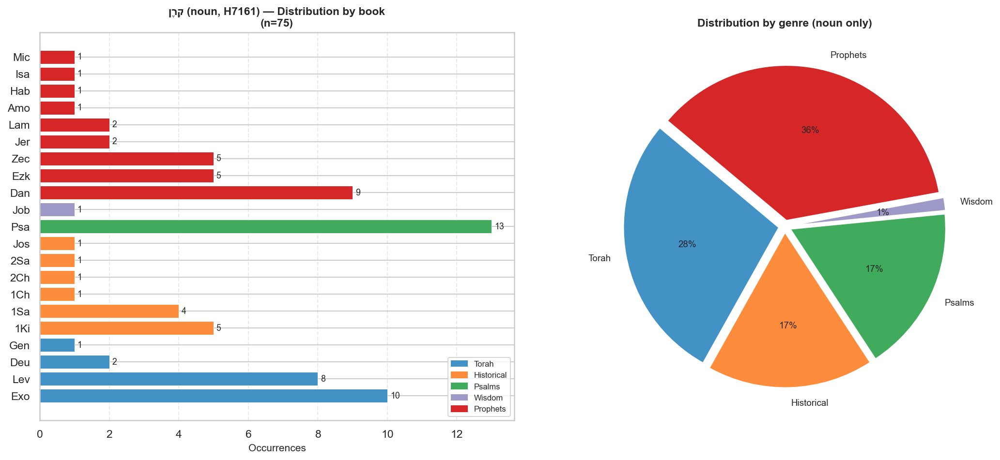
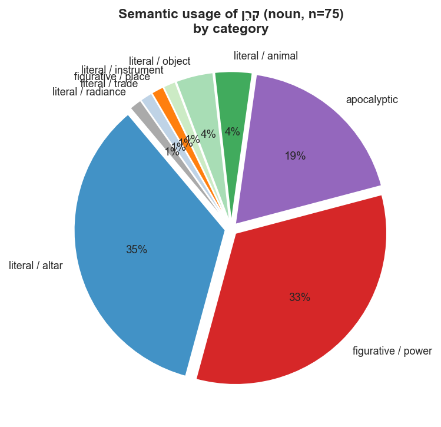
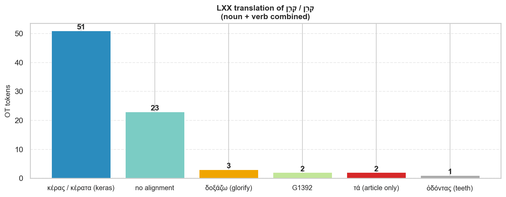
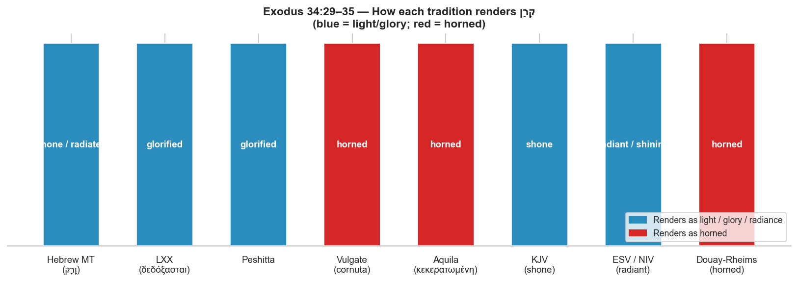

# קֶרֶן / קָרַן — Word Study: Horn, Radiance, and the Moses Problem

**Hebrew noun H7161 + verb H7160 | LXX, Vulgate, and translation history**

---

## Contents

1. [The Root and Its Forms](#the-root-and-its-forms)
2. [Noun קֶרֶן (H7161) — Distribution and Usage](#noun-distribution-and-usage)
3. [Semantic Categories of the Noun](#semantic-categories-of-the-noun)
4. [Verb קָרַן (H7160) — Exodus 34 and the Crux](#verb-exodus-34-and-the-crux)
5. [LXX Translation Choices](#lxx-translation-choices)
6. [The Vulgate: Jerome's *cornuta*](#the-vulgate-jeromes-cornuta)
7. [Aquila and the Literalist Tradition](#aquila-and-the-literalist-tradition)
8. [Other Ancient Witnesses](#other-ancient-witnesses)
9. [Translation Comparison Chart](#translation-comparison-chart)
10. [Complete Verb Concordance](#complete-verb-concordance)
11. [Selected Noun Concordance by Category](#selected-noun-concordance-by-category)
12. [Summary and Conclusions](#summary-and-conclusions)

---

## The Root and Its Forms

The Hebrew root **קרן** (q-r-n) generates two distinct lexical entries:

| Entry | Strong's | Form | Gloss |
|---|---|---|---|
| **קֶרֶן** | H7161 | Noun (f/m) | *horn, horn-shaped projection, ray of light* |
| **קָרַן** | H7160 | Verb (Qal + Hiphil) | *to shine, emit rays; (denominative) to grow horns* |

The noun is far more common (75 OT occurrences across 21 books) and covers a wide
semantic range from literal animal horns to altar projections to metaphors for power
and strength. The verb occurs only **4 times** — three in Exodus 34 (the Moses
shining face passages) and once in Psalm 69:32 (Hiphil participle, "having horns").

The key lexicographic question — and the source of a famous translation controversy —
is whether the **verb** in Exodus 34:29–35 means *to emit rays of light* (a
denominative from the "ray/radiance" sense of the noun) or *to grow horns*
(a denominative from the literal horn sense).

---

## Noun Distribution and Usage

### By genre

| Genre | Occurrences | % |
|---|---|---|
| Prophets | 27 | 36% |
| Torah (Pentateuch) | 21 | 28% |
| Historical Books | 13 | 17% |
| Psalms | 13 | 17% |
| Wisdom | 1 | 1% |

**Books with the most occurrences:**

| Book | Count | Primary context |
|---|---|---|
| Psalms | 13 | Metaphorical power; "horn of salvation" |
| Exodus | 10 | Altar horns (tabernacle construction) |
| Daniel | 9 | Apocalyptic visions (ram and goat) |
| Leviticus | 8 | Altar horns (sacrifice and atonement) |
| Zechariah | 5 | Vision of the four horns |
| 1 Kings | 5 | Altar horns + Zedekiah's iron horns |
| Ezekiel | 5 | Altar horns + metaphorical power |
| 1 Samuel | 4 | Anointing horn + Hannah's song |

---

## Semantic Categories of the Noun

Analysis of all 75 noun occurrences yields eight distinct semantic functions:

### 1. Literal / Altar (35% — 26 occurrences)

The most common usage is the **four projections (*qarnot*) of the bronze and incense
altars** described in Exodus, Leviticus, Ezekiel 43, and 1 Kings:

> *"Its horns shall be of one piece with it."* (Ex 27:2)
>
> *"You shall put it [blood] on the horns of the altar."* (Lev 4:7)
>
> *"He grasped the horns of the altar."* (1 Ki 1:50 — Adonijah seeking sanctuary)

These are architectural features — upward-projecting corners of the altar — and are
consistently translated **cornua** in the Vulgate and **κέρατα** (kerata) in the LXX.
There is no translation controversy here.

### 2. Figurative / Power (33% — 25 occurrences)

The second largest category is the metaphorical use of the horn as a symbol of
**power, strength, dignity, and sovereignty** — one of the most common Hebrew
idioms for royal or divine strength:

> *"My horn is exalted in the Lord."* (1 Sam 2:1 — Hannah's song)
>
> *"The Lord is my rock… the horn of my salvation."* (2 Sam 22:3; Ps 18:2)
>
> *"Lift not up your horn on high."* (Ps 75:5)
>
> *"There I will make a horn sprout for David."* (Ps 132:17)
>
> *"He has cut off in his fierce anger all the horn of Israel."* (Lam 2:3)

The image derives from the animal world: a bull or ram with raised horns is the
dominant animal, threatening rivals. Raised horns = power; cut-off horns = defeat.
Both the LXX (κέρας) and Vulgate (cornu/cornua) translate this literally, relying
on the reader's knowledge of the idiom. Modern translations often keep the idiom or
add a gloss ("horn of salvation").

### 3. Apocalyptic (19% — 14 occurrences)

Daniel 8 (9 occurrences) and Zechariah 2:1–4 (5 occurrences) use horns as
apocalyptic symbols for kingdoms and powers:

> *"Behold, a ram standing before the canal. It had two horns, and both horns were
> high."* (Dan 8:3)

Daniel's ram has two horns = Medo-Persian empire (8:20). The goat's great horn = the
first king of Greece (8:21). The LXX and Vulgate both translate κέρατα / cornua
literally, following the narrative's own interpretive key.

Habakkuk 3:4 is technically in this section but is distinct — it describes divine
**radiance from God's hands** as "horns/rays" (קַרְנַיִם), the same dual root that
may illuminate the Exodus 34 question:

> *"His brightness was like the light; rays flashed from his hand."* (Hab 3:4 ESV)
> *"cornua in manibus ejus"* (Vulgate: "horns in his hands")

The LXX reads κέρατα ἐν χερσὶν αὐτοῦ ("horns in his hands") — but most modern
commentators understand this as **rays of light** emanating from God's hands,
consistent with the theophanic context.

### 4. Literal / Animal (4%)

Gen 22:13 (ram caught by its horns), Ezk 34:21 (sheep butting with horns), Ps 22:22
(horns of wild bulls). Straightforward.

### 5. Other literal uses (9%)

- **Anointing horn** (1 Sam 16:1, 13; 1 Ki 1:39): a literal container
- **Battle horn / shofar** (Jos 6:5): possibly the same word
- **Trade goods** (Ezk 27:15): ivory tusks called "horns"
- **Hill / promontory** (Isa 5:1): "a vineyard on a horn of a son of oil" — a hillside

---

## Verb: Exodus 34 and the Crux

The verb **קָרַן** (H7160) occurs only four times in the Hebrew Bible:

| Ref | Hebrew form | Morph | Gloss (MACULA) | LXX | Context |
|---|---|---|---|---|---|
| Exo 34:29 | קָרַ֛ן | Vqp3ms | *it shone* | δεδόξασται (*has been glorified*) | Moses descending Sinai, unaware |
| Exo 34:30 | קָרַ֖ן | Vqp3ms | *it shone* | δεδοξασμένη (*was glorified*) | Aaron and Israel see and fear |
| Exo 34:35 | קָרַ֔ן | Vqp3ms | *it shone* | δεδόξασται (*has been glorified*) | Israel sees, Moses veils himself |
| Psa 69:32 | מַקְרִ֥ן | Vhrmsa | *having horns* | κέρατα ἐκφέροντα (*bringing forth horns*) | A young bull "producing horns and hooves" |

The **Psalm 69:32** occurrence is significant: the Hiphil participial form מַקְרִן
clearly means *having/sprouting horns* (of a bull), and the LXX confirms this with
κέρατα ἐκφέροντα. This is the **unambiguous denominative horn sense** of the verb.

The Exodus occurrences use the **Qal perfect** of the same root. The question is
whether *"the skin of his face קָרַן"* means:

**Option A — Denominative from "ray/light"**: The skin of his face **shone /
emitted rays of light**, like the radiance of God's presence. The noun קֶרֶן can
denote a ray of light (cf. Hab 3:4; Ps 69:32 shows the root can appear with
non-light meaning in other contexts but the theophanic context here points to
radiance).

**Option B — Denominative from "horn"**: The skin of his face **grew horns** —
a literal transformation after the divine encounter.

The context strongly favors Option A:
- Moses is **unaware** of the change (v. 29: "he did not know that the skin of his
  face had קָרַן") — a physical horn growth would be immediately noticeable
- The passage is a theophanic context: Moses has been in the presence of God's glory
  (כָּבוֹד), and radiant glory is the consistent biblical sign of divine presence
- The **veil** (מַסְוֶה) makes sense over radiant skin but is bizarre over horns
- The LXX translators (who were native Hebrew readers) chose **δοξάζω** (to glorify),
  firmly understanding this as radiance/glory
- The Syriac Peshitta likewise renders the verb as "glorified"
- Cognate languages (Arabic qarāna) support "to shine/radiate"

The MACULA morphology database glosses all three Exodus occurrences as "it shone,"
confirming the scholarly consensus.

---

## LXX Translation Choices

The LXX translators were remarkably consistent:

| Hebrew form | LXX Greek | Strong's | Count |
|---|---|---|---|
| קֶרֶן (noun) | κέρας / κέρατα | G2768 | 51 of 75 |
| קֶרֶן (noun) | no alignment data | — | 21 |
| קֶרֶן (noun) | τά (article — partial alignment) | G3588 | 2 |
| קֶרֶן (noun) | ὀδόντας (*teeth*) | G3599 | 1 (Ezk 27:15 — trade goods) |
| קָרַן (verb, Exo 34) | δεδόξασται / δεδοξασμένη | G1392 | 3 |
| קָרַן (verb, Ps 69:32) | κέρατα ἐκφέροντα | G2768 | 1 |

### The LXX's key interpretive decision: δοξάζω

For Exodus 34:29, 30, 35, the LXX translators chose forms of **δοξάζω**
(*to glorify, to make glorious*):

> **LXX Exo 34:29:** Μωυσῆς οὐκ ᾔδει ὅτι **δεδόξασται** ἡ ὄψις τοῦ χρώματος
> τοῦ προσώπου αὐτοῦ
> *"Moses did not know that the appearance of the colour of his face **had been
> glorified**"*

> **LXX Exo 34:30:** ἦν **δεδοξασμένη** ἡ ὄψις τοῦ χρώματος τοῦ προσώπου αὐτοῦ
> *"the appearance of the colour of his face **was glorified**"*

This is a theologically loaded choice: the LXX frames the transformation as Moses
sharing in God's **δόξα** (glory/radiance), consistent with the larger OT theology
of divine presence and the glory-cloud. The LXX never uses κέρας for these verses.

Paul draws directly on the LXX in **2 Corinthians 3:7–18**, using the same glory
vocabulary (δόξα, δοξάζω) and explicitly calling it "the glory on Moses' face"
(τὴν δόξαν τοῦ προσώπου Μωϋσέως, v. 7). Paul's entire argument depends on Moses
having *radiance/glory*, not horns — confirming the LXX reading shaped NT theology.

---

## The Vulgate: Jerome's *cornuta*

Jerome, translating in the late 4th century AD, made a different choice:

> **Vulgate Exo 34:29:** *"ignorabat quod **cornuta esset facies sua** ex consortio
> sermonis Domini"*
> *"he did not know that his face **was horned** from the fellowship of the Lord's
> speech"*

> **Vulgate Exo 34:30:** *"Videntes autem Aaron et filii Israël **cornutam Moysi
> faciem**, timuerunt"*
> *"But Aaron and the sons of Israel, seeing **Moses' horned face**, were afraid"*

> **Vulgate Exo 34:35:** *"faciem egredientis Moysi **esse cornutam**"*
> *"that the face of Moses going out **was horned**"*

Jerome used **cornuta** (feminine adj. of *cornutus*, "having horns"), directly
deriving from the literal horn sense of the root. This was not necessarily an error
of ignorance — Jerome was a skilled Hebraist and knew the debates. Several explanations
have been offered for his choice:

1. **Following Aquila's Greek version** (see below), which also used a horn word
2. **Theological conservatism**: Jerome may have understood "rays like horns" as
   a visual metaphor — beams of light that look like horns projecting from the face
3. **The Ps 69:32 data**: The only other Qal/Hiphil use of קָרַן in the Psalms
   clearly means "horns," which could have influenced his interpretation
4. **Artistic convention**: In late antique and medieval art, divine radiance was
   sometimes depicted as crown-like projections — the line between "rays" and
   "horns" was not always sharp

Jerome's translation was **not universally adopted** even in his own time. The older
Latin versions (Vetus Latina) and Greek sources used by Christian writers consistently
understood the passage as radiance. However, once the Vulgate became the standard
Latin Bible of the Western church, Jerome's *cornuta* shaped Western visual culture
profoundly.

### The Douay-Rheims consequence

The **Douay-Rheims Bible** (1609–10) translated directly from the Vulgate:

> *"And when Moses came down from the mount Sinai, he held the two tables of the
> testimony, and he knew not that **his face was horned** from the conversation of
> the Lord."* (Ex 34:29)

This is the famous text that — combined with Michelangelo's 1513–15 statue of Moses
(Vatican, San Pietro in Vincoli), which depicts Moses with two horn-like rays — has
led to the popular misconception that Moses had literal horns. Michelangelo was
working from the Vulgate, which was the authoritative biblical text of his era.

---

## Aquila and the Literalist Tradition

The Greek translator **Aquila of Sinope** (c. AD 130), known for his extremely
literal Hebrew-to-Greek renderings, used **κεκερατωμένη** (from κέρας, "horn") for
the Exodus passages — a word meaning literally "having been horned" or "made horny."

Aquila's translation philosophy was hyper-literal: he rendered each Hebrew word with
the Greek word most etymologically equivalent, regardless of idiomatic meaning. His
choice of a horn-word confirms that by the 2nd century AD, the horn reading of the
Hebrew verb had traction in some circles — likely because Ps 69:32 made the verb's
denominative-horn connection obvious.

Jerome, who admired Aquila's Hebrew fidelity and used his translations extensively,
may well have followed Aquila's lead here.

---

## Other Ancient Witnesses

| Version | Rendering | Notes |
|---|---|---|
| **LXX** (3rd–2nd c. BC) | δεδόξασται (*glorified*) | Radiance/glory reading; shapes NT use |
| **Aquila** (c. AD 130) | κεκερατωμένη (*horned*) | Hyper-literal; horn reading |
| **Symmachus** (c. AD 200) | δεδοξασμένη (*glorified*) | Agrees with LXX |
| **Peshitta** (Syriac, early) | *eshttabbach* (*glorified*) | Glory reading |
| **Targum Onkelos** (Aramaic) | *itnahar* (*became radiant*) | Light/radiance |
| **Targum Pseudo-Jonathan** | *itnahar* (*became radiant*) | Light/radiance |
| **Vulgate** (Jerome, c. AD 400) | *cornuta* (*horned*) | Horn reading — outlier |
| **KJV** (1611) | *shone* | Light/radiance, following Hebrew/LXX |
| **ESV, NIV, NASB** | *radiant / shone* | Modern consensus: radiance |
| **Douay-Rheims** (1609) | *horned* | Follows Vulgate |
| **New American Bible** (RC) | *rays of light* | Modern Catholic translation; corrects Vulgate |

The near-universal consensus of ancient versions (LXX, Peshitta, Targums, Symmachus)
is that Moses' face **shone with radiant light**. The "horned" reading is an outlier
held by Aquila (for hyper-literal reasons) and Jerome (likely following Aquila), then
perpetuated in the Western church via the Vulgate.

---

## Translation Comparison Chart

---

## Complete Verb Concordance

| Ref | Hebrew | Morph | Gloss | LXX Greek | Vulgate |
|---|---|---|---|---|---|
| Exo 34:29 | קָרַ֛ן | Vqp3ms | *it shone* | δεδόξασται (glorified) | cornuta esset facies sua (his face was horned) |
| Exo 34:30 | קָרַ֖ן | Vqp3ms | *it shone* | δεδοξασμένη (was glorified) | cornutam Moysi faciem (Moses' horned face) |
| Exo 34:35 | קָרַ֔ן | Vqp3ms | *it shone* | δεδόξασται (glorified) | esse cornutam (was horned) |
| Psa 69:32 | מַקְרִ֥ן | Vhrmsa | *having horns* | κέρατα ἐκφέροντα (bringing forth horns) | cornua producentem (producing horns) |

**Note on Psalm 69:32:** This is the Hiphil participle in an unambiguously literal
context — a young bull that is *producing/having horns and hooves*. Both LXX and
Vulgate translate this with horn vocabulary, confirming the denominative-horn sense
of the verb is alive and attested. This is presumably what gave Aquila (and then
Jerome) grounds to apply the horn reading to Exodus 34.

---

## Selected Noun Concordance by Category

### Altar horns (representative)

| Ref | Hebrew | LXX | Vulgate | Context |
|---|---|---|---|---|
| Exo 27:2 | קַרְנֹתָיו | κέρατα | cornua | Bronze altar, four corners |
| Lev 4:7 | קַרְנוֹת | κέρατα | cornua | Blood on the horns — sin offering |
| 1 Ki 1:50 | קַרְנוֹת | κεράτων | cornua | Adonijah grasps altar horns for sanctuary |
| Amo 3:14 | קַרְנוֹת | κέρατα | cornua | Horns of Bethel cut off as judgment |

### Power / strength (representative)

| Ref | Hebrew | LXX | Vulgate | KJV | Context |
|---|---|---|---|---|---|
| 1 Sa 2:1 | קַרְן | κέρας | cornu | *horn* | Hannah: "My horn is exalted in the Lord" |
| Ps 18:3 | קֶרֶן | κέρας | cornu | *horn* | "Horn of my salvation" |
| Ps 75:5 | קָרֶן | κέρας | cornu | *horn* | "Lift not up your horn" |
| Ps 132:17 | קֶרֶן | κέρας | cornu | *horn* | Horn of David to sprout (messianic) |
| Lam 2:3 | קֶרֶן | κέρας | cornu | *horn* | "All the horn of Israel cut off" |
| Jer 48:25 | קֶרֶן | κέρας | cornu | *horn* | "The horn of Moab is cut off" |

### Apocalyptic (Daniel 8)

| Ref | Hebrew | LXX | Vulgate | Interpretation |
|---|---|---|---|---|
| Dan 8:3 | קְרָנַיִם | κέρατα | cornua | Two horns = Medo-Persia |
| Dan 8:5 | קֶרֶן | κέρας | cornu | Great horn = first king of Greece |
| Dan 8:9 | קֶרֶן | κέρας | cornu | Little horn = Antiochus IV Epiphanes |
| Dan 8:21 | קֶרֶן | κέρας | cornu | "The great horn is the first king" |

### Radiance ambiguity (Habakkuk 3:4)

| Ref | Hebrew | LXX | Vulgate | KJV | ESV |
|---|---|---|---|---|---|
| Hab 3:4 | קַרְנַיִם | κέρατα | cornua | *horns* | *rays* |

This verse parallels the Exodus 34 problem: the word קַרְנַיִם (dual noun) describes
something coming *from God's hand* in a theophanic context. The LXX uses κέρατα
("horns"), the Vulgate *cornua* ("horns"), but the KJV and most modern translations
render "horns coming out of his hand" — understanding this as **rays of light** in
a divine appearance context. The ESV, NIV, and NASB prefer "rays" or "rays flashed."

---

## Summary and Conclusions

### 1. The noun קֶרֶן covers a broad semantic range

The 75 OT occurrences span literal animal horns, altar architecture, military power,
divine strength, apocalyptic symbols, and possibly rays of light. The metaphorical
power sense (33%) is so well established that it functions as a standard Hebrew idiom
by the time of the Psalms and Prophets.

### 2. The verb קָרַן is almost entirely confined to Exodus 34

Three of its four occurrences describe Moses' face after his theophanic encounter
with God. The fourth (Ps 69:32) is unambiguously literal — a bull sprouting horns.
The verb is a denominative from the noun and can take either the radiance or horn
meaning depending on context.

### 3. The LXX made a clear interpretive choice: radiance/glory

The LXX translators chose **δοξάζω** for Exodus 34, framing the transformation in
terms of God's **δόξα** (glory). This choice:
- Fits the theophanic context (Moses in the divine presence)
- Coheres with the veil narrative (a glowing face, not a horned face)
- Shaped Paul's theology in 2 Corinthians 3, where the "glory on Moses' face"
  is the direct basis for his argument about the fading Old Covenant

### 4. Jerome's *cornuta* was an outlier that had outsized influence

Jerome's choice to render קָרַן as *cornuta* appears to follow Aquila's hyper-literal
translation philosophy. It was not the dominant ancient reading — the LXX, Peshitta,
Targums, and Symmachus all chose radiance/glory. But because the Vulgate became the
Bible of medieval Western Christianity, Jerome's outlier reading:
- Produced Michelangelo's famous horned Moses statue (1513–15)
- Was enshrined in the Douay-Rheims translation
- Generated centuries of artistic and folk tradition depicting Moses with horns

The 20th-century **New American Bible** (the standard Catholic translation) corrected
this, rendering Exodus 34:29 as "the skin of his face had become radiant."

### 5. Habakkuk 3:4 is a secondary parallel

The dual noun form קַרְנַיִם in Hab 3:4 ("rays/horns from his hand") confirms the
semantic overlap between horn-shape and ray-shape in Hebrew visual thinking. In a
theophanic context, what projects from a divine figure can be described as either
"horns" (meaning projecting rays) or "radiance." This poetic ambiguity is exactly
what makes Exodus 34 a legitimate translation problem — and why both the LXX/Targum
tradition (radiance) and the Aquila/Vulgate tradition (horned) had Hebrew grounds for
their choices.

---

*Charts:*
- `output/charts/both/word_studies/qeren_noun_distribution.png`
- `output/charts/both/word_studies/qeren_lxx_translations.png`
- `output/charts/both/word_studies/qeren_semantic_categories.png`
- `output/charts/both/word_studies/qeren_exo34_translations.png`

*Data files:*
- `output/reports/both/word_studies/qeren_verb.csv`
- `output/reports/both/word_studies/qeren_noun.csv`
