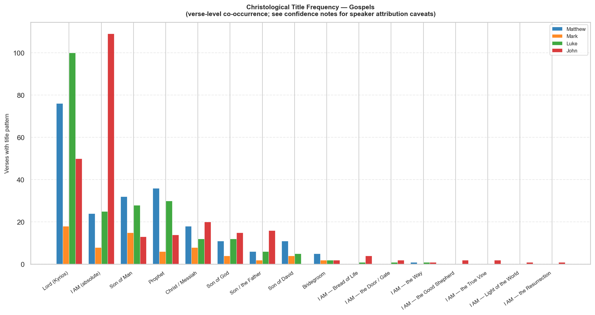

# Christological Titles: Jesus's Self-Designations in the Gospels

Frequency analysis of the major titles Jesus used to refer to Himself, counted by verse-level co-occurrence of the relevant Greek Strong's numbers across the four Gospels.

> **Speaker attribution note:** The STEPBible TAGNT data does not tag speakers. Counts reflect all occurrences of each title pattern in a given verse, regardless of who is speaking. The **Confidence** column indicates how reliably each title reflects Jesus's own self-designation vs. others' usage.

| Confidence | Meaning |
|---|---|
| ✓ High | Virtually all instances are Jesus speaking of Himself |
| ~ Medium | Mix of Jesus speaking and others; ~60–80% self-referential |
| ✗ Low | Many instances from narrators, disciples, or opponents |

## Summary

### Son titles

| Title | Greek | Mat | Mrk | Luk | Jhn | Total | Confidence |
|---|---|---:|---:|---:|---:|---:|---|
| Son of Man | ὁ υἱὸς τοῦ ἀνθρώπου | 32 | 15 | 28 | 13 | **88** | ✓ high |
| Son of God | υἱὸς τοῦ θεοῦ | 11 | 4 | 12 | 15 | **42** | ~ medium |
| Son / the Father | ὁ υἱός … ὁ πατήρ | 6 | 2 | 6 | 16 | **30** | ~ medium |
| Son of David | υἱὸς Δαυίδ | 11 | 4 | 5 | 0 | **20** | ✗ low |

### I AM sayings

| Title | Greek | Mat | Mrk | Luk | Jhn | Total | Confidence |
|---|---|---:|---:|---:|---:|---:|---|
| I AM (absolute) | ἐγώ εἰμι | 24 | 8 | 25 | 109 | **166** | ~ medium |
| I AM — Bread of Life | ἐγώ εἰμι ὁ ἄρτος τῆς ζωῆς | 0 | 0 | 1 | 4 | **5** | ✓ high |
| I AM — the Door / Gate | ἐγώ εἰμι ἡ θύρα | 0 | 0 | 1 | 2 | **3** | ✓ high |
| I AM — the Way | ἐγώ εἰμι ἡ ὁδός | 1 | 0 | 1 | 1 | **3** | ✓ high |
| I AM — the Good Shepherd | ἐγώ εἰμι ὁ ποιμὴν ὁ καλός | 0 | 0 | 0 | 2 | **2** | ✓ high |
| I AM — the True Vine | ἐγώ εἰμι ἡ ἄμπελος | 0 | 0 | 0 | 2 | **2** | ✓ high |
| I AM — Light of the World | ἐγώ εἰμι τὸ φῶς τοῦ κόσμου | 0 | 0 | 0 | 1 | **1** | ✓ high |
| I AM — the Resurrection | ἐγώ εἰμι ἡ ἀνάστασις | 0 | 0 | 0 | 1 | **1** | ✓ high |

### Other titles

| Title | Greek | Mat | Mrk | Luk | Jhn | Total | Confidence |
|---|---|---:|---:|---:|---:|---:|---|
| Lord (Kyrios) | κύριος | 76 | 18 | 100 | 50 | **244** | ✗ low |
| Prophet | προφήτης | 36 | 6 | 30 | 14 | **86** | ✗ low |
| Christ / Messiah | Χριστός | 18 | 8 | 12 | 20 | **58** | ✗ low |
| Bridegroom | νυμφίος | 5 | 2 | 2 | 2 | **11** | ✓ high |

---

## Title Details

### Son of Man

**Greek:** ὁ υἱὸς τοῦ ἀνθρώπου  
**Strongs:** G5207, G0444  
**Confidence:** ✓ high  

Jesus's most frequent self-designation. Every Gospel instance is Jesus speaking. One instance each in Acts (7:56, Stephen's vision) and Rev (1:13, 14:14) extend the pattern.

| Reference | Text |
|---|---|
| Matthew 7:9 | Or which is of you a man whom if he will ask for the son of him bread, surely not a stone will he give to him? |
| Matthew 8:20 | And says to him <the> Jesus; <the> Foxes holes have and the birds of the air nests, <the> but the Son <the> of Man no... |
| Matthew 9:6 | So that however you may know that authority has the Son <the> of Man on the earth to forgive sins.., Then He says to ... |
| Matthew 10:23 | Whenever then they may persecute you in the city one, do flee to <the> a different; Amen for I say to you; certainly ... |
| Matthew 11:19 | Came the Son <the> of Man eating and drinking, and they say; Behold a man a glutton and a drunkard, of tax collectors... |
| Matthew 12:8 | lord for is and of the Sabbath the Son <the> of Man. |
| Matthew 12:32 | And who[ever] if shall speak a word against the Son <the> of Man, it will be forgiven to him; who[ever] now maybe sha... |
| Matthew 12:40 | Just as for was Jonah in the belly of the great fish three days and three nights, so will be the Son <the> of Man in ... |
| Matthew 13:37 | <the> And answering He said to them: The [One] sowing the good seed is the Son <the> of Man; |
| Matthew 13:41 | Will send forth the Son <the> of Man the angels of Him, and they will gather out of the kingdom of Him all the causes... |
| Matthew 16:13 | Having come then <the> Jesus into the district of Caesarea <the> Philippi He was questioning the disciples of Him say... |
| Matthew 16:27 | Is about for the Son of the man to come in the glory of the Father of Him with the angels of Him and then He will giv... |
| Matthew 16:28 | Amen I say to you that there are some of those here already standing who certainly not shall taste of death until whe... |
| Matthew 17:9 | And when are descending they from the mountain instructed them <the> Jesus saying; To no one shall tell the vision un... |
| Matthew 17:12 | I say however to you that Elijah already is come, and not they knew him but did to him as much as they desired; Thus ... |
| Matthew 17:22 | When are abiding now they in <the> Galilee said to them <the> Jesus; Is about the Son <the> of Man to be betrayed int... |
| Matthew 18:11 | came for <the> son <the> of man to save those already perishing. |
| Matthew 19:28 | <the> And Jesus said to them; Amen I say to you that you yourselves who having followed Me in the regeneration, when ... |
| Matthew 20:18 | Behold we go up to Jerusalem, and the Son <the> of Man will be betrayed to the chief priests and scribes, and they wi... |
| Matthew 20:28 | even as the Son <the> of Man not came to be served but to serve and to give the life of Him [as] a ransom for many. |
| Matthew 22:2 | Has become like the kingdom of the heavens to a man a king who made a wedding feast for the son of him. |
| Matthew 24:27 | Just as for the lightning comes forth from [the] east and shines until [the] west, so will be also the coming of the ... |
| Matthew 24:30 | And then will appear the sign of the Son <the> of Man in <the> heaven; and then will mourn all the tribes of the eart... |
| Matthew 24:37 | As [were] for the days <the> of Noah, so will be also the coming of the Son <the> of Man. |
| Matthew 24:39 | And not they knew until came the flood and took away all, thus will be also the coming of the Son <the> of Man. |
| Matthew 24:44 | Because of this also you yourselves do be ready; for in that not you expect hour, the Son <the> of Man comes. |
| Matthew 25:13 | do watch therefore, for neither do you know the day nor [know] the hour in who <the> son <the> of man comes. |
| Matthew 25:31 | When then may come the Son <the> of Man in the glory of Him and all the holy angels with Him, then He will sit upon [... |
| Matthew 26:2 | You know that after two days the Passover takes place, and the Son <the> of Man is delivered over <the> to be crucified. |
| Matthew 26:24 | <the> Indeed the Son <the> of Man goes even as it has been written about Him, woe however for the man that [one] thro... |
| Matthew 26:45 | Then He comes to the disciples of him and says to them; Sleep <the> later on and take your rest; Behold has drawn nea... |
| Matthew 26:64 | Says to him <the> Jesus; You yourself have said. But I say to you; from now you will behold the Son <the> of Man sitt... |
| Mark 2:10 | That however you may know that authority has the Son <the> of Man to forgive sins on the earth He says to the paralytic; |
| Mark 2:28 | So then Lord is the Son <the> of Man also even of the Sabbath. |
| Mark 3:28 | Amen I say to you that all will be forgiven to the sons <the> of men the sins and the blasphemies as much as if they ... |
| Mark 8:31 | And He began to teach them that it is necessary for the Son <the> of Man many things to suffer and to be rejected by ... |
| Mark 8:38 | Who[ever] for if shall be ashamed of Me and <the> My words in <the> generation this <the> adulterous and sinful, also... |
| Mark 9:9 | And when are descending now they from the mountain He instructed them that to no one what they had seen they may tell... |
| Mark 9:12 | <the> And answering He was saying to them; Elijah indeed having come first restores all things; and how has it been w... |
| Mark 9:31 | He was teaching for the disciples of Him and He was saying to them that The Son <the> of Man is delivered into [the] ... |
| Mark 10:33 | that Behold we go up to Jerusalem, and the Son <the> of Man will be betrayed to the chief priests and to the scribes,... |
| Mark 10:45 | Even for the Son <the> of Man not came to be served but to serve and to give the life of Him [as] a ransom for many. |
| Mark 13:26 | And then will they behold the Son <the> of Man coming in [the] clouds with power great and glory. |
| Mark 14:21 | For <the> indeed the Son <the> of Man goes even as it has been written concerning Him, woe however to the man that [o... |
| Mark 14:41 | And He comes the third time and says to them; Are you sleeping <the> still and taking your rest, It is enough, has co... |
| Mark 14:62 | <the> And Jesus said; I myself am, And you will behold the Son <the> of Man at [the] right hand sitting <the> of Powe... |
| Mark 15:39 | Having seen then the centurion who having stood from opposite of Him that thus having cried out He breathed His last,... |
| Luke 5:10 | likewise now also James and John [the] sons of Zebedee, who were partners <the> with Simon. And said to <the> Simon <... |
| Luke 5:24 | That however you may know that the Son <the> of Man authority has on the earth to forgive sins.., He said to the [one... |
| Luke 6:5 | And He was saying to them that: Lord is also of the Sabbath the Son <the> of Man. |
| Luke 6:22 | Blessed are you when may hate you <the> men and when they may exclude you and they may insult [you] and they may cast... |
| Luke 7:34 | Has come the Son <the> of Man eating and drinking, and you say; Behold a man a glutton and a drunkard, a friend of ta... |
| Luke 9:22 | having said that It is necessary for the Son <the> of Man many things to suffer and to be rejected by the elders and ... |
| Luke 9:26 | Who[ever] for maybe may have been ashamed of Me and <the> My words, him the Son <the> of Man will be ashamed of when ... |
| Luke 9:44 | do implant in yourself you yourselves into the ears of you <the> words these; <the> for the Son <the> of Man is soon ... |
| Luke 9:56 | <the> for the son <the> of man not came souls of men to destroy but to save. and they went to another village. |
| Luke 9:58 | And said to him <the> Jesus; The foxes holes have, and the birds of the air nests; <the> but the Son <the> of Man not... |
| Luke 11:30 | Even as for was <the> Jonah to the Ninevites a sign thus will be also the Son <the> of Man to the generation this. |
| Luke 12:8 | I say now to you; everyone who maybe may confess in Me myself before the men, also the Son <the> of Man will confess ... |
| Luke 12:10 | And everyone who will speak a word against the Son <the> of Man, it will be forgiven to him; to the [one] however [wh... |
| Luke 12:40 | Also you yourselves therefore do be ready, for in the hour not you expect the Son <the> of Man comes. |
| Luke 15:11 | He said then; A man certain had two sons. |
| Luke 17:22 | He said then to the disciples; Will come days when you will desire one of the days of the Son <the> of Man to see and... |
| Luke 17:24 | As for the lightning which is flashing from the [one end] under the sky to the [other end] under [the] sky shines, th... |
| Luke 17:26 | And even as it came to pass in the days <the> of Noah, thus will it be also in the days of the Son <the> of man: |
| Luke 17:30 | According <the> to these will it be in that day the Son <the> of Man is revealed. |
| Luke 18:8 | I say to you that He will carry out the avenging of them with speed. Nevertheless the Son <the> of Man having come su... |
| Luke 18:31 | Having taken aside then the Twelve He said to them; Behold we go up to Jerusalem, and will be accomplished all things... |
| Luke 19:10 | Came for the Son <the> of Man to seek and to save that having been lost. |
| Luke 21:27 | And then will they behold the Son <the> of Man coming in a cloud with power and glory great. |
| Luke 21:36 | do watch also at every season praying that you may have strength to escape these things all that are soon to come to ... |
| Luke 22:22 | For the Son indeed <the> of man according to that determined goes; but woe to the man that [one] through whom He is b... |
| Luke 22:48 | <the> Jesus then said to him; Judas, with a kiss the Son <the> of Man are you betraying? |
| Luke 22:69 | From <the> now on also will be the Son <the> of Man sitting at [the] right hand of the power <the> of God. |
| Luke 24:7 | saying The Son <the> of Man that it behooves to be delivered into hands of men sinful and to be crucified and on the ... |
| John 1:51 | And He says to him; Amen Amen I say to all of you from now you will behold the heaven having opened and the angels <t... |
| John 3:13 | And no [one] has gone up into <the> heaven only except the [One] out of <the> heaven having come down, the Son <the> ... |
| John 3:14 | And even as Moses lifted up the serpent in the wilderness, thus to be lifted up it behooves the Son <the> of Man, |
| John 4:50 | Says to him <the> Jesus; do go, the son of you lives. and Believed the man in the word that said to him <the> Jesus, ... |
| John 5:27 | And authority He gave to Him and judgment to carry out, because Son of Man He is. |
| John 6:27 | do work not [for] the food that is perishing but [for] the food which is enduring unto life eternal which the Son <th... |
| John 6:53 | Said therefore to them <the> Jesus; Amen Amen I say to you; only unless you shall have eaten the flesh of the Son <th... |
| John 6:62 | What if then you shall see the Son <the> of Man ascending where He was <the> before? |
| John 8:28 | Said therefore to them <the> Jesus; When you may have lifted up the Son <the> of Man, then you will know that I mysel... |
| John 9:35 | Heard <the> Jesus that they had cast him out, and having found him He said to him: You yourself believe in the Son <t... |
| John 12:23 | <the> And Jesus answered to them saying; Has come the hour that may be glorified the Son <the> of Man. |
| John 12:34 | Answered therefore to Him the crowd; We ourselves heard from the law that the Christ abides to the age, and how say y... |
| John 13:31 | When therefore he had gone out, says <the> Jesus; Now has been glorified the Son <the> of Man, and <the> God has been... |
| Acts 7:56 | and he said; Behold I see the heavens opened up and the Son <the> of Man at [the] right [hand] already standing <the>... |
| Ephesians 3:5 | which in in other generations not was made known to the sons <the> of men as now it has been revealed to the holy apo... |
| 2 Thessalonians 2:3 | No one you may deceive in not one way; that only unless shall have come the apostasy first and shall have been reveal... |
| Hebrews 2:6 | Has testified however somewhere someone saying; What is man that You are mindful of him or [the] son of man that You ... |
| Hebrews 7:28 | The law for men appoints as high priests having weakness, the word however of the oath which [is] after the law a Son... |
| 1 John 5:9 | If the testimony <the> of men we receive, the testimony <the> of God greater is, For this is the testimony <the> of G... |
| Revelation 1:13 | and in [the] midst of the seven lampstands [One] like [the] Son of Man having clothed himself to the feet and having ... |
| Revelation 14:14 | And I looked and behold a cloud white, and upon the cloud is sitting [One] like [the] Son of Man, having on the head ... |

### Son of God

**Greek:** υἱὸς τοῦ θεοῦ  
**Strongs:** G5207, G2316  
**Confidence:** ~ medium  

Used both by Jesus (implicitly) and by others — demons (Mt 8:29), disciples (Mt 14:33), the high priest (Mt 26:63), the centurion (Mt 27:54). Counts include all speakers.

| Reference | Text |
|---|---|
| Matthew 1:23 | Behold the virgin in womb [pregnancy] will have and she will bear a son, and they will call the name of Him Immanuel,... |
| Matthew 4:3 | And having come the [one] tempting he said to Him; If Son You are <the> of God, do speak that <the> stones these loav... |
| Matthew 4:6 | and says to him; If Son You are <the> of God, do throw Yourself down; it has been written for that To the angels of H... |
| Matthew 5:9 | Blessed [are] the peacemakers, for they themselves sons of God will be called. |
| Matthew 8:29 | And behold they cried out saying; What to us and to you Jesus Son <the> of God? Are You come here before [the] time t... |
| Matthew 14:33 | Those then in the boat having come worshiped Him saying; Truly of God Son You are! |
| Matthew 16:16 | Answering now Simon Peter said; You yourself are the Christ the Son <the> of God the living. |
| Matthew 26:63 | <the> And Jesus was silent. And answering the high priest said to Him; I adjure you by <the> God the living that us m... |
| Matthew 27:40 | and saying; You who [are] destroying the temple and in three days building [it], do save Yourself! If [the] Son You a... |
| Matthew 27:43 | He has trusted on <the> God; he should deliver now him if He wants Him; He said for that Of God I am [the] Son. |
| Matthew 27:54 | <the> And the centurion and those with him keeping guard over <the> Jesus having seen the earthquake and the [things ... |
| Mark 1:1 | [The] beginning of the gospel of Jesus Christ Son <the> of God; |
| Mark 3:11 | And the spirits <the> unclean, whenever Him they were seeing they were falling down before Him and they were crying o... |
| Mark 5:7 | And having cried in a voice loud he spoke; What to me myself and to You, Jesus, Son <the> of God the Most High? I adj... |
| Mark 15:39 | Having seen then the centurion who having stood from opposite of Him that thus having cried out He breathed His last,... |
| Luke 1:16 | And many of the sons of Israel he will turn to [the] Lord the God of them, |
| Luke 1:32 | He will be great and Son of [the] Most High He will be called, and will give to Him [the] Lord <the> God the throne o... |
| Luke 1:35 | And answering the angel said to her; [the] Spirit Holy will come upon you and power of [the] Most High will overshado... |
| Luke 3:2 | during [the] high priesthood of Annas and Caiaphas, came [the] declaration of God upon John the <the> of Zechariah so... |
| Luke 4:3 | and Said then to Him the devil; If [the] Son You are <the> of God, do speak to the stone this that it may become bread. |
| Luke 4:9 | and He led also Him to Jerusalem and set him upon the pinnacle of the temple and said to Him; If the Son You are <the... |
| Luke 4:41 | Were going out now also demons from many shouting out and saying that You yourself are <the> Christ the Son <the> of ... |
| Luke 8:28 | Having seen then <the> Jesus and having cried out he fell down before Him and in a voice loud said; What to me myself... |
| Luke 12:8 | I say now to you; everyone who maybe may confess in Me myself before the men, also the Son <the> of Man will confess ... |
| Luke 20:36 | neither for to die any more are they able, like [the] angels for they are, and sons they are <the> of God of the resu... |
| Luke 22:69 | From <the> now on also will be the Son <the> of Man sitting at [the] right hand of the power <the> of God. |
| Luke 22:70 | They said then all; You yourself then are the Son <the> of God? <the> And to them He was saying; You yourselves say t... |
| John 1:34 | And I myself have seen and have borne witness that this is the Son <the> of God. |
| John 1:49 | Answered to him Nathanael and says: Rabbi, You yourself are the Son <the> of God, You yourself <the> King are <the> o... |
| John 1:51 | And He says to him; Amen Amen I say to all of you from now you will behold the heaven having opened and the angels <t... |
| John 3:16 | Thus for loved <the> God the world, that the Son of him the only begotten He gave, so that everyone who is believing ... |
| John 3:17 | Not for sent <the> God the Son of Him into the world that He may judge the world, but that may be saved the world thr... |
| John 3:18 | The [one] believing on Him not is judged; the [one] but not believing already has been judged because not he has beli... |
| John 3:36 | The [one] believing in the Son has life eternal; the [one] however not obeying the Son not will behold life, but the ... |
| John 5:25 | Amen Amen I say to you that is coming an hour and now is when the dead will hear the voice of the Son <the> of God an... |
| John 6:27 | do work not [for] the food that is perishing but [for] the food which is enduring unto life eternal which the Son <th... |
| John 10:36 | [of Him] whom the Father sanctified and He sent into the world, you yourselves do say that You blaspheme, because I s... |
| John 11:4 | Having heard then <the> Jesus said; This <the> sickness not is unto death but for the glory <the> of God that may be ... |
| John 11:27 | She says to Him; Yes Lord; I myself have believed that You yourself are the Christ the Son <the> of God the [One] int... |
| John 13:31 | When therefore he had gone out, says <the> Jesus; Now has been glorified the Son <the> of Man, and <the> God has been... |
| John 19:7 | Answered to him the Jews; We ourselves a law have, and according to the law of us He ought to die, because [the] Son ... |
| John 20:31 | these however have been written that you may believe that <the> Jesus is the Christ the Son <the> of God and that bel... |
| Acts 2:17 | And it will be in the last days, says <the> God, I will pour out of the Spirit of Mine upon all flesh and will prophe... |
| Acts 3:25 | You yourselves are the sons of the prophets and of the covenant that made <the> God with the fathers of you saying to... |
| Acts 7:37 | This is the Moses <the> having said to the sons of Israel; A prophet for you will raise up [the] Lord <the> God of yo... |
| Acts 7:56 | and he said; Behold I see the heavens opened up and the Son <the> of Man at [the] right [hand] already standing <the>... |
| Acts 8:37 | said now <the> Philip: if believe you from all the heart it is lawful. answering now said: I believe the son <the> of... |
| Acts 9:20 | And immediately in the synagogues he was proclaiming <the> Jesus, that He is the Son <the> of God. |
| Acts 13:21 | Then they asked for a king, and gave to them <the> God <the> Saul son of Kish, a man of [the] tribe of Benjamin, year... |
| Acts 13:26 | Men brothers, sons of [the] family of Abraham and you who [are] among you fearing <the> God, to us the message of the... |
| Acts 13:33 | that this <the> God has fulfilled to the children of them to us having raised up Jesus, as also in the psalm it has b... |
| Romans 1:4 | who having been declared Son of God in power according to [the] Spirit of holiness by resurrection [from the] dead, J... |
| Romans 1:9 | Witness for me is <the> God, whom I serve in the spirit of mine in the gospel of the Son of Him, how unceasingly ment... |
| Romans 5:10 | If for enemies being we were reconciled <the> to God through the death of the Son of Him, much more having been recon... |
| Romans 8:3 | <the> For powerless [being] the law, in that it was weak through the flesh, <the> God <the> His own Son having sent i... |
| Romans 8:14 | As many as for by [the] Spirit of God are led, these sons of God are. |
| Romans 8:19 | The for earnest expectation of the creation the revelation of the sons <the> of God awaits; |
| Romans 9:26 | and It will happen that in the place where it was said to them; Not people of Mine [are] You yourselves, there they w... |
| 1 Corinthians 1:9 | Faithful [is] <the> God, through whom you were called into fellowship with the Son of Him Jesus Christ the Lord of us. |
| 1 Corinthians 15:28 | When now shall have been subjected to Him <the> all things, then also Himself the Son will be put in subjection to th... |
| 2 Corinthians 1:19 | The <the> of God for Son Jesus Christ the [One] among you through us having been proclaimed through me and Silvanus a... |
| Galatians 2:20 | I live now no longer I myself, lives however in me myself Christ; that which then now I live in [the] flesh, through ... |
| Galatians 3:26 | all for sons of God you are through <the> faith in Christ Jesus; |
| Galatians 4:4 | When however had come the fullness of the time, sent forth <the> God the Son of him, having been born of a woman, hav... |
| Galatians 4:6 | Because now you are sons, sent forth <the> God the Spirit of the Son of Him into the hearts of us crying out; Abba O ... |
| Galatians 4:7 | So no longer you are a slave but a son; if now a son, also an heir of through God Christ. |
| Ephesians 4:13 | until we may attain <the> all to the unity of the faith and of the knowledge of the Son <the> of God, unto a man a co... |
| Ephesians 5:6 | No one you should deceive with empty words; because of these things for comes the wrath <the> of God upon the sons <t... |
| Colossians 3:6 | because of which things is coming the wrath <the> of God on the sons <the> of disobedience; |
| Hebrews 1:8 | Unto however the Son: The throne of You, O God [is] to the age of the age; and the scepter <the> of righteousness [is... |
| Hebrews 4:14 | Having therefore a high priest great having passed through the heavens, Jesus the Son <the> of God, we may hold firml... |
| Hebrews 6:6 | and then having fallen away — again to restore [them] to repentance crucifying in themselves the Son <the> of God and... |
| Hebrews 7:3 | Without father, without mother, without genealogy, neither beginning of days nor of life end having, made like howeve... |
| Hebrews 10:29 | How much think you worse will he deserve punishment the [one] the Son <the> of God having trampled upon and the blood... |
| Hebrews 12:7 | As discipline endure, as sons you is treating <the> God; what for is son [is there] whom not disciplines [his] father? |
| 2 Peter 1:17 | Having received for from God [the] Father honor and glory a voice was brought to Him such as follows by the Majestic ... |
| 1 John 3:8 | The [one] practicing <the> sin of the devil is, because from [the] beginning the devil has been sinning. For this [re... |
| 1 John 4:9 | In this has been revealed the love <the> of God among us, that the Son of Him the one and only has sent <the> God int... |
| 1 John 4:10 | In this is <the> love, not that we ourselves have loved <the> God, but that He himself loved us and He sent the Son o... |
| 1 John 4:15 | Who[ever] maybe shall confess that Jesus Christ is the Son <the> of God, <the> God in him abides and he in <the> God. |
| 1 John 5:5 | who now is the [one] overcoming the world only except the [one] believing that Jesus is the Son <the> of God? |
| 1 John 5:9 | If the testimony <the> of men we receive, the testimony <the> of God greater is, For this is the testimony <the> of G... |
| 1 John 5:10 | The [one] believing in the Son <the> of God has the testimony in himself; The [one] not believing <the> in God a liar... |
| 1 John 5:11 | And this is the testimony that life eternal has given to us <the> God; and this the life in the Son of Him is. |
| 1 John 5:12 | The [one] having the Son has <the> life; the [one] not having the Son <the> of God <the> life not has. |
| 1 John 5:13 | These things have I written to you to those believing into the name of the Son <the> of God so that you may know that... |
| 1 John 5:20 | We know now that the Son <the> of God is come and has given us understanding so that we may know Him who [is] true, a... |
| 2 John 1:3 | Will be with us grace mercy [and] peace from God [the] Father and from Lord Jesus Christ the Son of the Father in tru... |
| 2 John 1:9 | Anyone who is progressing and not abiding in the teaching <the> of Christ God not has; The [one] abiding in the teach... |
| Revelation 2:18 | And to the angel of the in Thyatira church do write: These things says the Son <the> of God, the [One] having the eye... |
| Revelation 12:5 | And she brought forth a son male, who is about to rule all the nations with a rod of iron. and was caught up the chil... |
| Revelation 21:7 | The [one] overcoming he will inherit these [things], and I will be to him God, and he himself will be My <the> son. |

### Son / the Father

**Greek:** ὁ υἱός … ὁ πατήρ  
**Strongs:** G5207, G3962  
**Confidence:** ~ medium  

Verses where both "Son" and "Father" appear — captures Jesus's "I and the Father…" and "the Son does what the Father does" discourse (esp. John). Includes some third-person references.

| Reference | Text |
|---|---|
| Matthew 5:45 | so that you may be sons of the Father of you who is in the heavens, For the sun of Him He makes rise on evil and good... |
| Matthew 10:37 | The [one] loving father or mother above Me myself not is of Me worthy, and the [one] loving son or daughter above Me ... |
| Matthew 11:27 | All things to Me was delivered by the Father of Mine, And no [one] knows the Son only except the Father, nor the Fath... |
| Matthew 16:27 | Is about for the Son of the man to come in the glory of the Father of Him with the angels of Him and then He will giv... |
| Matthew 24:36 | Concerning however <the> day that [very] and <the> hour no [one] knows not even the angels of the heavens nor the Son... |
| Matthew 28:19 | Having gone therefore do disciple all the nations baptizing them in the name of the Father and of the Son and of the ... |
| Mark 8:38 | Who[ever] for if shall be ashamed of Me and <the> My words in <the> generation this <the> adulterous and sinful, also... |
| Mark 13:32 | Concerning now the day that or the hour no [one] knows not even the angels <the> in heaven nor the Son only except th... |
| Luke 1:32 | He will be great and Son of [the] Most High He will be called, and will give to Him [the] Lord <the> God the throne o... |
| Luke 9:26 | Who[ever] for maybe may have been ashamed of Me and <the> My words, him the Son <the> of Man will be ashamed of when ... |
| Luke 10:22 | and having turned to <the> disciples said All things to Me was delivered by the Father of Mine, And no [one] knows wh... |
| Luke 11:11 | Which now of you who [is] a father will ask for the son bread surely not stone will he give to him if a fish, and sur... |
| Luke 12:53 | They will be divided father against son and son against father, mother against <the> daughter and daughter against <t... |
| Luke 15:21 | Said then the son to him: Father, I have sinned against <the> heaven and before you; and no longer am I worthy to be ... |
| John 3:35 | The Father loves the Son and all things has given into the hand of Him. |
| John 4:12 | Not You yourself greater are [than] the father of us Jacob, who gave us the well, and himself of it drank and the son... |
| John 4:53 | Knew therefore the father that [it was] in that [very] <the> hour at which said to him <the> Jesus that: The son of Y... |
| John 5:19 | Answered therefore <the> Jesus and was saying to them; Amen Amen I say to you; not is able the Son to do of Himself n... |
| John 5:20 | <the> For the Father loves the Son and all things shows to Him that He himself does, and greater than these He will s... |
| John 5:21 | Even as for the Father raises up the dead and gives life, thus also the Son to whom He wishes gives life. |
| John 5:22 | Not for the Father does judge no [one], but <the> judgment all has given to the Son, |
| John 5:23 | so that all may honor the Son even as they honor the Father. He who not is honoring the Son not is honoring the Fathe... |
| John 5:26 | As for the Father has life in Himself, so also to the Son He gave life to have in Himself, |
| John 6:27 | do work not [for] the food that is perishing but [for] the food which is enduring unto life eternal which the Son <th... |
| John 6:40 | This for is the will of the Father Mine, that everyone who is beholding the Son and believing in Him he may have life... |
| John 6:42 | And they were saying; Surely this is Jesus the son of Joseph, of whom we ourselves know the father and the mother? Ho... |
| John 8:28 | Said therefore to them <the> Jesus; When you may have lifted up the Son <the> of Man, then you will know that I mysel... |
| John 10:36 | [of Him] whom the Father sanctified and He sent into the world, you yourselves do say that You blaspheme, because I s... |
| John 14:13 | And which one maybe you may ask in the name of Me, this will I do, so that may be glorified the Father in the Son. |
| John 17:1 | These things spoke <the> Jesus, and having lifted up the eyes of Him to <the> heaven and He said; Father, has come th... |

### Son of David

**Greek:** υἱὸς Δαυίδ  
**Strongs:** G5207, G1138  
**Confidence:** ✗ low  

Predominantly crowds and petitioners addressing Jesus, not self-reference. Included to show messianic address frequency. Absent from John.

| Reference | Text |
|---|---|
| Matthew 1:1 | [The] book of [the] genealogy of Jesus Christ son of David son of Abraham. |
| Matthew 1:20 | These things now when he was pondering behold an angel of [the] Lord in a dream appeared to him saying; Joseph son of... |
| Matthew 9:27 | And passing on from there <the> Jesus followed Him two blind [men] crying out and saying; do have mercy on us, Son of... |
| Matthew 12:23 | And were amazed all the crowds and were saying; surely not ever this is the Son of David? |
| Matthew 15:22 | And behold a woman Canaanite from the region same having approached was crying out to him saying; do have mercy on me... |
| Matthew 20:30 | And behold two blind [men] sitting beside the road, having heard that Jesus is passing by, cried out saying; do have ... |
| Matthew 20:31 | <the> And the crowd rebuked them that they may be silent. <the> But all the more they cried out saying: do have mercy... |
| Matthew 21:9 | The now crowds which are going before Him and those following they were crying out saying: Hosanna to the Son of Davi... |
| Matthew 21:15 | Having seen now the chief priests and the scribes the wonders that He did and the children who are crying out in the ... |
| Matthew 22:42 | saying; What you think concerning the Christ? Of whom son is He? They say to Him; <the> Of David. |
| Matthew 22:45 | If therefore David calls Him Lord, how son of him is He? |
| Mark 10:47 | And having heard that Jesus <the> of Nazareth it is, he began to cry out and to say; O Son of David Jesus, do have me... |
| Mark 10:48 | And were rebuking him many that he may be silent. <the> but much more he was crying out; Son of David, do have mercy ... |
| Mark 12:35 | And answering <the> Jesus was saying teaching in the temple; How say the scribes that the Christ [the] son of David is? |
| Mark 12:37 | Himself therefore David names Him Lord, then how of him is He son? And the great crowd was listening to Him gladly. |
| Luke 1:32 | He will be great and Son of [the] Most High He will be called, and will give to Him [the] Lord <the> God the throne o... |
| Luke 18:38 | And he called out saying; Jesus Son of David, do have mercy on me. |
| Luke 18:39 | And those going before were rebuking him that he may be silent. He himself however much more was crying out; Son of D... |
| Luke 20:41 | He said then to them; How do they declare the Christ to be David's Son |
| Luke 20:44 | David therefore Lord Him calls, and how of him son is He? |

### I AM (absolute)

**Greek:** ἐγώ εἰμι  
**Strongs:** G1473, G1510  
**Confidence:** ~ medium  

Absolute "I am he / it is I" — includes Jhn 8:58 ("before Abraham was, I AM"), the arrest scene (Jhn 18:5–8), and walking-on-water pericopes. Also catches non-theological ego+eimi uses. High concentration in John.

| Reference | Text |
|---|---|
| Matthew 3:11 | I myself indeed you baptize with water to repentance, <the> however after me is coming mightier than I He is of whom ... |
| Matthew 5:11 | Blessed are you when they may insult you and they may persecute [you] and they may say all kinds of evil declaration ... |
| Matthew 5:22 | I myself however say to you that everyone who is being angry with the brother of him in vain liable will be to the ju... |
| Matthew 5:34 | I myself however say to you not to swear at all, neither [swear] by <the> heaven because [the] throne it is <the> of ... |
| Matthew 8:9 | Also for I myself a man am under authority appointed having under myself soldiers and I say to this [one]; do go, and... |
| Matthew 10:37 | The [one] loving father or mother above Me myself not is of Me worthy, and the [one] loving son or daughter above Me ... |
| Matthew 11:6 | And blessed is he who only unless shall fall away in Me myself. |
| Matthew 11:10 | For this for is [he] concerning whom it has been written: Behold I myself send the messenger of Mine before [the] fac... |
| Matthew 11:29 | do take the yoke of Mine upon you and do learn from Me for gentle I am and humble <the> in heart, and you will find r... |
| Matthew 12:27 | And if I myself by Beelzebul cast out <the> demons, the sons of you by whom do they cast out? On account of this they... |
| Matthew 12:30 | The [one] not being with Me against Me is, and the [one] not gathering with Me scatters. |
| Matthew 14:27 | Immediately now spoke <the> Jesus to them saying; Take courage! I myself it is, not do fear. |
| Matthew 16:18 | I myself also now to you say that you yourself are Peter and on this the rock I will build My <the> church, and [the]... |
| Matthew 16:23 | <the> And having turned He said <the> to Peter; do go behind Me Satan! A stumbling block you are to me, For not your ... |
| Matthew 18:20 | Where for are two or three assembled unto <the> My name, there am I in [the] midst of them. |
| Matthew 20:15 | Or surely it is lawful for me what I want to do with that which [is] mine? Or the eye of you envious is because I mys... |
| Matthew 20:23 | and He says to them; <the> Indeed the cup of Mine You will drink and <the> baptism what I myself am baptized will be ... |
| Matthew 22:32 | I myself am the God of Abraham and the God of Isaac and the God of Jacob?’ Not He is the God God of [the] dead but of... |
| Matthew 24:5 | Many for will come in the name of Me saying; I myself am the Christ, and many they will mislead. |
| Matthew 26:22 | And being grieved exceedingly they began to say to Him one each of them: surely not ever I myself is it, Lord? |
| Matthew 26:25 | Answering now Judas who is betraying Him said; surely not ever I myself is it, Rabbi? He says to him; You yourself ha... |
| Matthew 26:38 | Then He says to them <the> Jesus: Very sorrowful is the soul of Mine until death; do remain here and do watch with Me. |
| Matthew 26:39 | And having gone forward a little He fell upon face of Him praying and saying; Father of Mine, if possible it is, shou... |
| Matthew 28:20 | teaching them to observe all things as much as I commanded you; And behold I myself with you am all the days until th... |
| Mark 6:16 | Having heard now <the> Herod was saying that: Whom I myself beheaded John — he [it] is he himself is risen from dead. |
| Mark 6:50 | All for Him saw and were troubled. <the> now immediately He spoke with them and says to them; Take courage! I myself ... |
| Mark 7:11 | You yourselves however say [that]: if may say a man to the father or to the mother; [It is] Corban, that is a gift, w... |
| Mark 9:42 | And who[ever] maybe shall cause to stumble one of the little ones these who are believing in Me myself, better it is ... |
| Mark 10:29 | answering now Was saying <the> Jesus; Amen I say to you, no [one] there is who has left house or brothers or sisters ... |
| Mark 10:40 | <the> but to sit at [the] right hand of Me or at [the] left hand of me not is Mine to give but [to those] for whom it... |
| Mark 13:6 | Many for will come in the name of Me saying that I myself am [He], and many they will mislead. |
| Mark 14:62 | <the> And Jesus said; I myself am, And you will behold the Son <the> of Man at [the] right hand sitting <the> of Powe... |
| Luke 1:18 | And said Zechariah to the angel; By what will I know this? I myself for am an old man, and the wife of mine having ad... |
| Luke 1:19 | And answering the angel said to him; I myself am Gabriel the [one] standing before <the> God and I was sent to speak ... |
| Luke 3:16 | Answered saying [to] all <the> John: I myself indeed with water baptize you; comes however the [One] mightier than I,... |
| Luke 4:7 | You yourself therefore if You shall worship before me will be Yours everything. |
| Luke 5:8 | Having seen now Simon Peter fell at the knees <the> of Jesus saying; do depart from me, for a man sinful am I, Lord. |
| Luke 7:8 | Also for I myself a man am under authority appointed, having under myself soldiers. and I say to this [one]; do go, a... |
| Luke 7:23 | And blessed is who might not shall be offended in Me myself. |
| Luke 7:27 | This is he concerning whom it has been written: Behold I myself I send the messenger of Mine before [the] face of you... |
| Luke 9:9 | and Said then <the> Herod; John I myself beheaded; who however is this concerning whom I myself I hear such things? A... |
| Luke 9:48 | and He said to them; Who[ever] maybe shall receive this <the> child in the name of Me, Me myself receives; and who[ev... |
| Luke 11:7 | And he from within answering may say; Not me trouble do cause. already the door has been shut, and the children of mi... |
| Luke 11:19 | If now I myself by Beelzebul cast out the demons, the sons of you by whom do they cast out? On account of this they t... |
| Luke 11:23 | The [one] not being with Me against Me is, and the [one] not gathering with Me scatters. |
| Luke 13:27 | And he will speak; saying to you; not I do know you from where you are, do depart from me all [you] <the> workers <th... |
| Luke 15:31 | <the> And he said to him; Son, you yourself always with me are, and all that [is] mine yours is. |
| Luke 19:22 | He says now to him; Out of the mouth of you I will judge you, evil servant. You knew that I myself a man harsh am tak... |
| Luke 21:8 | <the> And He said; do take heed lest you may be led astray; many for will come in the name of Me saying that: I mysel... |
| Luke 22:19 | And having taken [the] bread having given thanks He broke [it] and He gave to them saying; This is the body of Mine w... |
| Luke 22:27 | Who for [is] greater, the [one] reclining or the [one] serving? Surely the [one] reclining? I myself however in [the]... |
| Luke 22:28 | You yourselves now are those having remained with Me in the trials of Mine. |
| Luke 22:53 | Every day being Me with you in the temple not did you stretch out the hands against Me myself. but this is of you the... |
| Luke 22:70 | They said then all; You yourself then are the Son <the> of God? <the> And to them He was saying; You yourselves say t... |
| Luke 23:43 | And He said to him <the> Jesus: Amen to you I say: today with Me you will be in <the> Paradise. |
| Luke 24:39 | do see the hands of Me and the feet of Me that I myself am He himself; do touch Me and do see for a spirit flesh and ... |
| Luke 24:44 | He said now unto to them; These [are] the words of mine which I spoke to you still being with you that it behooves to... |
| John 1:20 | And he confessed and not denied but confessed that I myself not am the Christ. |
| John 1:27 | he himself is the [One] after me coming, who before me has been; of whom not am I myself worthy that I may untie of H... |
| John 1:30 | He it is concerning whom I myself said; After me comes a man who precedence over me has because before me He was. |
| John 1:33 | And I myself not knew Him, but the [One] having sent me to baptize with water, He to me said; Upon whom maybe you may... |
| John 1:34 | And I myself have seen and have borne witness that this is the Son <the> of God. |
| John 3:28 | Yourselves you yourselves to me bear witness that I said that: I myself Not am I myself the Christ, but for sent I am... |
| John 3:29 | The [one] having the bride [the] bridegroom is. the now friend of the bridegroom, the [one] having stood and listenin... |
| John 4:9 | Says therefore to Him the woman <the> Samaritan; How You yourself a Jew being from me to drink you do ask a woman Sam... |
| John 4:26 | Says to her <the> Jesus; I myself am [He], who is speaking to you. |
| John 4:34 | Says to them <the> Jesus; My own food is that I may do the will of the [One who] having sent Me and may finish of Him... |
| John 5:30 | Not am able I myself to do of Myself no [thing]; even as I hear I judge, and the judgment <the> of Mine just is, beca... |
| John 5:31 | If I myself shall bear witness concerning Myself, the testimony of Mine not is true; |
| John 5:32 | Another it is who is bearing witness concerning Me, and I know that true is the testimony which he bears witness conc... |
| John 5:39 | You diligently search the Scriptures, for you yourselves think in them life eternal to have; and these are they those... |
| John 5:45 | Not do think that I myself will accuse you to the Father; There is [one] accusing you Moses in whom you yourselves ha... |
| John 6:20 | <the> And He says to them; I myself am [He], not do fear. |
| John 6:35 | Said now to them <the> Jesus; I myself am the bread <the> of life; the [one] coming to Me myself certainly not may hu... |
| John 6:40 | This for is the will of the Father Mine, that everyone who is beholding the Son and believing in Him he may have life... |
| John 6:41 | Were grumbling therefore the Jews about Him because He said; I myself am the bread <the> having come down from <the> ... |
| John 6:45 | It is written in the prophets: And they will be all taught <the> of God.’ Everyone therefore who having heard from th... |
| John 6:48 | I myself am the bread <the> of life. |
| John 6:51 | I myself am the bread which is living <the> from <the> heaven having come down; if anyone shall have eaten of this <t... |
| John 6:63 | The Spirit is the [one] giving life, the flesh not profits no [thing]; The declarations that I myself have spoken to ... |
| John 6:70 | Answered them <the> Jesus; Not I myself you the Twelve did choose, and of you one a devil is? |
| John 7:6 | Says therefore to them <the> Jesus; The time <the> for Me not yet is come, <the> but the time <the> of you always is ... |
| John 7:7 | Not is able the world to hate you, Me myself however it hates, because I myself bear witness concerning it that the w... |
| John 7:16 | Answered therefore them <the> Jesus and said: <the> My teaching not is of Myself but of the [One who] having sent Me; |
| John 7:17 | If anyone shall desire the will of Him to do, he will know concerning the teaching whether from <the> God it is or I ... |
| John 7:28 | Cried out therefore in the temple teaching <the> Jesus and saying; Me you know and you know from where I am; and of M... |
| John 7:29 | I myself now know Him, because from Him I am, and He Me sent. |
| John 7:34 | You will seek Me and not will find Me, and where am I myself you yourselves not are able to come. |
| John 7:36 | What is <the> word this that He said; You will seek Me and not will find Me, and Where am I myself you yourselves not... |
| John 8:12 | Again therefore to them spoke <the> Jesus saying; I myself am the light of the world. the [one] following Me myself c... |
| John 8:14 | Answered Jesus and said to them; Even if I myself shall be bearing witness concerning Myself, true is the testimony o... |
| John 8:16 | And if shall judge however I myself, <the> judgment <the> My true is, because alone not I am, but I myself and the ha... |
| John 8:18 | I myself am the [One] bearing witness concerning Myself, and bears witness concerning Me the having sent Me Father. |
| John 8:19 | They were saying therefore to Him; Where is the Father of You? Answered <the> Jesus; Neither Me myself you know nor [... |
| John 8:23 | And He was saying to them; You yourselves from <the> below are, I myself from <the> above am; You yourselves of this ... |
| John 8:24 | I said therefore to you that you will die in the sins of you; only for unless you shall believe that I myself am [He]... |
| John 8:26 | Many things I have concerning you to say and to judge; but the [One] having sent Me true is, and I myself what I have... |
| John 8:28 | Said therefore to them <the> Jesus; When you may have lifted up the Son <the> of Man, then you will know that I mysel... |
| John 8:29 | And the [One] having sent Me with Me is; not He has left Me alone <the> Father because I myself the [things] pleasing... |
| John 8:31 | Was saying therefore <the> Jesus to the having believed in Him Jews; If you yourselves shall abide in the word <the> ... |
| John 8:37 | I know that seed of Abraham you are; but you seek Me to kill, because the word <the> of Mine not receives a place in ... |
| John 8:42 | Said therefore to them <the> Jesus; If <the> God Father of you were, you were loving then would Me myself; I myself f... |
| John 8:50 | I myself now not seek the glory of Mine; there is One seeking [it] and judging. |
| John 8:54 | Answered Jesus; If I myself shall glorify Myself, the glory of Mine no [thing] is; it is the Father of Mine who is gl... |
| John 8:55 | And not you have known Him, I myself however know Him. And if I shall say that not I know Him, I will be like you a l... |
| John 8:58 | Said to them <the> Jesus; Amen Amen I say to you; before Abraham being I myself am. |
| John 9:9 | Some were saying that He it is, but others were saying; No, but that like as him he is. He was saying that I myself a... |
| John 10:7 | Said therefore again to them <the> Jesus; Amen Amen I say to you that I myself am the door of the sheep. |
| John 10:8 | All as many as came before Me thieves are and robbers; but not did listen to them the sheep. |
| John 10:9 | I myself am the door; through Me if anyone shall enter in, he will be saved and he will go in and will go out and pas... |
| John 10:11 | I myself am the shepherd <the> good; The shepherd <the> good the life of Him lays down for the sheep. |
| John 10:14 | I myself am the shepherd <the> good and I know <the> My own, and they know me those mine, |
| John 10:26 | But you yourselves not believe, because not you are from among the sheep <the> of Mine even as I said to you. |
| John 10:30 | I myself and the Father one are. |
| John 10:34 | Answered to them <the> Jesus; Surely it is written in the law of you that I myself said: gods you are’? |
| John 11:25 | Said to her <the> Jesus; I myself am the resurrection and the life; the [one] believing in Me myself even if he shall... |
| John 11:27 | She says to Him; Yes Lord; I myself have believed that You yourself are the Christ the Son <the> of God the [One] int... |
| John 12:26 | If Me myself anyone shall serve Me myself he should follow; and where am I myself, there also the servant <the> of Mi... |
| John 12:50 | And I know that the commandment of Him life eternal is. What therefore I myself speak even as has said to Me the Fath... |
| John 13:19 | From now I am telling you before <the> it comes to pass, so that you may believe when it may happen that I myself am ... |
| John 13:26 | Answers therefore <the> Jesus; He it is to whom I myself will dip the morsel and will give to him. And having dipped ... |
| John 13:33 | Little children, yet a little while with you I am. You will seek Me, and even as I said to the Jews that Where I myse... |
| John 13:35 | By this will know all that to Me disciples you are, if love you shall have among one another. |
| John 14:3 | And if I shall go and shall prepare a place for you again I am coming and I will receive you to Myself, that where am... |
| John 14:6 | Says to him <the> Jesus; I myself am the way and the truth and the life. No [one] comes to the Father only except thr... |
| John 14:9 | Says to him <the> Jesus; So long a time with you am I, and not you have known Me, Philip? The [one] having seen Me my... |
| John 14:10 | Surely you believe that I myself [am] in the Father and the Father in Me myself is? The declarations that I myself I ... |
| John 14:16 | And I myself will ask the Father, and another Helper He will give you, that with you to the age He may be |
| John 14:21 | The [one] having the commandments of Mine and keeping them, he is the [one] loving Me; the [one] now loving Me he wil... |
| John 14:24 | The [one] not loving Me the words of Mine not does keep; and the word that you hear not it is Mine but of the [One wh... |
| John 14:28 | You heard that I myself said to you; I am going away and I am coming to you. If you were loving Me, you have rejoiced... |
| John 15:1 | I myself am the vine <the> true, and the Father of Mine the vinedresser is. |
| John 15:5 | I myself am the vine, you [are] the branches. The [one] abiding in Me myself and I myself in him, he bears fruit much... |
| John 15:11 | These things I have spoken to you that <the> joy <the> of Mine in you may be and the joy of you may be full. |
| John 15:12 | This is <the> commandment <the> of Mine that you may love one another even as I loved you. |
| John 15:14 | You yourselves friends of Mine are if you shall do what things as much as I myself command you. |
| John 15:19 | If of the world you were, the world then would <the> [as its] own was loving [you]; because however of the world not ... |
| John 15:20 | do remember the word that I myself said to you: Not is a servant greater than the master of him. If Me myself they pe... |
| John 15:27 | Also you yourselves now bear witness, because from [the] beginning with Me you are. |
| John 16:4 | But these things I have said to you, so that when may have come the hour of them, you may remember those [things] tha... |
| John 16:15 | All things as much as has the Father Mine are; because of this I said that from that which [is] Mine He receives and ... |
| John 16:17 | Said therefore [some] of the disciples of him to one another; What is this that He says to us; A little [while] and n... |
| John 16:32 | Behold is coming an hour and now has come when you may be scattered each to <the> [his] own and I alone you may leave... |
| John 17:6 | I revealed Your <the> name to the men whom you gave Me out of the world; Yours they were and to Me them You gave and ... |
| John 17:9 | I myself concerning them am praying; Not concerning the world do I pray but concerning those whom You have given Me, ... |
| John 17:10 | And the [things] of mine all Yours are and <the> Yours Mine; and I have been glorified in them. |
| John 17:11 | And no longer I am in the world, and yet themselves in the world they are, and I myself to You am coming. Father Holy... |
| John 17:12 | When I was with them in <the> world I myself was keeping them in the name of You which [name] You have given to Me An... |
| John 17:14 | I myself have given to them the word of You, and the world hated them, because not they are of the world even as I my... |
| John 17:16 | Of the world not they are even as I myself not am of the world. |
| John 17:19 | and for them I myself sanctify Myself, that may be also they themselves sanctified in truth. |
| John 17:21 | that all one may be even as You yourself, Father, [are] in Me myself and I myself in You, that also they themselves i... |
| John 17:22 | And I myself the glory which You have given Me I have given to them, so that they may be one even as We ourselves one... |
| John 17:23 | I myself in them and You in Me myself — that they may be perfected in unity, and so that may know the world that You ... |
| John 17:24 | Father, that [one] You have given Me I desire that where am I myself they also may be with Me, that they may behold <... |
| John 17:26 | And I made known to them the name of You and will make [it] known, so that the love with which You loved Me in them m... |
| John 18:5 | They answered to Him; Jesus <the> of Nazareth. He says to them <the> Jesus: I myself am [He]. Had been standing now a... |
| John 18:6 | When therefore He said to them that: I myself am [He], they drew toward the back and fell to [the] ground. |
| John 18:8 | Answered <the> Jesus; I have told you that I myself am [He]. If therefore Me myself you seek, do allow these to go away; |
| John 18:26 | Says one of the servants of the high priest kinsman being [of him] of whom cut off Peter the ear; Surely I myself you... |
| John 18:35 | Answered <the> Pilate; surely not ever I myself a Jew am? The nation <the> of You and the chief priests delivered You... |
| John 18:36 | Answered <the> Jesus; The kingdom <the> of Mine not is of <the> world this; if of <the> world this were <the> kingdom... |
| John 18:37 | Said therefore to Him <the> Pilate; Then a king are You yourself? Answered <the> Jesus; You yourself say that a king ... |
| John 18:38 | Says to Him <the> Pilate; What is truth? And this having said again he went out to the Jews and says to them; I mysel... |
| John 19:11 | Answered to him Jesus; Not you were having authority against Me none, only unless it were given to you from above; Be... |
| John 20:15 | Says to her <the> Jesus; Woman, why do you weep? Whom do you seek? She thinking that the gardener He is she says to H... |

### I AM — Bread of Life

**Greek:** ἐγώ εἰμι ὁ ἄρτος τῆς ζωῆς  
**Strongs:** G1473, G1510, G0740  
**Confidence:** ✓ high  

John 6:35, 41, 48, 51. All Jesus speaking.

| Reference | Text |
|---|---|
| Luke 22:19 | And having taken [the] bread having given thanks He broke [it] and He gave to them saying; This is the body of Mine w... |
| John 6:35 | Said now to them <the> Jesus; I myself am the bread <the> of life; the [one] coming to Me myself certainly not may hu... |
| John 6:41 | Were grumbling therefore the Jews about Him because He said; I myself am the bread <the> having come down from <the> ... |
| John 6:48 | I myself am the bread <the> of life. |
| John 6:51 | I myself am the bread which is living <the> from <the> heaven having come down; if anyone shall have eaten of this <t... |

### I AM — Light of the World

**Greek:** ἐγώ εἰμι τὸ φῶς τοῦ κόσμου  
**Strongs:** G1473, G1510, G5457  
**Confidence:** ✓ high  

John 8:12. Jesus speaking.

| Reference | Text |
|---|---|
| John 8:12 | Again therefore to them spoke <the> Jesus saying; I myself am the light of the world. the [one] following Me myself c... |

### I AM — the Door / Gate

**Greek:** ἐγώ εἰμι ἡ θύρα  
**Strongs:** G1473, G1510, G2374  
**Confidence:** ✓ high  

John 10:7, 9. Jesus speaking.

| Reference | Text |
|---|---|
| Luke 11:7 | And he from within answering may say; Not me trouble do cause. already the door has been shut, and the children of mi... |
| John 10:7 | Said therefore again to them <the> Jesus; Amen Amen I say to you that I myself am the door of the sheep. |
| John 10:9 | I myself am the door; through Me if anyone shall enter in, he will be saved and he will go in and will go out and pas... |

### I AM — the Good Shepherd

**Greek:** ἐγώ εἰμι ὁ ποιμὴν ὁ καλός  
**Strongs:** G1473, G1510, G4166  
**Confidence:** ✓ high  

John 10:11, 14. Jesus speaking.

| Reference | Text |
|---|---|
| John 10:11 | I myself am the shepherd <the> good; The shepherd <the> good the life of Him lays down for the sheep. |
| John 10:14 | I myself am the shepherd <the> good and I know <the> My own, and they know me those mine, |

### I AM — the Resurrection

**Greek:** ἐγώ εἰμι ἡ ἀνάστασις  
**Strongs:** G1473, G1510, G0386  
**Confidence:** ✓ high  

John 11:25. Jesus speaking.

| Reference | Text |
|---|---|
| John 11:25 | Said to her <the> Jesus; I myself am the resurrection and the life; the [one] believing in Me myself even if he shall... |

### I AM — the Way

**Greek:** ἐγώ εἰμι ἡ ὁδός  
**Strongs:** G1473, G1510, G3598  
**Confidence:** ✓ high  

John 14:6 (Way, Truth, and Life). Jesus speaking.

| Reference | Text |
|---|---|
| Matthew 11:10 | For this for is [he] concerning whom it has been written: Behold I myself send the messenger of Mine before [the] fac... |
| Luke 7:27 | This is he concerning whom it has been written: Behold I myself I send the messenger of Mine before [the] face of you... |
| John 14:6 | Says to him <the> Jesus; I myself am the way and the truth and the life. No [one] comes to the Father only except thr... |

### I AM — the True Vine

**Greek:** ἐγώ εἰμι ἡ ἄμπελος  
**Strongs:** G1473, G1510, G0288  
**Confidence:** ✓ high  

John 15:1, 5. Jesus speaking.

| Reference | Text |
|---|---|
| John 15:1 | I myself am the vine <the> true, and the Father of Mine the vinedresser is. |
| John 15:5 | I myself am the vine, you [are] the branches. The [one] abiding in Me myself and I myself in him, he bears fruit much... |

### Lord (Kyrios)

**Greek:** κύριος  
**Strongs:** G2962  
**Confidence:** ✗ low  

Extremely broad — includes narrator references, disciples addressing Jesus, and Jesus's own usage. Cannot be filtered to self-reference without speaker tagging.

| Reference | Text |
|---|---|
| Matthew 1:20 | These things now when he was pondering behold an angel of [the] Lord in a dream appeared to him saying; Joseph son of... |
| Matthew 1:22 | This then all has come to pass that may be fulfilled that [which] having been spoken by the Lord through the prophet ... |
| Matthew 1:24 | Having been awoken then <the> Joseph from the sleep he did as he commanded him the angel of [the] Lord; and received ... |
| Matthew 2:13 | When were withdrawing then they behold an angel of [the] Lord appears in a dream <the> to Joseph saying; Having arise... |
| Matthew 2:15 | and he was remaining there until the death of Herod, so that it may be fulfilled that having been spoken by the Lord ... |
| Matthew 2:19 | When was dying now <the> Herod behold an angel of [the] Lord appears in a dream <the> to Joseph in Egypt |
| Matthew 3:3 | This for is the [One] having been spoken of through Isaiah the prophet saying; [The] voice of one crying in the wilde... |
| Matthew 4:7 | was saying to him <the> Jesus; Again it has been written: Not you will test [the] Lord the God of you.’ |
| Matthew 4:10 | Then says to him <the> Jesus; do go away behind me Satan; it has been written for: [The] Lord the God of you you will... |
| Matthew 5:33 | Again you have heard that it was said to the ancients; Not will you swear falsely, you will keep now to the Lord the ... |
| Matthew 6:24 | No [one] is able two masters to serve; either for the one he will hate and the other he will love or to [the] one he ... |
| Matthew 7:21 | Not everyone who is saying to Me; Lord Lord, will enter into the kingdom of the heavens, but the [one] doing the will... |
| Matthew 7:22 | Many will say to Me in that [very] <the> day; Lord Lord, surely <the> in Your name we did prophesy and <the> in Your ... |
| Matthew 8:2 | And behold a leper having come near was worshipping Him saying; Lord, if You shall be willing, You are able me to cle... |
| Matthew 8:6 | and saying; Lord, the servant of mine has been laid in the house paralyzed grievously being tormented. |
| Matthew 8:8 | And answering now the centurion was saying; Lord, not I am worthy that my under the roof You may come, but only do sp... |
| Matthew 8:21 | Another now of the disciples of Him said to Him; Lord, do allow me first to go and to bury the father of mine. |
| Matthew 8:25 | And having come to [Him] the disciples of Him they awoke Him saying; Lord, do save us we are perishing! |
| Matthew 9:28 | Having come now into the house came to Him the blind [men], and says to them <the> Jesus; Believe you that I am able ... |
| Matthew 9:38 | do beseech therefore the Lord of the harvest that He may send out workmen into the harvest of Him. |
| Matthew 10:24 | Not is a disciple above the teacher nor [is] a servant above the master of him. |
| Matthew 10:25 | [It is] sufficient for the disciple that he may become as the teacher of him and the servant as the master of him. If... |
| Matthew 11:25 | At that [very] <the> time answering <the> Jesus said; I fully consent to You, Father Lord of the heaven and the earth... |
| Matthew 12:8 | lord for is and of the Sabbath the Son <the> of Man. |
| Matthew 13:27 | Having come to [him] now the servants of the master of the house said to him; Sir, surely good seed did you sow in <t... |
| Matthew 13:51 | says to them <the> Jesus Did you understand these things all? They say to Him; Yes Lord. |
| Matthew 14:28 | Answering now to Him <the> Peter said: Lord, if You yourself [it] is, do command me to come to You upon the waters. |
| Matthew 14:30 | Seeing now the wind charging he was afraid, and having begun to sink he cried out saying; Lord, do save me! |
| Matthew 15:22 | And behold a woman Canaanite from the region same having approached was crying out to him saying; do have mercy on me... |
| Matthew 15:25 | <the> And having come she was worshiping Him saying; Lord, do help me! |
| Matthew 15:27 | <the> And she said; Yes Lord; even however the dogs eat of the crumbs those falling from the table of the masters of ... |
| Matthew 16:22 | And having taken aside Him <the> Peter began to rebuke Him saying; Far be it from You, Lord; certainly not will be to... |
| Matthew 17:4 | Answering now <the> Peter said <the> to Jesus; Lord, good it is for us here to be. If You wish, I will make here thre... |
| Matthew 17:15 | [15] Lord, do have mercy on my <the> son, for he is epileptic and miserably suffers; often for he falls into the fire... |
| Matthew 18:21 | Then having come <the> Peter said to Him; Lord, how often will sin against me myself the brother of mine and I will f... |
| Matthew 18:25 | [When] not is having [anything] now he to pay he commanded him the master of him to be sold and the wife of him and t... |
| Matthew 18:26 | Having fallen down therefore the servant was bowing on his knees to him saying; lord do have patience with me myself,... |
| Matthew 18:27 | Having been moved with compassion now the master of the servant, that [one] released him and the debt forgave him. |
| Matthew 18:31 | Having seen therefore the fellow servants of him the [things] having taken place they were grieved deeply, and having... |
| Matthew 18:32 | Then having called to him the master of him says to him; Servant evil, all the debt, that [one] I forgave you because... |
| Matthew 18:34 | And having been angry the master of him delivered him to the jailers until that he may pay all which is being owed to... |
| Matthew 20:8 | Evening then having arrived says the master of the vineyard to the foreman of him; do call the workmen and do pay to ... |
| Matthew 20:30 | And behold two blind [men] sitting beside the road, having heard that Jesus is passing by, cried out saying; do have ... |
| Matthew 20:31 | <the> And the crowd rebuked them that they may be silent. <the> But all the more they cried out saying: do have mercy... |
| Matthew 20:33 | They say to Him; Lord, that may be opened the eyes of us. |
| Matthew 21:3 | And if anyone to you may say anything, you will say that the Lord of them need has, Immediately then he will send them. |
| Matthew 21:9 | The now crowds which are going before Him and those following they were crying out saying: Hosanna to the Son of Davi... |
| Matthew 21:30 | and Having come then to the other he said likewise. <the> And answering he said; I myself [will] sir; and not did he go. |
| Matthew 21:40 | When therefore may come the master of the vineyard, what will he do <the> farmers to those? |
| Matthew 21:42 | Says to them <the> Jesus; surely sometime you did read in the Scriptures: [The] stone which rejected those building, ... |
| Matthew 22:37 | <the> And Jesus was saying to him; You will love [the] Lord the God of you with all the heart of you and with all the... |
| Matthew 22:43 | He says to them; How then David in spirit does call Him Lord saying: |
| Matthew 22:44 | Said the Lord to the Lord of me; do sit on [the] right hand of Me until when I may place the enemies of You [as] a fo... |
| Matthew 22:45 | If therefore David calls Him Lord, how son of him is He? |
| Matthew 23:39 | I say for to you; certainly not Me shall you see from now until when you may say; Blessed [is] the [One] coming in [t... |
| Matthew 24:42 | do keep watch therefore, for not you know on what day the Lord of you comes. |
| Matthew 24:45 | Who then is the faithful servant and wise whom has set the master of him over the household of him <the> to give to t... |
| Matthew 24:46 | Blessed [is] the servant that whom having come the master of him will find thus doing. |
| Matthew 24:48 | If however shall say the evil servant that one in the heart of him; Delays My <the> master to come |
| Matthew 24:50 | will come the master of the servant of that one in a day in which not he does expect and in an hour which not he is a... |
| Matthew 25:11 | Afterward then come also the other virgins saying; lord lord, do open to us! |
| Matthew 25:18 | <The> however <the> one having received having gone away he dug in in the ground and he hid the money of the master o... |
| Matthew 25:19 | After then much time comes the master of the servants those and takes account with them. |
| Matthew 25:20 | And having come the [one] the five talents having received he brought to [him] other five talents saying; Master, fiv... |
| Matthew 25:21 | was saying now to him the master of Him; Well done, servant good and faithful! Over a few things you were faithful, o... |
| Matthew 25:22 | Having come then also the [one] with the two talents having taken he said; Master, two talents to me you did deliver;... |
| Matthew 25:23 | was saying to him the master of Him; Well done, servant good and faithful! Over a few things you were faithful, over ... |
| Matthew 25:24 | Having come then also <the> the one talent having received he said; Master, I knew you that hard you are a man reapin... |
| Matthew 25:26 | answering now the master of him said to him; Wicked servant and lazy! You knew that I reap where not I sowed and I ga... |
| Matthew 25:37 | Then will answer Him the righteous saying; Lord, when You saw we hungering and fed [You] Or thirsting and gave [You] ... |
| Matthew 25:44 | Then will answer to him also themselves saying; Lord, when You saw we hungering or thirsting or a stranger or naked o... |
| Matthew 26:22 | And being grieved exceedingly they began to say to Him one each of them: surely not ever I myself is it, Lord? |
| Matthew 27:10 | and they gave them for the field of the potter, as directed me [the] Lord |
| Matthew 27:63 | saying; Sir, we have remembered how that [on,e] the deceiver said while living; After three days I arise. |
| Matthew 28:2 | And behold an earthquake there was great; an angel for of [the] Lord having descended out of heaven and having come h... |
| Matthew 28:6 | Not He is here; He is risen for even as He said. Come do see the place where He was lying the Lord. |
| Mark 1:3 | [The] voice of one crying in the wilderness do prepare the way of [the] Lord, straight do make the paths of Him. |
| Mark 2:28 | So then Lord is the Son <the> of Man also even of the Sabbath. |
| Mark 5:19 | And <the> now Jesus not He did permit him, but He says to him; do go to the home of you to <the> your own and do decl... |
| Mark 7:28 | <the> But she answered and she says to Him; yes Lord, even for the dogs under the table eat of the crumbs of the chil... |
| Mark 9:24 | and Immediately having cried out the father of the child with tears was saying; I believe Lord; do help me with the u... |
| Mark 11:3 | And if anyone to you may say; Why are you doing this?’ do say that the Lord of it need has, and soon it He sends back... |
| Mark 11:9 | And those going before and those following were crying out saying: Hosanna! Blessed [is] the [One] coming in [the] na... |
| Mark 11:10 | Blessed [is] the coming kingdom in name of the Lord of the father of us David! Hosanna in the highest! |
| Mark 12:9 | What therefore will do the master of the vineyard? he will come and he will destroy the farmers and will give the vin... |
| Mark 12:11 | from [the] Lord was this, and it is marvelous in [the] eyes of us.’? |
| Mark 12:29 | now Answered <the> Jesus to him The first is of all <the> commandments: do listen O Israel: [The] Lord the God of us ... |
| Mark 12:30 | and you will love [the] Lord the God of you with all the heart of you and with all the soul of you and with all the m... |
| Mark 12:36 | Himself for David said by the Spirit <the> Holy: Said the Lord to the Lord of me; do sit at [the] right hand of Me un... |
| Mark 12:37 | Himself therefore David names Him Lord, then how of him is He son? And the great crowd was listening to Him gladly. |
| Mark 13:20 | And only unless shortened [the] Lord the days, not then would there have been saved any flesh; but on account of the ... |
| Mark 13:35 | do watch therefore; not you know for when the master of the house comes or at evening or at midnight or when the roos... |
| Mark 16:19 | <the> Indeed therefore [the] Lord Jesus after <the> speaking to them was taken up into the heaven and sat at [the] ri... |
| Mark 16:20 | They now having gone forth they preached everywhere, of the Lord [who] working with [them] and the word confirming th... |
| Luke 1:6 | They were now righteous both in front of <the> God walking in all the commandments and ordinances of the Lord blameless. |
| Luke 1:9 | according to the custom of the priesthood the lot picked [him as] the [one] to burn incense entering into the temple ... |
| Luke 1:11 | Appeared then to him an angel of [the] Lord already standing at [the] right of the altar of the incense; |
| Luke 1:15 | He will be for great before the Lord, and wine and strong drink certainly not shall he drink, and [of the] Spirit Hol... |
| Luke 1:16 | And many of the sons of Israel he will turn to [the] Lord the God of them, |
| Luke 1:17 | And he himself will go forth before Him in [the] spirit and power of Elijah to turn [the] hearts of [the] fathers to ... |
| Luke 1:25 | that Thus to me has done the Lord in [the] days in which He looked upon [me] to take away the disgrace of mine among ... |
| Luke 1:28 | And having come <the> angel to her he said; Greetings! you graciously favored; The Lord [is] with you. blessed [are] ... |
| Luke 1:32 | He will be great and Son of [the] Most High He will be called, and will give to Him [the] Lord <the> God the throne o... |
| Luke 1:38 | Said then Mary; Behold the handmaid of [the] Lord; Would [that] it happen to me according to the declaration of you. ... |
| Luke 1:43 | And from where to me this that may come the mother of the Lord of mine to me myself? |
| Luke 1:45 | And blessed [is] the [one] having believed that there will be a fulfillment to the [things] spoken to her from [the] ... |
| Luke 1:46 | And said Mary: Magnifies the soul of Mine the Lord, |
| Luke 1:58 | And heard the neighbours and the relatives of her that magnified [the] Lord the mercy of Him with her, and they were ... |
| Luke 1:66 | And laid [them] up all those having heard in the heart of them saying; What then <the> child this will be? And for [t... |
| Luke 1:68 | Blessed [be] [the] Lord the God <the> of Israel, because He has visited and He has performed redemption [on] the peop... |
| Luke 1:76 | And you yourself now, child, prophet of [the] Most High will be called; you will go for in front of [the] face of [th... |
| Luke 2:9 | And behold an angel of [the] Lord stood by them, and [the] glory of [the] Lord shone around them, and they feared [wi... |
| Luke 2:11 | For has been born to you today a Savior who is Christ [the] Lord in [the] City of David. |
| Luke 2:15 | And it came to pass as they were departing from them into the heaven the angels, and the men <the> shepherds were spe... |
| Luke 2:22 | And when were fulfilled the days of the purification of them according to the law of Moses, they brought Him to Jerus... |
| Luke 2:23 | even as it has been written in [the] law of [the] Lord that Every male opening a womb holy to the Lord will be called; |
| Luke 2:24 | and <the> to offer a sacrifice according to that said in the law of [the] Lord; A pair of turtle doves or two young p... |
| Luke 2:26 | And it was to him revealed by the Spirit <the> Holy not to see death before than when he may see the Christ of [the] ... |
| Luke 2:39 | And when they had performed everything <the> according to the law of [the] Lord, they returned to <the> Galilee to th... |
| Luke 3:4 | as it has been written in [the] book of [the] words of Isaiah the prophet saying: [The] voice of one crying in the wi... |
| Luke 4:8 | And answering <the> Jesus said to him do go behind me Satan; It has been written: for [The] Lord the God of you you w... |
| Luke 4:12 | And answering He said to him <the> Jesus that It has been said; Not you will test [the] Lord the God of you.’ |
| Luke 4:18 | [The] Spirit of [the] Lord [is] upon Me myself, of which because He has anointed Me to evangelise to [the] poor, He h... |
| Luke 4:19 | to proclaim [the] year of [the] Lord’s favor. |
| Luke 5:8 | Having seen now Simon Peter fell at the knees <the> of Jesus saying; do depart from me, for a man sinful am I, Lord. |
| Luke 5:12 | And it came to pass in <the> being Him in one of the cities that behold a man full of leprosy; and having seen then <... |
| Luke 5:17 | And it came to pass on one of the days that He himself was teaching; and there were sitting by Pharisees and teachers... |
| Luke 6:5 | And He was saying to them that: Lord is also of the Sabbath the Son <the> of Man. |
| Luke 6:46 | Why now Me do you call: Lord Lord, and not do what I say? |
| Luke 7:6 | <the> And Jesus was going with them. Already then when he not far being distant from the house sent to him friends th... |
| Luke 7:13 | And having seen her the Lord was moved with compassion on her and He said to her; Not do weep. |
| Luke 7:19 | sent [them] to the Lord saying; You yourself are the coming [One], or another are we to look for? |
| Luke 7:31 | said now <the> Lord To what therefore will I liken the men of the generation this And to what are they like? |
| Luke 9:54 | Having seen [it] now the disciples of him James and John said; Lord, do you want [that] we may call fire to come down... |
| Luke 9:57 | And it came to pass now when are going they along the road said someone to Him; I will follow You wherever maybe You ... |
| Luke 9:59 | He said then to another; do follow Me. <the> But he said; Lord do allow me having gone away first to bury the father ... |
| Luke 9:61 | Said then also another; I will follow You, Lord; first however do allow me to bid farewell to those at the home of mine. |
| Luke 10:1 | After now these things appointed the Lord also others seventy two and sent them in two [by] two before [the] face of ... |
| Luke 10:2 | He was saying then to them; The indeed harvest [is] plentiful, <the> however the workmen [are] few; do pray earnestly... |
| Luke 10:17 | Returned then the seventy two with joy saying; Lord, even the demons are subject to us through the name of You. |
| Luke 10:21 | In [the] same <the> hour He rejoiced in the Spirit <the> Holy and said; I fully consent to You, Father, Lord of the h... |
| Luke 10:27 | <the> And answering he said; 'You will love [the] Lord the God of you with all the heart of you and with all the soul... |
| Luke 10:39 | And she was a sister being called Mary. She also having sat down at the feet of the Lord was listening to the word of... |
| Luke 10:40 | <the> But Martha was distracted about much service. having come up now she said; Lord, not is it concerning to You th... |
| Luke 10:41 | Answering now He said to her the Lord; Martha Martha, you are anxious and troubled about many things, |
| Luke 11:1 | And it came to pass while <the> being He in a place certain praying, when He ceased, said one of the disciples of Him... |
| Luke 11:39 | Said then the Lord to him; Now you yourselves <the> Pharisees the outside <of> the cup and <of> the dish you cleanse,... |
| Luke 12:36 | and you yourselves like to men waiting for the master of themselves whenever he may return from the wedding feasts, t... |
| Luke 12:37 | Blessed [are] the servants those whom having come the master will find watching; Amen I say to you that he will gird ... |
| Luke 12:41 | Said then to him <the> Peter; Lord, to us <the> parable this speak You or also to all? |
| Luke 12:42 | And said now the Lord; Who then is the faithful manager the wise whom will set the master over the care [of servants]... |
| Luke 12:43 | Blessed [is] the servant that [one] whom having come the master of him will find doing thus. |
| Luke 12:45 | If however shall say the servant that [one] in the heart of him; Delays the master of Me to come, and shall begin to ... |
| Luke 12:46 | will come the master of the servant that [one] in a day in which not he does expect and in an hour that not he knows ... |
| Luke 12:47 | That [very] now <the> servant the [one] having known the will of the master of him and not having prepared or having ... |
| Luke 13:8 | <the> And answering he says to him; Sir, do leave it also this the year, until when I may dig around it and may put [... |
| Luke 13:15 | Answered therefore to him the Lord and said; Hypocrites! Each one of you on the Sabbath not does he untie the ox of h... |
| Luke 13:23 | Said then one to Him; Lord, if [are] few those being saved? <the> And He said to them; |
| Luke 13:25 | From what maybe may have risen up the master of the house and may have shut the door then you may begin outside to ha... |
| Luke 13:35 | Behold is left to you the house of you desolate. Amen I say now to you that: certainly not shall you see Me until whe... |
| Luke 14:21 | And having come the servant that reported to the master of him these things. Then having become angry the master of t... |
| Luke 14:22 | And said the servant; Sir, it has been done as you did command, and still room there is. |
| Luke 14:23 | And said the master to the servant; do go out into the highways and hedges and do compel [them] to come in so that ma... |
| Luke 16:3 | Said then within himself the manager; What shall I do, for the master of me is taking away the management from me? To... |
| Luke 16:5 | And having called to [him] one each of the debtors of the master his own he was saying to the first; How much owe you... |
| Luke 16:8 | And praised the master the manager <the> unrighteous because shrewdly he had acted, For the sons of the age this more... |
| Luke 16:13 | No servant is able to two masters to serve; either for the one he will hate and the other he will love, or to one he ... |
| Luke 17:5 | And said the apostles to the Lord; do add to us faith! |
| Luke 17:6 | Said then the Lord; If you have faith like a grain of mustard, you have spoken then would to the mulberry tree this; ... |
| Luke 17:37 | And answering they say to Him; Where, Lord? <the> And He said to them; Where the body [is], there also the vultures w... |
| Luke 18:6 | Said then the Lord; do hear what the judge <the> unrighteous says; |
| Luke 18:41 | saying What to you desire you I may do? <the> And he said; Lord, that I may receive sight. |
| Luke 19:8 | Having stood then Zacchaeus said to the Lord; Behold the half my <the> possessions Lord, to the poor I give; and if o... |
| Luke 19:16 | Came up then the first saying; lord, the mina of you ten has produced more minas. |
| Luke 19:18 | And came the second saying; The mina of you, lord, has made five minas. |
| Luke 19:20 | And <the> another came saying; lord, behold the mina of you which I was keeping lying in a piece of cloth; |
| Luke 19:25 | And they said to him; Master, he has ten minas. |
| Luke 19:31 | And if anyone you shall ask; Because of why do you untie [it]? thus will you say to him: Because the Lord of it need ... |
| Luke 19:33 | When are untying then they the colt said the masters of it to them; Why untie you the colt? |
| Luke 19:34 | <the> And they said: that The Lord of it need has. |
| Luke 19:38 | saying: Blessed [is] the coming <the> King in [the] name of [the] Lord; In heaven peace, and glory in [the] highest. |
| Luke 20:13 | Said then the master of the vineyard; What shall I do? I will send the son of mine the beloved; perhaps him having se... |
| Luke 20:15 | And having cast forth him outside the vineyard they killed [him]. What therefore will do to them the master of the vi... |
| Luke 20:37 | for however are raised the dead, even Moses showed at the bush when he names [the] Lord the God of Abraham and the Go... |
| Luke 20:42 | and Himself for David says in [the] book of Psalms: Said the Lord to the Lord of me; do sit at [the] right hand of Me |
| Luke 20:44 | David therefore Lord Him calls, and how of him son is He? |
| Luke 22:31 | said now <the> Lord: Simon Simon, Behold <the> Satan demanded to have all of you <the> to sift like <the> wheat. |
| Luke 22:33 | <the> And he said to Him; Lord, with You ready I am both to prison and to death to go. |
| Luke 22:38 | <the> And they said; Lord, behold swords here [are] two. <the> And He said to them; Enough it is. |
| Luke 22:49 | Having seen then those around Him what will be they said to him: Lord, if will we strike with [the] sword? |
| Luke 22:61 | And having turned the Lord looked at <the> Peter, and remembered <the> Peter the declaration of the Lord how He had s... |
| Luke 23:42 | And he was saying: <the> Jesus, do remember me Lord when You may come into the kingdom of You! |
| Luke 24:3 | and Having entered however not they found the body of the Lord Jesus. |
| Luke 24:34 | saying that Indeed has risen the Lord and He has appeared to Simon. |
| John 1:23 | He was saying; I myself [am] a voice crying in the wilderness; do make straight the way of [the] Lord; even as said I... |
| John 4:11 | Says to Him the woman: Sir, nothing to draw with You have, and the well is deep; from where then have You the water w... |
| John 4:15 | Says to Him the woman; Sir, do give me this <the> water that not I may thirst nor I may come here to draw. |
| John 4:19 | Says to Him the woman; Sir, I understand that a prophet are You yourself. |
| John 4:49 | Says to Him the royal official; Sir, do come down before to die the child of mine. |
| John 5:7 | Answered Him the [one] ailing; Sir, a man not I have that when may be stirred the water he may put me into the pool; ... |
| John 6:23 | another now came boats from Tiberias near the place where they ate the bread when was giving thanks to the Lord. |
| John 6:34 | They said therefore to Him; Sir, always do give to us <the> bread this. |
| John 6:68 | Answered therefore Him Simon Peter; Lord, to whom will we go? declarations of life eternal You have, |
| John 8:11 | <the> And she said, No [one], Sir. Said then to her <the> Jesus, Neither I myself you do condemn; do go and from <the... |
| John 9:36 | Answered he and said; And who is He, lord, that I may believe in Him? |
| John 9:38 | <the> And he was saying; I believe, Lord, And he worshiped Him. |
| John 11:2 | Was now Mary the [one] having anointed the Lord with fragrant oil and having wiped the feet of Him with the hair of h... |
| John 11:3 | Sent therefore the sisters to Him saying; Lord, behold [he] whom You love was being sick. |
| John 11:12 | Said therefore the disciples to Him; Lord, if he has fallen asleep, he will get well. |
| John 11:21 | Said then <the> Martha to <the> Jesus; Lord, if You had been here, not then would be dead the brother of mine. |
| John 11:27 | She says to Him; Yes Lord; I myself have believed that You yourself are the Christ the Son <the> of God the [One] int... |
| John 11:32 | <the> Therefore Mary when she came to where was <the> Jesus, having seen Him she fell of Him at the feet saying to Hi... |
| John 11:34 | And He said; Where have you laid him? They say to Him; Lord, do come and do see. |
| John 11:39 | Says <the> Jesus; do take away the stone. Says to Him the sister of the [one] having deceased Martha; Lord, already h... |
| John 12:13 | took the branches of the palm trees and went out to meet Him and were shouting: Hosanna! Blessed [is] the [One] comin... |
| John 12:21 | these therefore came to Philip who was from Bethsaida <the> of Galilee and they were asking him saying; Sir, we desir... |
| John 12:38 | so that the word of Isaiah the prophet may be fulfilled that said: Lord, who has believed in the report of us? And th... |
| John 13:6 | He comes then to Simon Peter; and who says to Him that [question]; Lord, You yourself my do wash <the> feet? |
| John 13:9 | Says to Him Simon Peter; Lord, not the feet of me only but also the hands and the head. |
| John 13:13 | You yourselves call Me: <the> Teacher and <the> Lord, and rightly you say; I am for. |
| John 13:14 | If therefore I myself washed your <the> feet the Lord and the Teacher, also you yourselves ought of one another to wa... |
| John 13:16 | Amen Amen I say to you; not is a servant greater than the master of him nor [is] a messenger greater than the [one wh... |
| John 13:25 | Having leaned then he thus on the breast <the> of Jesus he says to Him; Lord, who is it? |
| John 13:36 | Says to Him Simon Peter; Lord, where go You? Answered to him <the> Jesus; Where I go not you are able Me now to follo... |
| John 13:37 | Says to Him <the> Peter; Lord, because of why not am I able You to follow presently? The life of mine for You I will ... |
| John 14:5 | Says to Him Thomas; Lord, not we know where You are going; and how can we the way to know? |
| John 14:8 | Says to Him Philip; Lord, do show us the Father, and it is enough for us. |
| John 14:22 | Says to Him Judas not <the> Iscariot; Lord, and what has occurred that to us You are about to manifest Yourself and n... |
| John 15:15 | no longer I name you servants, for the servant not knows what is doing his <the> master; You however I have called fr... |
| John 15:20 | do remember the word that I myself said to you: Not is a servant greater than the master of him. If Me myself they pe... |
| John 20:2 | She runs therefore and she comes to Simon Peter and to the other disciple whom was loving <the> Jesus and she says to... |
| John 20:13 | And say to her they; Woman, why weep you? She says to them; Because they have taken away the Lord of mine, and not I ... |
| John 20:15 | Says to her <the> Jesus; Woman, why do you weep? Whom do you seek? She thinking that the gardener He is she says to H... |
| John 20:18 | Comes Mary <the> Magdalene reporting to the disciples that I have seen the Lord, and [that] these things He had said ... |
| John 20:20 | And this having said He showed also the hands and the side of him to them. Rejoiced then the disciples having seen th... |
| John 20:25 | Were saying therefore to him the other disciples; We have seen the Lord. <the> But he said to them; Only unless I sha... |
| John 20:28 | and Answered <the> Thomas and said to Him; O Lord of Mine and O God of mine! |
| John 21:7 | Says therefore the disciple that [one] whom was loving <the> Jesus <the> to Peter; The Lord it is. Simon therefore Pe... |
| John 21:12 | Says to them <the> Jesus; Come do have breakfast. None however was daring of the disciples to ask Him; You yourself w... |
| John 21:15 | When therefore they had dined, says <the> to Simon to Peter <the> Jesus; Simon [son] of John, love you Me more than t... |
| John 21:16 | He says to him again a second time; Simon [son] of John, love you Me? He says to Him; Yes Lord, You yourself know tha... |
| John 21:17 | He says to him the third time; Simon [son] of John, do you dearly love Me? Was grieved <the> Peter because He said to... |
| John 21:20 | Having turned now <the> Peter sees the disciple whom was loving <the> Jesus following who also had reclined at the su... |
| John 21:21 | Him therefore having seen <the> Peter says <the> to Jesus; Lord, this man and what about? |

### Christ / Messiah

**Greek:** Χριστός  
**Strongs:** G5547  
**Confidence:** ✗ low  

Includes all uses as title and as part of "Jesus Christ". Jesus rarely uses this term of Himself (Mt 23:10 is an exception); most instances are narrator or epistolary.

| Reference | Text |
|---|---|
| Matthew 1:1 | [The] book of [the] genealogy of Jesus Christ son of David son of Abraham. |
| Matthew 1:16 | Jacob then begat <the> Joseph the husband of Mary out of whom was born Jesus who is being named Christ. |
| Matthew 1:17 | All therefore the generations from Abraham to David [were] generations fourteen and from David until the carrying awa... |
| Matthew 1:18 | <the> Now of Jesus Christ the origin thus was happening: At the pledging for of the mother of Him Mary <the> to Josep... |
| Matthew 2:4 | And having gathered together all the chief priests and scribes of the people he was inquiring of them where the Chris... |
| Matthew 11:2 | <the> And John having heard in the prison the works of the Christ, having sent on account of of the disciples of him |
| Matthew 16:16 | Answering now Simon Peter said; You yourself are the Christ the Son <the> of God the living. |
| Matthew 16:20 | Then he ordered the disciples of him that to no one they may say that He himself is Jesus the Christ. |
| Matthew 16:21 | From that time began <the> Jesus Christ to show to the disciples of Him that it is necessary for Him to Jerusalem to ... |
| Matthew 22:42 | saying; What you think concerning the Christ? Of whom son is He? They say to Him; <the> Of David. |
| Matthew 23:8 | you yourselves however not may be called Rabbi; One for is of you the Teacher <the> Christ all now you yourselves bro... |
| Matthew 23:10 | Neither may be called instructors, since the instructor of you is One the Christ. |
| Matthew 24:5 | Many for will come in the name of Me saying; I myself am the Christ, and many they will mislead. |
| Matthew 24:23 | Then if anyone to you may say; Behold here [is] the Christ or Here, not shall believe [it]. |
| Matthew 26:63 | <the> And Jesus was silent. And answering the high priest said to Him; I adjure you by <the> God the living that us m... |
| Matthew 26:68 | saying; do prophesy to us, Christ, who is the [one] having struck You? |
| Matthew 27:17 | When were assembled therefore they said to them <the> Pilate; Whom do you want [that] I may release to you? Jesus <th... |
| Matthew 27:22 | Says to them <the> Pilate; What then shall I do with Jesus who is called Christ? They say to him all; he should be cr... |
| Mark 1:1 | [The] beginning of the gospel of Jesus Christ Son <the> of God; |
| Mark 1:34 | And He healed many sick being of various diseases and demons many He cast out And not He was allowing to speak the de... |
| Mark 8:29 | And He himself was questioning them; You yourselves however whom Me do pronounce to be? Answering now <the> Peter say... |
| Mark 9:41 | Who[ever] for maybe may give to drink you a cup of water in the name of me because of Christ’s you are, Amen I say to... |
| Mark 12:35 | And answering <the> Jesus was saying teaching in the temple; How say the scribes that the Christ [the] son of David is? |
| Mark 13:21 | And then if anyone to you shall say; behold here [is] the Christ or behold there! not you do believe [it]. |
| Mark 14:61 | <the> But He was silent and not did He answer no [thing]. Again the high priest was questioning Him and he says to Hi... |
| Mark 15:32 | The Christ, the King <the> of Israel, he should descend now from the cross that we may see and may believe in him. An... |
| Luke 2:11 | For has been born to you today a Savior who is Christ [the] Lord in [the] City of David. |
| Luke 2:26 | And it was to him revealed by the Spirit <the> Holy not to see death before than when he may see the Christ of [the] ... |
| Luke 3:15 | When were expecting then the people and wondering all in the hearts of them concerning <the> John, whether he himself... |
| Luke 4:41 | Were going out now also demons from many shouting out and saying that You yourself are <the> Christ the Son <the> of ... |
| Luke 9:20 | He said then to them; You yourselves however whom Me do pronounce to be? <the> Peter then answering said; The Christ ... |
| Luke 20:41 | He said then to them; How do they declare the Christ to be David's Son |
| Luke 22:67 | saying; If You yourself are the Christ, do tell us. He said then to them; If you I shall tell, certainly not you shal... |
| Luke 23:2 | They began then to accuse Him saying; This [man] we found misleading the nation of us and forbidding tribute to Caesa... |
| Luke 23:35 | And had stood the people beholding. Were deriding [Him] then also the rulers with them saying; Others He saved, he sh... |
| Luke 23:39 | One now of those having been hanged criminals he was denigrating Him saying: Surely you yourself are the Christ? do s... |
| Luke 24:26 | Surely these things it was necessary for to suffer the Christ and to enter into the glory of Him? |
| Luke 24:46 | And He said to them that Thus it has been written and thus it was necessary for Was to suffer the Christ and to rise ... |
| John 1:17 | For the law through Moses was given, <the> grace and <the> truth through Jesus Christ came. |
| John 1:20 | And he confessed and not denied but confessed that I myself not am the Christ. |
| John 1:25 | And they asked him and they said to him; Why then baptize you if you yourself not are the Christ nor Elijah nor the p... |
| John 1:41 | Finds he first the brother <the> [his] own Simon and he says to him; We have found the Messiah, which is being transl... |
| John 3:28 | Yourselves you yourselves to me bear witness that I said that: I myself Not am I myself the Christ, but for sent I am... |
| John 4:25 | Says to Him the woman; I know that Messiah is coming, who is called Christ, when may come He, He will tell us all thi... |
| John 4:29 | Come, do see a man who told me all things as much as I did; surely not ever this is the Christ? |
| John 4:42 | <the> and to the woman they were saying that no longer because of <the> your speech we believe; we ourselves for have... |
| John 6:69 | and we ourselves have believed and have known that You yourself are <the> Christ the Holy One <the> of God who is liv... |
| John 7:26 | And behold publicly He speaks, and no [thing] to Him they say. otherwise Truly have recognized the rulers that this i... |
| John 7:27 | But this [man] we know from where He is; The however Christ whenever He may come, no [one] knows from where He is. |
| John 7:31 | Out of the crowd now many believed in Him and were saying that: The Christ When He may come, Surely not more signs th... |
| John 7:41 | Others were saying; This is the Christ; Those however were saying; Surely not for out of <the> Galilee the Christ comes? |
| John 7:42 | Surely the Scripture has said that out of the seed of David and from Bethlehem the village where was David comes the ... |
| John 9:22 | These things said the parents of Him because they were afraid of the Jews; already for had agreed together the Jews t... |
| John 10:24 | Encircled therefore Him the Jews and they were saying to Him; Until when the soul of us hold You in suspense? If You ... |
| John 11:27 | She says to Him; Yes Lord; I myself have believed that You yourself are the Christ the Son <the> of God the [One] int... |
| John 12:34 | Answered therefore to Him the crowd; We ourselves heard from the law that the Christ abides to the age, and how say y... |
| John 17:3 | This now is <the> eternal life that they may know You the only true God and whom You have sent Jesus Christ. |
| John 20:31 | these however have been written that you may believe that <the> Jesus is the Christ the Son <the> of God and that bel... |
| Acts 2:30 | A prophet therefore being and knowing that with an oath swore to him <the> God out of [the] fruit of the loins of him... |
| Acts 2:31 | Having foreseen he spoke concerning the resurrection of the Christ that neither was He left behind the soul of him in... |
| Acts 2:36 | Assuredly therefore should know all [the] house of Israel that both Lord Him and Christ has made <the> God — this <th... |
| Acts 2:38 | Peter then to them; do repent he declared and should be baptized every one of you in the name of Jesus Christ for the... |
| Acts 3:6 | Said however Peter; Silver and gold none there is to me; what however I have, this to you I give. In the name of Jesu... |
| Acts 3:18 | <the> But God who foretold through [the] mouth of all the prophets [the] suffering [of] the Christ of Him He has fulf... |
| Acts 3:20 | [20] and [that] He may send the [One] appointed to you Christ Jesus |
| Acts 4:10 | known it should be to all you and to all the people of Israel that in the name of Jesus Christ <the> of Nazareth whom... |
| Acts 4:26 | Took [their] stand the kings of the earth and the rulers were gathered together <the> themselves against the Lord and... |
| Acts 5:42 | Every then day in the temple and in house not they were ceasing teaching and evangelising [that] the Christ [is] Jesus. |
| Acts 8:5 | Philip now having gone down to the city <the> of Samaria was proclaiming to them the Christ. |
| Acts 8:12 | When however they believed <the> Philip evangelising <the> concerning the kingdom <the> of God and the name <the> of ... |
| Acts 8:37 | said now <the> Philip: if believe you from all the heart it is lawful. answering now said: I believe the son <the> of... |
| Acts 9:22 | Saul however all the more was empowered and was confounding the Jews those dwelling in Damascus, proving that this is... |
| Acts 9:34 | And said to him <the> Peter; Aeneas, heals you Jesus <the> Christ; do rise up and do make the bed for yourself. And i... |
| Acts 10:36 | the word that He sent to the sons of Israel evangelising [about] peace through Jesus Christ — He is of all Lord, |
| Acts 10:48 | He commanded now them in the name of Jesus Christ to be baptized of the Lord. Then they asked him to remain days some. |
| Acts 11:17 | If then the same gift has given to them <the> God as also to us having believed on the Lord Jesus Christ, I myself no... |
| Acts 15:11 | But through the grace of the Lord Jesus Christ we believe to be saved in [the] same manner [as] they also. |
| Acts 15:26 | men having handed over the lives of them for the name of the Lord of us Jesus Christ. |
| Acts 16:18 | This then she was continuing for many days. Having been distressed then <the> Paul and having turned to the spirit he... |
| Acts 16:31 | <the> And they said; do believe on the Lord Jesus Christ and will be saved you yourself and the household of you. |
| Acts 17:3 | opening and setting forth that the Christ it was being necessary to have suffered and to have risen out from [the] de... |
| Acts 18:5 | When now came down from <the> Macedonia <the> both Silas and <the> Timothy, was occupied with the word <the> Paul ear... |
| Acts 18:28 | Powerfully for the Jews he was refuting publicly showing through the Scriptures to be the Christ Jesus. |
| Acts 19:4 | Said then Paul; John indeed baptized a baptism of repentance to the people telling about the [One] coming after him t... |
| Acts 20:21 | earnestly testifying to Jews both and to Greeks <the> in <the> God repentance and faith <the> in the Lord of us Jesus... |
| Acts 24:24 | After then days some having arrived <the> Felix with Drusilla the own wife being a Jewess he sent for <the> Paul and ... |
| Acts 26:23 | that would suffer the Christ, as first through resurrection from [the] dead light He is about to preach <the> to both... |
| Acts 28:31 | proclaiming the kingdom <the> of God and teaching the [things] concerning the Lord Jesus Christ with all boldness unh... |
| Romans 1:1 | Paul a servant of Christ Jesus a called apostle set apart for [the] gospel of God, |
| Romans 1:4 | who having been declared Son of God in power according to [the] Spirit of holiness by resurrection [from the] dead, J... |
| Romans 1:6 | among whom are also you yourselves called of Jesus Christ; |
| Romans 1:7 | To all those being in Rome beloved of God to [those] called saints: Grace to you and peace from God [the] Father of u... |
| Romans 1:8 | First indeed I thank the God of mine through Jesus Christ for all of you because the faith of you is being proclaimed... |
| Romans 1:16 | Not for I am ashamed of the gospel of the Christ; [the] power for of God it is unto salvation to everyone who is beli... |
| Romans 2:16 | on day when judges <the> God the secrets <the> of men according to the gospel of mine through Christ Jesus. |
| Romans 3:22 | [the] righteousness now of God through faith from Jesus Christ toward all and upon all those believing; Not for there... |
| Romans 3:24 | being justified freely by the of Him grace through the redemption that [is] in Christ Jesus, |
| Romans 5:1 | Having been justified therefore by faith peace we have with <the> God through the Lord of us Jesus Christ, |
| Romans 5:6 | Yet for Christ being of us without strength still according to [the] right time for [the] ungodly died; |
| Romans 5:8 | Demonstrates however the His own love to us <the> God, that still sinners when being we Christ for us died. |
| Romans 5:11 | Not only [so] now, but also we are rejoicing in <the> God through the Lord of us Jesus Christ through whom now the re... |
| Romans 5:15 | But [is] not like the trespass so also the gift. If for by the of the one trespass the many died, how much more the g... |
| Romans 5:17 | If for by the of the one trespass <the> death reigned through the one, how much more those the excess <the> of grace ... |
| Romans 5:21 | so that just as reigned the sin in <the> death, so also <the> grace may reign through righteousness unto life eternal... |
| Romans 6:3 | Or are you unaware that as many as were baptized into Christ Jesus, into the death of Him were baptized? |
| Romans 6:4 | We were buried therefore with Him through <the> baptism into <the> death, so that just as was raised up Christ out fr... |
| Romans 6:8 | If now we died with Christ, we believe that also we will live with Him, |
| Romans 6:9 | knowing that Christ having been raised up out from [the] dead no longer dies; Death over Him no longer rules. |
| Romans 6:11 | So also <you yourselves> do consider yourselves to be dead indeed <the> to sin living however <the> to God in Christ ... |
| Romans 6:23 | The for wages <the> of sin [is] death, <the> but the gift <the> of God life eternal in Christ Jesus the Lord of us. |
| Romans 7:4 | Likewise, brothers of mine, also you yourselves were put to death to the law through the body <the> of Christ for <th... |
| Romans 7:25 | Thanks [be] then <the> to God through Jesus Christ the Lord of us! Then so myself I myself with the indeed mind serve... |
| Romans 8:1 | No therefore now condemnation to those in Christ Jesus not according to flesh walk but according to spirit. |
| Romans 8:2 | <the> For the law of the Spirit <the> of life in Christ Jesus has set free you from the law <the> of sin and <the> of... |
| Romans 8:9 | You yourselves now not are in flesh but in Spirit, if indeed Spirit of God dwells in you. if however anyone [the] Spi... |
| Romans 8:10 | If now Christ [is] in you, the indeed body [is] dead on account of sin the however Spirit [is] life on account of rig... |
| Romans 8:11 | If now the Spirit of the [One] having raised up <the> Jesus out from [the] dead dwells in you, the [One] having raise... |
| Romans 8:17 | If now children, also heirs; heirs indeed of God joint-heirs however of Christ; if indeed we suffer with [Him] so tha... |
| Romans 8:34 | Who [is] the [one] condemning? [For it is] Christ Jesus the [one] having died rather now also having been raised up f... |
| Romans 8:35 | Who us will separate from the love <the> of Christ? Tribulation or distress or persecution or famine or nakedness or ... |
| Romans 8:39 | nor height nor depth nor any created thing other will be able us to separate from the love <the> of God <the> in Chri... |
| Romans 9:1 | [The] truth I speak in Christ, Not I am lying, while is bearing witness with me the conscience of mine in [the] Spiri... |
| Romans 9:3 | was wishing for a curse to be [my]self I myself separated from <the> Christ for the brothers of mine the kinsmen of m... |
| Romans 9:5 | whose [are] the patriarchs and from whom [is] <the> Christ <the> according to the flesh, who is being over all God bl... |
| Romans 10:4 | [The] end for of law [is] Christ unto righteousness to everyone who is believing. |
| Romans 10:6 | The however of faith righteousness thus speaks: Not you may say in the heart of you; Who will ascend into <the> heave... |
| Romans 10:7 | or Who will descend into the abyss?’ That is Christ out from [the] dead to bring up. |
| Romans 10:17 | So <the> faith [is] from hearing <the> and hearing through declaration of Christ. |
| Romans 12:5 | so the many one body we are in Christ, <the> and individually one of another members. |
| Romans 13:14 | But do put on the Lord Jesus Christ and of the flesh provision not do make for desires. |
| Romans 14:9 | Unto this for Christ and died and rose up and lived again, that both over [the] dead and living He may rule. |
| Romans 14:15 | If for on account of food the brother of you is grieved, no longer according to love are you walking. Not with the fo... |
| Romans 14:18 | The [one] for in this thing serving <the> Christ [is] well-pleasing <the> to God and approved <the> by men. |
| Romans 15:3 | Even for <the> Christ not Himself pleased but even as it has been written: The reproaches of those reproaching You fe... |
| Romans 15:5 | The now God <the> of endurance and <the> encouragement would He give you the same to be of mind with one another acco... |
| Romans 15:6 | so that with one accord with one mouth you may glorify the God and Father of the Lord of us Jesus Christ. |
| Romans 15:7 | Therefore do receive one another even as also <the> Christ received you to [the] glory <the> of God. |
| Romans 15:8 | I say for Christ Jesus a servant to have become of [the] circumcision for [the] truth of God in order <the> to confir... |
| Romans 15:16 | for <the> to be me a minister of Christ Jesus to the Gentiles administering the sacred service of the gospel <the> of... |
| Romans 15:17 | I have therefore the boasting in Christ Jesus the [things] pertaining to <the> God; |
| Romans 15:18 | Not for will I dare anything to speak of what except has accomplished Christ through me unto [the] obedience of [the]... |
| Romans 15:19 | in [the] power of signs and wonders, in [the] power of [the] Spirit of God, so as for me from Jerusalem and around un... |
| Romans 15:20 | thus now being ambitious to evangelise not where was named Christ, so that not upon another’s foundation I may build |
| Romans 15:29 | I know now that coming to you in [the] fullness of the blessing of the gospel <the> of Christ I will come. |
| Romans 15:30 | I exhort now you, brothers, through the Lord of us Jesus Christ and through the love of the Spirit, to strive togethe... |
| Romans 16:3 | do greet Prisca and Aquila the fellow workers of mine in Christ Jesus — |
| Romans 16:5 | and the at house of them church. do greet Epenetus the beloved of mine, who is a firstfruit <the> of Asia for Christ. |
| Romans 16:7 | do greet Andronicus and Junia the kinsmen of mine and fellow prisoners with me, who are of note among the apostles, w... |
| Romans 16:9 | do greet Urbanus the fellow worker of us in Christ and Stachys the beloved of mine. |
| Romans 16:10 | do greet Apelles the approved in Christ. do greet those of the [household] of Aristobulus. |
| Romans 16:16 | do greet one another with a kiss holy. Greet you the churches all <the> of Christ. |
| Romans 16:18 | <the> For such the Lord of us Jesus Christ not serve but the their own belly, and through <the> smooth talk and flatt... |
| Romans 16:20 | The now God <the> of peace will crush <the> Satan under the feet of you with speed. The grace of the Lord of us Jesus... |
| Romans 16:24 | the grace of the Lord of us Jesus Christ with all of you. Amen. |
| 1 Corinthians 1:1 | Paul a called apostle of Christ Jesus through [the] will of God and Sosthenes the brother |
| 1 Corinthians 1:2 | To the church <the> of God which is being in Corinth, sanctified in Christ Jesus called holy, together with all those... |
| 1 Corinthians 1:3 | Grace to you and peace from God Father of us and [the] Lord Jesus Christ. |
| 1 Corinthians 1:4 | I thank the God of mine always concerning you for the grace <the> of God which having been given you in Christ Jesus |
| 1 Corinthians 1:6 | even as the testimony <the> about Christ was confirmed in you, |
| 1 Corinthians 1:7 | so as for you not to be lacking in not one gift eagerly awaiting the revelation of the Lord of us Jesus Christ; |
| 1 Corinthians 1:8 | who also will sustain you to [the] end blameless in the day of the Lord of us Jesus Christ. |
| 1 Corinthians 1:9 | Faithful [is] <the> God, through whom you were called into fellowship with the Son of Him Jesus Christ the Lord of us. |
| 1 Corinthians 1:10 | I exhort now you, brothers, through the name of the Lord of us Jesus Christ that the same thing you may speak all and... |
| 1 Corinthians 1:12 | I mean now this, that each of you says; I myself indeed am of Paul, I myself however of Apollos, I myself however of ... |
| 1 Corinthians 1:13 | Has been divided <the> Christ? Surely not Paul was crucified for you? Or into the name of Paul were you baptized? |
| 1 Corinthians 1:17 | Not for sent me Christ to baptize but to evangelise; not in wisdom of discourse, that not may be emptied of power the... |
| 1 Corinthians 1:23 | we ourselves however preach Christ crucified, to [the] Jews indeed a stumbling block to Gentiles however foolishness |
| 1 Corinthians 1:24 | to them however to those called, Jews both and to Greeks, Christ of God [the] power and of God [the] wisdom. |
| 1 Corinthians 1:30 | Out of Him however you yourselves are in Christ Jesus, who has been made wisdom unto us from God, righteousness and a... |
| 1 Corinthians 2:2 | Nothing for I decided of the anything to know among you only except Jesus Christ and Him crucified. |
| 1 Corinthians 2:16 | Who for has known [the] mind of [the] Lord? Who will instruct Him? We ourselves however [the] mind of Christ have. |
| 1 Corinthians 3:1 | And I myself brothers not was able to speak to you as to spiritual but as to fleshly, as to infants in Christ. |
| 1 Corinthians 3:11 | Foundation for another no [one] is able to lay besides the [one] being already laid, which is Jesus <the> Christ. |
| 1 Corinthians 3:23 | you now of Christ, Christ now of God. |
| 1 Corinthians 4:1 | So us should regard a man as servants of Christ and stewards of the mysteries of God. |
| 1 Corinthians 4:10 | We ourselves [are] fools on account of Christ you yourselves however wise in Christ; we ourselves weak you yourselves... |
| 1 Corinthians 4:15 | If for ten thousand guardians you shall have in Christ yet not many fathers; in for Christ Jesus through the gospel I... |
| 1 Corinthians 4:17 | On account of this I sent to you Timothy, who is my child beloved and faithful in [the] Lord, who you will remind of ... |
| 1 Corinthians 5:4 | in the name of the Lord our Jesus Christ having been gathered together you and <the> me in spirit with the power of t... |
| 1 Corinthians 5:7 | do cleanse out therefore the old leaven, that you may be a new lump even as you are unleavened; Also for the Passover... |
| 1 Corinthians 6:11 | And such some [of] you were; but you were washed but you were sanctified but you were justified in the name of the Lo... |
| 1 Corinthians 6:15 | Surely you know that the bodies of you members of Christ are? Having taken then the members of the Christ shall I mak... |
| 1 Corinthians 7:22 | The [one] for in [the] Lord having been called [being] a slave a freedman of [the] Lord is; likewise and the [one] fr... |
| 1 Corinthians 8:6 | yet to us [there is] one God the Father of whom [are] the [things] all and we ourselves for Him, and one Lord Jesus C... |
| 1 Corinthians 8:11 | Is destroyed for the [one] who is being weak through <the> your knowledge, the brother for whom Christ died. |
| 1 Corinthians 8:12 | Thus then sinning against the brothers and wounding their <the> conscience being weak, against Christ you sin. |
| 1 Corinthians 9:1 | Surely I am free? Surely I am an apostle Surely Jesus Christ the Lord of us have I seen? Surely the work of mine you ... |
| 1 Corinthians 9:12 | If others of the over you authority partake, surely more we ourselves? But not we did use <the> right this, Instead a... |
| 1 Corinthians 9:18 | What then of me is the reward? That in evangelising free of charge I may offer the gospel of the Christ so as <the> n... |
| 1 Corinthians 9:21 | To those outside [the] Law like outside [the] Law — not being outside [the] law of God but under [the] law of Christ ... |
| 1 Corinthians 10:4 | and all the same spiritual they drank drink they were drinking for from [the] spiritual accompanying [them] rock, the... |
| 1 Corinthians 10:9 | Neither shall we test the Christ even as and some of them tested, and by <the> serpents were destroyed. |
| 1 Corinthians 10:16 | The cup <the> of blessing that we bless, surely a participation it is in the blood <the> of Christ The bread that we ... |
| 1 Corinthians 11:1 | Imitators of me do be even as I myself also [am] of Christ. |
| 1 Corinthians 11:3 | I want however you to know that of every man the head <the> Christ is, [the] head now of [the] woman [is] the man; [t... |
| 1 Corinthians 12:12 | Just as for the body one is and members many has all now the members of the body of the one many being one are body, ... |
| 1 Corinthians 12:27 | You yourselves now are [the] body of Christ and members in particular. |
| 1 Corinthians 15:3 | I delivered for to you in [the] foremost what also I received that Christ died for the sins of us according to the Sc... |
| 1 Corinthians 15:12 | If now Christ is preached that out from [the] dead He has been raised, how say among you some that a resurrection of ... |
| 1 Corinthians 15:13 | If however a resurrection of [the] dead not there is, neither Christ has been raised; |
| 1 Corinthians 15:14 | if then Christ not has been raised, [is] void then also the preaching of us, void now also the faith of you. |
| 1 Corinthians 15:15 | We are found then also false witnesses <the> of God, because we have witnessed concerning <the> God that He raised up... |
| 1 Corinthians 15:16 | If for [the] dead not are raised, neither Christ has been raised; |
| 1 Corinthians 15:17 | if then Christ not has been raised, [is] futile the faith of you is; still you are in the sins of you; |
| 1 Corinthians 15:18 | Then also those having fallen asleep in Christ have perished. |
| 1 Corinthians 15:19 | If in <the> life this in Christ already hoping we are only, more to be pitied than all men we are. |
| 1 Corinthians 15:20 | Now however Christ has been raised out from [the] dead, firstfruit of those having fallen asleep he became. |
| 1 Corinthians 15:22 | For as indeed in <the> Adam all die, so also in <the> Christ all will be made alive. |
| 1 Corinthians 15:23 | each however in the own order: [the] firstfruit Christ, then those <the> of Christ at the coming of Him; |
| 1 Corinthians 15:31 | Every day I die, as surely as <the> in you boasting, brothers which I have in Christ Jesus the Lord of us. |
| 1 Corinthians 15:57 | <the> however to God [be] thanks who is giving us the victory through the Lord of us Jesus Christ. |
| 1 Corinthians 16:22 | If anyone not loves the Lord Jesus Christ he should be accursed. Marana tha! |
| 1 Corinthians 16:23 | The grace of the Lord Jesus Christ [be] with you. |
| 1 Corinthians 16:24 | The love of Mine [be] with all you in Christ Jesus. Amen to Corinthians first it was written from Philippi through of... |
| 2 Corinthians 1:1 | Paul apostle of Christ Jesus through [the] will of God and Timothy the brother To the church <the> of God which is be... |
| 2 Corinthians 1:2 | Grace to you and peace from God [the] Father of us and [the] Lord Jesus Christ. |
| 2 Corinthians 1:3 | Blessed [be] the God and Father of the Lord of us Jesus Christ, the Father <the> of compassions and God of all comfort, |
| 2 Corinthians 1:5 | because even as abound the sufferings of the Christ toward us, thus so through <the> Christ abounds also the comfort ... |
| 2 Corinthians 1:19 | The <the> of God for Son Jesus Christ the [One] among you through us having been proclaimed through me and Silvanus a... |
| 2 Corinthians 1:21 | The [One] now establishing us with you unto Christ and having anointed us [is] God, |
| 2 Corinthians 2:10 | To whomever now anything you forgive, I also myself; and for I myself to whom I have forgiven, if anything I have for... |
| 2 Corinthians 2:12 | Having come now to <the> Troas for the gospel <the> of Christ also a door to me having been opened in [the] Lord, |
| 2 Corinthians 2:14 | <the> However to God [be] thanks to the [One] always leading in triumph us in <the> Christ and the fragrance of the k... |
| 2 Corinthians 2:15 | For of Christ a sweet perfume we are <the> to God in those being saved and in those perishing, |
| 2 Corinthians 2:17 | Not for we are like the many peddling the word <the> of God, but as of sincerity, but as of God, before <the> God in ... |
| 2 Corinthians 3:3 | being revealed that you are a letter of Christ having been ministered to by us inscribed not in ink but with [the] Sp... |
| 2 Corinthians 3:4 | Confidence now such we have through <the> Christ toward <the> God; |
| 2 Corinthians 3:14 | But were hardened the minds of them. Until for the present day the same veil at the reading of the old covenant remai... |
| 2 Corinthians 4:4 | in whom the god of the age this has blinded the minds of the unbelieving so as for <the> not to beam forth to them th... |
| 2 Corinthians 4:5 | Not for ourselves do we proclaim but Jesus Christ Lord, ourselves now servants of you for the sake of Jesus. |
| 2 Corinthians 4:6 | For [it is] <the> God <the> having said Out of darkness light will shine, who shone in the hearts of us for [the] rad... |
| 2 Corinthians 5:10 | <the> For all of us to be revealed it behooves before the judgment seat <the> of Christ, that may receive back each t... |
| 2 Corinthians 5:14 | The for love <the> of Christ compels us having concluded this, that if One for all has died; therefore <the> all have... |
| 2 Corinthians 5:16 | Therefore we ourselves from <the> now no [one] know according to [the] flesh; If now even we have regarded according ... |
| 2 Corinthians 5:17 | Therefore if anyone [is] in Christ, [he is] a new creation; The old things have passed away, behold has come into bei... |
| 2 Corinthians 5:18 | <the> And all things [are] of <the> God the [One who] having reconciled us to Himself through Jesus Christ and having... |
| 2 Corinthians 5:19 | how for God was in Christ [the] world reconciling to Himself, not reckoning to them the trespasses of them, and havin... |
| 2 Corinthians 5:20 | For Christ therefore we are ambassadors, as though <the> God is beseeching through us; We implore on behalf of Christ... |
| 2 Corinthians 6:15 | What now harmony [has] Christ with Belial? Or what part [has] a believer with an unbeliever? |
| 2 Corinthians 8:9 | You know for the grace of the Lord of us Jesus Christ that for the sake of you He became poor rich being, so that you... |
| 2 Corinthians 8:23 | Whether as regards Titus, [he is] partner of mine and for you a fellow worker; or brothers our, [they are] apostles o... |
| 2 Corinthians 9:13 | through the proof of the service this [they] glorifying <the> God at the submission of the of confession of you to th... |
| 2 Corinthians 10:1 | Myself now I myself Paul exhort you through the meekness and gentleness <the> of Christ, who as to appearance indeed ... |
| 2 Corinthians 10:5 | and every high thing lifting itself up against the knowledge <the> of God and taking captive every thought into the o... |
| 2 Corinthians 10:7 | The [things] according to appearance are you looking. If anyone is persuaded in himself of Christ to be, this he shou... |
| 2 Corinthians 10:14 | Not for as not reaching to you we are overextending ourselves; as far as for also you we came in the gospel <the> of ... |
| 2 Corinthians 11:2 | I am jealous as to for you of God with [the] jealousy; I have betrothed for you to one husband a virgin pure to prese... |
| 2 Corinthians 11:3 | I am afraid however lest perhaps as the serpent deceived Eve in the craftiness of him, thus may be corrupted the mind... |
| 2 Corinthians 11:10 | Is [the] truth of Christ in me myself that <the> boasting this not will be stopped of mine in the regions <the> of Ac... |
| 2 Corinthians 11:13 | <the> For such [are] false apostles, workers deceitful, disguising themselves as apostles of Christ; |
| 2 Corinthians 11:23 | Servants of Christ are they? As being beside myself I speak; above [measure] I  myself[am]. in labors more abundantly... |
| 2 Corinthians 11:31 | The God and Father of the Lord of us Jesus Christ knows, who is being blessed to the ages, that not I am lying. |
| 2 Corinthians 12:2 | I know a man in Christ ago years fourteen — whether in [the] body not I know, or out of the body not I know, <the> Go... |
| 2 Corinthians 12:9 | And He has said to me; Suffices you the grace of Mine; the for power of mine in weakness is finished. Most gladly the... |
| 2 Corinthians 12:10 | Therefore I take pleasure in weaknesses, in insults, in hardships, in persecutions and difficulties for Christ; when ... |
| 2 Corinthians 12:19 | Previously you have been thinking that to you we are presenting a defense. before <the> God in Christ we speak. <the>... |
| 2 Corinthians 13:3 | since a proof you seek <the> in me myself speaking of Christ who toward you not is weak but He is powerful among you. |
| 2 Corinthians 13:5 | Yourselves do examine whether you are in the faith, yourselves do test; Or surely you do recognize yourselves that Je... |
| Galatians 1:1 | Paul an apostle not from men nor through man but through Jesus Christ and God [the] Father the [One who] having raise... |
| Galatians 1:3 | Grace to you and peace from God Father of us and of [the] Lord Jesus Christ, |
| Galatians 1:6 | I am astonished that so soon you are deserting from the [One who] having called you in [the] grace of Christ to a dif... |
| Galatians 1:7 | which not is another, only except some there are who are troubling you and are desiring to pervert the gospel <the> o... |
| Galatians 1:10 | Presently for of men do I seek approval or <the> God? Or do I seek men to please? if for yet men I were pleasing, of ... |
| Galatians 1:12 | Neither for I myself from man received it nor was I taught [it] but through a revelation of Jesus Christ. |
| Galatians 1:22 | I was then unknown <the> by face to the churches <the> of Judea that [are] in Christ, |
| Galatians 2:4 | because of even the brought in secretly false brothers, who came in by stealth to spy out the freedom of us which we ... |
| Galatians 2:16 | knowing then that not is justified a man by works of law only except through faith from Jesus Christ even we ourselve... |
| Galatians 2:17 | If however seeking to be justified in Christ have been found also we ourselves sinners, surely not [is] Christ of sin... |
| Galatians 2:20 | I live now no longer I myself, lives however in me myself Christ; that which then now I live in [the] flesh, through ... |
| Galatians 2:21 | Not I do set aside the grace <the> of God; if for through [the] Law righteousness [is], then Christ for naught died. |
| Galatians 3:1 | O foolish Galatians! Who you has bewitched the truth not to obey whose before eyes Jesus Christ was publicly portraye... |
| Galatians 3:13 | Christ us redeemed from the curse of the Law having become for us a curse; since it has been written for: Cursed [is]... |
| Galatians 3:14 | so that to the Gentiles the blessing <the> of Abraham may become in Christ Jesus so that the promise of the Spirit we... |
| Galatians 3:16 | <the> And to Abraham were spoken the promises and to the seed of him. Not it does say; and <the> to seeds as of many ... |
| Galatians 3:17 | This now I say: [The] covenant confirmed beforehand by <the> God into Christ <the> afterward four hundred and thirty ... |
| Galatians 3:22 | but imprisoned the Scripture <the> [things] all under sin, so that the promise by faith from Jesus Christ may be give... |
| Galatians 3:24 | so that the Law trainer of us has become unto Christ, so that by faith we may be justified; |
| Galatians 3:26 | all for sons of God you are through <the> faith in Christ Jesus; |
| Galatians 3:27 | As many as for into Christ you were baptized, Christ you have put on. |
| Galatians 3:28 | Neither there is Jew nor Greek, neither there is slave nor free, neither there is male and female; all for you yourse... |
| Galatians 3:29 | If now you yourselves [are] Christ’s, then <the> Abraham’s seed you are, and according to [the] promise heirs. |
| Galatians 4:7 | So no longer you are a slave but a son; if now a son, also an heir of through God Christ. |
| Galatians 4:14 | and the test of you <the> in the flesh of mine not you did despise [me] nor reject [me] with contempt, but as an ange... |
| Galatians 4:19 | Children of mine, of whom again I travail until that may have been formed Christ in you. |
| Galatians 5:1 | <the> In freedom which us Christ has set free; do stand firm therefore and not again in a yoke of slavery do be entan... |
| Galatians 5:2 | Behold I myself Paul say to you that if you shall become circumcised, Christ you no [thing] will profit; |
| Galatians 5:4 | You are severed from <the> Christ whoever in [the] Law are being justified, <the> from grace you have fallen away. |
| Galatians 5:6 | In for Christ Jesus neither circumcision any has power nor uncircumcision but only faith through love working. |
| Galatians 5:24 | Those now <the> of Christ Jesus the flesh crucified with [its] passions and <the> desires. |
| Galatians 6:2 | One another’s <the> burdens do bear you and thus you will fulfill the law <the> of Christ. |
| Galatians 6:12 | As many as wish to have a fair appearance in [the] flesh, these compel you to be circumcised, only that for the cross... |
| Galatians 6:14 | For me myself however never would it be to boast only except in the cross of the Lord of us Jesus Christ, through whi... |
| Galatians 6:15 | in Christ Jesus Neither for circumcision anything is nor uncircumcision instead a new creation. |
| Galatians 6:18 | The grace of the Lord of us Jesus Christ [be] with the spirit of you, brothers. Amen. to Galatians it was written fro... |
| Ephesians 1:1 | Paul an apostle of Christ Jesus through [the] will of God To the saints who are being in Ephesus and faithful in Chri... |
| Ephesians 1:2 | Grace to you and peace from God [the] Father of us and [the] Lord Jesus Christ. |
| Ephesians 1:3 | Blessed [be] the God and Father of the Lord of us Jesus Christ, the [One] having blessed us with every blessing spiri... |
| Ephesians 1:5 | having predestined us for divine adoption as sons through Jesus Christ to Himself according to the good pleasure of t... |
| Ephesians 1:10 | for [the] administration of the fullness of the times, to bring together the all things in <the> Christ, the [things]... |
| Ephesians 1:12 | for <the> to be us to [the] praise of the glory of Him, the [ones] having first trusted in <the> Christ; |
| Ephesians 1:17 | that the God of the Lord of us Jesus Christ, the Father <the> of glory, may give to you [a] spirit of wisdom and reve... |
| Ephesians 1:20 | which He worked in <the> Christ having raised Him out from the dead and having sat him at [the] right hand of Him in ... |
| Ephesians 2:5 | even being we dead <the> in trespasses made [us] alive with <the> Christ — by grace you are saved —. |
| Ephesians 2:6 | and He raised [us] up together and He seated [us] together in the heavenly realms in Christ Jesus, |
| Ephesians 2:7 | in order that He may show in the ages that [are] coming the surpassing riches of the grace of Him in kindness toward ... |
| Ephesians 2:10 | Of Him for we are workmanship having been created in Christ Jesus for works good which prepared beforehand <the> God,... |
| Ephesians 2:12 | for you were in <the> time that [very] separate from Christ alienated from the commonwealth <the> of Israel and stran... |
| Ephesians 2:13 | Now however in Christ Jesus you yourselves the [ones] once being far off have become near by the blood <the> of Christ. |
| Ephesians 2:20 | having been built upon the foundation of the apostles and prophets, being [the] cornerstone Himself Christ Jesus |
| Ephesians 3:1 | Of this Because I myself Paul the prisoner <the> of Christ Jesus for you <the> Gentiles..; |
| Ephesians 3:4 | by which you are able reading [it] to understand the insight of mine into the mystery <the> of Christ, |
| Ephesians 3:6 | being the Gentiles joint-heirs and a joint-body and joint-partakers of the promise of him in <the> Christ Jesus throu... |
| Ephesians 3:8 | To me myself the very least of all of the saints was given <the> grace this, among the Gentiles to evangelise the uns... |
| Ephesians 3:9 | and to enlighten all what [is] the administration of the mystery which hidden from the ages in <the> God the [One] wh... |
| Ephesians 3:11 | according to [the] purpose of the ages, which He accomplished in <the> Christ Jesus the Lord of us, |
| Ephesians 3:14 | of this Because I bow the knees of mine to the Father of the Lord of us Jesus Christ |
| Ephesians 3:17 | [for] to dwell <the> Christ through <the> faith in the hearts of you in love rooted and founded, |
| Ephesians 3:19 | to know then which is surpassing <the> knowledge love <the> of Christ, so that you may be filled unto all the fullnes... |
| Ephesians 3:21 | to Him [be] the glory in the church and in Christ Jesus to all the generations of the age of the ages, Amen. |
| Ephesians 4:7 | One now to each of us has been given <the> grace according to the measure of the gift <the> of Christ. |
| Ephesians 4:12 | toward the perfecting of the saints for [the] work of ministry, for [the] building up of the body <the> of Christ; |
| Ephesians 4:13 | until we may attain <the> all to the unity of the faith and of the knowledge of the Son <the> of God, unto a man a co... |
| Ephesians 4:15 | Speaking the truth however in love we may grow up into Him <the> in all things who is the head, <the> Christ |
| Ephesians 4:20 | you yourselves however not this way learned <the> Christ, |
| Ephesians 4:32 | do be now to one another kind, tender-hearted, forgiving each other even as also <the> God in Christ forgave you. |
| Ephesians 5:2 | and do walk in love even as also <the> Christ loved us and gave up himself for us [as] an offering and a sacrifice <t... |
| Ephesians 5:5 | This for you should know realizing that any fornicator or unclean person or covetous man, who is an idolater, not has... |
| Ephesians 5:14 | [14] Therefore it says: do awake you who [are] sleeping and do rise up out from the dead, and will shine upon you <th... |
| Ephesians 5:20 | giving thanks at all times for all things in [the] name the Lord of us Jesus Christ to the God and Father; |
| Ephesians 5:21 | Be submitting yourselves to one another in reverence of Christ. |
| Ephesians 5:23 | for the husband is head of the wife as also <the> Christ [is the] head of the church, and He Himself is Savior of the... |
| Ephesians 5:24 | But even as the church is subjected <the> to Christ so also <the> wives <the> to [their] own husbands in everything. |
| Ephesians 5:25 | you who [are] Husbands, do love the wives of your own even as also <the> Christ loved the church and Himself gave up ... |
| Ephesians 5:29 | no [one] for at any time the his own flesh hated, but he nourishes and he cherishes it even as also [does] <the> Chri... |
| Ephesians 5:32 | <the> mystery this great is, I myself however speak as to Christ and as to the church. |
| Ephesians 6:5 | you who [are] slaves, do obey the according to flesh masters with fear and trembling in sincerity of the heart of you... |
| Ephesians 6:6 | not with eye-service as men-pleasers but as servants of <the> Christ doing the will <the> of God from [the] heart |
| Ephesians 6:23 | Peace to the brothers and love with faith from God [the] Father and [the] Lord Jesus Christ. |
| Ephesians 6:24 | <the> Grace [be] with all those loving the Lord of us Jesus Christ in incorruptibility Amen. to Ephesian it was writt... |
| Philippians 1:1 | Paul and Timothy servants of Christ Jesus To all the saints in Christ Jesus who are being in Philippi with [the] over... |
| Philippians 1:2 | Grace to you and peace from God Father of us and [the] Lord Jesus Christ. |
| Philippians 1:6 | having been persuaded of [the] very thing this, that the [One] having begun in you a work good will complete [it] unt... |
| Philippians 1:8 | Witness for of mine is <the> God how I long after all you in [the] affection of Christ Jesus. |
| Philippians 1:10 | for <the> to approve you the [things] being excellent, so that you may be pure and blameless unto [the] day of Christ |
| Philippians 1:11 | filled with [the] fruit of righteousness that [is] through Jesus Christ to [the] glory and praise of God. |
| Philippians 1:13 | so as for the chains of mine clearly known in Christ to have become in all the palace guard and to the rest all |
| Philippians 1:15 | Some indeed even from envy and strife, some however also from goodwill <the> Christ are proclaiming —. |
| Philippians 1:18 | What then? Only that in every way whether in pretext or in truth Christ is proclaimed, And in this I rejoice Yes and ... |
| Philippians 1:19 | I know for that this for me will turn out to deliverance through <the> your prayer and [the] provision of the Spirit ... |
| Philippians 1:20 | according to the earnest expectation and hope of mine that in no [thing] I will be ashamed but in all boldness as alw... |
| Philippians 1:21 | To me myself for <the> to live [is] Christ and <the> to die [is] gain. |
| Philippians 1:23 | I am pressed now between the two, the desire having for [myself] <the> to depart and with Christ to be, very much for... |
| Philippians 1:26 | so that the boasting of you may abound to Christ Jesus in me myself through <the> my coming again to you. |
| Philippians 1:27 | Only worthily of the gospel <the> of Christ do conduct yourselves, so that whether having come and having seen you or... |
| Philippians 1:29 | For to you it has been granted <the> concerning Christ, not only <the> in Him to believe, but also <the> concerning H... |
| Philippians 2:1 | If [there is] any therefore encouragement in Christ, if any comfort of love, if any fellowship of [the] Spirit, if an... |
| Philippians 2:5 | This for do be thinking in you which also in Christ Jesus [was]: |
| Philippians 2:11 | and every tongue may confess that [is] Lord Jesus Christ to [the] glory of God [the] Father. |
| Philippians 2:16 | [the] word of life holding forth, unto a boast to me myself in [the] day of Christ that not in vain I did run nor in ... |
| Philippians 2:21 | Those all for the [things] their own are seeking, not the [things] <the> Jesus of Christ; |
| Philippians 2:30 | because for the sake of the work <the> of Christ unto death he came near having disregarded <the> [his] life so that ... |
| Philippians 3:3 | We ourselves for are the circumcision, those in [the] Spirit of God worshiping and glorying in Christ Jesus and not i... |
| Philippians 3:7 | But whatever things were to me gain, these I have esteemed because of <the> Christ loss; |
| Philippians 3:8 | But rather also I count all things loss to be because of which is excelling the knowledge of Christ Jesus the Lord of... |
| Philippians 3:9 | and may be found in Him not having my own righteousness which [is] of [the] Law but that through faith from Christ, t... |
| Philippians 3:12 | Not for already I have obtained [it] or already have been perfected, I am pursuing however if even I shall grasp of t... |
| Philippians 3:14 | toward [the] goal I press on for the prize of the upward calling <the> of God in Christ Jesus. |
| Philippians 3:18 | Many for are walking — [of] whom often I was telling you, now indeed even weeping I say — [as] the enemies of the cro... |
| Philippians 3:20 | Of us for the citizenship in [the] heavens exists from whence also a Savior we are awaiting [the] Lord Jesus Christ, |
| Philippians 4:7 | And the peace <the> of God which is surpassing all understanding will guard the hearts of you and the minds of you in... |
| Philippians 4:13 | [For] all things I have strength in the [One] strengthening me in Christ. |
| Philippians 4:19 | <the> And the God of mine will fill up all [the] needs of you according to the riches of Him in glory in Christ Jesus. |
| Philippians 4:21 | do greet every saint in Christ Jesus. Greet you the with me myself brothers. |
| Philippians 4:23 | The grace of the Lord of us Jesus Christ [be] with the spirit of you. Amen. to Philippi it was written from Rome thro... |
| Colossians 1:1 | Paul an apostle of Christ Jesus through [the] will of God and Timothy the brother |
| Colossians 1:2 | To those in Colossae saints and faithful brothers in Christ: Grace to you and peace from God [the] Father of us and L... |
| Colossians 1:3 | We give thanks to the God and Father of the Lord of us Jesus Christ continually for you praying, |
| Colossians 1:4 | having heard of the faith of you in Christ Jesus and the love that you have toward all the saints, |
| Colossians 1:7 | even as and you learned from Epaphras the beloved fellow bond-servant of us, who is faithful on behalf of of you a se... |
| Colossians 1:24 | Now I rejoice in the sufferings of mine for you and I am filling up that which is lacking of the tribulations <the> o... |
| Colossians 1:27 | to whom has willed <the> God to make known what the riches of the glory of the mystery this among the Gentiles, which... |
| Colossians 1:28 | whom we ourselves preach admonishing every man and teaching every man in all wisdom, so that we may present every man... |
| Colossians 2:2 | that may be encouraged the hearts of them being knit together in love and to all the richness of the full assurance <... |
| Colossians 2:5 | If truly even in the flesh I am absent, yet <the> in spirit with you I am, rejoicing and seeing your <the> good order... |
| Colossians 2:6 | Just as therefore you have received <the> Christ Jesus the Lord, in Him do walk |
| Colossians 2:8 | do take heed lest anyone you there will be who is taking captive through <the> philosophy and empty deceit according ... |
| Colossians 2:11 | in whom also you were circumcised with [the] circumcision made without hands in the removal of the body of the sins o... |
| Colossians 2:17 | which are a shadow of the [things] coming, the however body [is] <the> of Christ. |
| Colossians 2:20 | If therefore you have died with <the> Christ away from the principles of the world, why as if living in [the] world d... |
| Colossians 3:1 | If then you have been raised with <the> Christ, the [things] above do seek, where <the> Christ is at [the] right hand... |
| Colossians 3:3 | You have died for and the life of you has been hidden with <the> Christ in <the> God; |
| Colossians 3:4 | When <the> Christ may be revealed, the life of you, then also you yourselves with Him will appear in glory. |
| Colossians 3:11 | where not there is Greek and Jew, circumcision and uncircumcision, Barbarian, Scythian, slave, free, but <the> all an... |
| Colossians 3:15 | And the peace <the> from Christ should rule in the hearts of you, to which also you were called in one body; And than... |
| Colossians 3:16 | The word <the> of Christ should dwell in you richly, in all wisdom teaching and admonishing yourselves in psalms, and... |
| Colossians 3:24 | knowing that from [the] Lord you will receive the reward of the inheritance; The for Lord Christ you serve. |
| Colossians 4:3 | praying at the same time also for us that <the> God may open to us a door for the word to declare the mystery <the> o... |
| Colossians 4:12 | Greets you Epaphras who [is] [one] of you, a servant of Christ Jesus, always struggling for you in the prayers, so th... |
| 1 Thessalonians 1:1 | Paul and Silvanus and Timothy To the church of the Thessalonians in God [the] Father and in [the] Lord Jesus Christ: ... |
| 1 Thessalonians 1:3 | remembering your <the> work <the> of faith and <the> labor <the> of love and the endurance of the hope of the Lord of... |
| 1 Thessalonians 2:14 | you yourselves for imitators became, brothers, of the churches <the> of God which are being in <the> Judea in Christ ... |
| 1 Thessalonians 2:19 | Who [is] for our hope or joy or crown of boasting? Except only even you before the Lord of us Jesus Christ at <the> H... |
| 1 Thessalonians 3:2 | and we sent Timothy the brother of us and servant and fellow worker of us <the> of God in the gospel <the> of Christ ... |
| 1 Thessalonians 3:11 | Himself now the God and Father of us and the Lord of us Jesus Christ would direct the way of us to you; |
| 1 Thessalonians 3:13 | in order <the> to strengthen your <the> hearts blameless in holiness before the God and Father of us at the coming of... |
| 1 Thessalonians 4:16 | because Himself the Lord with a loud command, with [the] voice of an archangel and with [the] trumpet of God will des... |
| 1 Thessalonians 5:9 | because not has destined us <the> God for wrath but for obtaining salvation through the Lord of us Jesus Christ |
| 1 Thessalonians 5:18 | In everything do give thanks; this for [is the] will of God in Christ Jesus toward you. |
| 1 Thessalonians 5:23 | Himself now the God <the> of peace would sanctify you completely, and entirely your <the> spirit and <the> soul and <... |
| 1 Thessalonians 5:28 | The grace of the Lord of us Jesus Christ [be] with you. Amen. to Thessalonica first It was written from Athens. |
| 2 Thessalonians 1:1 | Paul and Silvanus and Timothy To the church of [the] Thessalonians in God [the] Father of us and in the Lord Jesus Ch... |
| 2 Thessalonians 1:2 | Grace to you and peace from God [the] Father of us and [the] Lord Jesus Christ. |
| 2 Thessalonians 1:8 | {8} inflicting vengeance on those not knowing God and on those not obeying the gospel of the Lord of us Jesus Christ; |
| 2 Thessalonians 1:12 | so that may be glorified the name of the Lord of us Jesus Christ in you and you in Him according to the grace of the ... |
| 2 Thessalonians 2:1 | We implore now you, brothers, by the coming of the Lord of us Jesus Christ and our gathering together unto Him |
| 2 Thessalonians 2:14 | to this also He called you through the gospel of us to [the] obtaining of [the] glory of the Lord of us Jesus Christ. |
| 2 Thessalonians 2:16 | Himself now the Lord of us Jesus Christ and <the> God the Father of us, the [One] having loved us and having given [u... |
| 2 Thessalonians 3:5 | <the> And the Lord would direct your <the> hearts into the love <the> of God and into the steadfastness <the> of Christ. |
| 2 Thessalonians 3:6 | We command now you, brothers, in [the] name of the Lord of us Jesus Christ, are to withdraw you from every brother id... |
| 2 Thessalonians 3:12 | <the> Now to such we warn and we exhort by the Lord of us Jesus Christ so that with quietness working <the> their own... |
| 2 Thessalonians 3:18 | The grace of the Lord of us Jesus Christ [be] with all of you Amen. to Thessalonica second it was written from Athens |
| 1 Timothy 1:1 | Paul an apostle of [the] Lord Christ Jesus according to [the] command of God [the] Savior of us and Lord Christ Jesus... |
| 1 Timothy 1:2 | To Timothy [my] true child in [the] faith: Grace, mercy, [and] peace from God [the] Father of us and Christ Jesus the... |
| 1 Timothy 1:12 | and Thankfulness I have for the [One] having strengthened me for Christ Jesus the Lord of us that faithful me He este... |
| 1 Timothy 1:14 | Surpassingly increased then the grace of the Lord of us with [the] faith and love that [are] in Christ Jesus. |
| 1 Timothy 1:15 | Trustworthy [is] the saying and of full acceptance worthy that Christ Jesus came into the world sinners to save, of w... |
| 1 Timothy 1:16 | But because of this I was shown mercy, that in me myself [the] foremost may display Christ Jesus <the> [his] perfect ... |
| 1 Timothy 2:5 | One for God [there is], one then mediator between God and men, [the] man Christ Jesus |
| 1 Timothy 2:7 | in regard to which was appointed I myself a herald and an apostle — [the] truth I am speaking in Christ not I do lie ... |
| 1 Timothy 3:13 | Those for well having served a standing for themselves good acquire and great confidence in [the] faith that [is] in ... |
| 1 Timothy 4:6 | These things laying before the brothers good you will be a servant of Christ Jesus being nourished in the words of th... |
| 1 Timothy 5:11 | Younger however widows do refuse; when for they may grow wanton against <the> Christ, to marry they desire |
| 1 Timothy 5:21 | I earnestly testify before <the> God and Lord Christ Jesus and the elect angels that these things you may keep apart ... |
| 1 Timothy 6:3 | If anyone teaches another doctrine and not he draws near to sound words <the> of the Lord of us Jesus Christ and the ... |
| 1 Timothy 6:13 | I charge you before <the> God who is giving life <the> to all things and Christ Jesus the [One who] having testified ... |
| 1 Timothy 6:14 | to keep you the commandment without stain, above reproach until the appearing of the Lord of us Jesus Christ, |
| 2 Timothy 1:1 | Paul an apostle of Christ Jesus through [the] will of God according to [the] promise of life <the> in Christ Jesus |
| 2 Timothy 1:2 | To Timothy [my] beloved child: Grace, mercy, [and] peace from God [the] Father and Christ Jesus the Lord of us. |
| 2 Timothy 1:9 | the [One who] having saved us and having called [us] with a calling holy, not according to the works of us but accord... |
| 2 Timothy 1:10 | having been made manifest also now through the appearing of the Savior of us Christ Jesus, having abolished indeed <t... |
| 2 Timothy 1:13 | [The] pattern do retain of sound words which from me you did hear in [the] faith and love that [are] in Christ Jesus; |
| 2 Timothy 2:1 | You yourself therefore, child of mine, do be strong in the grace that [is] in Christ Jesus, |
| 2 Timothy 2:3 | you yourself therefore do share in suffering as [a] good soldier of Christ Jesus. |
| 2 Timothy 2:8 | do remember Jesus Christ raised out from [the] dead from [the] seed of David according to <the> gospel of mine; |
| 2 Timothy 2:10 | Because of this all things I endure for the sake of the elect, so that also they themselves [the] salvation may obtai... |
| 2 Timothy 3:12 | Also all now those desiring piously to live in Christ Jesus will be persecuted. |
| 2 Timothy 3:15 | and for from childhood the sacred writings you know, which are being able you to make wise unto salvation through fai... |
| 2 Timothy 4:1 | I earnestly declare therefore I myself before <the> God and <the> Lord Christ Jesus who is being about to judge [the]... |
| 2 Timothy 4:22 | The Lord Jesus Christ [be] with the spirit of you. <the> Grace [be] with you all Amen. to Timothy second [epistle] of... |
| Titus 1:1 | Paul a servant of God an apostle now of Jesus Christ according to [the] faith of [the] elect of God and knowledge of ... |
| Titus 1:4 | To Titus [my] true child according to [our] common faith: Grace and peace from God [the] Father and Lord Christ Jesus... |
| Titus 2:13 | awaiting the blessed hope and [the] appearing of the glory of the great God and Savior of us Jesus Christ |
| Titus 3:6 | whom He poured out on us richly through Jesus Christ the Savior of us, |
| Philemon 1:1 | Paul a prisoner of Christ Jesus and Timothy <the> [our] brother To Philemon the beloved and fellow worker of us |
| Philemon 1:3 | Grace to you and peace from God Father of us and [the] Lord Jesus Christ. |
| Philemon 1:6 | so that the fellowship of the faith of you effective may become in [the] acknowledgment of every good [thing] that [i... |
| Philemon 1:8 | Therefore much in Christ boldness having to order you what [is] befitting |
| Philemon 1:9 | for the sake of <the> love rather I exhort [you], such a one being as Paul aged now then also a prisoner of Christ Je... |
| Philemon 1:20 | Yes, brother, I myself from you I would have profit in [the] Lord; do refresh my <the> heart in Christ. |
| Philemon 1:23 | He greets you Epaphras <the> fellow prisoner of mine in Christ Jesus, |
| Philemon 1:25 | The grace of the Lord of us Jesus Christ [be] with the spirit of you. Amen. to To Philemon it was written from Rome t... |
| Hebrews 3:1 | Therefore, brothers holy, of [the] calling heavenly partakers, do carefully consider the apostle and high priest of t... |
| Hebrews 3:6 | Christ however as [the] Son over the house of Him, whose house are we ourselves if indeed <the> [our] confidence and ... |
| Hebrews 3:14 | Partakers for <the> of Christ we have become if indeed from the beginning of the assurance unto [the] end firm we sha... |
| Hebrews 5:5 | So also <the> Christ not Himself did glorify to become a high priest but the [One] having said to Him: Son of Mine ar... |
| Hebrews 6:1 | Therefore having left <the> the beginning <the> of Christ [of the] teaching to <the> maturity we may go on not again ... |
| Hebrews 9:11 | Christ however having appeared as high priest of the having come good things through the greater and more perfect tab... |
| Hebrews 9:14 | how much more the blood <the> of Christ, who through [the] Spirit eternal Himself offered unblemished <the> to God, w... |
| Hebrews 9:24 | Not for into made by hands has entered Holy [Places] <the> Christ, copies of the true [ones], but into itself <the> h... |
| Hebrews 9:28 | so also <the> Christ once having been offered in order <the> of many to bear [the] sins for a second time apart from ... |
| Hebrews 10:10 | By that will sanctified we are <the> through the offering of the body <the> of Jesus Christ once for all. |
| Hebrews 11:26 | greater wealth having esteemed than that in Egypt treasures the reproach <the> of Christ; he was looking for toward t... |
| Hebrews 13:8 | Jesus Christ yesterday and today [is] the same and to the ages. |
| Hebrews 13:21 | would he equip you in everything work good in order <the> to do the will of Him working in us that which [is] well pl... |
| James 1:1 | James of God and of [the] Lord Jesus Christ a servant To the twelve tribes <the> in the Dispersion Greeting. |
| James 2:1 | Brothers of Mine, not with partiality do hold the faith of the Lord of us Jesus Christ <the> of glory. |
| 1 Peter 1:1 | Peter an apostle of Jesus Christ To [the] elect sojourners of [the] Dispersion of Pontus, Galatia, Cappadocia, Asia, ... |
| 1 Peter 1:2 | according to [the] foreknowledge of God [the] Father by [the] sanctification of [the] Spirit unto [the] obedience and... |
| 1 Peter 1:3 | Blessed [be] the God and Father of the Lord of us Jesus Christ, the [One] according to the great of Him mercy having ... |
| 1 Peter 1:7 | so that the proven genuineness of your <the> faith more precious than gold which is perishing through fire though bei... |
| 1 Peter 1:11 | inquiring into what or what manner of time was signifying the in them Spirit of Christ testifying beforehand <the> un... |
| 1 Peter 1:13 | Therefore having girded up the loins of the mind of you, being sober-minded, fully do set [your] hope upon which is b... |
| 1 Peter 1:19 | but by [the] precious blood as of a lamb without blemish and without spot of Christ, |
| 1 Peter 2:5 | also you yourselves as stones living are being built up as a house spiritual into a priesthood holy to offer spiritua... |
| 1 Peter 2:21 | To this hereunto for you have been called, because also Christ suffered for for you, you leaving an example that you ... |
| 1 Peter 3:15 | [As] Lord however <the> Christ do sanctify in the hearts of you. ready now always for a defense to everyone who is as... |
| 1 Peter 3:16 | [16] a conscience having good, so that in this you are spoken against you as to evildoers they may be ashamed those r... |
| 1 Peter 3:18 | because also Christ once for sins suffered, [the] righteous for [the] unrighteous, so that you He may bring <the> to ... |
| 1 Peter 3:21 | which also you prefigures now saving baptism, not of flesh a putting away of [the] filth, but of a conscience good [t... |
| 1 Peter 4:1 | Christ therefore having suffered for of us in [the] flesh also you yourselves the same mind do arm yourselves with, b... |
| 1 Peter 4:11 | if anyone speaks as oracles of God; if anyone serves as of strength which supplies <the> God; so that in all things m... |
| 1 Peter 4:13 | But as you have shared in the <the> of Christ sufferings do rejoice, so that also in the revelation of the glory of H... |
| 1 Peter 4:14 | If you are insulted in [the] name of Christ, [you are] blessed; because <the> <the> of glory and <the> <the> of God [... |
| 1 Peter 5:1 | Elders therefore <the> among you I exhort <the> a fellow elder and witness of the <the> of Christ sufferings, who [am... |
| 1 Peter 5:10 | The now God of all grace the [one] having called you to the eternal of Him glory in Christ Jesus a little while [of y... |
| 1 Peter 5:14 | do greet one another with a kiss of love. Peace [be] to you all who [are] in Christ Jesus. Amen. |
| 2 Peter 1:1 | Simon Peter a servant and apostle of Jesus Christ To those equally precious with ours having obtained a faith through... |
| 2 Peter 1:8 | These things for in you being and abounding neither idle nor unfruitful make [you] as to the of the Lord of us Jesus ... |
| 2 Peter 1:11 | In this way for richly will be supplied to you the entrance into the eternal kingdom of the Lord of us and Savior Jes... |
| 2 Peter 1:14 | knowing that imminent is the putting off of the tabernacle of mine, even as also the Lord of us Jesus Christ has made... |
| 2 Peter 1:16 | Not for contrived fables having followed we have made known to you the of the Lord of us Jesus Christ power and comin... |
| 2 Peter 2:20 | If for having escaped the pollutions of the world through [the] knowledge of the Lord of us and Savior Jesus Christ, ... |
| 2 Peter 3:18 | do grow however in grace and in knowledge of the Lord of us and Savior Jesus Christ. To Him [be] the glory both now a... |
| 1 John 1:3 | that which we have seen and have heard, we proclaim also to you so that also you yourselves fellowship may have with ... |
| 1 John 1:7 | If now in the light we shall walk as He himself is in the light, fellowship we have with one another and the blood of... |
| 1 John 2:1 | Little children of mine, these things I am writing to you so that not you may sin; And if anyone shall sin, an advoca... |
| 1 John 2:22 | who is the liar only except the [one] denying that Jesus not is the Christ? This is the antichrist, the [one] denying... |
| 1 John 3:23 | And this is the commandment of Him that we may believe in the name of the Son of Him Jesus Christ and we may love one... |
| 1 John 4:2 | By this you know the Spirit <the> of God: Every spirit that confesses Jesus Christ in [the] flesh having come of <the... |
| 1 John 4:3 | and any spirit that not confesses <the> Jesus Christ in flesh having come from <the> God not is; And this is that of ... |
| 1 John 4:15 | Who[ever] maybe shall confess that Jesus Christ is the Son <the> of God, <the> God in him abides and he in <the> God. |
| 1 John 5:1 | Everyone who is believing that Jesus is the Christ of <the> God has been born, and everyone who is loving the [One] h... |
| 1 John 5:6 | This is the [One] having come through water and blood, Jesus <the> Christ; not by <the> water only, but by <the> wate... |
| 1 John 5:20 | We know now that the Son <the> of God is come and has given us understanding so that we may know Him who [is] true, a... |
| 2 John 1:3 | Will be with us grace mercy [and] peace from God [the] Father and from Lord Jesus Christ the Son of the Father in tru... |
| 2 John 1:7 | For many deceivers have gone out into the world, those not confessing Jesus Christ coming in flesh; This is the decei... |
| 2 John 1:9 | Anyone who is progressing and not abiding in the teaching <the> of Christ God not has; The [one] abiding in the teach... |
| Jude 1:1 | Jude of Jesus Christ servant, brother then of James, To those in God [the] Father loved and in Jesus Christ kept called; |
| Jude 1:4 | Came in stealthily for certain men, those long ago designated unto this <the> condemnation, ungodly [ones], the of th... |
| Jude 1:17 | You yourselves however beloved, do remember the declarations which spoken beforehand by the apostles of the Lord of u... |
| Jude 1:21 | yourselves in [the] love of God do keep, awaiting the mercy of the Lord of us Jesus Christ unto life eternal. |
| Jude 1:25 | to [the] only wise God Savior of us, through Jesus Christ the Lord of us, [be] glory and majesty dominion and authori... |
| Revelation 1:1 | [The] revelation of Jesus Christ which gave to him <the> God to show to the bond-servants of Him what things it behoo... |
| Revelation 1:2 | who testified to the word <the> of God and to the testimony of Jesus Christ as much as then he saw. |
| Revelation 1:5 | and from Jesus Christ, the witness <the> faithful, the firstborn from the dead and the ruler of the kings of the eart... |
| Revelation 1:9 | I myself John, <the> also brother of you and fellow-partaker in the tribulation and in <the> kingdom and in endurance... |
| Revelation 11:15 | And the seventh angel sounded [his] trumpet, and there were voices great in <the> heaven saying: Has become the kingd... |
| Revelation 12:10 | And I heard a voice great in <the> heaven saying: Now have come the salvation and the power and the kingdom of the Go... |
| Revelation 12:17 | And was angry the dragon with the woman and went to make war with the rest of the children of her who are keeping the... |
| Revelation 20:4 | And I saw thrones, and they sat upon them and judgment was given to them, and the souls of those beheaded because of ... |
| Revelation 20:6 | Blessed and holy [is] the [one] having a part in the resurrection <the> first! Over these the second death not has po... |
| Revelation 22:21 | The grace of the Lord of us Jesus Christ [be] with all <the> of you Amen. |

### Bridegroom

**Greek:** νυμφίος  
**Strongs:** G3566  
**Confidence:** ✓ high  

Mt 9:15, Mk 2:19–20, Lk 5:34–35 — Jesus refers to himself as "the bridegroom." Also Jhn 3:29 (John the Baptist speaking). Mostly self-referential in Synoptics.

| Reference | Text |
|---|---|
| Matthew 9:15 | And said to them <the> Jesus; Surely not can the sons of the bridechamber [are] to mourn as long as with them is the ... |
| Matthew 25:1 | Then will be likened the kingdom of the heavens to ten virgins who having taken the lamps their own went forth to mee... |
| Matthew 25:5 | As was tarrying then the bridegroom they became drowsy all and were sleeping. |
| Matthew 25:6 | At middle then of [the] night a cry there was: Behold the bridegroom comes do go forth to meet him! |
| Matthew 25:10 | [While] are going away then they to buy came the bridegroom, and those ready went in with him to the wedding feast, a... |
| Mark 2:19 | And said to them <the> Jesus; Not are able the sons of the bridechamber in which the bridegroom with them is to fast?... |
| Mark 2:20 | Will come however [the] days when may have been taken away from them the bridegroom, and then they will fast in that ... |
| Luke 5:34 | <the> And Jesus said to them; Not are you able the sons of the bridechamber in which [time] the bridegroom with them ... |
| Luke 5:35 | Will come however days also when may be taken away from them the bridegroom, then they will fast in those <the> days. |
| John 2:9 | When then tasted the master of the feast the water wine became and not he knew from where it is — the however servant... |
| John 3:29 | The [one] having the bride [the] bridegroom is. the now friend of the bridegroom, the [one] having stood and listenin... |

### Prophet

**Greek:** προφήτης  
**Strongs:** G4396  
**Confidence:** ✗ low  

Mt 13:57, Mk 6:4, Lk 4:24, 13:33 — Jesus calls himself a prophet ("a prophet is not without honour…"). Counts all prophet occurrences in the Gospels; most are not self-referential.

| Reference | Text |
|---|---|
| Matthew 1:22 | This then all has come to pass that may be fulfilled that [which] having been spoken by the Lord through the prophet ... |
| Matthew 2:5 | <the> And they said to him; In Bethlehem <the> of Judea. thus for it has been written through the prophet: |
| Matthew 2:15 | and he was remaining there until the death of Herod, so that it may be fulfilled that having been spoken by the Lord ... |
| Matthew 2:17 | Then was fulfilled that having been spoken through Jeremiah the prophet saying; |
| Matthew 2:23 | and having come he dwelt in a city being named Nazareth, so that it may be fulfilled that having been spoken through ... |
| Matthew 3:3 | This for is the [One] having been spoken of through Isaiah the prophet saying; [The] voice of one crying in the wilde... |
| Matthew 4:14 | that it may be fulfilled that having been spoken through Isaiah the prophet saying: |
| Matthew 5:12 | do rejoice and do exult, for the reward of you [is] great in the heavens; thus for they persecuted the prophets <the>... |
| Matthew 5:17 | Not may think that I have come to abolish the law or the Prophets; not I have come to abolish but to fulfill. |
| Matthew 7:12 | All things therefore as much as maybe you shall desire that they shall enact for you the men, so also you yourselves ... |
| Matthew 8:17 | so that it may be fulfilled that having been spoken through Isaiah the prophet saying; Himself the infirmities of us ... |
| Matthew 10:41 | The [one] receiving a prophet in [the] name of a prophet [the] reward of a prophet will receive, and the [one] receiv... |
| Matthew 11:9 | But what did you go out to see? a prophet? Yes I say to you; and [one] more excellent than a prophet. |
| Matthew 11:13 | All for the prophets and the law until John prophesied. |
| Matthew 12:17 | so that may be fulfilled that having been spoken through Isaiah the prophet saying; |
| Matthew 12:39 | <the> And answering He said to them; A generation evil and adulterous a sign seeks for; and a sign not will be given ... |
| Matthew 13:17 | Amen for I say to you that many prophets and righteous [men] longed to see what you see, and not saw, and to hear wha... |
| Matthew 13:35 | so that may be fulfilled that having been spoken through the prophet saying; I will open in parables the mouth of Min... |
| Matthew 13:57 | And they were offended at Him. <the> But Jesus said to them; Not is a prophet without Honor only except in the hometo... |
| Matthew 14:5 | Although wishing him to kill he feared the multitude because as a prophet him they were holding. |
| Matthew 16:4 | A generation evil and adulterous a sign seeks; and a sign not will be given to it only except the sign of Jonah <the>... |
| Matthew 16:14 | <the> And they said: Some indeed, John the Baptist, others however, Elijah, others however, Jeremiah or one of the pr... |
| Matthew 21:4 | This then all has come to pass that it may be fulfilled that having been spoken through the prophet saying; |
| Matthew 21:11 | <the> And the crowds were saying; This is the prophet Jesus, the [One] from Nazareth <the> of Galilee. |
| Matthew 21:26 | If however we shall say; From men, we fear the multitude; all for as a prophet hold <the> John. |
| Matthew 21:46 | And seeking Him to lay hold of they feared the crowds, because to a prophet Him they were holding. |
| Matthew 22:40 | On these <the> two commandments all the law hangs and the Prophets. |
| Matthew 23:29 | Woe to you, scribes and Pharisees hypocrites! For you build the tombs of the prophets and adorn the monuments of the ... |
| Matthew 23:30 | and you say; If we were in the days of the fathers of us, not then would we were ourselves being with them partakers ... |
| Matthew 23:31 | Thus you bear witness to yourselves that sons you are of those having murdered the prophets; |
| Matthew 23:34 | Because of this behold I myself send to you prophets and wise [men] and scribes; and Some of them you will kill and w... |
| Matthew 23:37 | Jerusalem Jerusalem you who [are] killing the prophets and stoning those sent to her! How often I wanted to gathered ... |
| Matthew 24:15 | When therefore you may see the abomination <the> of desolation’ which having been spoken of through Daniel the prophe... |
| Matthew 26:56 | This then all has come to pass that may be fulfilled the Scriptures of the prophets. Then the disciples all having fo... |
| Matthew 27:9 | Then was fulfilled that having been spoken through Jeremiah the prophet saying; And they took the thirty pieces of si... |
| Matthew 27:35 | having crucified now Him they divided the garments of Him casting lots, so that may be fulfilled which having been sp... |
| Mark 1:2 | Even as it has been written in <the> Isaiah in the prophet: Behold I myself send the messenger of Mine before face of... |
| Mark 6:4 | And was saying now to them <the> Jesus that Not is a prophet without honor only except in the hometown of him and amo... |
| Mark 6:15 | Others however were saying that Elijah He is; Others now were saying that A prophet is or like one of the prophets. |
| Mark 8:28 | <the> And they said to Him saying: that John the Baptist, and others; Elijah, others now that one of the prophets. |
| Mark 11:32 | But if shall we say; From men’.., they were afraid of the crowd; all for were holding <the> John truly that a prophet... |
| Mark 13:14 | When then you may see the abomination of the desolation which having been spoken of by Daniel <the> prophet already s... |
| Luke 1:70 | even as He spoke through [the] mouth of the holy of the of [old] age prophets of Him; |
| Luke 1:76 | And you yourself now, child, prophet of [the] Most High will be called; you will go for in front of [the] face of [th... |
| Luke 3:4 | as it has been written in [the] book of [the] words of Isaiah the prophet saying: [The] voice of one crying in the wi... |
| Luke 4:17 | And there was given to Him [the] scroll of the prophet Isaiah; and having unrolled the scroll He found the place wher... |
| Luke 4:24 | He said then; Amen I say to you that no prophet acceptable is in the hometown of him. |
| Luke 4:27 | And many lepers were in <the> Israel in the time of Elisha the prophet; and none of them was cleansed only except Naa... |
| Luke 6:23 | do rejoice in that [very] <the> day and do leap for joy; behold for the reward of you [is] great in <the> heaven. Acc... |
| Luke 7:16 | Seized then fear all, and they were glorifying <the> God saying that A prophet great was raised up among us! and that... |
| Luke 7:26 | But what have you gone out to see? A prophet? Yes I say to you; and [one] more excellent than a prophet. |
| Luke 7:28 | I say for to you; a greater among [those] born of women prophet <the> than John no [one] is. <the> yet the least in t... |
| Luke 7:39 | Having seen now the Pharisee the [one] having invited Him he spoke within himself saying; This if He was <the> prophe... |
| Luke 9:8 | by some also that Elijah had appeared, by others also that a prophet someone of the ancients had arisen. |
| Luke 9:19 | <the> And answering they said; John the Baptist, others also Elijah, others now that a prophet one of the ancients ha... |
| Luke 10:24 | I say for to you that many prophets and kings desired to see what you yourselves see and not saw, and to hear what yo... |
| Luke 11:29 | Of the now crowds being pressed around together He began to say; <the> generation this generation an evil is. a sign ... |
| Luke 11:47 | Woe to you, for you build the tombs of the prophets, <the> yet the fathers of you killed them. |
| Luke 11:49 | Because of this also the Wisdom <the> of God said; I will send to them prophets and apostles. and [some] of them they... |
| Luke 11:50 | so that may be charged the blood of all the prophets which poured out from [the] foundation of [the] world against <t... |
| Luke 13:28 | There will be the weeping and the gnashing of the teeth when you may behold Abraham and Isaac and Jacob and all the p... |
| Luke 13:33 | But it behooves Me today and tomorrow and to the [day] following to proceed, for not it is possible [for] a prophet t... |
| Luke 13:34 | Jerusalem Jerusalem, You who [are] killing the prophets and stoning those sent to her, how often I have wanted to gat... |
| Luke 16:16 | The law and the prophets [were] until John; from that time the kingdom <the> of God is evangelised [about], and every... |
| Luke 16:29 | Says however to him Abraham; They have Moses and the prophets; they should listen to them. |
| Luke 16:31 | He said however to him; If to Moses and the prophets not they listen, not even if one out from [the] dead shall rise ... |
| Luke 18:31 | Having taken aside then the Twelve He said to them; Behold we go up to Jerusalem, and will be accomplished all things... |
| Luke 20:6 | If however we shall say; From men, the people all will stone us; persuaded for they are John a prophet to be. |
| Luke 24:19 | And He said to them; What things? <the> And they said to Him; The [things] concerning Jesus <the> of Nazareth, who wa... |
| Luke 24:25 | And He himself said to them; O foolish and slow <the> of heart <the> to believe in all that spoke the prophets; |
| Luke 24:27 | And having begun from Moses and from all the Prophets He interpreted to them in all the Scriptures the [things] conce... |
| Luke 24:44 | He said now unto to them; These [are] the words of mine which I spoke to you still being with you that it behooves to... |
| John 1:21 | And they asked him; What then? You yourself Elijah are And he says; Not I am. The prophet are you yourself? And he an... |
| John 1:23 | He was saying; I myself [am] a voice crying in the wilderness; do make straight the way of [the] Lord; even as said I... |
| John 1:25 | And they asked him and they said to him; Why then baptize you if you yourself not are the Christ nor Elijah nor the p... |
| John 1:45 | Finds Philip <the> Nathanael and says to him; [Him] whom wrote of Moses in the Law also the prophets, we have found, ... |
| John 4:19 | Says to Him the woman; Sir, I understand that a prophet are You yourself. |
| John 4:44 | Himself for <the> Jesus testified that a prophet in the own hometown honor not has. |
| John 6:14 | The therefore people having seen what He had done sign <the> Jesus were saying that This is truly the prophet who is ... |
| John 6:45 | It is written in the prophets: And they will be all taught <the> of God.’ Everyone therefore who having heard from th... |
| John 7:40 | many from the crowd therefore having heard the words these were saying that: This is truly the Prophet. |
| John 7:52 | They answered and they said to him; Surely not also you yourself from <the> Galilee are? do search and do see that ou... |
| John 8:52 | Said therefore to Him the Jews; Now we have known that a demon You have. Abraham died and the prophets, and You yours... |
| John 8:53 | Surely not You yourself greater are than the father of us Abraham, who died? And the prophets died! Whom yourself you... |
| John 9:17 | They say therefore to the blind [man] again; What you yourself say concerning Him for He opened of you the eyes? <the... |
| John 12:38 | so that the word of Isaiah the prophet may be fulfilled that said: Lord, who has believed in the report of us? And th... |

---

_Source: STEPBible TAGNT (CC BY 4.0, Tyndale House Cambridge). Counts are verse-level co-occurrences of Strong's numbers; speaker attribution requires additional annotation not present in this dataset. Cross-reference data: scrollmapper / OpenBible.info (CC-BY)._