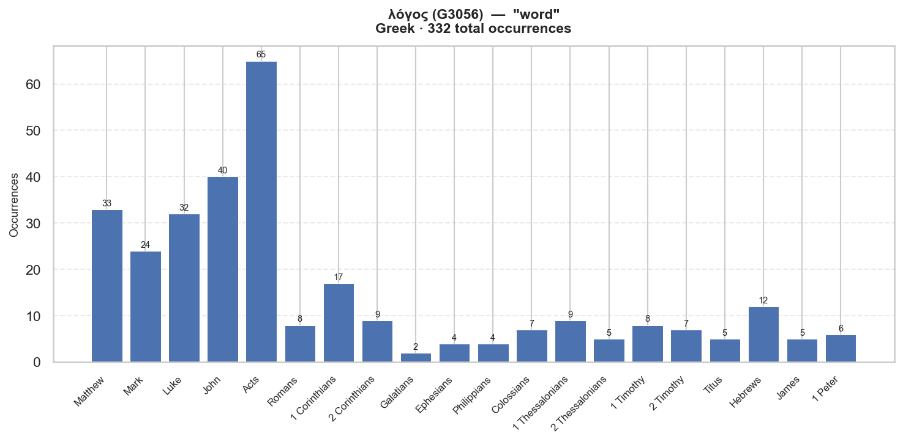

# Semantic Profile: G3056 — λόγος

**Language:** Greek  
**Lemma:** λόγος  
**Transliteration:** logos  
**Gloss:** word  
**POS:** G:N-M  
**Total occurrences:** 332  

## Definition

λόγος, -ου, ὁ (λέγω) [in LXX chiefly for דָּבָר, also for מִלָּה ,אֵמֶר, etc. ;] __I. Of that by which the inward thought is expressed, Lat. oratio, sermo, vox, verbum. __1. a word, not in the grammatical sense of a mere name (ἔπος, ὄνομα, ῥῆμα), but a word as embodying a conception or idea: Mat.8:8, Luk.7:7, 1Co.14:9, 19 Heb.12:19, al. __2. a saying, statement, declaration: Mat.19:22 (T om.), Mrk.5:36 7:29, Luk.1:29, Jhn.2:22 6:60, Act.7:29, al.; with genitive attrib., Act.13:15, Rom.9:9, Heb.7:28, al.; of the sayings, commands, promises, etc., of teachers, Mat.7:24 10:14, Mrk.8:38, Luk.9:4, Jhn.14:24, al.; λ. κενοί, Eph.5:6; ἀληθινοί, Rev.19:9; πιστοί, Rev.22:6; esp. of the precepts, decrees and promises of God, ὁ λ. τ. θεοῦ, the word of God: Mrk.7:13, Jhn.10:35, Rom.13:9, 1Co.14:36, Php.1:14, al.; absol., ὁ λ., Mat.13:21, 22 Mrk.16:[20], Luk.1:2, Act.6:4, Heb.4:12, al. __3. speech, discourse: Act.14:12, 2Co.10:10, Jas.3:2; opposite to ἐπιστολή, 2Th.2:15; disting, from σοφία, 1Co.2:1; ἀναστροφή, 1Ti.4:12; δύναμις, 1Co.4:19, 1Th.1:5; ἔργον, Rom.15:18; οὐδενὸς λ. τίμιον (not worthy of mention), Act.20:24; of the faculty of speech, Luk.24:19, 2Co.11:6; of the style of speech, Mat.5:37, 1Co.1:5; of instruction, Col.4:3, 1Pe.3:1; with genitive of person(s), Jhn.5:24 8:52, Act.2:41, al.; ὁ λ. ὁ ἐμός, Jhn.8:31; with genitive obj. (τ.) ἀληθείας, 2Co.6:7, Col.1:5, Jas.1:18; τ. καταλλαγῆς, 2Co.5:19; τ. σταυροῦ, 1Co.1:18; of mere talk, 1Co.4:19, 2o, Col.2:23, 1Jn.3:18; of the talk which one occasions, hence, repute: Col.2:23. __4. subject-matter, hence, teaching, doctrine: Act.18:15, 2Ti.2:17, al.; esp. of Christian doctrine: Mat.13:20-23, Mrk.4:14-20 8:32, Luk.1:2, Act.8:4, Gal.6:6, 1Th.1:6, al.; with genitive of person(s), τ. θεοῦ, Luk.5:1, Jhn.17:6, Act.4:29, 1Co.14:36, I Jhn.1:10, Rev.6:9, al.; τ. Κυρίου, Act.8:25, 1Th.1:8, al.; τ. Χριστοῦ, Col.3:16, Rev.3:8; with genitive appos., Act.15:7; with genitive attrib., Heb.5:13. __5. a story, tale, narrative: Mat.28:15, Jhn.21:23, Act.1:1 11:22; before περί, Luk.5:15. __6. That which is spoken of (Plat., al.; V. Kennedy, Sources, 124), matter, affair, thing: Mat.21:24, Mrk.1:45 11:29, Luk.20:3, Act.8:21; of a matter in dispute, as a case or suit at law, Act.19:38; pl. (1Ma.7:33, al.), Luk.1:4. __II. Of the inward thought itself, Lat. ratio. __1. reason, __(a) of the mental faculty (Hdt., Plat., al.): κατὰ λόγον, Act.18:14; __(b) a reason, cause: τίνι λόγῳ, Act.10:29; παρεκτὸς λόγου πορνείας, Mat.5:32 19:9, WH, mg., R, mg. __2. account, __(a) regard: Act.20:24, Rec.; __(b) reckoning: Php.4:15, 17; συναίρειν (which see) λ., Mat.18:23 25:19; in forensic sense, Rom.14:12, Heb.13:17, 1Pe.4:5; with genitive of thing(s), Luk.16:2; before περί, Mat.12:36, Act.19:40, 1Pe.3:15. __3. proportion, analogy: Php.2:16 (Field, Notes, 193 f.). __III. ὁ λ., the Divine Word or Logos: Jhn.1:1, 14; τ. ζωῆς, 1Jn.1:1; τ. θεοῦ, Rev.19:13 (see Westc, Swete, CGT, in ll.; reff. in Artt., Logos, DB, DCG). (AS)

## Distribution by Book

| Book | Count | % |
|---|---:|---:|
| Matthew | 33 | 9.9% |
| Mark | 24 | 7.2% |
| Luke | 32 | 9.6% |
| John | 40 | 12.0% |
| Acts | 65 | 19.6% |
| Romans | 8 | 2.4% |
| 1 Corinthians | 17 | 5.1% |
| 2 Corinthians | 9 | 2.7% |
| Galatians | 2 | 0.6% |
| Ephesians | 4 | 1.2% |
| Philippians | 4 | 1.2% |
| Colossians | 7 | 2.1% |
| 1 Thessalonians | 9 | 2.7% |
| 2 Thessalonians | 5 | 1.5% |
| 1 Timothy | 8 | 2.4% |
| 2 Timothy | 7 | 2.1% |
| Titus | 5 | 1.5% |
| Hebrews | 12 | 3.6% |
| James | 5 | 1.5% |
| 1 Peter | 6 | 1.8% |
| 2 Peter | 4 | 1.2% |
| 1 John | 7 | 2.1% |
| 3 John | 1 | 0.3% |
| Revelation | 18 | 5.4% |

## Morphological Forms

| Form | Count | % |
|---|---:|---:|
| Accusative | 153 | 46.1% |
| Nominative | 79 | 23.8% |
| Dative | 60 | 18.1% |
| Genitive | 37 | 11.1% |

## Top Collocates  (window ±5, NT)

| Lemma | Strongs | Gloss | Observed | Expected | PMI | G² |
|---|---|---|---:|---:|---:|---:|
| ὁ | G3588 | the/this/who | 638 | 485.0 | 0.40 | 351.3 |
| ἀκούω | G191 | to hear | 44 | 10.2 | 2.11 | 67.6 |
| τηρέω | G5083 | to keep: observe | 15 | 1.7 | 3.13 | 41.8 |
| οὗτος | G3778 | this/he/she/it | 68 | 33.4 | 1.03 | 32.6 |
| σπείρω | G4687 | to sow | 11 | 1.2 | 3.17 | 31.2 |
| διά | G1223 | through/because of | 40 | 16.0 | 1.32 | 28.1 |
| θεός | G2316 | God | 62 | 31.5 | 0.98 | 27.0 |
| συντέμνω | G4932 | to cut short | 3 | 0.1 | 6.00 | 25.0 |
| ἐν | G1722 | in/on/among | 100 | 66.4 | 0.59 | 19.6 |
| λαλέω | G2980 | to speak | 21 | 7.0 | 1.59 | 19.5 |

## Example Verses

**[Mat 5:32]** _λόγου_  
> But I say unto you, That whosoever shall put away his wife, saving for the cause of fornication, causeth her to commi...

**[Mat 5:37]** _λόγος_  
> But let your communication be, Yea, yea; Nay, nay: for whatsoever is more than these cometh of evil.

**[Mat 7:24]** _λόγους_  
> Therefore whosoever heareth these sayings of mine, and doeth them, I will liken him unto a wise man, which built his ...

**[Mat 7:26]** _λόγους_  
> And every one that heareth these sayings of mine, and doeth them not, shall be likened unto a foolish man, which buil...

**[Mat 7:28]** _λόγους_  
> And it came to pass, when Jesus had ended these sayings, the people were astonished at his doctrine:

---

_Source: STEPBible TAHOT/TAGNT/TALXX (CC BY 4.0, Tyndale House Cambridge). IBM Model 1 word alignment. Collocations scored by log-likelihood (G²)._