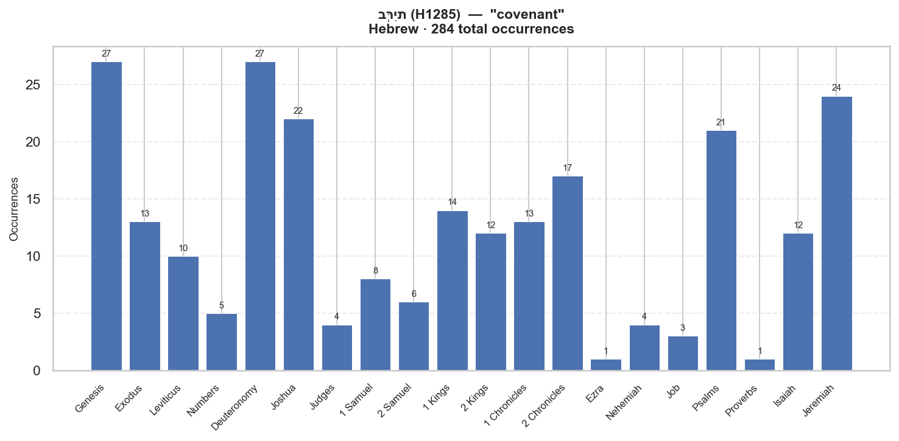

# Semantic Profile: H1285 — בְּרִית

**Language:** Hebrew  
**Lemma:** בְּרִית  
**Transliteration:** be.rit  
**Gloss:** covenant  
**POS:** H:N-F  
**Total occurrences:** 284  

## Definition

1) covenant, alliance, pledge1a) between men1a1) treaty, alliance, league (man to man)1a2) constitution, ordinance (monarch to subjects)1a3) agreement, pledge (man to man)1a4) alliance (of friendship)1a5) alliance (of marriage)1b) between God and man1b1) alliance (of friendship)1b2) covenant (divine ordinance with signs or pledges)2) (phrases)2a) covenant making2b) covenant keeping2c) covenant violation

## Distribution by Book

| Book | Count | % |
|---|---:|---:|
| Genesis | 27 | 9.5% |
| Exodus | 13 | 4.6% |
| Leviticus | 10 | 3.5% |
| Numbers | 5 | 1.8% |
| Deuteronomy | 27 | 9.5% |
| Joshua | 22 | 7.7% |
| Judges | 4 | 1.4% |
| 1 Samuel | 8 | 2.8% |
| 2 Samuel | 6 | 2.1% |
| 1 Kings | 14 | 4.9% |
| 2 Kings | 12 | 4.2% |
| 1 Chronicles | 13 | 4.6% |
| 2 Chronicles | 17 | 6.0% |
| Ezra | 1 | 0.4% |
| Nehemiah | 4 | 1.4% |
| Job | 3 | 1.1% |
| Psalms | 21 | 7.4% |
| Proverbs | 1 | 0.4% |
| Isaiah | 12 | 4.2% |
| Jeremiah | 24 | 8.5% |
| Ezekiel | 18 | 6.3% |
| Daniel | 7 | 2.5% |
| Hosea | 5 | 1.8% |
| Amos | 1 | 0.4% |
| Obadiah | 1 | 0.4% |
| Zechariah | 2 | 0.7% |
| Malachi | 6 | 2.1% |

## Morphological Forms

| Form | Count | % |
|---|---:|---:|
| Noun | 196 | 69.0% |
| Suffix | 82 | 28.9% |

## LXX Translation Equivalents

| Greek Lemma | Strongs | Count | % |
|---|---|---:|---:|
| διαθήκη | G1242 | 198 | 100.0% |

## LXX Translation Consistency

**Overall consistency:** 100%  
**Corpus-wide primary rendering:** διαθήκη (100%)  

| Book | Tokens | Primary Rendering | Consistency | Alt Renderings |
|---|---:|---|---:|---|
| Genesis | 23 | διαθήκη | 100% |  |
| Exodus | 13 | διαθήκη | 100% |  |
| Leviticus | 8 | διαθήκη | 100% |  |
| Numbers | 5 | διαθήκη | 100% |  |
| Deuteronomy | 19 | διαθήκη | 100% |  |
| Joshua | 19 | διαθήκη | 100% |  |
| Judges | 4 | διαθήκη | 100% |  |
| 1 Samuel | 3 | διαθήκη | 100% |  |
| 2 Samuel | 6 | διαθήκη | 100% |  |
| 1 Kings | 7 | διαθήκη | 100% |  |
| 2 Kings | 9 | διαθήκη | 100% |  |
| 1 Chronicles | 13 | διαθήκη | 100% |  |
| 2 Chronicles | 14 | διαθήκη | 100% |  |
| Isaiah | 12 | διαθήκη | 100% |  |
| Jeremiah | 7 | διαθήκη | 100% |  |
| Ezekiel | 15 | διαθήκη | 100% |  |
| Daniel | 5 | διαθήκη | 100% |  |
| Hosea | 3 | διαθήκη | 100% |  |
| Malachi | 6 | διαθήκη | 100% |  |

## OT → LXX → NT Trajectory

**διαθήκη** (G1242) — 33 NT occurrences

| NT Book | Count |
|---|---:|
| Mat | 1 |
| Mrk | 1 |
| Luk | 2 |
| Act | 2 |
| Rom | 2 |
| 1Co | 1 |
| 2Co | 2 |
| Gal | 3 |
| Eph | 1 |
| Heb | 17 |

## Top Collocates  (window ±5, OT)

| Lemma | Strongs | Gloss | Observed | Expected | PMI | G² |
|---|---|---|---:|---:|---:|---:|
| כָּרַת | H3772 | to cut: cut | 84 | 2.7 | 4.97 | 468.3 |
| אֲרוֹן | H727 | ark | 46 | 1.9 | 4.62 | 223.9 |
| אֵת | H854 | with | 69 | 8.6 | 3.00 | 184.5 |
| פּוּר | H6565 | to break | 22 | 0.5 | 5.57 | 139.5 |
| עוֹלָם | H5769 | forever: enduring | 33 | 4.1 | 3.02 | 85.3 |
| אָלָה | H423 | oath | 10 | 0.3 | 4.94 | 52.5 |
| שָׁמַר | H8104 | to keep: obey | 26 | 4.4 | 2.58 | 52.3 |
| זָכַר | H2142 | to remember | 19 | 2.2 | 3.14 | 51.3 |
| אֵת | H853 | [Obj.] | 158 | 101.7 | 0.64 | 46.4 |
|  | H430 |  | 57 | 24.2 | 1.24 | 36.9 |

## Example Verses

**[Gen 6:18]** _בְּרִיתִ֖/י_  
> But with thee will I establish my covenant; and thou shalt come into the ark, thou, and thy sons, and thy wife, and t...

**[Gen 9:9]** _בְּרִיתִ֖/י_  
> And I, behold, I establish my covenant with you, and with your seed after you;

**[Gen 9:11]** _בְּרִיתִ/י֙_  
> And I will establish my covenant with you; neither shall all flesh be cut off any more by the waters of a flood; neit...

**[Gen 9:12]** _הַ/בְּרִית֙_  
> And God said, This is the token of the covenant which I make between me and you and every living creature that is wit...

**[Gen 9:13]** _בְּרִ֔ית_  
> I do set my bow in the cloud, and it shall be for a token of a covenant between me and the earth.

---

_Source: STEPBible TAHOT/TAGNT/TALXX (CC BY 4.0, Tyndale House Cambridge). IBM Model 1 word alignment. Collocations scored by log-likelihood (G²)._