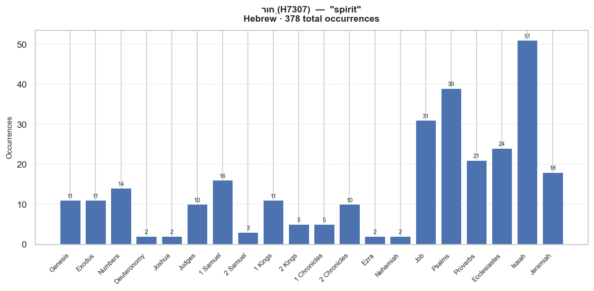

# Semantic Profile: H7307 — רוּחַ

**Language:** Hebrew  
**Lemma:** רוּחַ  
**Transliteration:** ru.ach  
**Gloss:** spirit  
**POS:** H:N-F  
**Total occurrences:** 378  

## Definition

: spirit1) wind, breath, mind, spirit1a) breath1b) wind1b1) of heaven1b2) quarter (of wind), side1b3) breath of air1b4) air, gas1b5) vain, empty thing1c) spirit (as that which breathes quickly in animation or agitation)1c1) spirit, animation, vivacity, vigour1c2) courage1c3) temper, anger1c4) impatience, patience1c5) spirit, disposition (as troubled, bitter, discontented)1c6) disposition (of various kinds), unaccountable or uncontrollable impulse1c7) prophetic spirit1d) spirit (of the living, breathing being in man and animals)1d1) as gift, preserved by God, God's spirit, departing at death, disembodied being1e) spirit (as seat of emotion)1e1) desire1e2) sorrow, trouble1f) spirit1f1) as seat or organ of mental acts1f2) rarely of the will1f3) as seat especially of moral character1g) Spirit of God, the third person of the triune God, the Holy Spirit, coequal, coeternal with the Father and the Son1g1) as inspiring ecstatic state of prophecy1g2) as impelling prophet to utter instruction or warning1g3) imparting warlike energy and executive and administrative power1g4) as endowing men with various gifts1g5) as energy of life1g6) as manifest in the Shekinah glory1g7) never referred to as a depersonalised force

## Distribution by Book

| Book | Count | % |
|---|---:|---:|
| Genesis | 11 | 2.9% |
| Exodus | 11 | 2.9% |
| Numbers | 14 | 3.7% |
| Deuteronomy | 2 | 0.5% |
| Joshua | 2 | 0.5% |
| Judges | 10 | 2.6% |
| 1 Samuel | 16 | 4.2% |
| 2 Samuel | 3 | 0.8% |
| 1 Kings | 11 | 2.9% |
| 2 Kings | 5 | 1.3% |
| 1 Chronicles | 5 | 1.3% |
| 2 Chronicles | 10 | 2.6% |
| Ezra | 2 | 0.5% |
| Nehemiah | 2 | 0.5% |
| Job | 31 | 8.2% |
| Psalms | 39 | 10.3% |
| Proverbs | 21 | 5.6% |
| Ecclesiastes | 24 | 6.3% |
| Isaiah | 51 | 13.5% |
| Jeremiah | 18 | 4.8% |
| Lamentations | 1 | 0.3% |
| Ezekiel | 52 | 13.8% |
| Daniel | 4 | 1.1% |
| Hosea | 7 | 1.9% |
| Joel | 2 | 0.5% |
| Amos | 1 | 0.3% |
| Jonah | 2 | 0.5% |
| Micah | 3 | 0.8% |
| Habakkuk | 2 | 0.5% |
| Haggai | 4 | 1.1% |
| Zechariah | 9 | 2.4% |
| Malachi | 3 | 0.8% |

## Morphological Forms

| Form | Count | % |
|---|---:|---:|
| Noun | 294 | 77.8% |
| Suffix | 68 | 18.0% |

## LXX Translation Equivalents

| Greek Lemma | Strongs | Count | % |
|---|---|---:|---:|
| πνεῦμα | G4151 | 194 | 87.0% |
| ἄνεμος | G417 | 29 | 13.0% |

## LXX Translation Consistency

**Overall consistency:** 88%  
**Corpus-wide primary rendering:** πνεῦμα (87%)  
**Divergent books:** Pro, Jer, Dan  

| Book | Tokens | Primary Rendering | Consistency | Alt Renderings |
|---|---:|---|---:|---|
| Genesis | 7 | πνεῦμα | 100% |  |
| Exodus | 8 | πνεῦμα | 62% | ἄνεμος×3 |
| Numbers | 12 | πνεῦμα | 100% |  |
| Judges | 9 | πνεῦμα | 100% |  |
| 1 Samuel | 12 | πνεῦμα | 100% |  |
| 2 Samuel | 3 | πνεῦμα | 67% | ἄνεμος×1 |
| 1 Kings | 7 | πνεῦμα | 100% |  |
| 2 Kings | 5 | πνεῦμα | 100% |  |
| 2 Chronicles | 8 | πνεῦμα | 100% |  |
| Job | 20 | πνεῦμα | 85% | ἄνεμος×3 |
| Proverbs | 3 | ἄνεμος | 67% ← | πνεῦμα×1 |
| Ecclesiastes | 17 | πνεῦμα | 94% | ἄνεμος×1 |
| Isaiah | 35 | πνεῦμα | 91% | ἄνεμος×3 |
| Jeremiah | 8 | ἄνεμος | 62% ← | πνεῦμα×3 |
| Ezekiel | 34 | πνεῦμα | 82% | ἄνεμος×6 |
| Daniel | 3 | ἄνεμος | 67% ← | πνεῦμα×1 |
| Hosea | 4 | πνεῦμα | 75% | ἄνεμος×1 |
| Zechariah | 7 | πνεῦμα | 86% | ἄνεμος×1 |

## OT → LXX → NT Trajectory

**πνεῦμα** (G4151) — 385 NT occurrences

| NT Book | Count |
|---|---:|
| Mat | 19 |
| Mrk | 23 |
| Luk | 38 |
| Jhn | 24 |
| Act | 70 |
| Rom | 35 |
| 1Co | 41 |
| 2Co | 16 |
| Gal | 18 |
| Eph | 14 |

**ἄνεμος** (G417) — 221 NT occurrences

| NT Book | Count |
|---|---:|
| Mat | 31 |
| Mrk | 13 |
| Luk | 44 |
| Jhn | 9 |
| Act | 49 |
| Rom | 2 |
| 1Co | 1 |
| 2Co | 7 |
| Eph | 1 |
| Php | 3 |

## Top Collocates  (window ±5, OT)

| Lemma | Strongs | Gloss | Observed | Expected | PMI | G² |
|---|---|---|---:|---:|---:|---:|
| קָדִים | H6921 | east | 16 | 0.8 | 4.23 | 67.8 |
| רְעוּת | H7469 | longing | 7 | 0.1 | 6.34 | 61.6 |
| נִשְׁמָא | H5397 | breath | 10 | 0.3 | 5.07 | 55.9 |
| קָנֶה | H7070 | branch | 13 | 0.8 | 4.08 | 52.2 |
| נָבָא | H5012 | to prophesy | 15 | 1.4 | 3.40 | 45.7 |
| בֵּן | H1121 | son: child | 19 | 61.1 | -1.69 | 45.6 |
| זָרָה | H2219 | to scatter | 10 | 0.5 | 4.37 | 44.4 |
| פָּעַם | H6470 | to trouble | 5 | 0.1 | 6.34 | 44.0 |
| סַ֫עַר | H5591 | tempest | 8 | 0.3 | 4.75 | 40.3 |
| הֶ֫בֶל | H1892 | vanity | 11 | 0.9 | 3.61 | 36.6 |

## Example Verses

**[Gen 1:2]** _וְ/ר֣וּחַ_  
> And the earth was without form and void; and darkness was upon the face of the deep. And the Spirit of God moved upon...

**[Gen 3:8]** _לְ/ר֣וּחַ_  
> And they heard the voice of the Lord God walking in the garden in the cool of the day: and Adam and his wife hid them...

**[Gen 6:3]** _רוּחִ֤/י_  
> And the Lord said, My spirit shall not always strive with man, for that he also is flesh: yet his days shall be an hu...

**[Gen 6:17]** _ר֣וּחַ_  
> And, behold, I, even I, do bring a flood of waters upon the earth, to destroy all flesh, wherein is the breath of lif...

**[Gen 7:15]** _ר֥וּחַ_  
> And they went in unto Noah into the ark, two and two of all flesh, wherein is the breath of life.

---

_Source: STEPBible TAHOT/TAGNT/TALXX (CC BY 4.0, Tyndale House Cambridge). IBM Model 1 word alignment. Collocations scored by log-likelihood (G²)._