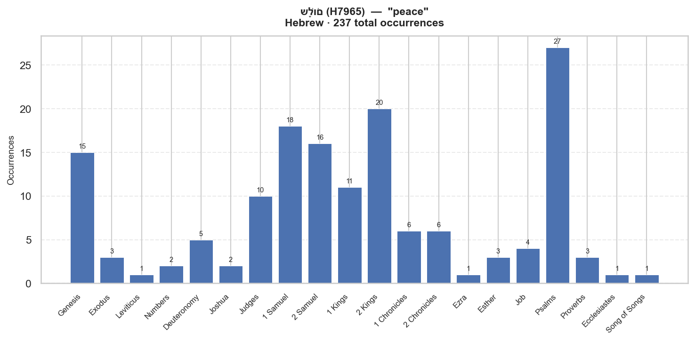

# Semantic Profile: H7965 — שָׁלוֹם

**Language:** Hebrew  
**Lemma:** שָׁלוֹם  
**Transliteration:** sha.lom  
**Gloss:** peace  
**POS:** H:N-M  
**Total occurrences:** 237  

## Definition

: peace1) completeness, soundness, welfare, peace1a) completeness (in number)1b) safety, soundness (in body)1c) welfare, health, prosperity1d) peace, quiet, tranquillity, contentment1e) peace, friendship1e1) of human relationships1e2) with God especially in covenant relationship1f) peace (from war)1g) peace (as adjective)

## Distribution by Book

| Book | Count | % |
|---|---:|---:|
| Genesis | 15 | 6.3% |
| Exodus | 3 | 1.3% |
| Leviticus | 1 | 0.4% |
| Numbers | 2 | 0.8% |
| Deuteronomy | 5 | 2.1% |
| Joshua | 2 | 0.8% |
| Judges | 10 | 4.2% |
| 1 Samuel | 18 | 7.6% |
| 2 Samuel | 16 | 6.8% |
| 1 Kings | 11 | 4.6% |
| 2 Kings | 20 | 8.4% |
| 1 Chronicles | 6 | 2.5% |
| 2 Chronicles | 6 | 2.5% |
| Ezra | 1 | 0.4% |
| Esther | 3 | 1.3% |
| Job | 4 | 1.7% |
| Psalms | 27 | 11.4% |
| Proverbs | 3 | 1.3% |
| Ecclesiastes | 1 | 0.4% |
| Song of Songs | 1 | 0.4% |
| Isaiah | 29 | 12.2% |
| Jeremiah | 31 | 13.1% |
| Lamentations | 1 | 0.4% |
| Ezekiel | 7 | 3.0% |
| Daniel | 1 | 0.4% |
| Obadiah | 1 | 0.4% |
| Micah | 2 | 0.8% |
| Haggai | 1 | 0.4% |
| Zechariah | 6 | 2.5% |
| Malachi | 2 | 0.8% |
| Nam | 1 | 0.4% |

## Morphological Forms

| Form | Count | % |
|---|---:|---:|
| Noun | 210 | 88.6% |
| Suffix | 10 | 4.2% |

## LXX Translation Equivalents

| Greek Lemma | Strongs | Count | % |
|---|---|---:|---:|
| εἰρήνη | G1515 | 116 | 100.0% |

## LXX Translation Consistency

**Overall consistency:** 100%  
**Corpus-wide primary rendering:** εἰρήνη (100%)  

| Book | Tokens | Primary Rendering | Consistency | Alt Renderings |
|---|---:|---|---:|---|
| Judges | 9 | εἰρήνη | 100% |  |
| 1 Samuel | 10 | εἰρήνη | 100% |  |
| 2 Samuel | 10 | εἰρήνη | 100% |  |
| 1 Kings | 7 | εἰρήνη | 100% |  |
| 2 Kings | 12 | εἰρήνη | 100% |  |
| 1 Chronicles | 3 | εἰρήνη | 100% |  |
| 2 Chronicles | 6 | εἰρήνη | 100% |  |
| Proverbs | 3 | εἰρήνη | 100% |  |
| Isaiah | 20 | εἰρήνη | 100% |  |
| Jeremiah | 10 | εἰρήνη | 100% |  |
| Ezekiel | 5 | εἰρήνη | 100% |  |
| Zechariah | 4 | εἰρήνη | 100% |  |

## OT → LXX → NT Trajectory

**εἰρήνη** (G1515) — 92 NT occurrences

| NT Book | Count |
|---|---:|
| Mat | 4 |
| Mrk | 1 |
| Luk | 14 |
| Jhn | 6 |
| Act | 7 |
| Rom | 11 |
| 1Co | 4 |
| 2Co | 2 |
| Gal | 3 |
| Eph | 8 |

## Top Collocates  (window ±5, OT)

| Lemma | Strongs | Gloss | Observed | Expected | PMI | G² |
|---|---|---|---:|---:|---:|---:|
| אָמַר | H559 | to say | 116 | 41.2 | 1.49 | 124.9 |
| אֵת | H853 | [Obj.] | 33 | 84.9 | -1.36 | 57.6 |
| אַ֫יִן | H369 | nothing | 31 | 6.1 | 2.34 | 54.4 |
| שָׁאַל | H7592 | to ask | 16 | 1.3 | 3.59 | 52.6 |
| יֵהוּא | H3058 | Jehu | 9 | 0.5 | 4.32 | 38.5 |
| קָרָא | H7122 | to encounter: meet | 11 | 1.1 | 3.35 | 32.4 |
| אֱמֶת | H571 | truth: faithful | 10 | 1.0 | 3.34 | 29.3 |
| לַ֫חַץ | H3906 | oppression | 4 | 0.1 | 5.43 | 23.8 |
| שׁוּב | H7725 | to return: return | 24 | 8.2 | 1.55 | 21.3 |
| מַרְפֵּא | H4832 | healing | 4 | 0.1 | 5.01 | 21.1 |

## Example Verses

**[Gen 15:15]** _בְּ/שָׁל֑וֹם_  
> And thou shalt go to thy fathers in peace; thou shalt be buried in a good old age.

**[Gen 26:29]** _בְּ/שָׁל֑וֹם_  
> That thou wilt do us no hurt, as we have not touched thee, and as we have done unto thee nothing but good, and have s...

**[Gen 26:31]** _בְּ/שָׁלֽוֹם\׃_  
> And they rose up betimes in the morning, and sware one to another: and Isaac sent them away, and they departed from h...

**[Gen 28:21]** _בְ/שָׁל֖וֹם_  
> So that I come again to my father’s house in peace; then shall the Lord be my God:

**[Gen 29:6]** _הֲ/שָׁל֣וֹם_  
> And he said unto them, Is he well? And they said, He is well: and, behold, Rachel his daughter cometh with the sheep.

---

_Source: STEPBible TAHOT/TAGNT/TALXX (CC BY 4.0, Tyndale House Cambridge). IBM Model 1 word alignment. Collocations scored by log-likelihood (G²)._