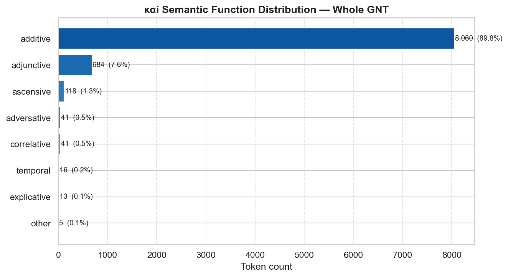
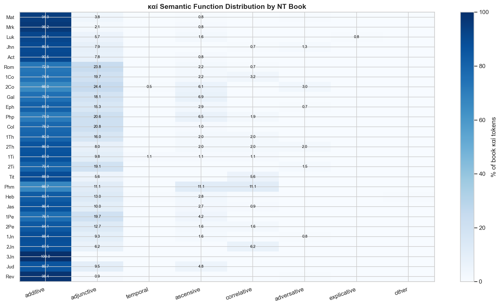

# καί Semantic Function Analysis

*Build script: [scripts/nt/discourse/build_kai_report.py](../../../../scripts/nt/discourse/build_kai_report.py)*

## Contents

1. [Overview](#overview)
2. [GNT-Wide Function Profile](#gnt-wide-function-profile)
3. [Key Observations](#key-observations)
4. [Function Definitions](#function-definitions)
5. [Per-Book Distribution](#per-book-distribution)
6. [Notable Instances](#notable-instances)
7. [Downloads](#downloads)

---

## Overview

καί (G2532) is the single most frequent word in the GNT with **8,978 tokens**. Although its default translation is "and" (additive coordination), it serves a range of semantic functions that carry significant exegetical weight — particularly the **ascensive** ("even") and **adjunctive** ("also") uses, which are often obscured by flat translation.

Classification uses the per-token translator gloss from the MACULA Greek syntax layer (Nestle 1904), which captures contextual usage at the word level.

---

## GNT-Wide Function Profile

| Function | Count | % | Description |
|---|---:|---:|---|
| **additive** | 8,060 | 89.8% | additive — coordinates clauses, phrases, or words (most common) |
| **adjunctive** | 684 | 7.6% | adjunctive — "also"; adds a parallel or supplementary element |
| **ascensive** | 118 | 1.3% | ascensive — "even / indeed"; intensifies or raises the rhetorical register |
| **correlative** | 41 | 0.5% | correlative — "both … and"; pairs two elements symmetrically |
| **adversative** | 41 | 0.5% | adversative — "but / yet / although"; marks contrast or concession |
| **temporal** | 16 | 0.2% | temporal — "then"; indicates sequence in narrative |
| **explicative** | 13 | 0.1% | explicative — "that"; introduces a content clause |
| **other** | 5 | 0.1% | other — miscellaneous / context-dependent uses |

---

## Key Observations

- **Additive dominates** (89.8% of all καί tokens) — plain coordination is the overwhelmingly default use.

- **Adjunctive καί** ("also") is the second-most-common function at 7.6%. It is a hallmark of Pauline argumentation: Rom (23.8%), Gal (18.1%), Eph (15.3%).

- **Ascensive καί** ("even / indeed") appears 118 times GNT-wide. It is rare but exegetically significant — missing it in translation flattens the rhetorical force of the clause.

- Books with the **highest adjunctive %**: 2Co (24.4%), Rom (23.8%), Col (20.8%), Php (20.6%), 1Pe (19.7%).

- Books with the **highest ascensive %**: Phm (11.1%), Gal (6.9%), Php (6.5%), 2Co (6.1%), Jud (4.8%).

---

## Function Definitions

| Function | Gloss signals | Linguistic description |
|---|---|---|
| **additive** | "and" | additive — coordinates clauses, phrases, or words (most common) |
| **adjunctive** | "also", "and also" | adjunctive — "also"; adds a parallel or supplementary element |
| **temporal** | "then", "and then" | temporal — "then"; indicates sequence in narrative |
| **ascensive** | "even", "indeed", "truly" | ascensive — "even / indeed"; intensifies or raises the rhetorical register |
| **correlative** | "both" | correlative — "both … and"; pairs two elements symmetrically |
| **adversative** | "but", "yet", "although", "however" | adversative — "but / yet / although"; marks contrast or concession |
| **explicative** | "that" | explicative — "that"; introduces a content clause |
| **other** | misc. | other — miscellaneous / context-dependent uses |

---

## Per-Book Distribution

### Focus Books — Function % Breakdown

| Book | additive | adjunctive | temporal | ascensive | correlative | adversative | explicative | other |
|---|---|---|---|---|---|---|---|---|
| Mat | 94.9% | 3.8% | 0.0% | 0.8% | 0.1% | 0.4% | 0.1% | 0.0% |
| Mrk | 96.2% | 2.1% | 0.2% | 0.8% | 0.2% | 0.3% | 0.1% | 0.1% |
| Luk | 91.1% | 5.7% | 0.3% | 1.6% | 0.2% | 0.2% | 0.8% | 0.1% |
| Jhn | 89.5% | 7.9% | 0.2% | 0.2% | 0.7% | 1.3% | 0.0% | 0.0% |
| Act | 90.5% | 7.8% | 0.3% | 0.8% | 0.4% | 0.3% | 0.0% | 0.0% |
| Rom | 72.9% | 23.8% | 0.0% | 2.2% | 0.7% | 0.0% | 0.0% | 0.4% |
| Gal | 75.0% | 18.1% | 0.0% | 6.9% | 0.0% | 0.0% | 0.0% | 0.0% |
| Eph | 81.0% | 15.3% | 0.0% | 2.9% | 0.0% | 0.7% | 0.0% | 0.0% |
| Heb | 83.1% | 13.0% | 0.4% | 2.8% | 0.4% | 0.0% | 0.0% | 0.4% |
| Rev | 98.4% | 0.9% | 0.1% | 0.2% | 0.0% | 0.4% | 0.0% | 0.0% |

---

## Notable Instances

### Ascensive καί in Romans

| Reference | Prev word | καί | Next word | Gloss |
|---|---|---|---|---|
| Rom 1:13 | καθὼς | καὶ | ἐν | even |
| Rom 5:7 | τις | καὶ | τολμᾷ | even |
| Rom 5:14 | Μωϋσέως | καὶ | ἐπὶ | even |
| Rom 8:23 | ἀλλὰ | καὶ | αὐτοὶ | even |
| Rom 9:24 | οὓς | καὶ | ἐκάλεσεν | even |
| Rom 15:3 |  | καὶ | γὰρ | Even |

### Adversative καί in John

| Reference | Prev word | καί | Next word | Gloss |
|---|---|---|---|---|
| Jhn 1:20 | ἠρνήσατο | καὶ | ὡμολόγησεν | but |
| Jhn 6:36 | με | καὶ | οὐ | and yet |
| Jhn 7:30 | πιάσαι | καὶ | οὐδεὶς | but |
| Jhn 9:30 | ἐστίν | καὶ | ἤνοιξέν | and yet |
| Jhn 10:12 | μισθωτὸς | καὶ | οὐκ | however |
| Jhn 10:39 | πιάσαι | καὶ | ἐξῆλθεν | but |
| Jhn 16:32 | ἀφῆτε | καὶ | οὐκ | yet |
| Jhn 17:11 | κόσμῳ | καὶ | αὐτοὶ | and yet |
| Jhn 17:25 | δίκαιε | καὶ | ὁ | although |
| Jhn 20:29 | ἰδόντες | καὶ | πιστεύσαντες | yet |
| Jhn 21:11 | τριῶν | καὶ | τοσούτων | although |

---

## Downloads

| File | Description |
|---|---|
| [kai-gnt-profile.csv](kai-gnt-profile.csv) | GNT-wide function counts and percentages |
| [kai-by-book.csv](kai-by-book.csv) | Function counts per NT book |
