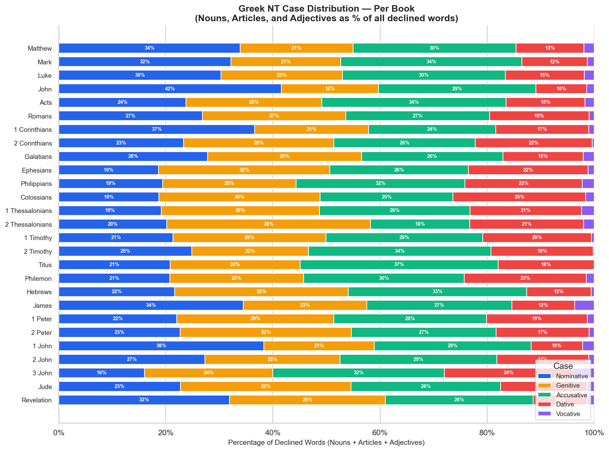

# Greek NT Case Distribution by Book

Case distribution for declined words (Nouns, Articles, Adjectives) in each NT book,
shown as a percentage of all declined words in that book.

**Cases included:** Nominative, Genitive, Accusative, Dative, Vocative.  
**Words counted:** Nouns, Articles, and Adjectives only — the three POS with fully
declined forms in TAGNT. Pronouns are excluded as their case coding uses a different
scheme in the source data.

---

## Chart



---

## Data Table

| Book | Nominative | Genitive | Accusative | Dative | Vocative | Declined Words |
|------|------------|----------|------------|--------|----------|----------------|
| Matthew | 33.9% | 21.1% | 30.5% | 12.7% | 1.9% | 7,700 |
| Mark | 32.1% | 20.5% | 33.8% | 12.2% | 1.3% | 4,358 |
| Luke | 30.3% | 22.7% | 30.5% | 14.7% | 1.8% | 7,623 |
| John | 41.6% | 18.1% | 29.4% | 9.5% | 1.4% | 5,678 |
| Acts | 23.8% | 25.4% | 34.4% | 14.8% | 1.7% | 8,117 |
| Romans | 26.8% | 26.8% | 26.8% | 18.6% | 1.0% | 3,242 |
| 1 Corinthians | 36.6% | 21.3% | 23.8% | 17.4% | 1.0% | 2,893 |
| 2 Corinthians | 23.3% | 28.1% | 26.4% | 21.9% | 0.4% | 1,691 |
| Galatians | 27.8% | 28.8% | 26.4% | 15.0% | 2.0% | 939 |
| Ephesians | 18.6% | 32.0% | 25.8% | 22.4% | 1.1% | 1,250 |
| Philippians | 19.4% | 24.9% | 31.6% | 21.9% | 2.2% | 675 |
| Colossians | 18.7% | 30.1% | 24.8% | 24.8% | 1.6% | 770 |
| 1 Thessalonians | 19.2% | 29.5% | 28.2% | 20.8% | 2.3% | 600 |
| 2 Thessalonians | 20.2% | 38.1% | 18.5% | 21.3% | 2.0% | 357 |
| 1 Timothy | 21.3% | 28.5% | 29.3% | 20.3% | 0.5% | 792 |
| 2 Timothy | 24.8% | 21.8% | 34.1% | 19.1% | 0.2% | 592 |
| Titus | 20.8% | 24.3% | 37.0% | 17.9% | 0.0% | 346 |
| Philemon | 20.7% | 25.0% | 30.0% | 22.9% | 1.4% | 140 |
| Hebrews | 21.6% | 32.4% | 33.4% | 12.0% | 0.6% | 2,278 |
| James | 34.5% | 23.1% | 27.1% | 11.7% | 3.6% | 775 |
| 1 Peter | 22.0% | 29.4% | 28.5% | 18.9% | 1.2% | 800 |
| 2 Peter | 22.7% | 32.0% | 27.0% | 17.3% | 1.0% | 525 |
| 1 John | 38.3% | 20.7% | 29.3% | 9.6% | 2.2% | 875 |
| 2 John | 27.3% | 25.3% | 29.3% | 17.2% | 1.0% | 99 |
| 3 John | 16.0% | 24.0% | 32.0% | 24.0% | 4.0% | 75 |
| Jude | 22.7% | 31.9% | 27.9% | 16.2% | 1.3% | 229 |
| Revelation | 31.9% | 29.1% | 27.6% | 10.0% | 1.3% | 5,191 |

---

## Observations

- **John and 1 John have the highest nominative rates** (41.6% and 38.3%) — consistent with their direct declarative style. Subject-predicate constructions ("I am the light," "God is love") favor the nominative.
- **Acts has the lowest nominative rate (23.8%) and highest accusative rate (34.4%)** — Acts is the most action-packed NT book, with verbs taking direct objects (accusative) driving the narrative.
- **The Pauline epistles shift heavily toward genitive**, especially 2 Thessalonians (38.1%), Ephesians (32.0%), Colossians (30.1%), and Hebrews (32.4%). Paul's theological argumentation frequently uses genitive chains ("the righteousness of God," "the body of Christ," "the spirit of wisdom").
- **The dative is highest in the Prison Epistles**: Ephesians (22.4%), Colossians (24.8%), Philemon (22.9%). This reflects dative of reference/advantage constructions common in ethical/community instruction.
- **Romans has a uniquely even distribution** (26.8% / 26.8% / 26.8% across Nom/Gen/Acc) — a signature of its carefully balanced dialectical argument.
- **2 Thessalonians has the highest genitive rate** (38.1%) for its length — a small letter with a dense concentration of genitive phrases in its eschatological discourse.
- **James has the highest vocative rate** (3.6%), reflecting its sermon-like address to "brothers" (ἀδελφοί, vocative) throughout.

---

## Usage

```python
from bible_grammar import query

# All genitive nouns in Ephesians
query(book='Eph', part_of_speech='Noun', case_='Genitive')

# Dative plural nouns in Paul
query(book_group='pauline', part_of_speech='Noun', case_='Dative', number='Plural')

# Vocative nouns in the NT
query(testament='NT', part_of_speech='Noun', case_='Vocative')
```

---

*Source: STEPBible TAGNT (CC BY). Includes Nouns, Articles, and Adjectives only.*  
*Chart: `output/charts/nt-case-distribution-by-book.png`.*
