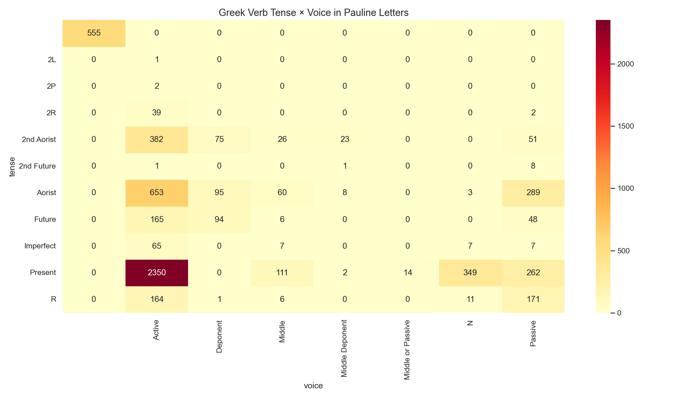

# Greek Verb Tense × Voice in Pauline Letters

**Source:** STEPBible TAGNT  
**Scope:** All verb tokens in the 13 Pauline epistles  
(Romans, 1–2 Corinthians, Galatians, Ephesians, Philippians, Colossians,
1–2 Thessalonians, 1–2 Timothy, Titus, Philemon)

## Summary

The heatmap shows Paul's verb tense/voice usage. Paul's letters are primarily
argumentative prose (as opposed to narrative), which shapes his verb profile.

## Key Observations

- **Present Active** dominates — Paul makes present-tense statements and commands
  throughout his letters.
- **Aorist Active** is the second highest — used for completed past actions and
  aorist imperatives (commands).
- **Aorist Passive** is significant — Paul frequently uses the passive to describe
  what God has done to/for believers ("justified", "reconciled", "raised").
- Paul uses **Perfect Active** more than the NT average, consistent with his
  theological emphasis on the ongoing effects of past events (e.g., "I have learned",
  "Christ has been raised").

*Generated by `notebooks/02_query_demo.ipynb`*
