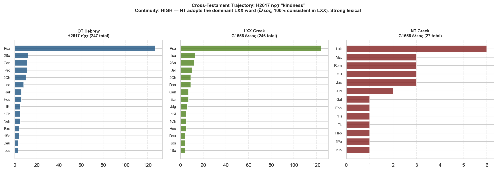

# Cross-Testament Trajectory: H2617 חֶ֫סֶד "kindness"

> **חֶ֫סֶד** (che.sed) — goodness, kindness, faithfulness

| Corpus | Strong's | Lemma | Total |
|---|---|---|---:|
| OT Hebrew | H2617 | חֶ֫סֶד | 247 |
| LXX Greek | G1656 | ἔλεος | 246 |
| NT Greek  | G1656 | ἔλεος | 27 |

## Continuity Assessment: HIGH 🟢

NT adopts the dominant LXX word (ἔλεος, 100% consistent in LXX). Strong lexical continuity.

## OT Hebrew Distribution

| Book | Count |
|---|---:|
| Psa | 127 |
| 2Sa | 12 |
| Gen | 11 |
| Pro | 11 |
| 2Ch | 10 |
| Isa | 8 |
| Jer | 6 |
| Hos | 6 |
| 1Ki | 5 |
| 1Ch | 5 |
| Neh | 5 |
| Exo | 4 |
| 1Sa | 4 |
| Deu | 3 |
| Jos | 3 |

### Morphological Forms

| stem | conjugation | part_of_speech | state | count | pct |
|---|---|---|---|---|---|
|  |  | Suffix |  | 132 | 53.4 |
|  |  | Noun | Absolute | 99 | 40.1 |
|  |  | Noun | Construct | 16 | 6.5 |

## OT → LXX Alignment

The LXX renders **חֶ֫סֶד** as follows (consistency: 100%):

| LXX Strong's | LXX Lemma | Count | Pct |
|---|---|---:|---:|
| G1656 | ἔλεος | 114 | 80.3% |
| G1656 | ἐλέους | 16 | 11.3% |
| G1656 | ἐλέει | 12 | 8.5% |

## LXX Distribution

| Book | Count |
|---|---:|
| Psa | 124 |
| Isa | 13 |
| 2Sa | 12 |
| Jer | 10 |
| 2Ch | 9 |
| Dan | 9 |
| Gen | 7 |
| Ezr | 7 |
| Jdg | 6 |
| 1Ki | 5 |
| 1Ch | 5 |
| Hos | 5 |
| Deu | 4 |
| Jos | 4 |
| 1Sa | 4 |

## NT Distribution

| Book | Count |
|---|---:|
| Luk | 6 |
| Mat | 3 |
| Rom | 3 |
| 2Ti | 3 |
| Jas | 3 |
| Jud | 2 |
| Gal | 1 |
| Eph | 1 |
| 1Ti | 1 |
| Tit | 1 |
| Heb | 1 |
| 1Pe | 1 |
| 2Jn | 1 |

---

_Sources: TAHOT (STEPBible, CC BY 4.0), MACULA Hebrew WLC (Clear Bible, CC BY 4.0), CenterBLC LXX Rahlfs 1935, TAGNT (STEPBible, CC BY 4.0). Hebrew→LXX alignment via MACULA Hebrew inline greek/greekstrong columns._