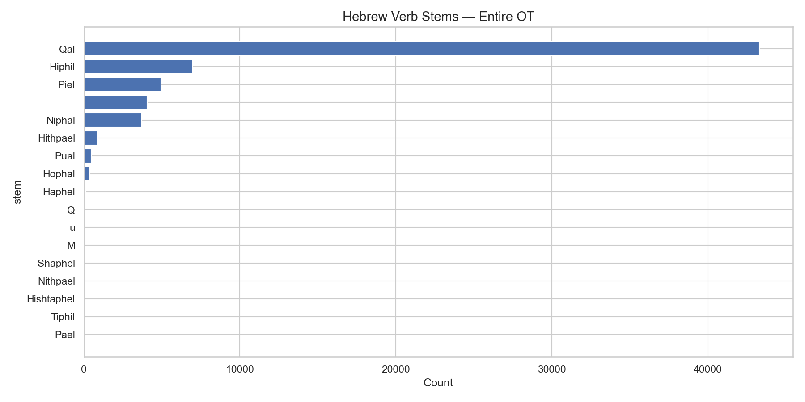

# Hebrew Verb Stems — Entire Old Testament

**Source:** STEPBible TAHOT (Translators Amalgamated Hebrew OT)  
**Scope:** All verb tokens across the entire Hebrew/Aramaic Old Testament

## Summary

The chart shows the distribution of all Hebrew verbal stems across the Old Testament.
Qal overwhelmingly dominates as the simple active stem, followed by Hiphil (causative)
and Piel (intensive/factitive). The derived passive stems (Niphal, Hophal, Pual) together
account for a significant minority.

## Key Numbers

| Stem | Description |
|---|---|
| **Qal** | Simple active — the basic, most common stem |
| **Hiphil** | Causative active — "cause to do" |
| **Piel** | Intensive / factitive — "do thoroughly" or "declare to be" |
| **Niphal** | Simple passive/reflexive |
| **Hithpael** | Reflexive/reciprocal of Piel |
| **Hophal** | Causative passive — passive of Hiphil |
| **Pual** | Intensive passive — passive of Piel |

*Generated by `notebooks/03_statistics.ipynb`*
