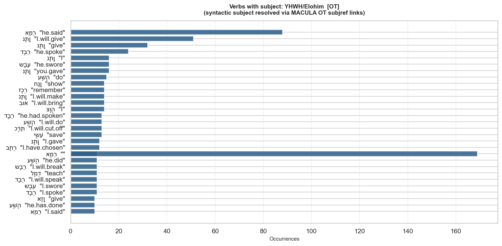
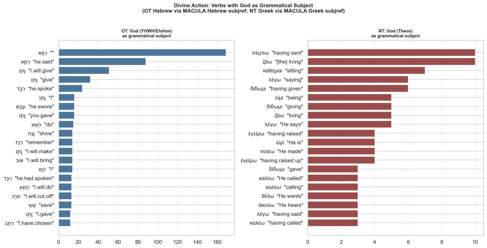

# Syntactic Role Analysis: YHWH/Elohim [OT]

Verbs whose grammatical subject is **YHWH/Elohim**, resolved via MACULA Hebrew `subjref` links.

> **Method:** Each verb token in the MACULA syntax tree carries a `subjref` attribute pointing to its grammatical subject. This analysis finds all verb tokens where that subject resolves to the given Strong's number(s).

## Top Verbs by Frequency

| Lemma | Gloss | Stem | LXX Greek | LXX Strong | Count |
|---|---|---|---|---|---:|
| אָמַר |  | qal | λέγων | G3004 | 169 |
| אָמַר | he.said | qal | εἶπεν | G2036 | 88 |
| נָתַן | I.will.give | qal | δώσω | G1325 | 51 |
| נָתַן | give | qal | δοῦναι | G1325 | 32 |
| דָבַר | he.spoke | piel | ἐλάλησεν | G2980 | 24 |
| נָתַן | I | qal | δώσω | G1325 | 16 |
| שָׁבַע | he.swore | niphal | ὤμοσεν | G3660 | 16 |
| נָתַן | you.gave | qal | ἔδωκας | G1325 | 16 |
| עָשָׂה | do | qal | ποιῆσαι | G4160 | 15 |
| חָנַן | show | qal | ἐλέησόν | G1653 | 14 |
| זָכַר | remember | qal | μνήσθητι | G3415 | 14 |
| נָתַן | I.will.make | qal | δώσω | G1325 | 14 |
| בּוֹא | I.will.bring | hiphil | ἐπάχω | G1863 | 14 |
| צָוָה | I | piel | ἐνετειλάμην | G1781 | 14 |
| דָבַר | he.had.spoken | piel | ἐλάλησεν | G2980 | 13 |
| עָשָׂה | I.will.do | qal | ποιήσω | G4160 | 13 |
| כָּרַת | I.will.cut.off | hiphil | ἐχολεθρεύσω | G1842 | 13 |
| יָשַׁע | save | hiphil | σῶσόν | G4982 | 13 |
| נָתַן | I.gave | qal | ἔδωκα | G1325 | 12 |
| בָּחַר | I.have.chosen | qal | ἐχελεχάμην | G1586 | 12 |
| אָמַר |  | qal |  |  | 11 |
| עָשָׂה | he.did | qal | ἐποίησεν | G4160 | 11 |
| שָׁבַר | I.will.break | qal | συντρίψω | G4937 | 11 |
| לָמַד | teach | piel | δίδαχόν | G1321 | 11 |
| דָבַר | I.will.speak | piel | λαλήσω | G2980 | 11 |
| שָׁבַע | I.swore | niphal | ὤμοσα | G3660 | 11 |
| דָבַר | I.spoke | piel | ἐλάλησα | G2980 | 11 |
| אָזַן | give | hiphil |  |  | 10 |
| עָשָׂה | he.has.done | qal | ἐποίησεν | G4160 | 10 |
| אָמַר | I.said | qal | εἶπα | G2036 | 10 |

## Distribution by Book (Top 5 Verbs)

| Book | אָמַר | אָמַר | נָתַן | נָתַן | דָבַר |
|---|---:|---:|---:|---:|---:|
| 1Ch | 5 | 5 | 8 | 8 | 6 |
| 1Ki | 12 | 12 | 37 | 37 | 21 |
| 1Sa | 5 | 5 | 9 | 9 | 7 |
| 2Ch | 10 | 10 | 31 | 31 | 7 |
| 2Ki | 9 | 9 | 9 | 9 | 9 |
| 2Sa | 8 | 8 | 5 | 5 | 3 |
| Amo | 1 | 1 | 2 | 2 | 0 |
| Dan | 0 | 0 | 1 | 1 | 1 |
| Deu | 16 | 16 | 52 | 52 | 11 |
| Ecc | 0 | 0 | 5 | 5 | 0 |
| Exo | 42 | 42 | 21 | 21 | 10 |
| Ezk | 26 | 26 | 12 | 12 | 5 |
| Ezr | 0 | 0 | 6 | 6 | 0 |
| Gen | 42 | 42 | 30 | 30 | 9 |
| Hab | 1 | 1 | 0 | 0 | 0 |
| Hag | 1 | 1 | 1 | 1 | 0 |
| Hos | 3 | 3 | 6 | 6 | 2 |
| Isa | 25 | 25 | 19 | 19 | 12 |
| Jdg | 6 | 6 | 10 | 10 | 2 |
| Jer | 13 | 13 | 72 | 72 | 28 |
| Job | 5 | 5 | 2 | 2 | 0 |
| Jol | 1 | 1 | 5 | 5 | 0 |
| Jon | 0 | 0 | 1 | 1 | 1 |
| Jos | 3 | 3 | 17 | 17 | 8 |
| Lam | 1 | 1 | 2 | 2 | 0 |
| Lev | 39 | 39 | 14 | 14 | 0 |
| Mal | 0 | 0 | 1 | 1 | 0 |
| Mic | 1 | 1 | 2 | 2 | 0 |
| Neh | 3 | 3 | 18 | 18 | 1 |
| Num | 59 | 59 | 24 | 24 | 7 |
| Oba | 0 | 0 | 1 | 1 | 0 |
| Pro | 0 | 0 | 2 | 2 | 0 |
| Psa | 8 | 8 | 49 | 49 | 3 |
| Rut | 0 | 0 | 1 | 1 | 0 |
| Zec | 6 | 6 | 3 | 3 | 1 |
| Zep | 1 | 1 | 2 | 2 | 0 |

## Cross-Testament: OT vs NT Divine Action

The OT column shows Hebrew verb lemmas with their inline LXX Greek equivalent. The NT column shows Greek verbs with Θεός as subject.

---

_Source: MACULA Hebrew WLC and MACULA Greek Nestle1904 (CC BY 4.0, Clear Bible / Tyndale House Cambridge). Syntactic subject resolved via `subjref` attribute in the MACULA lowfat syntax trees._