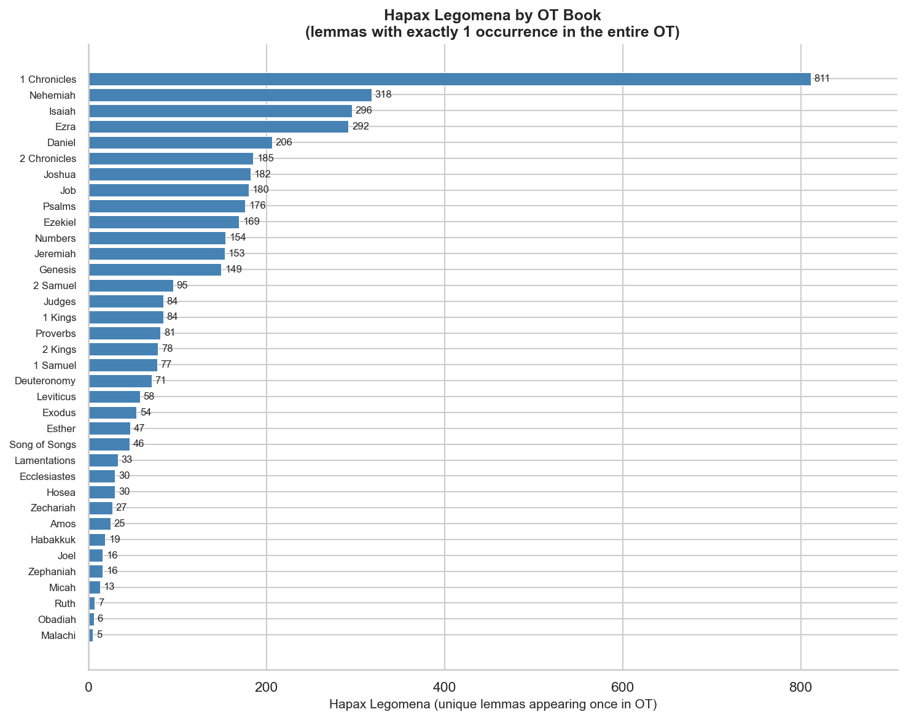
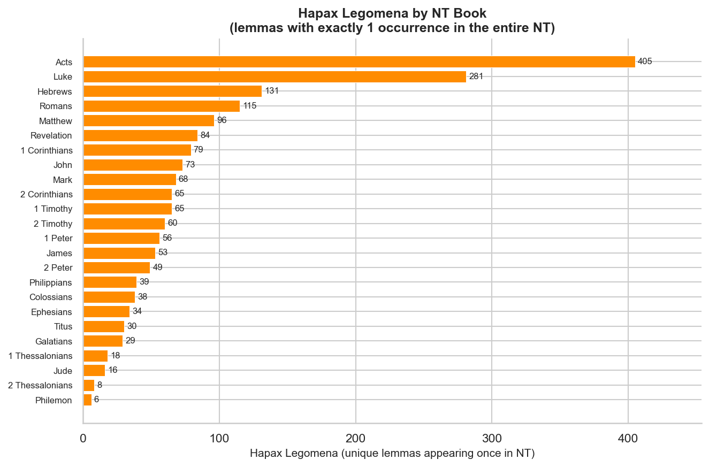

# Hapax Legomena by Biblical Book

A **hapax legomenon** (plural: *hapax legomena*; Greek, "said only once") is a word whose lemma appears exactly once in a given corpus. In biblical studies, hapaxes are significant because their meaning must be inferred from context, cognate languages (Aramaic, Arabic, Akkadian), or ancient translations rather than from usage patterns elsewhere in the text.

**Counting method:** Each Strong's lemma is counted once across the entire OT or NT. A word tagged H1234 that appears only once in the whole OT is a hapax regardless of which book it appears in. The count per book reflects how many of the corpus-wide hapaxes occur in that book.

---

## Hebrew Old Testament

**Total OT hapax lemmas: 4,295** out of ~8,600 unique lemmas (~50%)

### Chart



### Summary Table

| Book | Hapax Count | Total Lemmas | % Hapax |
|------|-------------|--------------|---------|
| 1 Chronicles | 811 | 2,600 | 31.2% |
| Nehemiah | 318 | 1,377 | 23.1% |
| Isaiah | 296 | 2,785 | 10.6% |
| Ezra | 292 | 1,139 | 25.6% |
| Daniel | 206 | 1,198 | 17.2% |
| 2 Chronicles | 185 | 1,675 | 11.0% |
| Joshua | 182 | 1,379 | 13.2% |
| Job | 180 | 1,886 | 9.5% |
| Psalms | 176 | 2,465 | 7.1% |
| Ezekiel | 169 | 1,939 | 8.7% |
| Numbers | 154 | 1,664 | 9.3% |
| Jeremiah | 153 | 2,213 | 6.9% |
| Genesis | 149 | 2,068 | 7.2% |
| 2 Samuel | 95 | 1,537 | 6.2% |
| Judges | 84 | 1,400 | 6.0% |
| 1 Kings | 84 | 1,498 | 5.6% |
| Proverbs | 81 | 1,503 | 5.4% |
| 2 Kings | 78 | 1,479 | 5.3% |
| 1 Samuel | 77 | 1,477 | 5.2% |
| Deuteronomy | 71 | 1,657 | 4.3% |
| Leviticus | 58 | 1,082 | 5.4% |
| Exodus | 54 | 1,635 | 3.3% |
| Esther | 47 | 532 | 8.8% |
| Song of Songs | 46 | 522 | 8.8% |
| Lamentations | 33 | 654 | 5.0% |
| Hosea | 30 | 809 | 3.7% |
| Ecclesiastes | 30 | 633 | 4.7% |
| Zechariah | 27 | 800 | 3.4% |
| Amos | 25 | 712 | 3.5% |
| Habakkuk | 19 | 409 | 4.6% |
| Joel | 16 | 419 | 3.8% |
| Zephaniah | 16 | 384 | 4.2% |
| Micah | 13 | 631 | 2.1% |
| Ruth | 7 | 350 | 2.0% |
| Obadiah | 6 | 168 | 3.6% |
| Malachi | 5 | 343 | 1.5% |
| Jonah | 4 | 270 | 1.5% |
| Haggai | 1 | 219 | 0.5% |

### Sample OT Hapaxes — Job

Job is the most lexically dense OT book relative to its size (9.5% hapax rate). A selection:

| Strongs | Lemma | Gloss | Reference |
|---------|-------|-------|-----------|
| H1623 | גָּרַד | to scrape | Job 2:8 |
| H5105 | נְהָרָה | light | Job 3:4 |
| H3650 | כִּמְרִיר | darkness | Job 3:5 |
| H2495 | חַלָּמוּת | mallow | Job 6:6 |
| H5153 | נָחוּשׁ | bronze | Job 6:12 |
| H4523 | מָס | despairing | Job 6:14 |
| H5076 | נְדוּד | tossing | Job 7:4 |
| H4267 | מַחֲנָק | strangling | Job 7:15 |
| H4645 | מִפְגָּע | target | Job 7:20 |

---

## Greek New Testament

**Total NT hapax lemmas: 1,903** out of ~5,400 unique lemmas (~35%)

### Chart



### Summary Table

| Book | Hapax Count | Total Lemmas | % Hapax |
|------|-------------|--------------|---------|
| Acts | 405 | 2,020 | 20.0% |
| Luke | 281 | 2,045 | 13.7% |
| Hebrews | 131 | 1,032 | 12.7% |
| Romans | 115 | 1,053 | 10.9% |
| Matthew | 96 | 1,694 | 5.7% |
| Revelation | 84 | 921 | 9.1% |
| 1 Corinthians | 79 | 958 | 8.2% |
| John | 73 | 1,018 | 7.2% |
| Mark | 68 | 1,362 | 5.0% |
| 1 Timothy | 65 | 541 | 12.0% |
| 2 Corinthians | 65 | 781 | 8.3% |
| 2 Timothy | 60 | 460 | 13.0% |
| 1 Peter | 56 | 547 | 10.2% |
| James | 53 | 558 | 9.5% |
| 2 Peter | 49 | 396 | 12.4% |
| Philippians | 39 | 441 | 8.8% |
| Colossians | 38 | 435 | 8.7% |
| Ephesians | 34 | 530 | 6.4% |
| Titus | 30 | 309 | 9.7% |
| Galatians | 29 | 523 | 5.5% |
| 1 Thessalonians | 18 | 362 | 5.0% |
| Jude | 16 | 228 | 7.0% |
| 2 Thessalonians | 8 | 250 | 3.2% |
| Philemon | 6 | 140 | 4.3% |
| 3 John | 3 | 105 | 2.9% |
| 1 John | 1 | 241 | 0.4% |
| 2 John | 1 | 98 | 1.0% |

---

## Observations

- **1 Chronicles dominates the OT** with 811 hapaxes — driven primarily by the genealogical chapters (1 Chr 1–9), which contain many obscure personal and place names.
- **Nehemiah and Ezra** follow, reflecting the Persian-era administrative vocabulary and proper nouns from that period.
- **Job has the highest hapax rate** among narrative/poetic books (9.5% of its unique lemmas), consistent with its reputation as the most lexically difficult OT book. Its hapaxes include rare botanical, zoological, and emotional vocabulary.
- **Acts leads the NT** with 405 hapaxes — Luke–Acts together account for 686, reflecting Luke's educated Greek style and the range of settings (court speeches, nautical terminology, medical vocabulary).
- **The Pastoral Epistles** (1 Timothy, 2 Timothy, Titus) show disproportionately high hapax rates (9–13%), a factor frequently cited in debates about Pauline authorship.
- **The short letters** (Philemon, 2–3 John) have few hapaxes simply due to their length.

---

## Usage

```python
from bible_grammar import hapax_legomena, hapax_table, hapax_summary

# Full hapax list for a book
hapax_legomena(book='Job')

# Summary stats by book
hapax_summary('OT')
hapax_summary('NT')

# Print formatted table
hapax_table(book='Job', top_n=30)
hapax_table(corpus='NT', top_n=50)

# Rare words (≤ 3 occurrences) in Isaiah
hapax_legomena(corpus='OT', book='Isa', max_count=3)

# Verbs only
hapax_legomena(corpus='OT', part_of_speech='Verb')
```

---

*Source: STEPBible TAHOT/TAGNT (CC BY). Lemma counts based on primary Strong's number per word token.*  
*Charts: `output/charts/hapax-ot-by-book.png`, `output/charts/hapax-nt-by-book.png`.*
