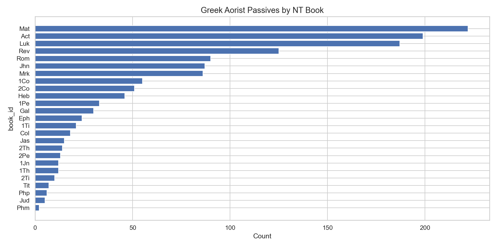

# Greek Aorist Passive Verbs by NT Book

**Source:** STEPBible TAGNT  
**Scope:** All Aorist Passive verb forms across the New Testament

## Summary

The Aorist Passive in Greek expresses a completed passive action — "was [verb]ed."
It is theologically significant in the NT as the standard form for the "divine passive"
(implying God as the unstated agent), resurrection language, and descriptions of what
happened to Jesus and believers.

## Key Observations

- **Luke and Acts** (both by the same author) together lead the NT, consistent with
  Luke's extensive narrative of events in the life of Jesus and the early church.
- **Matthew** is close behind, also a narrative Gospel with many event descriptions.
- **Revelation** ranks high for its apocalyptic passive constructions.
- **Paul's letters** use the Aorist Passive heavily for soteriological statements
  ("you were justified", "you were baptized", "you were called").
- The **short epistles** (Philemon, 2–3 John, Jude) naturally have the lowest counts.

*Generated by `notebooks/03_statistics.ipynb`*
