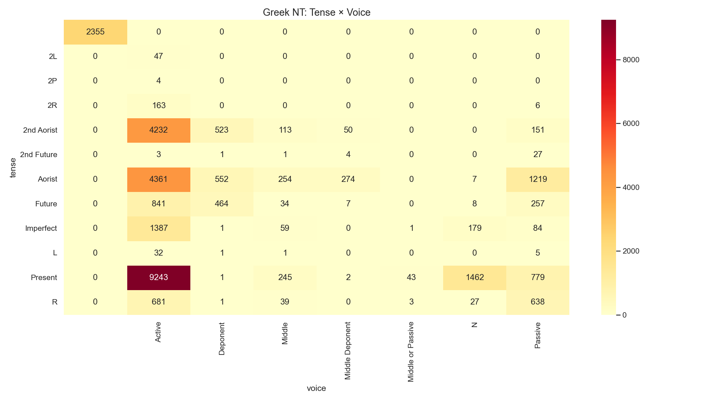

# Greek NT Verb Tense × Voice Heatmap

**Source:** STEPBible TAGNT (Translators Amalgamated Greek NT)  
**Scope:** All verb tokens across the entire New Testament

## Summary

This heatmap cross-tabulates verb tense against voice for every verb in the NT.
Darker cells indicate higher frequency.

## Key Observations

- **Present Active** is the single most common combination — Greek's present tense
  covers ongoing/repeated action and is the default for narrative and discourse.
- **Aorist Active** is the second most common — the aorist is the "default past" in
  Greek narrative, expressing a simple completed event.
- **Aorist Passive** is notably frequent, reflecting Greek's rich passive vocabulary
  for expressing divine action and human reception.
- **Perfect Active** is relatively rare — the Greek perfect expresses a present state
  resulting from a past action and is used for emphasis.
- **Imperfect** only occurs in Active and Middle/Passive — the imperfect has no
  distinct passive form in Koine Greek.

## Voice Abbreviations

| Code | Voice |
|---|---|
| Active | Subject performs the action |
| Middle | Subject acts on/for itself |
| Passive | Subject receives the action |
| Middle or Passive | Form is ambiguous between Middle and Passive |
| Deponent | Passive/Middle form with Active meaning |

*Generated by `notebooks/03_statistics.ipynb`*
