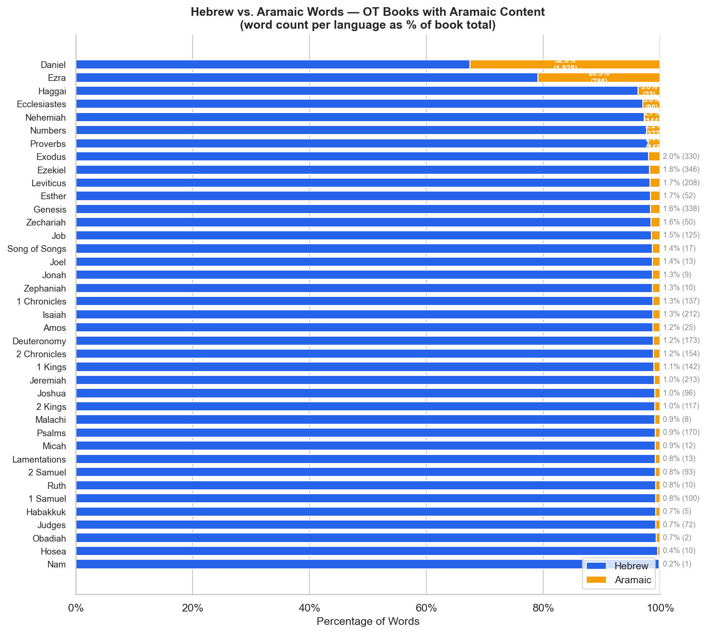

# Hebrew vs. Aramaic Word Distribution in the OT

The Hebrew Bible contains two languages: **Biblical Hebrew** (the vast majority) and
**Biblical Aramaic** (concentrated in Daniel and Ezra, with scattered loanwords elsewhere).
The TAHOT morphology data tags each word with its language, enabling precise separation.

---

## Chart



---

## Data Table — Books with Aramaic Content

| Book | Hebrew Words | Aramaic Words | Aramaic % |
|------|-------------|---------------|-----------|
| Daniel | 3,992 | 1,928 | 32.6% |
| Ezra | 2,969 | 786 | 20.9% |
| Haggai | 577 | 23 | 3.8% |
| Ecclesiastes | 2,898 | 90 | 3.0% |
| Nehemiah | 5,175 | 144 | 2.7% |
| Numbers | 16,036 | 377 | 2.3% |
| Proverbs | 6,770 | 145 | 2.1% |
| Exodus | 16,383 | 330 | 2.0% |
| Ezekiel | 18,384 | 346 | 1.8% |
| Leviticus | 11,742 | 208 | 1.7% |
| Genesis | 20,276 | 338 | 1.6% |
| … | … | … | … |

---

## The Aramaic Sections

### Daniel (32.6% Aramaic — 1,928 words)

Daniel is the most bilingual OT book. The Aramaic section spans **Dan 2:4b–7:28**,
covering the court narratives and apocalyptic visions addressed to the nations, while
the Hebrew sections (chapters 1, 8–12) frame the book's introduction and Daniel's
personal visions addressed to Israel.

### Ezra (20.9% Aramaic — 786 words)

Ezra's Aramaic sections contain official Persian imperial correspondence:
- **Ezra 4:8–6:18** — letters between Persian officials and kings Artaxerxes and Darius
- **Ezra 7:12–26** — Artaxerxes' decree authorizing Ezra's mission

The use of Aramaic here is historically appropriate — Aramaic was the administrative
language (*lingua franca*) of the Persian Empire.

### Scattered Aramaic (1–4%)

Books like Haggai (3.8%), Ecclesiastes (3.0%), Nehemiah (2.7%), and most others show
low Aramaic percentages reflecting **Aramaisms** — individual words borrowed from
Aramaic into late Biblical Hebrew — not contiguous Aramaic prose sections. This is
expected: Hebrew and Aramaic were closely related Semitic languages in ongoing contact,
and late Biblical Hebrew (post-exilic books) absorbed more Aramaic loanwords.

---

## Querying by Language

The `language` field is available in `query()` and `concordance()`:

```python
from bible_grammar import query

# Only Hebrew words in Daniel
query(book='Dan', language='Hebrew')

# Only Aramaic words in Daniel
query(book='Dan', language='Aramaic')

# Aramaic verbs in Ezra
query(book='Ezr', language='Aramaic', part_of_speech='Verb')

# All Aramaic in the OT
query(testament='OT', language='Aramaic')
```

---

## Notes on the Data

- Language tagging comes from STEPBible's TAHOT morphology, which tags each word token
  individually as `Hebrew` or `Aramaic`.
- The Aramaic morphology codes (Haphel, Pael, Shaphel, etc.) correspond to Aramaic
  verbal stems and appear in the `stem` column for Aramaic words.
- Books with < 1% Aramaic contain only isolated loanwords, not Aramaic sections.

---

*Source: STEPBible TAHOT (CC BY).*  
*Chart: `output/charts/ot-hebrew-aramaic-by-book.png`.*
