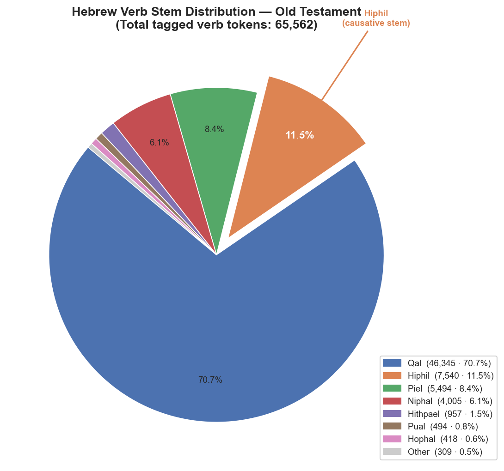

# Hebrew Verb Stem Distribution — Old Testament

## Summary

Across all 65,562 tagged verb tokens in the Hebrew/Aramaic Old Testament,
the Qal stem dominates overwhelmingly, with the Hiphil coming in as a
distant second.

| Stem | Count | % | Description |
|---|---:|---:|---|
| Qal | 46,345 | 70.7% | Simple active — the basic, unmarked stem |
| **Hiphil** | **7,540** | **11.5%** | **Causative active — "cause to do/be"** |
| Piel | 5,494 | 8.4% | Intensive / factitive active |
| Niphal | 4,005 | 6.1% | Simple passive / reflexive |
| Hithpael | 957 | 1.5% | Reflexive / reciprocal of Piel |
| Pual | 494 | 0.8% | Intensive passive (passive of Piel) |
| Hophal | 418 | 0.6% | Causative passive (passive of Hiphil) |
| Other | 309 | 0.5% | Rare stems (Haphel, Pael, Shaphel, etc.) |
| **Total** | **65,562** | **100%** | |

## Key Observations

### Qal dominance (70.7%)
The Qal is the default stem — simple, active, unmarked. It is used for nearly
every common verb in its ordinary sense: to go, to come, to see, to hear, to
speak (Qal), to eat, to die. Its overwhelming frequency reflects that most
verbal action in the OT is narrated straightforwardly.

### The Hiphil (11.5%) — called out
The Hiphil is the **causative active** stem: it takes a simple action and
makes someone *cause* it to happen. Examples:

- יָצָא (Qal) "to go out" → יוֹצִיא (Hiphil) "to bring out, cause to go out"
- מוּת (Qal) "to die" → הֵמִית (Hiphil) "to kill, cause to die"
- יָדַע (Qal) "to know" → הוֹדִיעַ (Hiphil) "to make known, declare"

At 11.5%, the Hiphil's prevalence reflects the OT's strong emphasis on divine
and human agency — God bringing out, making known, causing rain to fall,
giving victory, etc.

### Piel (8.4%)
The Piel carries intensive or factitive nuance: it either intensifies the
simple action (שָׁבַר Qal "to break" → שִׁבֵּר Piel "to smash/shatter") or
declares someone to be what the Qal describes (קָדַשׁ Qal "to be holy" →
קִדֵּשׁ Piel "to sanctify, treat as holy"). The Piel is particularly common
in cultic and legal texts.

### Niphal (6.1%)
The Niphal functions as the simple passive or reflexive: "to be seen," "to be
called," "to be saved." Its relatively modest frequency compared to the Hiphil
and Piel reflects that Hebrew prefers active constructions.

### Passive stems (Pual, Hophal — combined 1.4%)
The Pual (passive of Piel) and Hophal (passive of Hiphil) are rare. Hebrew
generally avoids double-marking passives; the Niphal handles most passive
needs.

## Data Notes

- Total reflects tagged verb tokens only; untagged prefix tokens (~4,287 rows
  with blank stem) are excluded.
- Aramaic verbs (Daniel, Ezra) use the Haphel/Pael/Shaphel stems, which appear
  in the "Other" category.
- Source: STEPBible TAHOT morphological data (CC BY 4.0, Tyndale House Cambridge).
