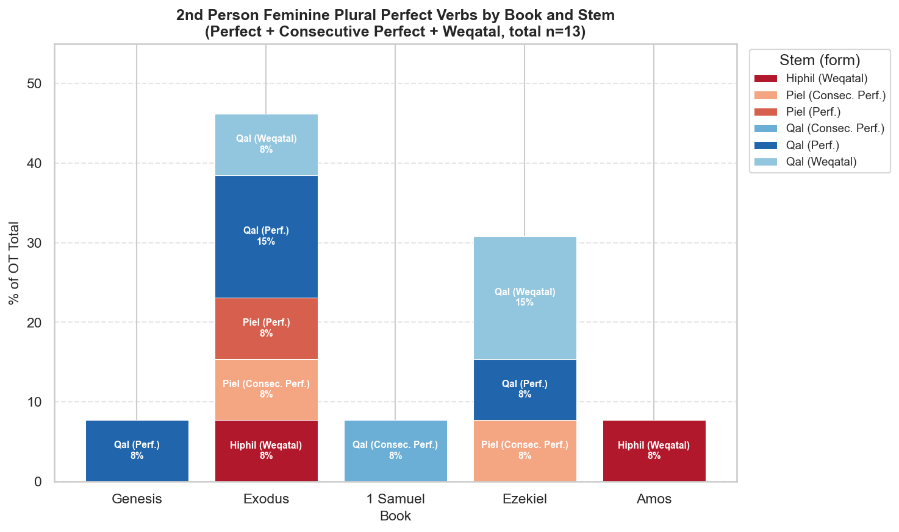

# 2nd Person Feminine Plural Perfect Verbs in the OT

**Total occurrences: 13**

Includes: Perfect, Consecutive Perfect, and Weqatal (Consecutive Imperfect) forms.

> **Note on tagging:** The TAHOT morphology data labels weqatal forms (waw + perfect vowel pattern)
> as `Consecutive Imperfect`. Logos and many grammars classify these with the perfects. This report
> follows the broader grammatical convention and includes all three conjugation types.

---

## Chart

---

## Summary Table by Book (descending by % of OT total)

| Book | Count | % of OT Total |
|------|-------|---------------|
| Exodus | 6 | 46.2% |
| Ezekiel | 4 | 30.8% |
| Genesis | 1 | 7.7% |
| 1 Samuel | 1 | 7.7% |
| Amos | 1 | 7.7% |
| **Total** | **13** | **100%** |

---

## By Book, Stem, and Form

| Book | Stem | Form | Count | % |
|------|------|------|-------|---|
| Exodus | Qal | Perfect | 2 | 15.4% |
| Exodus | Piel | Perfect | 1 | 7.7% |
| Exodus | Piel | Consecutive Perfect | 1 | 7.7% |
| Exodus | Hiphil | Weqatal | 1 | 7.7% |
| Exodus | Qal | Weqatal | 1 | 7.7% |
| Ezekiel | Qal | Perfect | 1 | 7.7% |
| Ezekiel | Piel | Consecutive Perfect | 1 | 7.7% |
| Ezekiel | Qal | Weqatal | 2 | 15.4% |
| Genesis | Qal | Perfect | 1 | 7.7% |
| 1 Samuel | Qal | Consecutive Perfect | 1 | 7.7% |
| Amos | Hiphil | Weqatal | 1 | 7.7% |

---

## All 13 Occurrences

| Reference | Hebrew Word | Stem | Form | KJV |
|-----------|------------|------|------|-----|
| Gen 31:6 | יְדַעְתֶּ֑ן | Qal | Perfect | And ye know that with all my power I have served your father. |
| Exo 1:16 | וּ/רְאִיתֶ֖ן | Qal | Weqatal | And he said, When ye do the office of a midwife to the Hebrew women, and see them upon the stools… |
| Exo 1:16 | וַ/הֲמִתֶּ֣ן | Hiphil | Weqatal | …if it be a son, then ye shall kill him: but if it be a daughter, then she shall live. |
| Exo 1:18 | עֲשִׂיתֶ֖ן | Qal | Perfect | …Why have ye done this thing, and have saved the men children alive? |
| Exo 1:18 | וַ/תְּחַיֶּ֖יןָ | Piel | Consecutive Perfect | …and have saved the men children alive? |
| Exo 2:18 | מִהַרְתֶּ֥ן | Piel | Perfect | How is it that ye are come so soon to day? |
| Exo 2:20 | עֲזַבְתֶּ֣ן | Qal | Perfect | …why is it that ye have left the man? call him, that he may eat bread. |
| 1Sa 14:27 | וַ/תָּאֹ֖רְנָה | Qal | Consecutive Perfect | *(KJV text not available in dataset)* |
| Ezk 13:19 | וַ/תְּחַלֶּלְ֨נָה | Piel | Consecutive Perfect | And will ye pollute me among my people for handfuls of barley… |
| Ezk 13:21 | וִֽ/ידַעְתֶּ֖ן | Qal | Weqatal | …and ye shall know that I am the Lord. |
| Ezk 13:23 | וִֽ/ידַעְתֶּ֖ן | Qal | Weqatal | …and ye shall know that I am the Lord. |
| Ezk 33:26 | עֲשִׂיתֶ֣ן | Qal | Perfect | Ye stand upon your sword, ye work abomination… |
| Amo 4:3 | וְ/הִשְׁלַכְתֶּ֥נָה | Hiphil | Weqatal | …and ye shall cast them into the palace, saith the Lord. |

---

## Observations

- **Exodus dominates** (6 of 13, 46%), concentrated in the midwives narrative (Exo 1–2) and Pharaoh's command — the only extended narrative in the OT addressing a group of women directly in 2fp.
- **Ezekiel** accounts for 4 occurrences (31%), all in oracles against the false prophetesses (Ezk 13) and the corrupt community (Ezk 33).
- **Qal is the most common stem** (8 of 13, 62%), followed by Piel (3) and Hiphil (2).
- The form is grammatically rare because Biblical Hebrew seldom directly addresses plural female groups in the second person perfect.

---

*Source: STEPBible TAHOT (CC BY). Chart: `output/charts/2fp-perfect-by-book-stem-v3.png`.*
