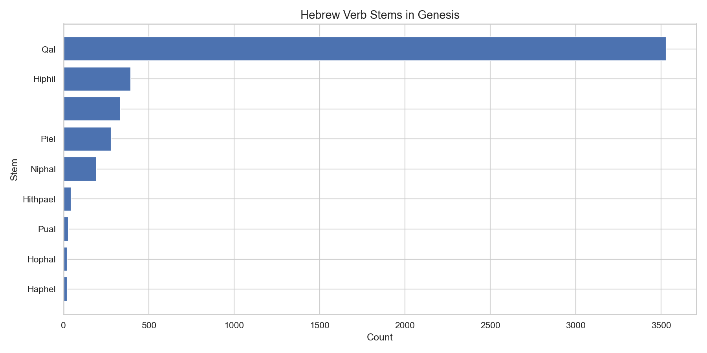

# Hebrew Verb Stems — Genesis

**Source:** STEPBible TAHOT  
**Scope:** All verb tokens in Genesis

## Summary

Verb stem distribution in Genesis mirrors the OT-wide pattern, with Qal accounting for
the large majority of verbal activity. Genesis has a notably active narrative style,
reflected in its high absolute verb count (4,845 verbs — the most of any Torah book).

## Key Numbers (Genesis)

| Stem | Count |
|---|---|
| Qal | 3,530 |
| Hiphil | 395 |
| Piel | 279 |
| Niphal | 193 |
| Hithpael | 44 |
| Hophal | 21 |
| Pual | 28 |

*Generated by `notebooks/02_query_demo.ipynb`*
