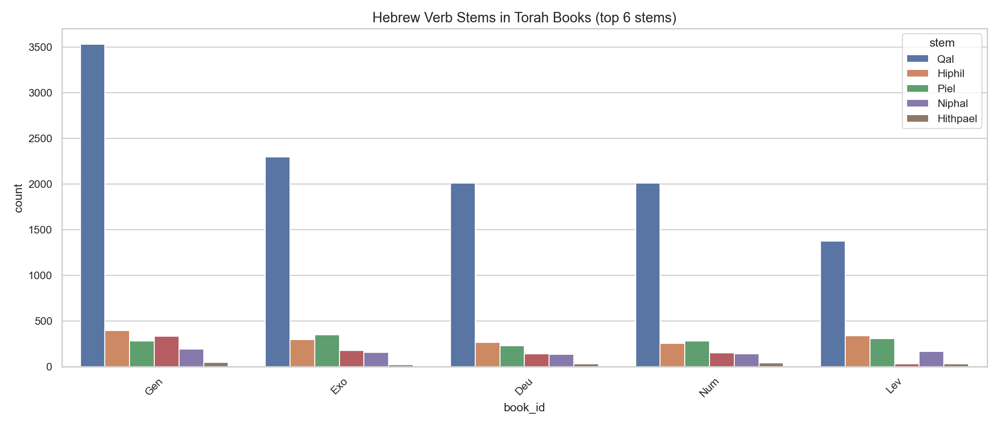

# Hebrew Verb Stems in Torah Books (Grouped)

**Source:** STEPBible TAHOT  
**Scope:** Top 6 verb stems across all five books of the Torah (Pentateuch)

## Summary

This grouped bar chart compares the six most frequent verb stems across the five books
of the Pentateuch. Qal dominates in every book. Notable observations:

- **Leviticus** has a disproportionately high Piel rate (13.4% of its verbs) — fitting
  for a legal/ritual text that frequently declares things clean, unclean, or holy.
- **Exodus** concentrates more Hophal (passive causative) verbs than other Torah books,
  reflecting passive constructions in the tabernacle instructions.
- **Genesis** has the highest total verb count (4,845), consistent with its narrative density.

## Total Verbs by Book

| Book | Total Verbs |
|---|---:|
| Genesis | 4,845 |
| Exodus | 3,381 |
| Leviticus | 2,288 |
| Numbers | 2,909 |
| Deuteronomy | 2,841 |
| **Pentateuch Total** | **16,264** |

*Generated by `notebooks/03_statistics.ipynb`*
