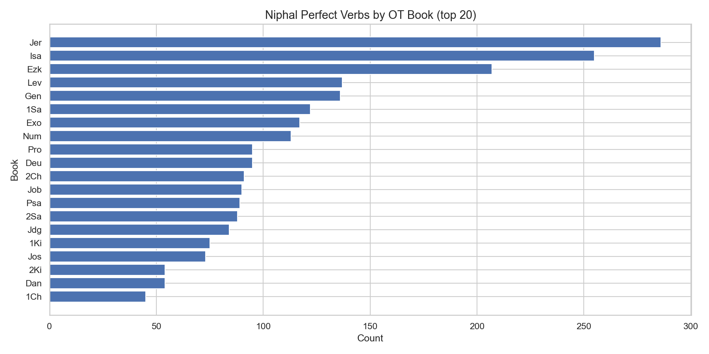

# Niphal Perfect Verbs by OT Book (Top 20)

**Source:** STEPBible TAHOT  
**Scope:** Top 20 OT books by Niphal Perfect verb count

## Summary

This chart shows the 20 OT books with the most Niphal Perfect verb forms, sorted by
count. The three Major Prophets (Isaiah, Jeremiah, Ezekiel) lead significantly, together
accounting for nearly 29% of all Niphal Perfects in the OT.

## Notes

- The Niphal stem encodes passive or reflexive action; the Perfect form indicates
  completed aspect (past or present state).
- High Niphal Perfect counts in the prophetic literature likely reflect theological
  use of the divine passive ("it has been written", "they have been scattered").
- Nahum is the only OT book with zero Niphal verbs of any conjugation.

*Generated by `notebooks/02_query_demo.ipynb`*
