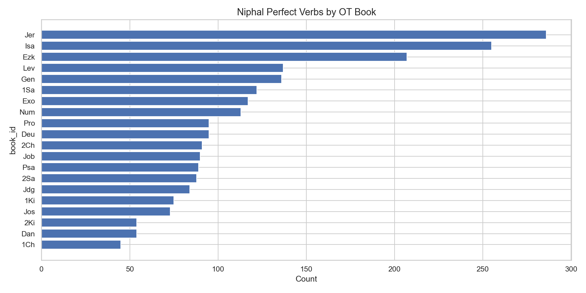

# Niphal Perfect Verbs by OT Book

**Source:** STEPBible TAHOT  
**Scope:** All Niphal Perfect verb forms across the Old Testament  
**Total:** 2,601 Niphal Perfect verbs

## Summary

The Niphal Perfect combines the simple passive/reflexive stem with the perfect
(completed) aspect, typically expressing a completed state or a resulting condition.
The Major Prophets (Isaiah, Jeremiah, Ezekiel) account for a disproportionate share,
reflecting their extensive use of divine-passive constructions ("it has been decreed",
"it will be done").

## Top 10 Books

| Book | Niphal Perfects |
|---|---:|
| Jeremiah | 394 |
| Isaiah | 378 |
| Ezekiel | 302 |
| Genesis | 193 |
| 1 Samuel | 182 |
| Leviticus | 165 |
| Exodus | 157 |
| Proverbs | 153 |
| Judges | 125 |
| Job | 119 |

*Generated by `notebooks/02_query_demo.ipynb` and `notebooks/03_statistics.ipynb`*
