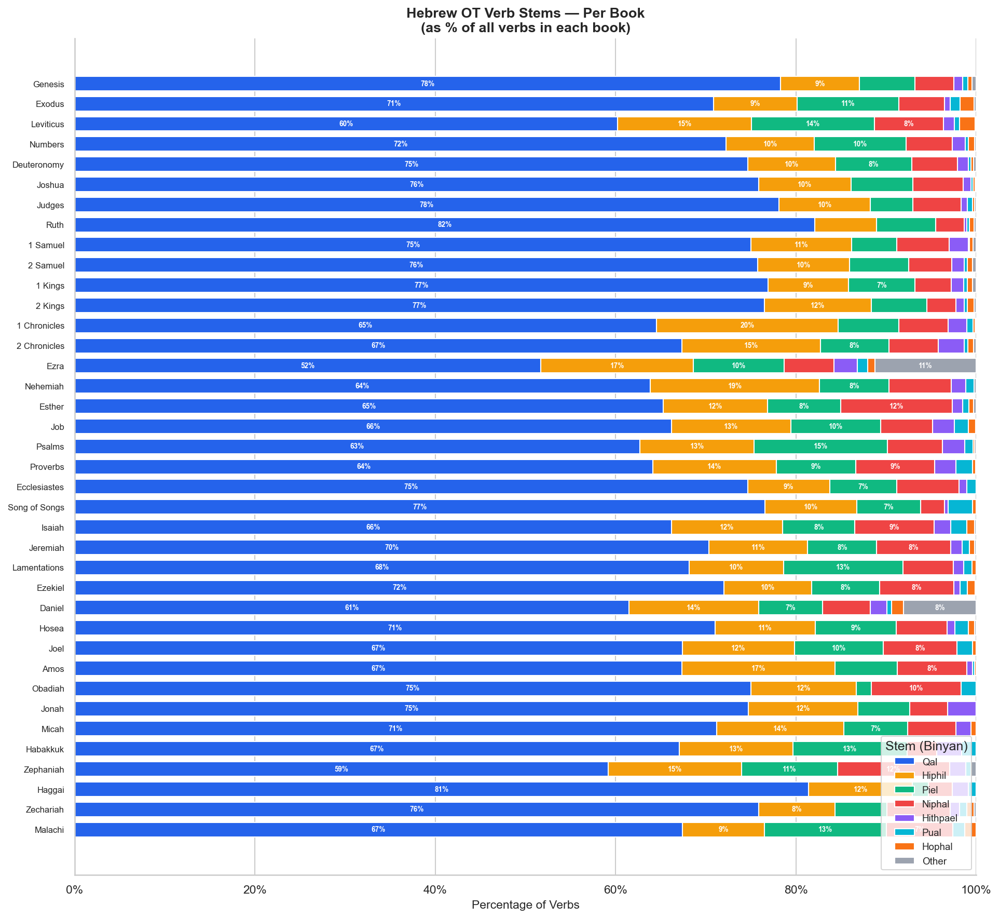
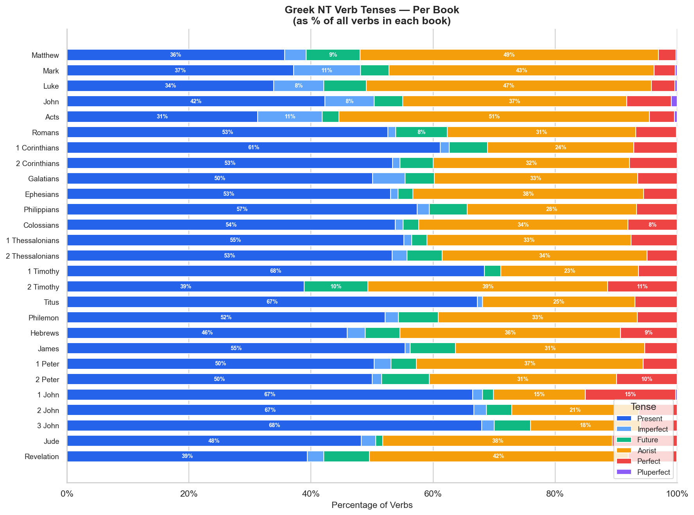
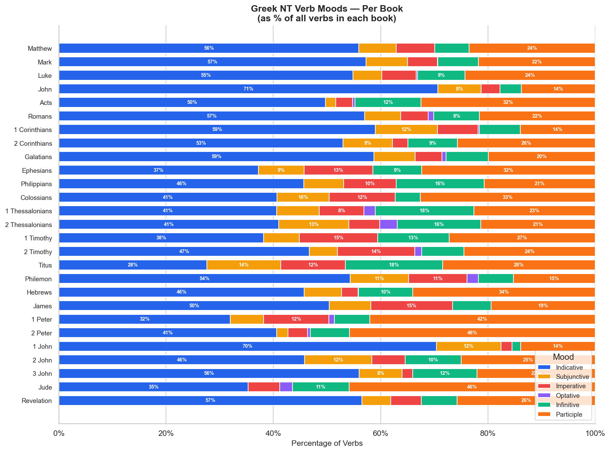

# Verb Morphology by Book

Verb stem distribution for the Hebrew OT and verb tense/mood distribution for the Greek NT,
shown as a percentage of all verbs in each book.

---

## Hebrew OT — Verb Stems (Binyanim)

**Stems included:** Qal, Hiphil, Piel, Niphal, Hithpael, Pual, Hophal, Other (rare/Aramaic stems).

### Chart

### Data Table

| Book | Qal | Hiphil | Piel | Niphal | Hithpael | Pual | Hophal | Other | Verbs |
|------|-----|--------|------|--------|----------|------|--------|-------|-------|
| Genesis | 78.3% | 8.7% | 6.2% | 4.3% | 1.0% | 0.6% | 0.5% | 0.5% | 4,613 |
| Exodus | 70.9% | 9.3% | 11.2% | 5.1% | 0.6% | 1.1% | 1.6% | 0.2% | 3,425 |
| Leviticus | 60.2% | 14.8% | 13.7% | 7.7% | 1.2% | 0.6% | 1.7% | 0.1% | 2,344 |
| Numbers | 72.3% | 9.8% | 10.2% | 5.1% | 1.5% | 0.3% | 0.7% | 0.2% | 2,913 |
| Deuteronomy | 74.7% | 9.7% | 8.5% | 5.1% | 1.2% | 0.3% | 0.3% | 0.3% | 2,930 |
| Joshua | 75.9% | 10.2% | 6.9% | 5.6% | 0.8% | 0.3% | 0.2% | 0.1% | 1,775 |
| Judges | 78.1% | 10.1% | 4.7% | 5.3% | 0.7% | 0.6% | 0.3% | 0.2% | 2,348 |
| Ruth | 82.1% | 6.9% | 6.6% | 3.2% | 0.3% | 0.3% | 0.5% | 0.3% | 379 |
| 1 Samuel | 75.0% | 11.1% | 5.1% | 5.8% | 2.1% | 0.1% | 0.4% | 0.4% | 3,205 |
| 2 Samuel | 75.7% | 10.2% | 6.5% | 4.8% | 1.4% | 0.3% | 0.6% | 0.4% | 2,513 |
| 1 Kings | 76.9% | 8.9% | 7.4% | 4.0% | 1.4% | 0.4% | 0.6% | 0.4% | 2,807 |
| 2 Kings | 76.5% | 11.8% | 6.2% | 3.2% | 0.9% | 0.3% | 0.8% | 0.3% | 2,779 |
| 1 Chronicles | 64.5% | 20.2% | 6.7% | 5.5% | 2.1% | 0.7% | 0.2% | 0.1% | 1,353 |
| 2 Chronicles | 67.3% | 15.4% | 7.6% | 5.5% | 2.8% | 0.4% | 0.6% | 0.3% | 2,574 |
| Ezra | 51.7% | 17.0% | 10.1% | 5.5% | 2.6% | 1.2% | 0.8% | 11.2% | 507 |
| Nehemiah | 63.8% | 18.8% | 7.7% | 6.9% | 1.6% | 0.9% | 0.0% | 0.2% | 868 |
| Esther | 65.3% | 11.6% | 8.1% | 12.4% | 1.2% | 0.7% | 0.5% | 0.3% | 605 |
| Job | 66.2% | 13.3% | 10.0% | 5.7% | 2.5% | 1.5% | 0.8% | 0.0% | 2,155 |
| Psalms | 62.7% | 12.7% | 14.8% | 6.1% | 2.4% | 0.9% | 0.2% | 0.2% | 4,580 |
| Proverbs | 64.1% | 13.7% | 8.8% | 8.8% | 2.4% | 1.8% | 0.3% | 0.1% | 1,739 |
| Ecclesiastes | 74.6% | 9.1% | 7.5% | 6.9% | 0.9% | 1.0% | 0.0% | 0.0% | 682 |
| Song of Songs | 76.5% | 10.2% | 7.1% | 2.7% | 0.4% | 2.7% | 0.4% | 0.0% | 226 |
| Isaiah | 66.2% | 12.3% | 8.0% | 8.8% | 1.8% | 1.8% | 0.8% | 0.2% | 4,376 |
| Jeremiah | 70.3% | 11.0% | 7.7% | 8.2% | 1.3% | 0.8% | 0.6% | 0.2% | 4,849 |
| Lamentations | 68.1% | 10.5% | 13.3% | 5.6% | 1.2% | 0.9% | 0.5% | 0.0% | 430 |
| Ezekiel | 72.0% | 9.7% | 7.6% | 8.2% | 0.7% | 0.8% | 0.9% | 0.1% | 3,891 |
| Daniel | 61.5% | 14.4% | 7.1% | 5.3% | 1.9% | 0.5% | 1.3% | 8.0% | 1,342 |
| Hosea | 71.0% | 11.1% | 9.0% | 5.6% | 0.9% | 1.5% | 0.7% | 0.2% | 587 |
| Joel | 67.4% | 12.4% | 9.9% | 8.2% | 0.0% | 1.7% | 0.4% | 0.0% | 233 |
| Amos | 67.4% | 16.9% | 6.9% | 7.7% | 0.6% | 0.2% | 0.2% | 0.0% | 478 |
| Obadiah | 75.0% | 11.7% | 1.7% | 10.0% | 0.0% | 1.7% | 0.0% | 0.0% | 60 |
| Jonah | 74.7% | 12.1% | 5.8% | 4.2% | 3.2% | 0.0% | 0.0% | 0.0% | 190 |
| Micah | 71.2% | 14.1% | 7.1% | 5.4% | 1.7% | 0.0% | 0.6% | 0.0% | 354 |
| Habakkuk | 67.0% | 12.6% | 12.6% | 3.3% | 2.7% | 1.6% | 0.0% | 0.0% | 182 |
| Zephaniah | 59.2% | 14.8% | 10.7% | 12.4% | 1.8% | 0.6% | 0.0% | 0.6% | 169 |
| Haggai | 81.4% | 11.5% | 1.8% | 2.7% | 1.8% | 0.9% | 0.0% | 0.0% | 113 |
| Zechariah | 75.9% | 8.4% | 5.8% | 7.0% | 1.1% | 0.8% | 0.8% | 0.3% | 758 |
| Malachi | 67.4% | 9.1% | 13.5% | 7.4% | 0.0% | 1.3% | 1.3% | 0.0% | 230 |

### OT Observations

- **Qal dominates every book**, ranging from ~59% (Leviticus, Zephaniah) to ~82% (Ruth, Haggai). The Qal's strong presence is expected — it is the basic active stem.
- **Leviticus has the lowest Qal rate (60.2%)** and elevated Hiphil (14.8%) and Piel (13.7%), reflecting its ritual/legal register. Causative (Hiphil) and intensive/declarative (Piel) actions are frequent in priestly law.
- **Psalms has the highest Piel rate (14.8%)** among major books, consistent with its lyric/hymnic register — the Piel is common in praise and petition vocabulary.
- **1 Chronicles has the highest Hiphil rate (20.2%)**, partly driven by its royal/cultic register and Levitical/priestly narratives.
- **Ezra and Daniel have elevated "Other" rates** (11.2% and 8.0% respectively) because both books contain substantial Aramaic sections, which carry Aramaic stems (Haphel, Pael, Shaphel) not present in Hebrew.

---

## Greek NT — Verb Tenses

**Tenses:** Present, Imperfect, Future, Aorist, Perfect, Pluperfect (2nd-form variants consolidated).

### Chart

### Tense Data Table

| Book | Present | Imperfect | Future | Aorist | Perfect | Pluperfect | Verbs |
|------|---------|-----------|--------|--------|---------|------------|-------|
| Matthew | 35.7% | 3.6% | 8.8% | 49.0% | 2.8% | 0.2% | 4,055 |
| Mark | 37.1% | 11.0% | 4.7% | 43.4% | 3.5% | 0.3% | 2,715 |
| Luke | 33.9% | 8.2% | 7.0% | 46.8% | 3.8% | 0.4% | 4,521 |
| John | 42.3% | 8.1% | 4.7% | 36.7% | 7.3% | 0.9% | 3,651 |
| Acts | 31.3% | 10.5% | 2.8% | 50.9% | 4.1% | 0.4% | 4,022 |
| Romans | 52.6% | 1.3% | 8.5% | 30.8% | 6.7% | 0.1% | 1,177 |
| 1 Corinthians | 61.2% | 1.5% | 6.3% | 23.9% | 7.1% | 0.0% | 1,324 |
| 2 Corinthians | 53.4% | 1.2% | 5.5% | 32.2% | 7.8% | 0.0% | 768 |
| Galatians | 50.1% | 5.3% | 4.8% | 33.3% | 6.5% | 0.0% | 417 |
| Ephesians | 53.0% | 1.2% | 2.4% | 37.8% | 5.5% | 0.0% | 328 |
| Philippians | 57.4% | 2.0% | 6.2% | 27.7% | 6.6% | 0.0% | 256 |
| Colossians | 53.8% | 1.3% | 2.5% | 34.3% | 8.1% | 0.0% | 236 |
| 1 Thessalonians | 55.2% | 1.3% | 2.5% | 33.5% | 7.5% | 0.0% | 239 |
| 2 Thessalonians | 53.3% | 2.5% | 5.7% | 33.6% | 4.9% | 0.0% | 122 |
| 1 Timothy | 68.4% | 0.0% | 2.7% | 22.6% | 6.3% | 0.0% | 301 |
| 2 Timothy | 38.9% | 0.0% | 10.5% | 39.3% | 11.4% | 0.0% | 229 |
| Titus | 67.2% | 0.9% | 0.0% | 25.0% | 6.9% | 0.0% | 116 |
| Philemon | 52.2% | 2.2% | 6.5% | 32.6% | 6.5% | 0.0% | 46 |
| Hebrews | 46.0% | 2.9% | 5.7% | 36.1% | 9.3% | 0.0% | 927 |
| James | 55.4% | 0.8% | 7.5% | 31.0% | 5.3% | 0.0% | 361 |
| 1 Peter | 50.3% | 2.8% | 4.2% | 37.2% | 5.6% | 0.0% | 288 |
| 2 Peter | 50.0% | 1.6% | 7.8% | 30.7% | 9.9% | 0.0% | 192 |
| 1 John | 66.5% | 1.6% | 1.8% | 15.0% | 14.8% | 0.2% | 439 |
| 2 John | 66.7% | 2.1% | 4.2% | 20.8% | 6.2% | 0.0% | 48 |
| 3 John | 68.0% | 2.0% | 6.0% | 18.0% | 6.0% | 0.0% | 50 |
| Jude | 48.2% | 2.4% | 1.2% | 37.6% | 10.6% | 0.0% | 85 |
| Revelation | 39.4% | 2.7% | 7.5% | 42.4% | 8.0% | 0.1% | 1,610 |

---

## Greek NT — Verb Moods

### Chart

### Mood Data Table

| Book | Indicative | Subjunctive | Imperative | Optative | Infinitive | Participle |
|------|------------|-------------|------------|----------|------------|------------|
| Matthew | 55.9% | 7.0% | 7.2% | 0.0% | 6.4% | 23.5% |
| Mark | 57.3% | 7.7% | 5.6% | 0.0% | 7.6% | 21.8% |
| Luke | 54.8% | 5.4% | 6.4% | 0.2% | 8.9% | 24.2% |
| John | 70.7% | 8.1% | 3.5% | 0.0% | 4.0% | 13.7% |
| Acts | 49.7% | 1.9% | 3.1% | 0.4% | 12.3% | 32.5% |
| Romans | 57.0% | 6.7% | 5.2% | 1.0% | 8.5% | 21.6% |
| 1 Corinthians | 59.0% | 11.6% | 7.6% | 0.2% | 7.6% | 14.0% |
| 2 Corinthians | 53.0% | 9.2% | 2.9% | 0.0% | 9.2% | 25.7% |
| Galatians | 58.8% | 7.7% | 5.0% | 0.7% | 7.9% | 19.9% |
| Ephesians | 37.2% | 8.5% | 12.8% | 0.0% | 9.1% | 32.3% |
| Philippians | 45.7% | 7.4% | 9.8% | 0.0% | 16.4% | 20.7% |
| Colossians | 40.7% | 9.7% | 12.3% | 0.0% | 4.7% | 32.6% |
| 1 Thessalonians | 40.6% | 7.9% | 8.4% | 2.1% | 18.4% | 22.6% |
| 2 Thessalonians | 41.0% | 13.1% | 5.7% | 3.3% | 15.6% | 21.3% |
| 1 Timothy | 38.2% | 6.6% | 14.6% | 0.0% | 13.3% | 27.2% |
| 2 Timothy | 46.7% | 5.2% | 14.4% | 1.3% | 7.9% | 24.5% |
| Titus | 27.6% | 13.8% | 12.1% | 0.0% | 18.1% | 28.4% |
| Philemon | 54.3% | 10.9% | 10.9% | 2.2% | 6.5% | 15.2% |
| Hebrews | 45.7% | 7.0% | 3.0% | 0.1% | 10.1% | 34.0% |
| James | 50.4% | 7.8% | 15.2% | 0.0% | 7.2% | 19.4% |
| 1 Peter | 31.9% | 6.2% | 12.2% | 1.0% | 6.6% | 42.0% |
| 2 Peter | 40.6% | 2.1% | 3.6% | 0.5% | 7.3% | 45.8% |
| 1 John | 70.4% | 12.1% | 2.1% | 0.0% | 1.6% | 13.9% |
| 2 John | 45.8% | 12.5% | 6.2% | 0.0% | 10.4% | 25.0% |
| 3 John | 56.0% | 8.0% | 2.0% | 0.0% | 12.0% | 22.0% |
| Jude | 35.3% | 0.0% | 5.9% | 2.4% | 10.6% | 45.9% |
| Revelation | 56.5% | 5.3% | 5.7% | 0.0% | 6.7% | 25.7% |

### NT Observations

**Tenses:**
- **Narrative books (Gospels, Acts) are aorist-heavy**: Acts (50.9%), Matthew (49.0%), Luke (46.8%). The aorist is the default narrative past tense in Greek.
- **Mark has the highest imperfect rate (11.0%)** among all NT books — consistent with its vivid, "historical present" narrative style and frequent use of imperfect for continuous background action.
- **The Pauline and General Epistles shift toward present-heavy profiles** (50–68%), reflecting their argumentative/paraenetic register. Timeless truths and general commands favor the present tense.
- **1 John stands out with the highest perfect rate (14.8%)**, reflecting its theological emphasis on abiding states — what has been done and continues to have effect (e.g., "we have known," "he has given").
- **2 Timothy has the highest perfect rate among the Pauline letters (11.4%)** and a notable future rate (10.5%), consistent with its farewell/legacy tone.

**Moods:**
- **John and 1 John have the highest indicative rates** (70.7% and 70.4%), reflecting their direct declarative style — "this is," "he is," "we know."
- **Acts and Hebrews have the highest participle rates** (32.5% and 34.0%), consistent with their Greek literary style. Luke–Acts uses the genitive absolute and attendant circumstance participle extensively.
- **1 Peter (42.0%) and 2 Peter (45.8%) and Jude (45.9%) have extremely high participle rates**, indicating a Greek rhetorical style that relies heavily on participial phrases rather than finite verbs.
- **Titus has the lowest indicative rate (27.6%)** and the highest subjunctive (13.8%) + infinitive (18.1%) combination, reflecting its concentrated use of purpose clauses and indirect discourse in pastoral instruction.
- **The Prison Epistles (Ephesians, Colossians) show elevated imperative rates** (~12–13%), consistent with their extended paraenetic sections.

---

*Source: STEPBible TAHOT/TAGNT (CC BY).*  
*Charts: `output/charts/verb-stems-ot-by-book.png`, `output/charts/verb-tenses-nt-by-book.png`, `output/charts/verb-moods-nt-by-book.png`.*
